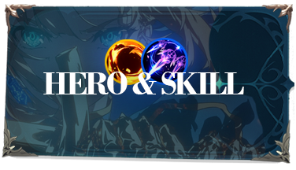
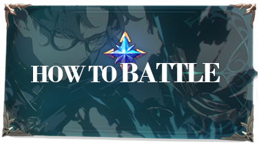

# 📙 EXTOCIUM GAME BOOK



<figure><figcaption></figcaption></figure>



<figure><figcaption></figcaption></figure>





<figure><figcaption></figcaption></figure>



<figure><figcaption></figcaption></figure>





<figure><figcaption></figcaption></figure>



<figure><figcaption></figcaption></figure>












