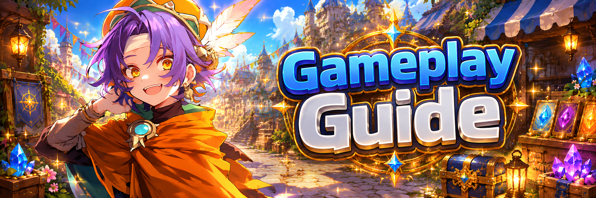

# 🕹️ Gameplay Guide

<figure><figcaption></figcaption></figure>



### 🎮 Gameplay Guide

Explore the core gameplay of **EXTOCIUM** at a glance.\
From combat to growth, crafting, and collecting,\
jump straight to the systems you need — no detours.

***

**🏹 Battle – Combat & Basic Controls**

* _Learn the essential controls you’ll need for combat._


[battle.md](battle.md)


**🛠️ Crafting**&#x20;

* _Discover how to craft items and equipment._


[crafting.md](crafting.md)


**🏋️ Training – Skill Training & Progression**

* _A growth system where you use TP (Training Points)_ _to train skills and unlock new content._


[training.md](training.md)


**🍎 Collecting – Gathering & Collecting**

* _Learn how to unlock gathering through skill training and collect materials needed for crafting._


[collecting.md](collecting.md)




### 🎮 Gameplay Guide

EXTOCIUM의 핵심 플레이를 한눈에 확인하세요.\
전투부터 성장, 제작, 수집까지 필요한 부분만 골라서 바로 볼 수 있습니다.

***

**🏹 Battle – 전투 & 기본 조작**

* _전투에 필요한 기본 조작 방법을 안내합니다._


[battle.md](battle.md)


**🛠️ Crafting – 제작**

* _아이템과 장비를 제작하는 방법을 설명합니다._


[crafting.md](crafting.md)


**🏋️ Training – 기술 연마 & 성장**

* _TP(Training Point)를 사용해 기술을 연마하고 콘텐츠를 해금하는 성장 시스템입니다._


[training.md](training.md)


**🍎 Collecting – 채집 & 수집**

* _기술 연마를 통해 채집을 해금하고 제작에 필요한 재료를 수집하는 방법을 안내합니다._


[collecting.md](collecting.md)




### 🎮 ゲームプレイガイド

**EXTOCIUM**の主要なゲームプレイを ひと目で確認できます。\
戦闘、成長、制作、収集など、必要なコンテンツだけをすぐにチェックできます。

***

**🏹 Battle – 戦闘＆基本操作**

* _戦闘に必要な基本操作を案内します。_


[battle.md](battle.md)


**🛠️ Crafting – 制作**

* _アイテムや装備を制作する方法を説明します。_


[crafting.md](crafting.md)


**🏋️ Training – 技術研磨＆成長**

* TP（トレーニングポイント）を使用して \
  技術を研磨し、コンテンツを解放する成長システムです。


[training.md](training.md)


**🍎 Collecting – 採集＆収集**

* _技術研磨によって採集を解放し、制作に必要な素材を集める方法を案内します。_


[collecting.md](collecting.md)



