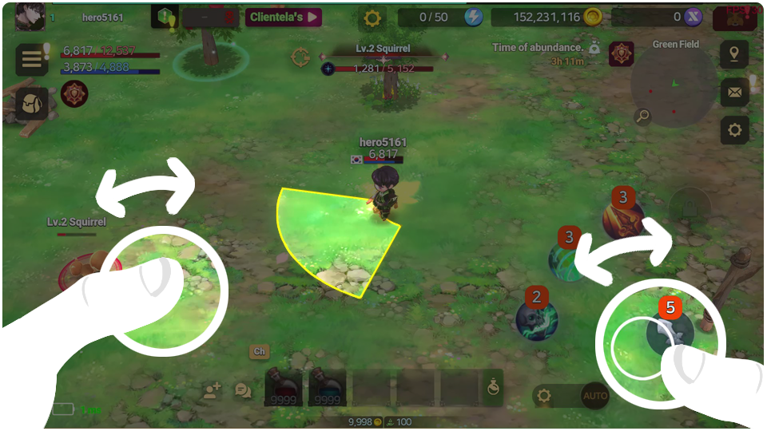

# 🏹 Battle



### 💥 Welcome to EXTOCIUM! Ready to master the battlefield?

#### 🎮 Basic Controls – Let’s Go!

EXTOCIUM is built for smooth mobile play. \
Here’s your quick-start guide to dominating the fight!

1️⃣[Movement ](battle.md#id-1-movement)\
2️⃣[Using Skills ](battle.md#id-2-using-skills)\
3️⃣[Skill Cooldown ](battle.md#id-3-skill-cooldown)\
4️⃣[Auto ](battle.md#id-4-auto)\
5️⃣[Quick Slot](battle.md#id-5-quick-slot)

<figure><figcaption></figcaption></figure>

_EXTOCIUM is optimized for mobile devices._

#### 1️⃣Movement

* Use the joystick on the left to move your character. Simple as that!

#### 2️⃣Using Skills

* You’ve got **five** skill slots on the right:
  * **Slot 1 & 2** → Hero skills
  * **Slot 3** → Weapon skill
  * **Slot 4** → Succession hero skill
  * **Slot 5** → Normal attack
* Tap a skill to auto-target and attack the nearest enemy.
* No enemy? No problem! You’ll attack in the direction you’re facing.
* Drag to **manually aim**—a yellow range indicator will appear. Adjust, release, and BOOM!
* **Pro Tip:** Mastering movement + skill usage = insane moving shots. Stay mobile, stay deadly!

#### 3️⃣Skill Cooldown

Skills rely on **three** cooldown factors:

✅ **Skill Reload Time** → Reload time per bullet. (Invest in **CHA** to reduce!)\
✅ **Magazine Capacity** → Number of shots per skill. (Most skills = 2\~3 shots, Normal attack = 5 shots.)\
✅ **World Cooldown** → A fixed cooldown that can’t be reduced.

🔄 After using a skill, check the **orange panel** on the skill slot:

<figure><figcaption></figcaption></figure>

* **Black mask** = Reload timer. When it completes a full circle, you get one more shot.

<figure><figcaption></figcaption></figure>

* **Magazine bar** = Number of shots left. If it’s full, fire away!


❓[Invest in CHA among primary stats to reduce reload time.](../../growth/heroes/stats/special-stats/#eng)


<figure><figcaption></figcaption></figure>

* **World cooldown mask** = Rotates clockwise to show when the skill is ready again.

<figure><figcaption></figcaption></figure>

#### 4️⃣Auto

<figure><figcaption></figcaption></figure>

* Tap the **Auto** button to start auto-hunting.
* Tap the **gear icon** to fine-tune auto settings (requires [**TP**](training.md#eng)).

<figure><figcaption></figcaption></figure>

* Customize: Choose **which skills to use, movement range, and targets.**


❓**Heads up!** After **Lv. 25**, auto-hunting can make you a[ PK](../../system/pk/#eng) target. Stay alert!


#### 5️⃣Quick Slot

* Drag & drop potions or food into the **Quick Slot** at the bottom of your HUD.

<figure><figcaption></figcaption></figure>

* Tap the **potion icon** to access auto-heal settings.

<figure><figcaption></figcaption></figure>

* Example: If you set HP potions to **20%**, they’ll auto-use when your HP drops below 20%. Lifesaver!

***

#### 💀 Resurrection System – Death isn’t the end!

Got knocked out in battle? Don’t worry.\
You can **resurrect instantly** using a **Resurrection Feather**!

* 🪶 Up to 10 uses per day
* Out of feathers? No problem — you can **revive with Gold!**\
  (Limited to 11 times per day)
* The more you revive, the more Gold it costs. Use wisely!

📊 Check the table below for Gold cost by revive count:

| Revive Count | Gold Required |
| :----------: | :-----------: |
|       1      |    100,000G   |
|       2      |    200,000G   |
|       3      |    400,000G   |
|       4      |    800,000G   |
|       5      |   1,600,000G  |
|       6      |   3,200,000G  |
|       7      |   6,400,000G  |
|       8      |  12,800,000G  |
|       9      |  25,600,000G  |
|      10      |  51,200,000G  |
|      11      |  102,400,000G |

#### 🎯 Final Tip: Stay Fast, Stay Smart, Stay Alive!

Master these basics, and you’ll be crushing the battlefield in no time. See you in EXTOCIUM! 🚀



### 💥 EXTOCIUM에 오신 걸 환영합니다! 전장을 지배할 준비 되셨나요?

#### 🎮 기본 조작법 – 바로 시작!

EXTOCIUM은 모바일 플레이에 최적화되어 있습니다. \
전투를 지배할 수 있도록 빠르게 익혀보세요!

1️⃣[이동](battle.md#id-1)\
2️⃣[스킬 사용](battle.md#id-2)\
3️⃣[스킬 쿨타임](battle.md#id-3)\
4️⃣[오토](battle.md#id-4)\
5️⃣[퀵슬롯](battle.md#id-5)

<figure><figcaption></figcaption></figure>

_EXTOCIUM은 모바일 기기에 최적화 되어 있습니다._&#x20;

#### 1️⃣이동

* 왼쪽의 조이스틱을 사용해 캐릭터를 움직이세요. 간단하죠!

#### 2️⃣스킬 사용

* 우측에는 **다섯 개**의 스킬 슬롯이 있습니다:
  * **슬롯 1 & 2** → 영웅 스킬
  * **슬롯 3** → 무기 스킬
  * **슬롯 4** → 계승 영웅 스킬
  * **슬롯 5** → 일반 공격
* 스킬을 터치하면 자동으로 가장 가까운 적을 공격합니다.
* 주변에 적이 없으면? 괜찮아요! 캐릭터가 보고 있는 방향으로 공격합니다.
* 드래그하면 **수동 조준**이 가능합니다. 노란색 범위가 나타나며, 손을 떼면 발동!
* **꿀팁:** 이동과 스킬을 동시에 활용하면 강력한 **무빙샷**을 만들 수 있습니다. 끊임없이 움직이며 전투하세요!

#### 3️⃣스킬 쿨타임

스킬은 **세 가지** 쿨다운 요소를 따릅니다:&#x20;

✅ **스킬 재장전 시간** → 탄환당 재장전 시간. (**CHA** 투자 시 단축 가능!) \
✅ **탄창 용량** → 스킬별 사용 가능한 횟수. (대부분 2\~3회, 일반 공격은 5회.) \
✅ **월드 쿨다운** → 고정된 쿨타임으로 **CHA 투자로 단축 불가**.

🔄 스킬을 사용한 후 **스킬 슬롯의 주황색 패널**을 확인하세요:

<figure><figcaption></figcaption></figure>

* **검은 마스크** = 재장전 타이머. 한 바퀴를 돌면 탄환이 한 개 충전됩니다.

<figure><figcaption></figcaption></figure>

* **탄창 바** = 남은 탄환 수. 꽉 차 있다면 연속 발사 가능!


❓[1차 스탯 중 CHA 등에 투자하여 리로드 타임을 감소시킬 수 있습니다. ](../../growth/heroes/stats/special-stats/#undefined-1)


<figure><figcaption></figcaption></figure>

* **월드 쿨다운 마스크** = 시계 방향 회전하여 스킬 준비 상태를 표시.

<figure><figcaption></figcaption></figure>

#### 4️⃣오토

<figure><figcaption></figcaption></figure>

* **자동** 버튼을 터치하면 자동 사냥이 시작됩니다.
* **기어 아이콘**을 눌러 자동 설정을 조정하세요 ([**TP**](training.md#undefined-1) **필요**).

<figure><figcaption></figcaption></figure>

* **맞춤 설정:** 사용할 스킬, 이동 범위, 목표를 직접 선택 가능.


❓**주의!** **Lv. 25 이후 자동 사냥 중** [**PK**](../../system/pk/#undefined-1)**의 대상이 될 수 있습니다.** 신중하게 활용하세요!


#### 5️⃣퀵슬롯

* 포션이나 음식을 **퀵 슬롯**에 드래그 & 드롭하여 등록하세요.

<figure><figcaption></figcaption></figure>

* **포션 아이콘**을 눌러 자동 회복 설정을 변경하세요

<figure><figcaption></figcaption></figure>

* 예시: HP 포션을 **20%**&#xB85C; 설정하면 HP가 20% 이하일 때 자동으로 사용됩니다. 생존 필수!

***

#### 💀 부활 시스템 – 죽음은 끝이 아니다!

전투 중 사망했다면 걱정 마세요.\
‘부활의 깃털’을 사용하면 **즉시 부활이 가능합니다!**

* 🪶 **하루 최대 10회 사용 가능**
* 그 이후에는? **골드를 사용해 부활** 가능! (단, **1일 11회 제한**)
* 부활할수록 소비 골드가 늘어나니, **전략적으로 사용하세요!**

📊 골드 소비량은 부활 횟수에 따라 다르며, 아래 테이블을 참고하세요.

| 부활 횟수 |     필요 골드    |
| :---: | :----------: |
|   1   |   100,000G   |
|   2   |   200,000G   |
|   3   |   400,000G   |
|   4   |   800,000G   |
|   5   |  1,600,000G  |
|   6   |  3,200,000G  |
|   7   |  6,400,000G  |
|   8   |  12,800,000G |
|   9   |  25,600,000G |
|   10  |  51,200,000G |
|   11  | 102,400,000G |

#### 🎯 마지막 팁: 빠르게, 스마트하게, 살아남아라!

이 기본기를 익히면 전장을 장악하는 것은 시간문제! EXTOCIUM에서 만나요! 🚀



### 💥 EXTOCIUMへようこそ！戦場を支配する準備はできましたか？

#### 🎮 基本操作 – すぐに覚えよう！

EXTOCIUMはモバイルプレイに最適化されています。\
戦闘を支配するためのクイックガイドをご紹介！

1️⃣[移動](battle.md#id-1-yi-dong) \
2️⃣[スキル使用 ](battle.md#id-2sukiru)\
3️⃣[スキルクールダウン](battle.md#id-3sukirukrudaun) \
4️⃣[オート ](battle.md#id-4to)\
5️⃣[クイックスロット](battle.md#id-5kuikkusurotto)

<figure><figcaption></figcaption></figure>

_EXTOCIUMはモバイル機器に最適化されています。_

#### 1️⃣移動

* 左側のジョイスティックでキャラクターを移動させましょう。シンプルですね！

#### 2️⃣スキル使用

* 右側には**5つのスキルスロット**があります:
  * **スロット1 & 2** → ヒーロースキル
  * **スロット3** → 武器スキル
  * **スロット4** → 継承ヒーロースキル
  * **スロット5** → 通常攻撃
* スキルをタップすると、自動で最も近い敵を攻撃します。
* 敵が近くにいない場合は、キャラクターの向いている方向へ攻撃します。
* **ドラッグで手動エイム可能！** 黄色の範囲が表示されるので、調整して指を離せば発動！
* **ポイント:** 移動とスキル使用を組み合わせることで、驚異的な**ムービングショット**が可能！

#### 3️⃣スキルクールダウン

スキルには**3つのクールダウン要素**があります:&#x20;

✅ **スキルリロード時間** → 弾丸ごとのリロード時間。（**CHA** に投資すると短縮！） \
✅ **マガジン容量** → スキルの発射回数。（通常2～3発、通常攻撃は5発） \
✅ **ワールドクールダウン** → 固定時間。**CHA投資では短縮不可**。

🔄 スキル使用後は**スキルスロットのオレンジパネル**をチェック！

<figure><figcaption></figcaption></figure>

* **黒いマスク** = リロードタイマー。1周すると弾丸が1つ補充。

<figure><figcaption></figcaption></figure>

* **マガジンバー** = 残り弾数。フルなら連続使用OK！


❓[主要ステータスのCHAに投資してリロード時間を短縮できます。](../../growth/heroes/stats/special-stats/#ri-ben-yu)


<figure><figcaption></figcaption></figure>

* **ワールドクールダウンマスク** = 時計回りに回転し、スキルの準備状態を示す。

<figure><figcaption></figcaption></figure>

#### 4️⃣オート

<figure><figcaption></figcaption></figure>

* **オート**ボタンを押すと自動狩り開始！
* **ギアアイコン**で詳細設定可能（[**TP**](training.md#ri-ben-yu)**が必要**）。

<figure><figcaption></figcaption></figure>

* **カスタマイズ:** 使用スキル、移動範囲、ターゲットを選択可能。


❓**注意！** Lv.25以降は[PK](../../system/pk/#ri-ben-yu)のターゲットになる可能性あり。慎重に！


#### 5️⃣クイックスロット

* ポーションや食料を**クイックスロット**にドラッグ＆ドロップ。

<figure><figcaption></figcaption></figure>

* **ポーションアイコン**で自動回復設定変更。

<figure><figcaption></figcaption></figure>

* 例: HPポーションを\*\*20%\*\*に設定すると、HPが20%以下で自動使用。生存率アップ！

***

#### 💀 復活システム – 死んでも終わりじゃない！

戦闘中に倒れてしまいましたか？大丈夫です。\
\*\*「復活の羽」\*\*を使えば、すぐにその場で復活できます！

* 🪶 1日に最大10回まで使用可能
* 羽がなくなった後は？ **ゴールドを使って復活**することも可能です！\
  （こちらも1日最大11回まで）
* 復活回数が増えるたびに、必要なゴールドも増えていきます。\
  計画的に使いましょう！

📊 復活回数ごとの必要ゴールドは以下の通りです：

| 復活回数 |    必要ゴールド    |
| :--: | :----------: |
|   1  |   100,000G   |
|   2  |   200,000G   |
|   3  |   400,000G   |
|   4  |   800,000G   |
|   5  |  1,600,000G  |
|   6  |  3,200,000G  |
|   7  |  6,400,000G  |
|   8  |  12,800,000G |
|   9  |  25,600,000G |
|  10  |  51,200,000G |
|  11  | 102,400,000G |

#### 🎯 最後のヒント: 速く、賢く、生き残れ！

基本をマスターすれば、戦場を支配するのも簡単！EXTOCIUMで会いましょう！🚀



\-
