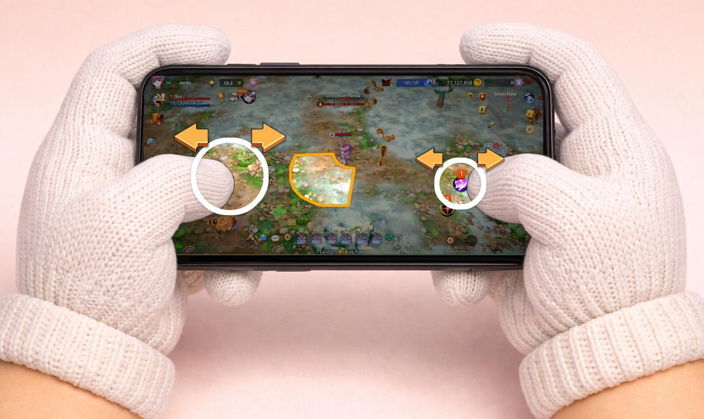
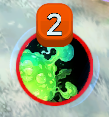
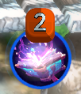
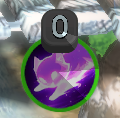
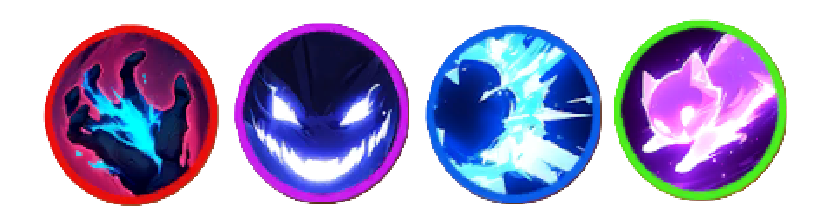

# 🏹 Battle



## 💥 EXTOCIUM Combat Guide

Combat in **EXTOCIUM** is built around\
intuitive, mobile-optimized controls\
and a **real-time battle system** that rewards fast decision-making.

Master the basic controls and systems below,\
and the battlefield will feel a lot more manageable.

***

### 🎮 Core Combat Controls

The key combat elements are:

1️⃣ [Movement](battle.md#id-1-movement)\
2️⃣ [Skill Usage](battle.md#id-2-skill-usage)\
3️⃣ [Skill Cooldowns](battle.md#id-3-skill-cooldowns)\
4️⃣ [Auto Combat](battle.md#id-4-auto-combat)\
5️⃣ [Quick Slots](battle.md#id-5-quick-slots)

***

### 1️⃣ Movement

Use the **left side of the screen** to move your character freely.\
With simple controls, you can dodge, approach enemies,\
and position yourself effectively at all times.

<figure><figcaption></figcaption></figure>

***

### 2️⃣ Skill Usage

On the **right side of the screen**, you’ll see **5 skill slots**.

* Slot 1 / 2: Hero Skills
* Slot 3: Weapon Skill
* Slot 4: Inherited Hero Skill
* Slot 5: Basic Attack

<figure><figcaption></figcaption></figure>

#### #Basic Usage

Tapping a skill automatically targets and attacks the **nearest enemy**.\
If no enemy is nearby, the skill is cast in the **direction your character is facing**.

#### #Manual Targeting

Drag a skill button to display a **yellow targeting area**.\
Release your finger to cast the skill at the selected location.

<figure><figcaption></figcaption></figure>

#### #Combat Tips

Using skills while moving allows you to **attack and dodge at the same time**.\
Constant movement is key to surviving battles.

***

### 3️⃣ Skill Cooldowns

Skills cannot be used infinitely in succession.\
Each skill follows **three cooldown-related elements**.

***

#### 🔫 Cooldown Components

**1️⃣ Reload Time**\
The time required to reload ammo after using a skill.\
Investing in the **CHA stat** reduces reload time.

**2️⃣ Magazine Capacity**\
The number of times a skill can be used consecutively.\
Most skills can be used **2–3 times**,\
while basic attacks can be used up to **5 times**.

**3️⃣ World Cooldown**\
A fixed cooldown that applies after using a skill.\
This cooldown **cannot be reduced**, even with CHA investment.

***

### 👀 Skill Slot UI Indicators

All cooldown-related information is shown directly on the skill slot UI.

***

**🔴 Number Above Skill Icon (Magazine Count)**

<figure><figcaption></figcaption></figure>

* The red number above a skill icon shows the **current loaded ammo count**.
* It also represents how many times the skill can still be used.
* The number decreases by 1 each time the skill is used.

🔄 **Reload Status Indicator**

<figure><figcaption></figcaption></figure>

* A black rotating mask appears in the number area.
* Each full rotation restores **1 ammo**.
* Ammo is not restored until the rotation completes.


[Reload time can be reduced by investing in **CHA**.](../../growth/heroes/stats/special-stats/)


**🔵 Outer Ring (World Cooldown**)

<figure><figcaption></figcaption></figure>

* The large black rotating ring around the skill icon indicates **World Cooldown**.
* After using a skill, the ring rotates.
* The skill becomes usable only after the rotation fully completes.
* World Cooldown is a **fixed value** and cannot be reduced.

***

#### 🎨 Skill Icon Border Color (Skill Type)

<figure><figcaption></figcaption></figure>

The color of the outer border shows the skill type:

* **Red**: Area-of-Effect Attack
* **Purple**: Summon Skill
* **Blue**: Ranged Attack
* **Green**: Buff Skill

This allows quick recognition of skill roles during combat.


#### Skills can only be used when **ammo is available** and **all cooldowns are complete**.


***

### 4️⃣ Auto Combat

<figure><figcaption></figcaption></figure>

Auto Combat allows your character to move and fight automatically.

#### 🔓 Unlock Condition

* Auto Combat is unlocked using [**TP**](training.md).
* Once unlocked, it can be used at any time.

***

#### ⚙️ Auto Combat Settings

Use the **gear icon** to configure:

* Skills to use
* Movement range
* Target priorities

Proper settings enable efficient farming.

<figure><figcaption></figcaption></figure>


#### Caution

After **Lv.25**, you may become a [PK ](../../system/pk/)target during Auto Combat.\
Always check whether the area is safe before using it.


***

### 5️⃣ Quick Slots

You can register **potions and food** in Quick Slots.\
Drag items directly into the slot to assign them.

<figure><figcaption></figcaption></figure>

Use the **gear icon** to set automatic usage conditions.

<figure><figcaption></figcaption></figure>

#### Example:

If an HP potion is set to **20%**,\
it will be used automatically when HP drops below 20%.

<figure><figcaption></figcaption></figure>

***

### 💀 Revival System

If your character dies in combat, you can use the revival system.

* Instant revival using a **Feather of Revival**
* Up to **10 uses per day**
* After exceeding feather uses, revival is possible with **Gold**\
  (Up to **11 times per day**)

📊 The amount of Gold required depends on the number of revivals.\
Please refer to the table below for details.

| Revival Count | Required Gold |
| :-----------: | :-----------: |
|       1       |    100,000G   |
|       2       |    200,000G   |
|       3       |    400,000G   |
|       4       |    800,000G   |
|       5       |   1,600,000G  |
|       6       |   3,200,000G  |
|       7       |   6,400,000G  |
|       8       |  12,800,000G  |
|       9       |  25,600,000G  |
|       10      |  51,200,000G  |
|       11      |  102,400,000G |

***

### 🎯 Combat Key Takeaways

* Never stop moving.
* Understand the cooldown structure.
* Use Auto Combat wisely, depending on the situation.

Once you grasp the core combat systems,\
the battlefield of **EXTOCIUM**\
will no longer feel overwhelming.



## 💥 **EXTOCIUM 전투 가이드**

EXTOCIUM의 전투는\
모바일 환경에 최적화된 직관적인 조작과\
빠른 판단을 요구하는 실시간 전투 시스템으로 구성되어 있습니다.

아래 기본 조작과 시스템을 숙지하면 전장을 보다 안정적으로 지배할 수 있습니다.

***

### 🎮 기본 조작 구성

전투의 핵심 조작 요소는 다음과 같습니다.

1️⃣ [이동](battle.md#id-1)\
2️⃣ [스킬 사용](battle.md#id-2)\
3️⃣ [스킬 쿨타임](battle.md#id-3)\
4️⃣ [오토(자동 전투)](battle.md#id-4)\
5️⃣ [퀵슬롯](battle.md#id-5)

***

### 1️⃣ 이동

화면의 왼쪽부분을 사용하여 캐릭터를 자유롭게 이동할 수 있습니다.\
간단한 조작만으로 회피, 접근, 위치 선정이 모두 가능합니다.

<figure><figcaption></figcaption></figure>

***

### 2️⃣ 스킬 사용

화면 오른쪽에는 총 **5개의 스킬 슬롯**이 배치되어 있습니다.

* **슬롯 1 / 2** : 영웅 스킬
* **슬롯 3** : 무기 스킬
* **슬롯 4** : 계승 영웅 스킬
* **슬롯 5** : 일반 공격

<figure><figcaption></figcaption></figure>

#### #기본 사용 방식

스킬을 터치하면 가장 가까운 적을 자동으로 공격합니다.\
주변에 적이 없는 경우에는 캐릭터가 바라보는 방향으로 스킬이 발동됩니다.

#### #수동 조준

스킬 버튼을 드래그하면 노란색 범위가 표시됩니다.\
손을 떼는 위치를 기준으로 스킬이 발동됩니다.

<figure><figcaption></figcaption></figure>

#### #전투 팁

이동 중 스킬을 사용하면 공격과 회피를 동시에 수행할 수 있습니다.\
전투 중에는 지속적인 이동이 중요합니다.

***

### 3️⃣ 스킬 쿨타임

스킬은 연속 사용에 제한이 있습니다.\
각 스킬은 다음 **3가지 쿨타임 요소**를 따릅니다.

***

#### 🔫 쿨타임 구성 요소

**1️⃣ 재장전 시간 (Reload Time)**\
스킬 사용 후 탄환이 다시 충전되기까지 필요한 시간입니다.\
CHA 스탯에 투자할 경우 재장전 시간이 감소합니다.

**2️⃣ 탄창 용량 (Magazine Capacity)**\
스킬별로 연속 사용 가능한 횟수가 정해져 있습니다.\
대부분의 스킬은 2\~3회 사용이 가능하며,\
일반 공격은 최대 5회까지 사용 가능합니다.

**3️⃣ 월드 쿨다운 (World Cooldown)**\
스킬 사용 후 반드시 대기해야 하는\
고정 쿨타임입니다.\
CHA 스탯 투자로는 감소되지 않습니다.

***

### 👀 스킬 슬롯 UI 표시 안내

위의 쿨타임 요소들은\
모두 **스킬 슬롯 UI**를 통해 확인할 수 있습니다.

***

**🔴 스킬 아이콘 상단 숫자 (탄창 바)**

<figure><figcaption></figcaption></figure>

스킬 아이콘 위에 표시된 **빨간색 숫자**는\
해당 스킬의 **탄창 수(현재 장전된 탄환 개수)**&#xB97C; 의미합니다.

* 숫자는 해당 스킬이 **최대 몇 회까지 사용 가능한지**를 나타냅니다.
* 스킬을 사용할 때마다 숫자가 **1씩 감소**합니다.

**🔄 재장전 상태 표시**

<figure><figcaption></figcaption></figure>

숫자 영역에는 **검은색 회전 마스크**가 표시됩니다.

* 회전이 **1회 완료될 때마다 탄환 1개가 충전**됩니다.
* 회전이 종료되기 전까지는 해당 탄환이 충전되지 않습니다.


[1차 스탯 중 CHA 등에 투자하여 리로드 타임을 감소시킬 수 있습니다. ](../../growth/heroes/stats/special-stats/#undefined-1)


**🔵 스킬 아이콘 외곽 원 (월드 쿨다운)**

<figure><figcaption></figcaption></figure>

스킬 아이콘 바깥을 감싸는 **큰 원형 검은색 회전 마스크**는\
해당 스킬의 **월드 쿨다운 상태**를 나타냅니다.

* 스킬 사용 시 외곽 원이 **검은색으로 회전**합니다.
* 회전이 **완전히 종료되어야 스킬 사용이 가능**합니다.

월드 쿨다운은 CHA 스탯 투자로 감소되지 않는 고정 쿨타임입니다.

***

#### 🎨 스킬 아이콘 외곽 색상 (스킬 유형)

<figure><figcaption></figcaption></figure>

스킬 아이콘 바깥 원형 테두리의 **색상**은\
해당 스킬의 **유형**을 나타냅니다.

* **빨간색** : 광역 공격 스킬
* **보라색** : 소환 스킬
* **파란색** : 원거리 공격 스킬
* **초록색** : 버프 스킬

색상을 통해 전투 중 스킬의 성격을 빠르게 구분할 수 있습니다.


#### **스킬은 탄환이 존재하고 모든 쿨타임이 종료된 상태에서만 사용할 수 있습니다.**


***

### 4️⃣ 오토 (자동 전투)

<figure><figcaption></figcaption></figure>

자동 전투는 캐릭터가 이동과 전투를 자동으로 수행하는 기능입니다.

#### 🔓 오토 해금 조건

자동 전투 기능은 [**TP**](../../economy/trade/#undefined-1)**를 사용하여 해금**할 수 있습니다.\
해금 이후에는 언제든지 자동 전투를 사용할 수 있습니다.

***

#### ⚙️ 자동 전투 설정

기어 아이콘을 통해 자동 전투 세부 설정이 가능합니다.

* 사용 스킬 선택
* 이동 범위 설정
* 공격 대상 지정

상황에 맞는 설정을 통해 효율적인 사냥이 가능합니다.

<figure><figcaption></figcaption></figure>


#### 주의 사항

Lv.25 이후에는 자동 전투 중 [PK](../../system/pk/)의 대상이 될 수 있습니다.\
안전 지역 여부를 확인한 후 사용을 권장합니다.


***

### 5️⃣ 퀵슬롯

포션 및 음식을 퀵슬롯에 등록하여 사용할 수 있습니다.\
아이템을 드래그하여 퀵슬롯에 배치할 수 있습니다.

<figure><figcaption></figcaption></figure>

톱니바퀴 아이콘을 눌러 자동 사용 조건을 설정할 수 있습니다.

<figure><figcaption></figcaption></figure>

#### 설정 예시

HP 포션을 20%로 설정할 경우 체력이 20% 이하가 되면 자동으로 사용됩니다.

<figure><figcaption></figcaption></figure>

***

### 💀 부활 시스템

전투 중 캐릭터가 사망한 경우 부활 시스템을 이용할 수 있습니다.

* **부활의 깃털** 사용 시 즉시 부활
* 하루 최대 **10회 사용 가능**

깃털 사용 횟수를 초과할 경우 골드를 사용하여 부활할 수 있습니다. (1일 최대 11회 제한)

📊 골드 소비량은 부활 횟수에 따라 다르며, 아래 테이블을 참고하세요.

| 부활 횟수 |     필요 골드    |
| :---: | :----------: |
|   1   |   100,000G   |
|   2   |   200,000G   |
|   3   |   400,000G   |
|   4   |   800,000G   |
|   5   |  1,600,000G  |
|   6   |  3,200,000G  |
|   7   |  6,400,000G  |
|   8   |  12,800,000G |
|   9   |  25,600,000G |
|   10  |  51,200,000G |
|   11  | 102,400,000G |

***

### 🎯 전투 핵심 요약

* 이동을 멈추지 마십시오.
* 쿨타임 구조를 이해하십시오.
* 자동 전투는 상황에 맞게 사용하십시오.

기본 전투 시스템을 숙지하면\
EXTOCIUM의 전장은\
더 이상 위협적인 공간이 아닙니다.



## 💥 EXTOCIUM バトルガイド

**EXTOCIUM**の戦闘は、\
モバイル環境に最適化された直感的な操作と、\
素早い判断が求められる**リアルタイムバトル**で構成されています。

以下の基本操作とシステムを理解すれば、\
戦場をより安定して戦えるようになります。

***

### 🎮 基本操作構成

戦闘の主な操作要素は以下の通りです。

1️⃣[ 移動](battle.md#id-1-yi-dong)\
2️⃣ [スキル使用](battle.md#id-2-sukiru)\
3️⃣ [スキルクールタイム](battle.md#id-3-sukirukrutaimu)\
4️⃣ [オート（自動戦闘）](battle.md#id-4-to)\
5️⃣ [クイックスロット](battle.md#id-5-kuikkusurotto)

***

### 1️⃣ 移動

画面左側を使用して、キャラクターを自由に移動できます。\
回避・接近・位置取りを、シンプルな操作で行うことが可能です。

<figure><figcaption></figcaption></figure>

***

### 2️⃣ スキル使用

画面右側には **5つのスキルスロット** が配置されています。

* スロット1 / 2：ヒーロースキル
* スロット3：武器スキル
* スロット4：継承ヒーロースキル
* スロット5：通常攻撃

<figure><figcaption></figcaption></figure>

#### #基本操作

スキルをタップすると、最も近い敵を自動で攻撃します。\
周囲に敵がいない場合は、キャラクターが向いている方向にスキルが発動します。

#### #手動照準

スキルボタンをドラッグすると、黄色い照準範囲が表示されます。\
指を離した位置を基準にスキルが発動します。

<figure><figcaption></figcaption></figure>

#### #バトルのコツ

移動しながらスキルを使うことで、攻撃と回避を同時に行えます。\
戦闘中は常に移動することが重要です。

***

### 3️⃣ スキルクールタイム

スキルは連続で無制限に使用できません。\
各スキルには、以下の3つの要素があります。

***

#### 🔫 クールタイム構成

**1️⃣ リロード時間（Reload Time）**\
スキル使用後、弾薬が再装填されるまでの時間です。\
**CHAステータス**に投資すると短縮されます。

**2️⃣ マガジン容量（Magazine Capacity）**\
スキルごとに連続使用可能回数が決まっています。\
多くのスキルは **2～3回**、\
通常攻撃は **最大5回** 使用可能です。

**3️⃣ ワールドクールダウン（World Cooldown）**\
スキル使用後、必ず待機が必要な固定クールタイムです。\
CHAへの投資では短縮されません。

***

### 👀 スキルスロットUI表示

クールタイムに関する情報は、\
すべてスキルスロットUIで確認できます。

***

**🔴 スキルアイコン上部の数字（弾数**）

<figure><figcaption></figcaption></figure>

* 赤い数字は、現在装填されている弾数を示します。
* 使用可能な残り回数を表します。
* スキル使用ごとに数字が1減少します。

**🔄 リロード状態表示**

<figure><figcaption></figcaption></figure>

* 数字部分に黒い回転マスクが表示されます。
* 回転が1周完了するごとに弾が1つ補充されます。
* 回転が終わるまで弾は補充されません。


[CHA投資によりリロード時間を短縮できます。](../../growth/heroes/stats/special-stats/)


**🔵 外周リング（ワールドクールダウン**）

<figure><figcaption></figcaption></figure>

* スキルアイコン外側の大きな円は、ワールドクールダウンの状態を示します。
* スキル使用後、黒い円が回転します。
* 回転が完全に終了すると使用可能になります。
* ワールドクールダウンは固定値です。

***

#### 🎨 スキルアイコン外枠の色（スキルタイプ）

<figure><figcaption></figcaption></figure>

* **赤**：範囲攻撃スキル
* **紫**：召喚スキル
* **青**：遠距離攻撃スキル
* **緑**：バフスキル

色によって戦闘中にスキルの役割を素早く判別できます。


#### スキルは、弾があり、すべてのクールタイムが終了した状態でのみ使用可能です。


***

### 4️⃣ オート（自動戦闘）

<figure><figcaption></figcaption></figure>

自動戦闘では、キャラクターが移動と戦闘を自動で行います。

**🔓 解放条件**

* [**TP**](training.md)を使用して解放できます。
* 解放後はいつでも利用可能です。

***

#### **⚙️ 自動戦闘設定**

歯車アイコンから以下を設定できます。

* 使用スキル
* 移動範囲
* 攻撃対象

設定次第で効率的な狩りが可能です。

<figure><figcaption></figcaption></figure>


#### 注意

Lv.25以降は、自動戦闘中に[PK](../../system/pk/)の対象となる可能性があります。\
必ず安全エリアか確認してから使用してください。


***

### 5️⃣ クイックスロット

ポーションや食べ物をクイックスロットに登録できます。\
アイテムをドラッグして配置してください。

<figure><figcaption></figcaption></figure>

歯車アイコンから自動使用条件を設定できます。

<figure><figcaption></figcaption></figure>

#### **設定例**

HPポーションを20％に設定すると、\
HPが20％以下になった際に自動で使用されます。

<figure><figcaption></figcaption></figure>

***

### 💀 復活システム

戦闘中にキャラクターが死亡した場合、復活システムを利用できます。

* **復活の羽**を使用すると即時復活
* 1日最大10回まで使用可能
* 羽の使用回数を超えた場合、ゴールドで復活可能\
  （1日最大11回まで）

📊 消費ゴールド量は復活回数によって異なります。\
詳細は下記テーブルをご確認ください。

| 復活回数 |    必要ゴールド    |
| :--: | :----------: |
|   1  |   100,000G   |
|   2  |   200,000G   |
|   3  |   400,000G   |
|   4  |   800,000G   |
|   5  |  1,600,000G  |
|   6  |  3,200,000G  |
|   7  |  6,400,000G  |
|   8  |  12,800,000G |
|   9  |  25,600,000G |
|  10  |  51,200,000G |
|  11  | 102,400,000G |

***

#### 🎯 バトル要点まとめ

* 移動を止めないこと
* クールタイム構造を理解すること
* 自動戦闘は状況に応じて使うこと

基本的な戦闘システムを把握すれば、\
**EXTOCIUM**の戦場は\
もはや恐れる場所ではありません。



\-
