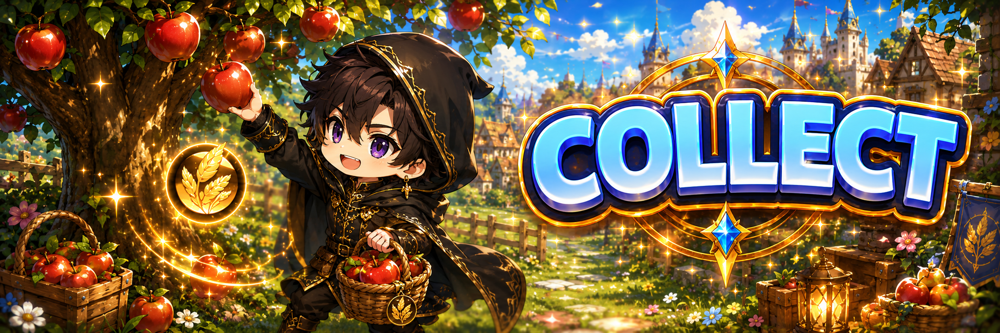
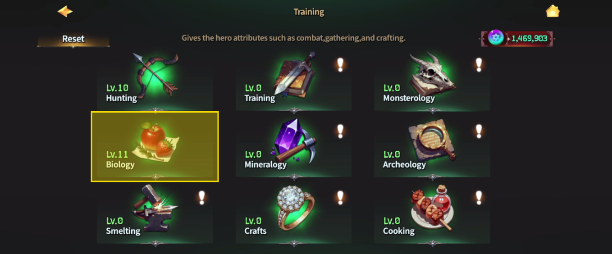
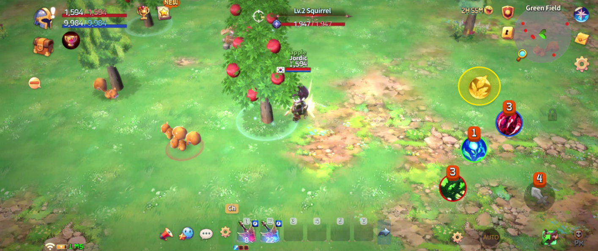

# 🍎 Collecting

<figure><figcaption></figcaption></figure>



## 🌿 Collecting Guide

Can anyone collect plants and ores in the field right away?\
Not quite.

In **EXTOCIUM**, collecting is an action that must be **learned first**.

***

### ◾ Before You Start

To begin collecting, you must first learn collecting skills through [**Training**](training.md#training-guide).\
Learning skills requires [**TP (Training Points)**](training.md#what-is-tp-training-point).

TP can be obtained by hunting monsters.\
Look for the **blue coins** dropped on the ground after defeating them.

<figure><figcaption></figcaption></figure>

***

### ◾ How to Learn Collecting Skills

You can learn collecting skills by following these steps:

1️⃣ From the main screen, tap the **Helmet Icon** to open the Dashboard.

<figure><figcaption></figcaption></figure>

\
2️⃣ Select **Training** from the left menu.

<figure><figcaption></figcaption></figure>

\
3️⃣ Choose **Biology** from the top menu.

<figure><figcaption></figcaption></figure>

In Biology, you will find skills related to collecting.\
Spend TP on a skill to unlock the corresponding collecting ability.

<figure><figcaption></figcaption></figure>

***

### ◾ How to Collect

After learning a collecting skill, move to the field.\
When you approach a collectible object, the **Collect button** will appear on the screen.

<figure><figcaption></figcaption></figure>

Tap the button to start collecting.\
Once completed, you will obtain material items.

***

### ◾ Auto Collecting

If you need to collect the same material repeatedly,\
you can use the **Auto Collecting** feature.

With Auto Collecting enabled,\
your character will automatically gather nearby resources.

For details on how to set it up, please refer to the related UI guide.

<figure><figcaption></figcaption></figure>

<figure><figcaption></figcaption></figure>

***

### ◾ Collecting – Key Points

* Collecting is available after Training.
* Collecting skills are learned in **Training > Biology**.
* Approach a resource and tap the button to collect.
* Use Auto Collecting for repeated gathering.



## 🌿 채집 가이드

필드에 있는 풀과 광물, 아무나 바로 채집할 수 있을까요?&#x20;

아닙니다.\
EXTOCIUM에서 채집은 **배워야 할 수 있는 행동**입니다.

***

### ◾ 먼저 알아두세요

채집을 하려면 [**기술 연마(Training)**](training.md#undefined-2)를 통해 채집 기술을 먼저 배워야 합니다.\
기술을 배우기 위해서는 [**TP(Training Point)**](training.md#tp-training-point)가 필요합니다.

TP는 몬스터를 사냥하다 보면 바닥에 떨어진 **파란색 동전**으로 획득할 수 있습니다.

<figure><figcaption></figcaption></figure>

***

### ◾ 채집 기술 배우는 방법

채집 기술은 다음 순서로 배울 수 있습니다.

1️⃣ 메인 화면에서 **‘투구 아이콘’을 클릭**해 **대시보드**를 엽니다.

<figure><figcaption></figcaption></figure>

\
2️⃣ 좌측 메뉴에서 **기술 연마(Training)**&#xB97C; 선택합니다.

<figure><figcaption></figcaption></figure>

\
3️⃣ 상단 메뉴에서 **생물학**을 선택합니다.

<figure><figcaption></figcaption></figure>

**생물학**에는 채집과 관련된 기술들이 정리되어 있습니다.\
원하는 기술에 TP를 사용하면 해당 채집이 가능해집니다.

<figure><figcaption></figcaption></figure>

***

### ◾ 채집은 이렇게 합니다

채집 기술을 배운 뒤 필드로 이동해 보세요.\
채집물 근처로 다가가면 화면에 **채집 버튼**이 나타납니다.

<figure><figcaption></figcaption></figure>

채집 버튼을 터치하면 채집이 시작됩니다.\
채집이 끝나면 재료 아이템을 획득할 수 있습니다.

***

### ◾ 자동 채집

같은 재료를 여러 번 채집해야 할 때는 **자동 채집 기능**을 사용할 수 있습니다.\
자동 채집을 설정하면 캐릭터가 주변 채집물을 자동으로 수집합니다.

자동 채집 설정 방법은 관련 UI 안내를 참고하시기 바랍니다.

<figure><figcaption></figcaption></figure>

<figure><figcaption></figcaption></figure>

***

### ◾ 채집, 이것만 기억하세요

* 채집은 기술 연마 후 가능합니다.
* 채집 기술은 **Training > Biology**에서 배웁니다.
* 채집물 근처에서 버튼을 터치하면 채집이 시작됩니다.
* 반복 채집 시 자동 채집을 활용할 수 있습니다.



## 🌿 採集ガイド

フィールドにある草や鉱石は、誰でもすぐに採集できるのでしょうか？\
いいえ、できません。

**EXTOCIUM**では、採集は**学んでから行う行動**です。

***

### ◾ まず知っておきましょう

採集を行うには、[**技術研磨（Training）**](training.md#gaido)で 採集スキルを先に習得する必要があります。\
スキルを習得するには [**TP（Training Point）**](training.md#tptraining-pointtoha)が必要です。

TPはモンスターを倒すと、地面に落ちる**青いコイン**として獲得できます。

<figure><figcaption></figcaption></figure>

***

### ◾ 採集スキルの習得方法

採集スキルは、以下の手順で習得できます。

1️⃣ メイン画面で**ヘルメットアイコン**をタップし、ダッシュボードを開きます。

<figure><figcaption></figcaption></figure>

\
2️⃣ 左側メニューから**技術研磨（Training）**&#x3092;選択します。

<figure><figcaption></figcaption></figure>

\
3️⃣ 上部メニューで**Biology**を選択します。

<figure><figcaption></figcaption></figure>

**Biology**には、採集に関するスキルがまとめられています。\
TPを使用すると、対応する採集が可能になります。

<figure><figcaption></figcaption></figure>

***

### ◾ 採集のやり方

採集スキルを習得したら、フィールドへ移動してください。\
採集物の近くに行くと、画面に**採集ボタン**が表示されます。

<figure><figcaption></figcaption></figure>

ボタンをタップすると採集が開始され、完了すると素材アイテムを獲得できます。

***

### ◾ 自動採集

同じ素材を何度も採集する場合は、**自動採集機能**を利用できます。\
自動採集を設定すると、キャラクターが周囲の採集物を自動で集めます。

設定方法の詳細は、関連するUIガイドをご確認ください。

<figure><figcaption></figcaption></figure>

<figure><figcaption></figcaption></figure>

***

### ◾ 採集のポイントまとめ

* 採集は技術研磨後に可能になります。
* 採集スキルは **Training > Biology** で習得します。
* 採集物の近くでボタンをタップすると採集が始まります。
* 繰り返し採集する場合は自動採集が便利です。



<em>※ This guide was written based on the game status as of December 26, 2025,</em>  <em>and its contents may change with future updates.</em>

