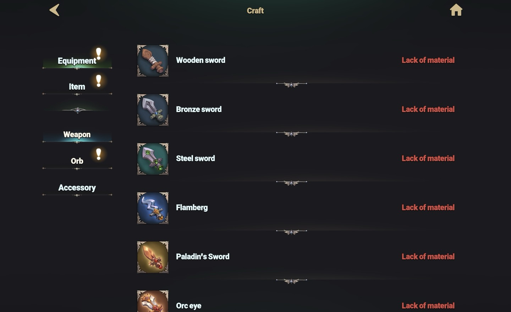

# ⚒️ Crafting



💡**The economy of EXTOCIUM is based on a crafting system.**

To become stronger, you must craft more powerful equipment. Crafting equipment requires numerous intermediate materials. Acquire recipes through hunting, and craft materials and equipment to further upgrade your character!

Shall we learn how to craft items now?

<figure><figcaption></figcaption></figure>

👉First, touch the dashboard button on the main HUD.

<figure><figcaption></figcaption></figure>

👉Please touch the 'Craft' button in the left menu bar of the dashboard widget.

<figure><figcaption></figcaption></figure>

👉 **There are three categories in the crafting screen.**\
❓ In the **Equipment tab**, you can craft [**Weapons**](../../growth/equipment/weapon/#eng)**,** [**Orbs**](../../growth/equipment/orb/#eng)**, and** [**Accessories**](../../growth/equipment/accessories/#eng).\
❓ In the **Item tab**, you can craft **Materials, Potions, and Scrolls**.

<figure><figcaption></figcaption></figure>

👉For items that can be crafted, the screen will show how many items can be crafted, as depicted above.

<figure><figcaption></figcaption></figure>

👉Touch the target panel to see more detailed information. It will display the required gold and material items for crafting, as well as the quantity to be crafted. Touch the 'Craft' button at the bottom to craft the item.

<figure><figcaption></figcaption></figure>

👉There are two cases where crafting is not possible. \
The first is, as shown above, where you need to learn the crafting method through '[Traning](training.md#eng)'. Earn TP through hunting to refine your crafting skills.

<figure><figcaption></figcaption></figure>

👉The second case, as shown above, is when a 'Recipe Item' is needed. \
Recipe items are dropped throughout the continent of Asterica. They can be dropped by monsters, or you can obtain them from '[NPC Hermaion](../../field-info/rotten-hill/npc-rotten-hill.md#hermaion-herumeion)'.



💡**EXTOCIUM의 경제는 제작 시스템을 기반으로 순환합니다.**&#x20;

나를 더욱 강하게 만들려면, 더 강력한 장비를 제작해야 합니다. 장비를 제작하려면 수많은 중간 단계의 재료들이 필요합니다. 사냥을 통해 레시피를 습득하고, 재료와 장비를 제작하여 나의 캐릭터를 더 업그레이드 시켜보세요!

지금부터 아이템을 제작하는 방법을 알아볼까요?

<figure><figcaption></figcaption></figure>

👉우선 메인 HUD의 대시보트 버튼을 터치합니다.

<figure><figcaption></figcaption></figure>

👉대시보드 위젯의 좌측 메뉴바에서 '제작' 버튼을 터치해주세요.

<figure><figcaption></figcaption></figure>

👉 제작 화면에는 3개의 카테고리가 존재합니다.\
❓ 장비 탭에서는 '[**무기**](../../growth/equipment/weapon/#undefined-1)', '[**오브**](../../growth/equipment/orb/#undefined-1)', '[**악세서리**](../../growth/equipment/accessories/#undefined-1)' 제작이 가능합니다.\
❓ 아이템 탭에서는 '**재료**', '**포션**', '**주문서**' 제작이 가능합니다.

<figure><figcaption></figcaption></figure>

👉제작이 가능한 아이템의 경우, 위 화면처럼 몇 개의 아이템 제작이 가능한지 표시됩니다.

<figure><figcaption></figcaption></figure>

👉대상 패널을 터치하여 더 자세한 정보를 확인할 수 있습니다. 제작에 필요한 골드 및 재료아이템, 제작 수량 등이 표시됩니다. 하단에 '제작' 버튼을 터치하면 아이템을 제작할 수 있습니다.

<figure><figcaption></figcaption></figure>

👉제작이 불가능한 경우는 두 가지가 있습니다. \
첫 번째로는 위 화면 처럼, '[기술 연마](training.md#undefined-1)'를 통해 제작법을 익혀야 하는 경우입니다. 사냥을 통해 TP를 획득하여 제작 기술을 연마해보세요.

<figure><figcaption></figcaption></figure>

👉두 번째 경우는 위 화면 처럼, '레시피 아이템'이 필요한 경우입니다. \
레시피 아이템은 아스테리카 대륙 곳곳에서 드랍됩니다. 몬스터에게 드랍되는 경우도 있고, '[NPC 헤르마이온](../../field-info/rotten-hill/npc-rotten-hill.md#hermaion-herumeion)'에게서 획득할 수 있는 경우도 있습니다.



💡**EXTOCIUMの経済は製作システムを基盤として回っています。**

もっと強くなるには、より強力な装備を製作する必要があります。装備を製作するには、多くの中間材料が必要です。狩りを通じてレシピを習得し、材料と装備を製作してキャラクターをさらにアップグレードしましょう！

さあ、アイテムの作り方を学びましょうか？

<figure><figcaption></figcaption></figure>

👉まず、メインHUDのダッシュボードボタンをタッチします。

<figure><figcaption></figcaption></figure>

👉ダッシュボードウィジェットの左側のメニューバーから「製作」ボタンをタッチしてください。

<figure><figcaption></figcaption></figure>

👉 **クラフト画面には3つのカテゴリーが存在します。**\
❓ **装備タブ**では、[**武器**](../../growth/equipment/weapon/#ri-ben-yu)**・**[**オーブ**](../../growth/equipment/orb/#ri-ben-yu)**・**[**アクセサリー**](../../growth/equipment/accessories/#ri-ben-yu) をクラフトできます。\
❓ **アイテムタブ**では、**素材・ポーション・スクロール** をクラフトできます。

<figure><figcaption></figcaption></figure>

👉製作可能なアイテムの場合、上の画面のように何個のアイテムを製作できるか表示されます。

<figure><figcaption></figcaption></figure>

👉対象パネルをタッチして、詳細情報を確認できます。製作に必要なゴールドや素材アイテム、製作数量などが表示されます。下部の「製作」ボタンをタッチするとアイテムを製作できます。

<figure><figcaption></figcaption></figure>

👉製作が不可能な場合は二つあります。最初の場合は、上の画面のように、「[技術研磨](training.md#ri-ben-yu)」を通じて製作法を学ぶ必要があります。狩りを通じてTPを獲得し、製作技術を磨きましょう。

<figure><figcaption></figcaption></figure>

👉二つ目の場合は、上の画面のように、「レシピアイテム」が必要な場合です。\
レシピアイテムはアステリカ大陸の至る所でドロップされます。\
モンスターからドロップされることもありますし、「[NPCヘルマイオン](../../field-info/rotten-hill/npc-rotten-hill.md#hermaion-herumeion)」から入手することもできます。


