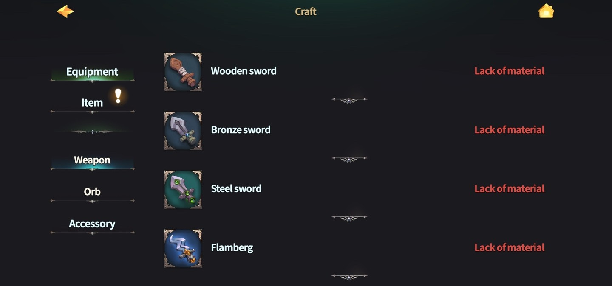
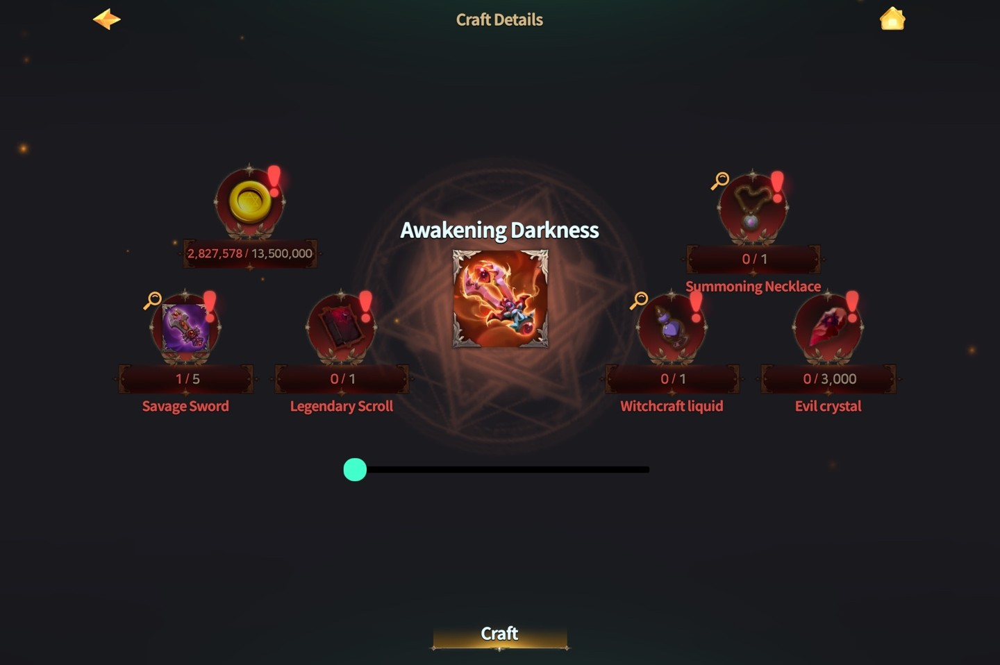

# 📂 Equipment NFT



### 🛡️ Equipment NFT – Craft & Mint Guide

Powerful gear, crafted by your own hands—\
In Extocium, you can **craft special weapons and mint them as NFTs.**

***

#### ⚔️ Equipment Available for NFT Minting

* 🌑 **Awakening Darkness**
* 🌟 **Sword of Light**
* 🌈 **Rainbow**
* 💧 **Water Wrath**

> ※ Each weapon requires **different materials**, so make sure to check before crafting!

***

#### 📍 How to Craft Equipment NFT – Step by Step

***

**① Open the Dashboard**

🎯 Click the **helmet icon on the left side** of the game screen to open the dashboard.

<figure><figcaption></figcaption></figure>

***

**② Go to the Craft Tab**

🛠️ Click the **`Craft` tab on the left side of the dashboard** to enter the crafting screen.

<figure><figcaption></figcaption></figure>

***

**③ Select Your Weapon**

🗡️ From the left menu, choose **"Equipment"**,\
then select the weapon you want to craft (e.g. **Awakening Darkness**).

<figure><figcaption></figcaption></figure>

***

**④ Gather Materials & Craft**

🧾 Make sure you have all the required materials ready,\
then ⚒️ **click `Craft` to start the process**.

※ The weapon will be minted as an NFT during the crafting!

<figure><figcaption></figcaption></figure>

***

#### 🔐 MetaMask Wallet Required

To mint your crafted equipment as an NFT,\
**you must connect your MetaMask wallet** beforehand.

> The completed NFT will be directly sent to your wallet—\
> so double-check that it’s connected before crafting!

***

Alright, Wizard—\
Your weapon of legend awaits.\
✨ Who knows? It might be the key to turning the tide of your next battle.



### 🛡️ Equipment NFT – 무기 제작 & 민팅 가이드

강력한 무기, 이제는 직접 제작하고 NFT로 소유해보세요!\
엑스토시움에서는 특정 장비를 **직접 만들고, NFT로 민팅**할 수 있답니다.

***

#### ⚔️ 현재 NFT로 제작 가능한 무기 목록

* 🌑 **깨어나는 어둠**
* 🌟 **빛의 검**
* 🌈 **레인보우**&#x20;
* 💧 **물의 분노**&#x20;

> ※ 무기마다 **필요한 재료가 다르며**, 제작 전에 꼭 확인해 주세요!

***

#### 📍 무기 NFT 제작 방법 – Step by Step

***

**① 대시보드로 이동**

🎯 **게임 화면 좌측의 ‘투구 아이콘’을 클릭**해 대시보드로 진입하세요.

<figure><figcaption></figcaption></figure>

***

**② 제작 탭으로 이동**

🛠️ **대시보드 좌측 메뉴에서 `제작(Craft)`을 클릭**하면, 제작 화면이 열립니다.

<figure><figcaption></figcaption></figure>

***

**③ 무기 선택**

🗡️ **좌측 카테고리에서 ‘무기(Equipment)’를 선택**한 뒤,\
제작하고 싶은 무기를 클릭하세요. (예: **깨어나는 어둠**)

<figure><figcaption></figcaption></figure>

***

**④ 재료 수집 & 제작**

🧾 필요한 재료가 모두 준비되었는지 확인한 후,\
⚒️ **제작 버튼을 클릭하면 무기 제작이 시작됩니다.**

※ 무기 제작과 동시에 **NFT로 민팅**이 진행돼요!

<figure><figcaption></figcaption></figure>

***

#### 🔐 지갑 연결은 필수!

장비를 NFT로 제작하려면,\
**MetaMask 지갑 연결이 반드시 필요**해요.

> 연결된 지갑으로 완성된 장비 NFT가 직접 발행되므로,\
> 제작 전에 지갑 상태를 꼭 확인해 주세요!

***

자, 위자드님.\
이제 전설의 무기를 손에 넣을 시간이에요!\
✨ 다음 전투에선, 당신이 만든 무기가 전장을 지배하게 될지도 몰라요...



### 🛡️ Equipment NFT – 装備クラフト＆ミントガイド

強力な装備を、自分の手でクラフトし、NFTとして所有しませんか？\
エクストシウムでは、特定の武器を**クラフトしてNFT化**することが可能です。

***

#### ⚔️ NFT化可能な装備リスト

* 🌑 **覚醒する闇**
* 🌟 **光の剣**
* 🌈 **レインボー**
* 💧 **水の怒り**

> ※ 武器ごとに**必要な素材が異なる**ため、事前に確認しておきましょう！

***

#### 📍 装備NFTの作成方法 – ステップガイド

***

**① ダッシュボードを開く**

🎯 ゲーム画面左側の**ヘルメットアイコン**をクリックして、ダッシュボードに入ります。

<figure><figcaption></figcaption></figure>

***

**② 「クラフト」タブを開く**

🛠️ ダッシュボード左側のメニューから\*\*「クラフト」タブ\*\*をクリックしてください。

<figure><figcaption></figcaption></figure>

***

**③ 装備を選択**

🗡️ 左のカテゴリーから\*\*「装備（Equipment）」\*\*を選択し、\
作りたい武器を選びましょう（例：**覚醒する闇**）。

<figure><figcaption></figcaption></figure>

***

**④ 素材を集めてクラフト**

🧾 必要な素材がすべて揃っていることを確認したら、\
⚒️ **「クラフト」ボタンをクリック**して製作を開始しましょう。

※ 作成された武器は、そのまま**NFTとしてミント**されます！

<figure><figcaption></figcaption></figure>

***

#### 🔐 MetaMaskウォレットの接続が必須

装備をNFTとして登録するには、\
**事前にMetaMaskウォレットを接続**しておく必要があります。

> 完成した装備NFTは、接続されたウォレットに直接送信されます。\
> クラフトを始める前に、接続状況をしっかり確認しておきましょう！

***

さあ、ウィザード様。\
伝説の武器を、その手で生み出しましょう。\
✨ 次の戦いの勝敗は、あなたのクラフトにかかっているかもしれません！


