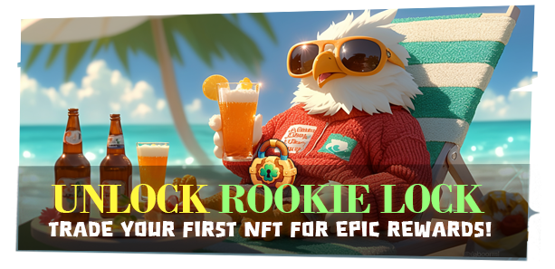

# 🔒 Rookie Lock System

<figure><figcaption></figcaption></figure>



### 🔒 Rookie Lock System – New Adventurer Protection

When you first enter **EXTOCIUM**,\
a system called **Rookie Lock** is applied to features such as:

* Trading
* Swapping
* NFT-related functions

<figure><figcaption></figcaption></figure>

The Rookie Lock exists to:

* Protect new players
* Prevent multi-account abuse and abnormal resource transfers
* Keep the [XTO](/broken/pages/AG4T2oH3KnzlguCn0fOx) ecosystem stable and healthy

It may feel a bit restrictive at first,\
but think of it as a safety net that helps you learn and adapt to the game.

<figure><figcaption></figcaption></figure>

***

### 🚀 What Happens When Rookie Lock Is Removed?

Once the Rookie Lock is lifted,\
you’ll gain access to all of the following features:

* Item trading ✅
* NFT trading ✅
* XTO swapping ✅

👉 All core EXTOCIUM features will be unlocked.

***

### 🔓 How to Remove Rookie Lock

You only need to complete **one** of the following:

1️⃣ Purchase a **Hero NFT** from the [in-game market](../../economy/trade/market/#eng)\
2️⃣ Summon (mint) a [**Hero NFT**](../nft-minting-guide/#nft-minting-guide) directly in the game

***

### ⚠️ Important to Know

* To **keep Rookie Lock removed**,\
  your account must hold **at least one Hero NFT**.
* If you lose all Hero NFTs,\
  Rookie Lock may be applied again.

***

🔥 At the beginning, take your time and explore battles and systems\
using [**Trial Heroes**](trial-hero.md#eng).

When you’re ready to dive deeper into the world of EXTOCIUM:\
👉 Summon or purchase a Hero NFT\
👉 Remove Rookie Lock and enjoy all available content

Your journey starts safely, then opens wide. Welcome aboard, Wizard ✨



### 🔒 Rookie Lock System – 신규 모험가 보호 시스템

EXTOCIUM에 처음 입장하면\
**거래, 스왑, NFT 관련 기능에 ‘루키 락(Rookie Lock)’이 적용되어 있습니다.**

<figure><figcaption></figcaption></figure>

루키 락은

* 신규 유저를 보호하고
* 다계정 생성이나 비정상적인 자원 이동을 막아
* [**XTO**](/broken/pages/AG4T2oH3KnzlguCn0fOx) **생태계를 안정적으로 유지하기 위한 시스템**입니다.

처음엔 다소 제한적으로 느껴질 수 있지만,\
게임을 이해하고 적응할 수 있도록 돕는 **안전장치**라고 생각하시면 됩니다.

<figure><figcaption></figcaption></figure>

***

### 🚀 루키 락이 해제되면?

루키 락이 해제되면, 아래 기능을 모두 이용할 수 있습니다.

* 아이템 거래 ✅
* NFT 거래 ✅
* XTO 스왑 ✅

👉 EXTOCIUM의 모든 핵심 기능이 열립니다.

***

### 🔓 루키 락 해제 방법

아래 두 가지 방법 중 **하나만 달성해도** 루키 락이 해제됩니다.

1️⃣[ 인게임 마켓](../../economy/trade/market/)에서 **영웅 NFT 구매**\
2️⃣ 게임 내에서 **영웅** [**NFT 직접 소환**](../nft-minting-guide/#nft-minting-guide-1)**(민팅)**

***

### ⚠️ 꼭 알아두세요

* 루키 락 해제 상태를 **유지하려면**,\
  계정에 **영웅 NFT를 최소 1종 이상 보유**하고 있어야 합니다.
* 영웅 NFT를 모두 잃게 되면,\
  루키 락이 다시 적용될 수 있습니다.

***

🔥처음에는 [**트라이얼 영웅**](trial-hero.md#undefined-1)으로 전투와 시스템을 충분히 체험해 보세요.

그리고 EXTOCIUM의 세계에 더 깊이 들어가고 싶다면,\
👉 영웅 NFT를 소환하거나 구매하여\
👉 루키 락을 해제하고 모든 콘텐츠를 즐겨보세요.



### 🔒 ルーキーロックシステム ― 新規冒険者保護機能

**EXTOCIUM**に初めて入場すると、取引・スワップ・NFT関連機能に\
&#xNAN;**「ルーキーロック（Rookie Lock）」**&#x304C;適用されます。

<figure><figcaption></figcaption></figure>

ルーキーロックは、

* 新規ユーザーの保護
* 複数アカウント作成や不正な資産移動の防止
* [XTO](/broken/pages/AG4T2oH3KnzlguCn0fOx) エコシステムの安定維持

を目的としたシステムです。

最初は制限が多く感じられるかもしれませんが、\
ゲームを理解し、安心して慣れていくための\
**安全装置**としてお考えください。

<figure><figcaption></figcaption></figure>

***

### 🚀 ルーキーロックが解除されると？

ルーキーロックが解除されると、以下の機能がすべて利用可能になります。

* アイテム取引 ✅
* NFT取引 ✅
* XTOスワップ ✅

👉 EXTOCIUM の主要コンテンツがすべて開放されます。

***

### 🔓 ルーキーロック解除方法

以下の **いずれか1つ**を達成すると解除されます。

1️⃣ [インゲームマーケット](../../economy/trade/market/#ri-ben-yu)で **ヒーローNFTを購入**\
2️⃣ ゲーム内で [**ヒーローNFT**](../nft-minting-guide/#nftmintingugaido)**を直接召喚（ミント）**

***

### ⚠️ 必ずご確認ください

* ルーキーロック解除状態を維持するには、\
  アカウントに **ヒーローNFTを最低1体以上** 所持している必要があります。
* すべてのヒーローNFTを失った場合、ルーキーロックが再適用されることがあります。

***

🔥 最初は[トライアルヒーロー](trial-hero.md#ri-ben-yu)で、戦闘やシステムをじっくり体験してみてください。

そして、EXTOCIUMの世界を さらに深く楽しみたくなったら──\
👉 ヒーローNFTを召喚、または購入し\
👉 ルーキーロックを解除して、すべてのコンテンツをお楽しみください。



\-
