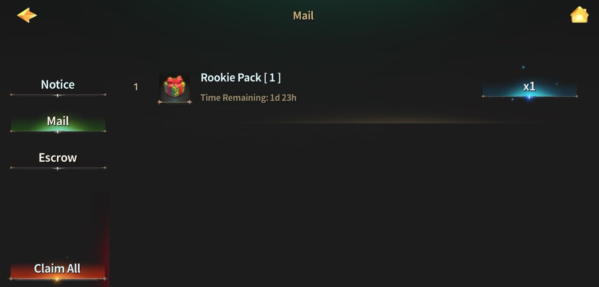

# 🎁 Rookie Shopper's Surprises

<figure><figcaption></figcaption></figure>



#### 🎁 **Rookie Shopper’s Surprises** Guide

### **1)** Check Mailbox

<figure><figcaption></figcaption></figure>

After minting a Hero, the Rookie Pack is sent to your mailbox.\
Make sure to **claim it** to move it into your inventory.

***

### **2)** Check Inventory

<figure><figcaption></figcaption></figure>

Once claimed, the Rookie Pack appears as an unopened item in your inventory.

***

### **3)** Pack Contents

<figure><figcaption></figcaption></figure>

Opening the Rookie Pack grants all rewards at once:


* Rookie Potion Pack ×1
* Rookie Food Pack ×1
* Rookie Growth Pack ×1
* Rookie Booster Pack ×1
* Pet: Eaglet Chirp ×1


#### 🎒Detailed Contents

**Rookie Potion Pack**

* Advanced HP Potion x 1200
* Advanced MP Potion x 1200
* Summon HP Potion Lv.3 x 1200

**Rookie Food Pack**

* Lobster Dish x 20
* Spicy Popcorn x 20

**Rookie Growth Pack**

* Rune of fortune Lv.2 × 1
* Rune of Protection Lv.2 × 1
* Trial Reload ×5

**Rookie Booster Pack**

* Resurrection Feather x 20
* PK Shield x 10
* Energy 100 Booster x 5

***

### **4)** Important Note

<figure><figcaption></figcaption></figure>

Opening the Rookie Pack **immediately activates the new pet.**

* Even if you already own a pet, opening the Rookie Pack will immediately start the new pet’s 30-day duration.
* Want to use it _after_ your current pet expires?

#### ✅ **Open the Rookie Pack exactly when your current pet’s duration ends.**



#### 🎁 **Rookie Shopper’s Surprises** 가이드

### **1) 우편 수령**

<figure><figcaption></figcaption></figure>

영웅을 민팅하면 루키팩이 **우편함으로 지급**됩니다.\
우편함에서 **수령하면 인벤토리로 이동**해요.

***

### **2) 인벤토리 확인**

<figure><figcaption></figcaption></figure>

우편에서 수령을 완료하면\
인벤토리에서 **루키팩 아이템이 보관된 상태로 확인**됩니다.

***

### **3) 구성품 안내**

<figure><figcaption></figcaption></figure>

루키팩을 열면 아래 보상이 **한 번에 지급**됩니다:


* 루키 포션팩 ×1
* 루키 푸드팩 ×1
* 루키 성장팩 ×1
* 루키 부스터팩 ×1
* 펫: Eaglet Chirp ×1


#### 🎒각 패키지 상세 구성

**루키 포션팩**

* 고급 HP 포션 x 1200
* 고급 MP 포션 x 1200
* 소환수 HP 포션 Lv.3 x 1200

**루키 푸드팩**

* 랍스터 디쉬 x 20
* 매운 팝콘 x 20

**루키 성장팩**

* 행운의 룬 Lv.2 × 1
* 보호의 룬 Lv.2 × 1
* 트라이얼 리로드 × 5

**루키 부스터팩**

* 부활의 깃털 x 20
* PK 실드 x 10
* 에너지 100 부스터 x 5

***

### **4)** 사용 시 주의

<figure><figcaption></figcaption></figure>

루키팩을 열면 **펫이 즉시 적용**됩니다.

* 이미 펫을 보유 중이더라도, 루키팩을 열면 새 펫의 30일 기간이 바로 시작돼요.
* 현재 펫의 기간이 끝난 후 사용하고 싶다면…

#### ✅ **사용 중인 펫의 기간이 만료되는 시점에 루키팩을 오픈하세요.**



#### 🎁 **Rookie Shopper’s Surprises** ガイド

### **1)** メール受取

<figure><figcaption></figcaption></figure>

英雄をミントすると、ルーキーパックが**メールボックスに届きます**。\
受け取るとインベントリへ移動します。

***

### **2)** インベントリ確認

<figure><figcaption></figcaption></figure>

受取後、インベントリ内に未開封のルーキーパックが表示されます。

***

### **3)** パック内容

<figure><figcaption></figcaption></figure>

開封すると、以下の報酬が**まとめて**入手できます：


* ルーキーポーションパック ×1
* ルーキーフードパック ×1
* ルーキー成長パック ×1
* ルーキーブースターパック ×1
* ペット：Eaglet Chirp ×1


#### 🎒各パックの詳細

**ルーキーポーションパック**

* 高級HPポーション x 1200
* 高級MPポーション x 1200
* 召喚獣HPポーション Lv.3 x 1200

**ルーキーフードパック**

* ロブスターディッシュ x 20
* スパイシーポップコーン x 20

**ルーキー成長パック**

* 幸運のルーン Lv.2 × 1
* 保護のルーン Lv.2 × 1
* トライアルリロード × 5

**ルーキーブースターパック**

* 復活の羽 x 20
* PKシールド x 10
* エナジー100ブースター x 5

***

### **4)** 使用時の注意

<figure><figcaption></figcaption></figure>

ルーキーパックを開封すると、**ペットが即時に適用**されます。

* すでにペットを所持していても、ルーキーパックを開封すると新しいペットの30日間の期間がすぐに開始されます。
* 現在のペットの期間終了後に使いたい場合は…

#### ✅ **有効期間が終了するタイミングで開封してください。**



\-

