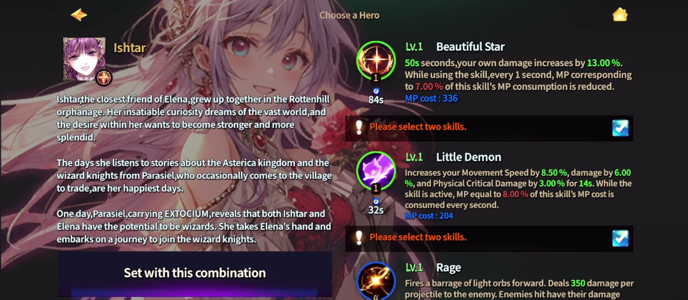

# 🐤 Trial Hero

<figure><figcaption></figcaption></figure>



### 🧪 Trial Hero – Trial Hero Selection Guide

#### Welcome to EXTOCIUM!

When you log into EXTOCIUM for the first time,\
you’ll choose a **Trial Hero** before starting your adventure.

***

### 🌱 Starting Area

Your journey begins in the '**Land of Beginnings'**.

<figure><figcaption></figcaption></figure>

👉 Follow the NPC’s guidance and move at your own pace toward the \
**Trial Hero Selection Area**.

***

### 🧙 How to Choose a Trial Hero

#### ① Choose a Base Hero

You can select **1 out of EXTOCIUM’s** [**7 base heroes**](../../growth/heroes/#heroes-the-core-of-your-battle-strategy).

<figure><figcaption></figcaption></figure>

#### ② Choose Skills

Each hero comes with **7 available skills**.\
You’ll choose **2 skills** to use in combat.

<figure><figcaption></figcaption></figure>

👉 This combo becomes your **first combat style**, so feel free to experiment!

***

### 🎯 Skill Test Area

After selecting your Trial Hero, head **up the stairs at the top of the map**.\
You’ll find a space where you can freely test your skills.

* **Blue practice slimes** are placed here,
* so you can try different skill combinations and get a feel for combat.

<figure><figcaption></figcaption></figure>

> 💡 **Running out of Mana?**\
> No worries!\
> **Move over to the NPC on the right.**\
> She’ll help you continue testing your skills without interruption.

***

### 📊 Trial Hero Features

* Base Stats: **Fixed at 14**
* **Trial-only hero** (not an NFT hero)
* [**Rookie Lock**](./#rookie-lock-system-new-adventurer-protection) is applied


#### While using a Trial Hero, you **cannot**:

* Trade items
* Trade NFTs
* Swap XTO
* Register Mining Setup

Once you’ve had a real taste of what EXTOCIUM has to offer,\
head to the [**Market**](../../economy/trade/market/#eng) to purchase a Hero NFT,\
or[ **summon**](../nft-minting-guide/hero-nft.md#hero-nft-how-to-summon-a-hero) **(mint) a hero in-game** to unlock your Rookie Lock!


***

### 🔓 Moving to the Next Stage

After completing Trial Hero selection,\
move to the **top end of the map** to find a warp gate to [**`Rottenhill`**](../../field-info/rotten-hill/#eng).

<figure><figcaption></figcaption></figure>


#### If you proceed without selecting a Trial Hero, a hero will be **automatically assigned at random**.




### 🧪 Trial Hero – 트라이얼 영웅 선택 안내

EXTOCIUM에 처음 접속하면,\
모험을 시작하기 전에 **트라이얼 영웅(Trial Hero)** 을 먼저 선택하게 됩니다.

***

### 🌱 시작 위치 안내

게임에 처음 접속하면 **‘시작의 땅’에서 시작하게 됩니다.**

<figure><figcaption></figcaption></figure>

👉 NPC의 안내를 따라 이동하며, 트라이얼 영웅 선택 구간으로 천천히 진행해 주세요.

***

### 🧙 트라이얼 영웅 선택 방법

#### ① 기본 영웅 선택

EXTOCIUM의 [**일곱 기본 영웅**](../../growth/heroes/#heroes) 중 1명을 선택할 수 있습니다.

<figure><figcaption></figcaption></figure>

#### ② 스킬 선택

각 영웅마다 사용할 수 있는 스킬이 7가지 준비되어 있으며,\
그중 **2개를 골라 전투에 사용하게 됩니다.**

<figure><figcaption></figcaption></figure>

👉 이 조합이 당신의 첫 전투 스타일이 됩니다.

***

### 🎯 스킬 테스트 공간 안내

트라이얼 영웅을 선택한 뒤,\
**맵 위쪽으로 계단을 따라 이동하면**\
스킬을 자유롭게 시험할 수 있는 공간이 나옵니다.

* 이곳에는 **파란 연습용 슬라임**이 배치되어 있습니다.
* 여러 스킬 조합을 직접 사용해 보며 전투 감각을 익힐 수 있습니다.

<figure><figcaption></figcaption></figure>

> 💡 **마나가 부족하다면?**\
> 오른쪽에 있는 NPC에게 이동해 보세요.\
> 스킬 테스트를 계속할 수 있도록 도와줍니다.

***

### 📊 트라이얼 영웅의 특징

* 베이스 스탯: **14 고정**
* NFT 영웅이 아닌 **트라이얼 전용 영웅**
* [**루키 락(Rookie Lock)**](./#rookie-lock-system) 이 적용되어 있습니다.


#### 트라이얼 영웅 사용 중에는 다음 기능을 이용할 수 없습니다

* 아이템 거래
* NFT 거래
* XTO 스왑
* 채굴 세팅 등록

트라이얼 영웅을 통해 충분히 EXTOCIUM의 매력에 빠져드시게 된다면, \
'[마켓](../../economy/trade/market/#undefined-1)'에서 영웅 NFT를 **구매**하거나, 게임 내에서 영웅을 직접 [소환](../nft-minting-guide/hero-nft.md#hero-nft)(민팅)하여 루키 락을 해제해보세요!


***

### 🔓 다음 단계로 이동하기

트라이얼 영웅 선택을 완료한 뒤, **맵의 위쪽 끝까지 이동하면**\
[`로튼힐(Rottenhill)`](../../field-info/rotten-hill/#undefined-1)로 이동하는 워프가 나타납니다.

<figure><figcaption></figcaption></figure>


#### 트라이얼 영웅을 직접 선택하지 않고 진행할 경우, 영웅은 **랜덤으로 자동 배정**됩니다.




### 🧪 トライアルヒーロー – 選択ガイド

#### EXTOCIUMへようこそ！

EXTOCIUMに初めてログインすると、\
冒険を始める前に **トライアルヒーロー** を選択します。

***

### 🌱 開始地点について

ゲームは「**始まりの地**」からスタートします。

<figure><figcaption></figcaption></figure>

👉 NPCの案内に従って移動し、**トライアルヒーロー選択エリア**へ進んでください。

***

### 🧙 トライアルヒーローの選び方

#### ① 基本ヒーローの選択

EXTOCIUMに登場する [**7人の基本ヒーロー**](../../growth/heroes/#heroes-notonarutachi) から 1人を選択できます。

<figure><figcaption></figcaption></figure>

#### ② スキルの選択

各ヒーローには **7種類のスキル** が用意されており、\
その中から **2つのスキル** を選んで戦闘に使用します。

<figure><figcaption></figcaption></figure>

👉 この組み合わせが、あなたの最初の戦闘スタイルになります。

***

### 🎯 スキルテストエリア

トライアルヒーローを選択後、\
マップ上部の階段を進むと、\
スキルを自由に試せるエリアに到達します。

* この場所には **青い練習用スライム** が配置されており、
* さまざまなスキル構成を実際に使って、戦闘感覚をつかむことができます。

<figure><figcaption></figcaption></figure>

> 💡 **マナが足りなくなったら？**\
> **右側にいるNPCのもとへ移動してください。**\
> スキルテストを継続できるようサポートしてくれます。

***

### 📊 トライアルヒーローの特徴

* 基本ステータス：**14固定**
* NFTヒーローではなく、**トライアル専用ヒーロー**
* [**ルーキーロック（Rookie Lock）**](./#rkrokkushisutemu) が適用されています


**トライアルヒーロー使用中は、以下の機能が利用できません：**

* アイテム取引
* NFT取引
* XTOスワップ
* 採掘設定を登録

EXTOCIUMの魅力を十分に体験した後は、[**マーケット**](../../economy/trade/market/#ri-ben-yu)**でヒーローNFTを購入**するか、\
ゲーム内で[ヒーローを召喚](../nft-minting-guide/hero-nft.md#hero-nft-no)（ミント）して ルーキーロックを解除してみてください。


***

### 🔓 次のエリアへ

トライアルヒーロー選択を完了し、マップ最上部まで進むと\
[**ロッテンヒル**](../../field-info/rotten-hill/#ri-ben-yu)**（Rottenhill）** へ移動するワープが出現します。

<figure><figcaption></figcaption></figure>


トライアルヒーローを選択せずに進行した場合、ヒーローは **ランダムで自動選択** されます。




<em>※ This guide was written based on the game status as of December 24, 2025,</em>  <em>and its contents may change with future updates.</em>

