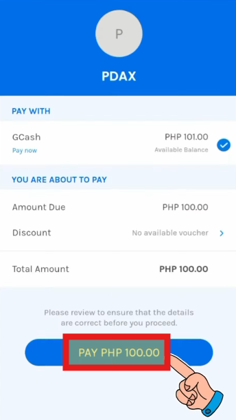

# 🧭 Alternative: BNB Top-Up via GCash


BNB Top-Up Method Using G-Cash




### 💳 BNB Top-Up Method Using GCash (GCrypto)

<figure><figcaption>
<a href="https://gcash.com/">https://gcash.com/</a>
</figcaption></figure>

This guide explains how to **purchase BNB using the GCrypto feature in the GCash app**\
and **send it to your personal wallet (MetaMask / Trust Wallet)**.

The attached video shows the entire process at a glance.\
This written guide is a **step-by-step summary** you can follow while watching the video.

> If you enter the **wrong address or network**, your assets **cannot be recovered**.\
> Before sending, always **double-check the wallet address and network**.

***

### ✅ Before You Start — Important Checks

#### 1️⃣ Confirm GCrypto Availability

GCrypto is **not available for all accounts by default**.\
You must meet the following requirements:

* At least **18 years old**
* **Fully verified** GCash account
* **Email verification** completed

If these requirements are not met,\
the process may stop midway even if you follow the video.

***

#### 2️⃣ Check Wallet Address & Network

When sending BNB to your wallet,\
you must use a **BNB Smart Chain (BSC) address**.

If the network is incorrect or the address is wrong,\
the transferred assets **cannot be recovered**.

***

#### 3️⃣ Network Fees Apply

When sending coins from GCrypto to your wallet,\
a **small network fee** will be deducted.

Before sending, make sure to check the **final amount after fees**.

***

### 🧭 Full Process Overview

Just remember this order:

**GCash Balance**\
→ **Top up GCrypto Trading Wallet**\
→ **Buy BNB**\
→ **Send to Personal Wallet (BNB Smart Chain)**

***

### ✅ STEP 1. Enter GCrypto & Top Up the Trading Wallet

1️⃣ Open the **GCash** app\
2️⃣ Go to **GInvest → GCrypto**\
3️⃣ On the GCrypto screen, select **Top Up**

<figure><figcaption></figcaption></figure>

4️⃣ Enter the amount → **Continue** → **Pay**

<figure><figcaption></figcaption></figure> <figure><figcaption></figcaption></figure>

Once completed,\
your **GCrypto Trading Wallet balance** will be updated.

***

### ✅ STEP 2. Buy BNB in GCrypto

1️⃣ On the GCrypto screen, select **BNB (Binance Coin)**\
2️⃣ Tap **Buy**\
3️⃣ Enter the amount or quantity\
4️⃣ Tap **Buy** to complete the purchase

<figure><figcaption></figcaption></figure>

The purchased BNB will be stored in your **GCrypto Trading Wallet**.

***

### ✅ STEP 3. Send BNB to Your Personal Wallet

1️⃣ In GCrypto, select **BNB → Send**\
2️⃣ Enter the following details:

* Amount to send
* Receiving wallet address
* Network: **BNB Smart Chain**

<figure><figcaption></figcaption></figure>

3️⃣ Review the details and agree to the\
&#xNAN;**“irreversible transaction”** notice, then tap **Send**

<figure><figcaption></figcaption></figure>

4️⃣ Enter the **OTP verification code** sent to your email\
→ The transfer will proceed

<figure><figcaption></figcaption></figure>

***

### ✅ STEP 4. Check BNB Balance in Your Wallet

Once the transfer is complete,\
check your **MetaMask or Trust Wallet**\
to confirm that the **BNB balance has been credited**.

***


### 🔎 **Final Checklist**

Before you finish, confirm these three points:

✅ The wallet address is **BNB Smart Chain (BSC)**\
✅ The address was copied and pasted correctly\
✅ You checked the **final amount including network fees**

If these are all confirmed,\
your **GCash → Wallet BNB top-up** is complete and safe.




### 💳 BNB Top-Up Method Using GCash (GCrypto)

<figure><figcaption>
<a href="https://gcash.com/">https://gcash.com/</a>
</figcaption></figure>

이 가이드는\
**GCash 앱의 GCrypto 기능을 사용해 BNB를 구매하고,**\
**개인 지갑(MetaMask / Trust Wallet)으로 전송하는 방법**을 안내합니다.

아래에 첨부된 영상은 **전체 과정을 한 번에 보여주는 참고용**이며,\
이 글은 **영상을 보면서 그대로 따라 할 수 있는 단계별 요약 가이드**입니다.

> **주소 또는 네트워크를 잘못 입력하면 자산을 되돌릴 수 없습니다.**\
> 전송 전, 지갑 주소와 네트워크를 반드시 다시 한 번 확인해 주세요.

***

### ✅ 시작 전 꼭 확인하세요

#### 1️⃣ GCrypto 사용 가능 상태인지 확인

GCrypto는 모든 계정에서 바로 사용할 수 있는 기능이 아닙니다.

아래 조건을 충족해야 정상적으로 이용할 수 있습니다.

* 만 18세 이상
* GCash 계정 **Fully Verified**
* 이메일 인증 완료

조건이 충족되지 않으면\
영상대로 따라가도 **중간 단계에서 진행이 멈출 수 있습니다.**

***

#### 2️⃣ 지갑 주소 & 네트워크 확인

BNB를 지갑으로 보낼 때는 반드시\
**BNB Smart Chain (BSC) 네트워크 주소**를 사용해야 합니다.

* 네트워크가 다르거나
* 주소를 잘못 입력하면

전송된 자산은 **되돌릴 수 없습니다.**

***

#### 3️⃣ 전송 수수료(네트워크 비용) 존재

GCrypto에서 코인을 **지갑으로 전송(Send)** 할 때는\
소량의 네트워크 수수료가 함께 사용됩니다.

전송 전에 **최종 수량이 어떻게 줄어드는지** 꼭 확인하세요.

***

### 🧭 전체 흐름 한 번에 보기

**GCash 잔액**\
→ **GCrypto Trading Wallet 충전**\
→ **BNB 구매**\
→ **개인 지갑(BNB Smart Chain)으로 전송**

이 순서만 기억하면 됩니다.

***

### ✅ STEP 1. GCrypto 들어가서 Trading Wallet 충전하기

1️⃣ GCash 앱 실행\
2️⃣ **GInvest → GCrypto** 선택\
3️⃣ GCrypto 화면에서 **Top Up** 선택

<figure><figcaption></figcaption></figure>

4️⃣ 충전할 금액 입력 → **Continue → Pay**

<figure><figcaption></figcaption></figure> <figure><figcaption></figcaption></figure>

충전이 완료되면\
GCrypto Trading Wallet 잔액이 업데이트됩니다.

***

### ✅ STEP 2. GCrypto에서 BNB 구매하기

1️⃣ GCrypto 화면에서 **BNB (Binance Coin)** 선택\
2️⃣ **Buy** 버튼 선택\
3️⃣ 구매할 금액 또는 수량 입력\
4️⃣ **Buy** 버튼으로 구매 완료

<figure><figcaption></figcaption></figure>

구매한 BNB는\
GCrypto Trading Wallet 안에 보관됩니다.

***

### ✅ STEP 3. BNB를 개인 지갑으로 보내기 (Send)

1️⃣ GCrypto에서 **BNB → Send** 선택\
2️⃣ 아래 정보를 입력합니다.

* 전송할 수량
* 받는 지갑 주소
* 네트워크 (BNB Smart Chain)

<figure><figcaption></figcaption></figure>

3️⃣ 전송 정보 확인 후\
“되돌릴 수 없음” 안내에 동의하고 **Send**

<figure><figcaption></figcaption></figure>

4️⃣ 이메일로 전송되는 **인증 코드(OTP)** 입력\
→ 전송 진행

<figure><figcaption></figcaption></figure>

***

### ✅ STEP 4. 지갑에서 BNB 잔액 확인

전송이 완료되면\
**MetaMask 또는 Trust Wallet**에서\
BNB 잔액이 반영된 것을 확인할 수 있습니다.

***


### 🔎 마지막으로 꼭 다시 확인하세요

✅ 지갑 주소가 **BNB Smart Chain(BSC)** 인지

✅ 주소를 복사/붙여넣기 할 때 앞뒤가 바뀌지 않았는지

✅ 전송 수수료를 포함한 **최종 수량**을 확인했는지

이 3가지만 확인하면\
GCash → 지갑 BNB 충전은 안전하게 완료됩니다.




### 💳 GCash（GCrypto）を使ってBNBをチャージする方法

<figure><figcaption>
<a href="https://gcash.com/">https://gcash.com/</a>
</figcaption></figure>

このガイドでは、\
**GCashアプリのGCrypto機能を使ってBNBを購入し、**\
**個人ウォレット（MetaMask／Trust Wallet）へ送金する方法**をご案内します。

添付の動画は全体の流れをまとめて確認できる参考用です。\
本ガイドは、**動画を見ながらそのまま進められる手順書**となっています。

> **アドレスやネットワークを誤って入力すると、資産は復元できません。**\
> 送金前に、**ウォレットアドレスとネットワークを必ず再確認**してください。

***

### ✅ 開始前の重要確認事項

#### 1️⃣ GCryptoが利用可能か確認する

GCryptoは、すべてのアカウントで\
すぐに使える機能ではありません。\
以下の条件を満たしている必要があります。

* **18歳以上**であること
* **GCashアカウントがFully Verified**であること
* **メール認証が完了**していること

条件を満たしていない場合、\
動画どおり進めても途中で止まる可能性があります。

***

#### 2️⃣ ウォレットアドレス・ネットワークの確認

BNBをウォレットへ送金する際は、\
必ず **BNB Smart Chain（BSC）** のアドレスを使用してください。

ネットワークやアドレスを間違えると、\
送金した資産は**取り戻せません**。

***

#### 3️⃣ ネットワーク手数料について

GCryptoからウォレットへ送金（Send）する際、\
**少量のネットワーク手数料**が発生します。

送金前に、\
**手数料を含めた最終受取数量**を必ず確認してください。

***

### 🧭 全体の流れ（まとめ）

以下の順番だけ覚えておきましょう。

**GCash残高**\
→ **GCryptoトレーディングウォレットにチャージ**\
→ **BNBを購入**\
→ **個人ウォレット（BNB Smart Chain）へ送金**

***

### ✅ STEP 1. GCryptoに入り、Trading Walletをチャージ

1️⃣ **GCash** アプリを起動\
2️⃣ **GInvest → GCrypto** を選択\
3️⃣ GCrypto画面で **Top Up** を選択

<figure><figcaption></figcaption></figure>

4️⃣ 金額入力 → **Continue** → **Pay**

<figure><figcaption></figcaption></figure> <figure><figcaption></figcaption></figure>

完了すると、\
**GCrypto Trading Walletの残高**が更新されます。

***

### ✅ STEP 2. GCryptoでBNBを購入

1️⃣ GCrypto画面で **BNB（Binance Coin）** を選択\
2️⃣ **Buy** をタップ\
3️⃣ 購入金額または数量を入力\
4️⃣ **Buy** をタップして購入完了

<figure><figcaption></figcaption></figure>

購入したBNBは、\
**GCrypto Trading Wallet** に保管されます。

***

### ✅ STEP 3. BNBを個人ウォレットへ送金（Send）

1️⃣ GCryptoで **BNB → Send** を選択\
2️⃣ 以下の情報を入力します。

* 送金数量
* 受取ウォレットアドレス
* ネットワーク：**BNB Smart Chain**

<figure><figcaption></figcaption></figure>

3️⃣ 内容を確認し、\
&#xNAN;**「取り消し不可」** の案内に同意して **Send**

<figure><figcaption></figcaption></figure>

4️⃣ メールで届く **認証コード（OTP）** を入力\
→ 送金が実行されます

<figure><figcaption></figcaption></figure>

***

### ✅ STEP 4. ウォレットでBNB残高を確認

送金が完了すると、\
**MetaMask または Trust Wallet** で\
**BNB残高が反映**されていることを確認できます。

***


### 🔎 **最後の確認ポイント**

以下の3点を必ず確認してください。

✅ ウォレットアドレスが **BNB Smart Chain（BSC）** か\
✅ コピー＆ペースト時にアドレスが崩れていないか\
✅ 手数料を含めた **最終数量を確認**したか

この3点を確認できれば、\
**GCash → ウォレットへのBNBチャージ**は安全に完了です。




<em>This page was last updated on December 18, 2025.</em>

