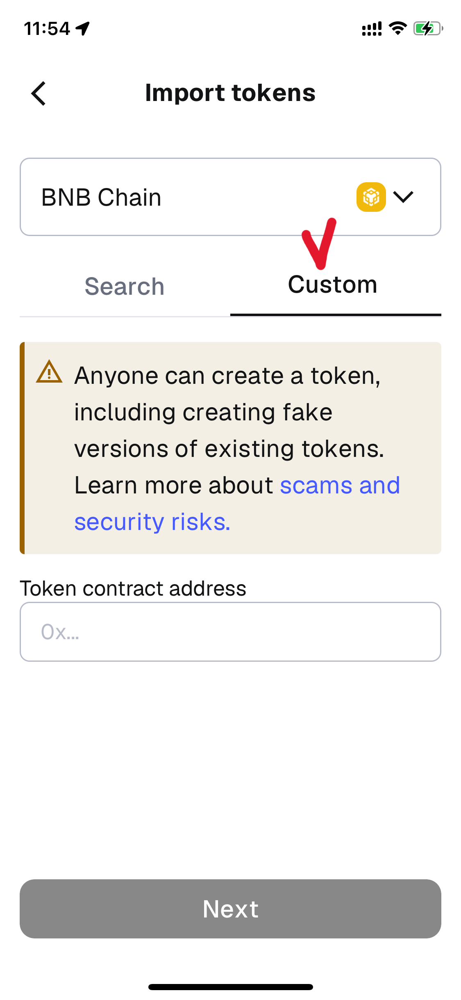
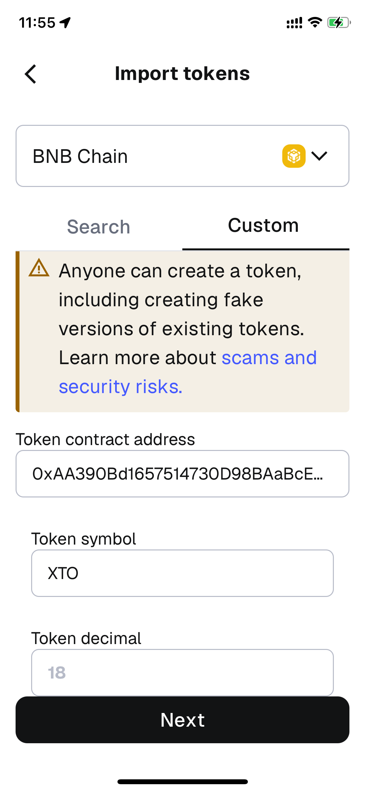

# ➕ Import XTO Tokens



### ➕ Import XTO Token

Once the **BNB Smart Chain** network has been added,\
it’s time to **import the XTO token** into your wallet.

You must add the XTO token in order to:

* Check your balance
* Swap XTO
* Trade XTO

***

### 🦊 Add XTO Token in MetaMask

_(Manual Import Required)_

In **MetaMask**,\
you only need to add the XTO token **once** manually.

Please follow the steps below.

***

#### ✅ STEP 1. Open the Add Token Screen

1️⃣ Open the **MetaMask** app.\
2️⃣ Tap the **+ button** located to the right of the network display at the top of the screen.

<figure><figcaption></figcaption></figure>

3️⃣ The **Add Token** screen will open.

***

#### ✅ STEP 2. Select Custom Token

1️⃣ XTO will not appear automatically in the token search list.\
2️⃣ Select **Custom Token**..

<figure><figcaption></figcaption></figure> <figure><figcaption></figcaption></figure>

***

#### ✅ STEP 3. Enter Token Information

Enter the following details:


* **Token Address**\
  `0xAA390Bd1657514730D98BAaBcE4b393a53ACD579`
* **Token Symbol**\
  `XTO`
* **Token Decimal**\
  `18`


📌 Once the **Token Address** is entered,\
the **Token Symbol** and **Token Decimal** will be filled in automatically.

<figure><figcaption></figcaption></figure>

***

#### ✅ STEP 4. Complete Token Import

1️⃣ Tap **NEXT**.\
2️⃣ A message asking, _“Would you like to import this token?”_ will appear.

<figure><figcaption></figcaption></figure>

\
3️⃣ Tap **IMPORT** to complete the process.

🎉 If **XTO** appears in your MetaMask token list, the setup was successful.

<figure><figcaption></figcaption></figure>

***

### 🛡️ Check XTO Token in Trust Wallet

_(Provided by Default / Activation Required)_

In **Trust Wallet**,\
the XTO token is already provided by default.\
No token address input is required.

***

#### ✅ STEP 1. Go to Token Management

1️⃣ Open the **Trust Wallet** app.\
2️⃣ Go to **Manage Crypto**.

<figure><figcaption></figcaption></figure>

***

#### ✅ STEP 2. Search and Enable XTO

1️⃣ Enter **XTO** in the search bar.\
2️⃣ Find **XTO** on the **BNB Smart Chain** network.\
3️⃣ Make sure **EXTOCIUM** is displayed under the token name.\
4️⃣ Turn on the toggle to enable the token.

<figure><figcaption></figcaption></figure>

***

#### ⚠️ Important Check

* Make sure the token is **XTO on BNB Smart Chain**.
* There may be multiple tokens with similar names,\
  so always confirm that **EXTOCIUM** is shown.

***

#### ❓ XTO Doesn’t Appear After Enabling

If XTO is enabled but does not appear in the token list,\
please check the following setting:

1️⃣ Tap the **settings icon** at the top-right of the token list.

<figure><figcaption></figcaption></figure>

2️⃣ Check the **“Hide assets < 0.01 USD”** option.

<figure><figcaption></figcaption></figure>

3️⃣ If it is enabled, turn it off.

📌 When this option is active, tokens with small balances may be hidden automatically.\
Disabling it will make **XTO** visible in the list.

***

### ✅ Setup Complete

You can now:

* Check your **XTO balance** in your wallet
* Swap XTO using **Swap with Wallet** or **PancakeSwap**



### ➕ Import XTO Token

**BNB Smart Chain 네트워크 추가가 완료되었다면,**\
**이제 XTO 토큰을 지갑에 등록할 차례입니다.**

XTO 토큰을 등록해야\
잔액을 확인하고, 스왑과 거래를 진행할 수 있습니다.

***

### 🦊 MetaMask에서 XTO 토큰 추가하기

_(수동 등록 필요)_

MetaMask에서는\
**XTO 토큰을 직접 한 번만 추가해야 합니다.**

아래 단계를 차례대로 진행해 주세요.

***

#### ✅ STEP 1. 토큰 추가 화면 열기

1️⃣ MetaMask 앱을 실행합니다.\
2️⃣ 화면 상단의 **네트워크 표시 영역 오른쪽에 있는 `+` 버튼**을 터치합니다.

<figure><figcaption></figcaption></figure>

3️⃣ **토큰 추가(Add Token)** 화면이 열립니다.

***

#### ✅ STEP 2. Custom Token 선택

1️⃣ 토큰 검색 화면에서 **XTO는 바로 표시되지 않습니다.**\
2️⃣ **Custom Token(커스텀 토큰)** 메뉴를 선택합니다.

<figure><figcaption></figcaption></figure> <figure><figcaption></figcaption></figure>

***

#### ✅ STEP 3. 토큰 정보 입력

아래 정보를 입력합니다.


* **Token Address**\
  `0xAA390Bd1657514730D98BAaBcE4b393a53ACD579`
* **Token Symbol**\
  `XTO`
* **Token Decimal**\
  `18`


📌 **Token Address를 입력하면**\
Token Symbol과 Token Decimal은 **자동으로 채워집니다.**

<figure><figcaption></figcaption></figure>

***

#### ✅ STEP 4. 토큰 Import 완료

1️⃣ **NEXT** 버튼을 터치합니다.\
2️⃣ “XTO 토큰을 Import 하시겠습니까?”라는 안내가 표시됩니다.

<figure><figcaption></figcaption></figure>

\
3️⃣ **IMPORT** 버튼을 선택하면 완료됩니다.

🎉 MetaMask 메인 화면의 토큰 목록에 **XTO가 표시되면 성공입니다.**

<figure><figcaption></figcaption></figure>

***

### 🛡️ Trust Wallet에서 XTO 토큰 확인하기

_(자동 제공 / 활성화만 필요)_

Trust Wallet에서는\
**XTO 토큰이 이미 기본으로 제공됩니다.**

따로 주소를 입력할 필요는 없습니다.

***

#### ✅ STEP 1. 토큰 관리 화면 이동

1️⃣ Trust Wallet 앱을 실행합니다.\
2️⃣ **Manage Crypto(가상자산 관리)** 메뉴로 이동합니다.

<figure><figcaption></figcaption></figure>

***

#### ✅ STEP 2. XTO 검색 및 활성화

1️⃣ 검색창에 **XTO**를 입력합니다.\
2️⃣ 목록에서 **BNB Smart Chain 네트워크의 XTO**를 찾습니다.\
3️⃣ 토큰 이름 아래에 **EXTOCIUM** 이라고 표시되어 있는지 꼭 확인합니다.\
4️⃣ 스위치를 켜서 활성화합니다.

<figure><figcaption></figcaption></figure>

***

#### ⚠️ 꼭 확인하세요

* **BNB Smart Chain의 XTO인지 반드시 확인해야 합니다.**
* 이름이 비슷한 토큰이 여러 개 있을 수 있으니\
  **EXTOCIUM 표기**를 꼭 확인해 주세요.

***

#### ❓ XTO를 활성화했는데도 보이지 않는 경우

Trust Wallet에서 XTO를 활성화했는데 토큰 목록에 보이지 않는다면,\
아래 설정을 확인해 주세요.

1️⃣ 토큰 목록 화면 우측 상단의 **설정 버튼**을 선택합니다.

<figure><figcaption></figcaption></figure>

2️⃣ **Hide assets < 0.01 USD** 옵션을 확인합니다.

<figure><figcaption></figcaption></figure>

3️⃣ 해당 옵션이 체크되어 있다면, **체크를 해제**합니다.

📌 이 옵션이 활성화되어 있으면 금액이 작은 토큰은 자동으로 숨겨질 수 있습니다.\
체크를 해제하면 XTO 토큰이 목록에 정상적으로 표시됩니다.

***

### ✅ 완료 안내

이제 지갑에서

* XTO 잔액을 확인할 수 있고
* **Swap with Wallet** 또는 **PancakeSwap**을 이용해\
  XTO를 스왑할 수 있습니다.



### ➕ XTOトークンを追加する

**BNB Smart Chain** の追加が完了したら、次は **XTOトークンをウォレットに登録**します。

XTOトークンを登録することで、以下の操作が可能になります。

* 残高の確認
* XTOのスワップ
* XTOの取引

***

### 🦊 MetaMaskでXTOトークンを追加する

_（手動追加が必要）_

**MetaMask** では、\
XTOトークンを **一度だけ手動で追加**する必要があります。

以下の手順に沿って進めてください。

***

#### ✅ STEP 1. トークン追加画面を開く

1️⃣ **MetaMask** アプリを起動します。\
2️⃣ 画面上部のネットワーク表示欄右側にある **＋ボタン** をタップします。

<figure><figcaption></figcaption></figure>

3️⃣ **トークン追加（Add Token）** 画面が表示されます。

***

#### ✅ STEP 2. Custom Tokenを選択

1️⃣ トークン検索画面には、XTOはすぐに表示されません。\
2️⃣ **Custom Token（カスタムトークン）** を選択してください。

<figure><figcaption></figcaption></figure> <figure><figcaption></figcaption></figure>

***

#### ✅ STEP 3. トークン情報を入力する

以下の情報を入力します。


* **Token Address**\
  `0xAA390Bd1657514730D98BAaBcE4b393a53ACD579`
* **Token Symbol**\
  `XTO`
* **Token Decimal**\
  `18`


📌 **Token Address** を入力すると、**Token Symbol** と **Token Decimal** は自動で入力されます。

<figure><figcaption></figcaption></figure>

***

#### ✅ STEP 4. トークン追加を完了する

1️⃣ **NEXT** をタップします。\
2️⃣ 「XTOトークンをインポートしますか？」という表示が出ます。

<figure><figcaption></figcaption></figure>

\
3️⃣ **IMPORT** を選択すると完了です。

🎉 MetaMaskのトークン一覧に **XTO** が表示されれば成功です。

<figure><figcaption></figcaption></figure>

***

### 🛡️ Trust WalletでXTOトークンを確認する

_（自動提供／有効化のみ必要）_

**Trust Wallet** では、\
XTOトークンは **すでに標準で提供**されています。\
アドレスを入力する必要はありません。

***

#### ✅ STEP 1. トークン管理画面へ移動

1️⃣ **Trust Wallet** アプリを起動します。\
2️⃣ **Manage Crypto（資産管理）** を選択します。

<figure><figcaption></figcaption></figure>

***

#### ✅ STEP 2. XTOを検索して有効化する

1️⃣ 検索欄に **XTO** と入力します。\
2️⃣ **BNB Smart Chain** 上の **XTO** を探します。\
3️⃣ トークン名の下に **EXTOCIUM** と表示されていることを必ず確認してください。\
4️⃣ スイッチをオンにして有効化します。

<figure><figcaption></figcaption></figure>

***

#### ⚠️ 必ずご確認ください

* **BNB Smart Chain上のXTO** であることを必ず確認してください。
* 似た名前のトークンが複数存在する場合がありますので、\
  **EXTOCIUM** の表記を必ずご確認ください。

***

#### ❓ 有効化したのにXTOが表示されない場合

Trust WalletでXTOを有効化しても表示されない場合は、\
以下の設定をご確認ください。

1️⃣ トークン一覧画面右上の **設定アイコン** をタップします。

<figure><figcaption></figcaption></figure>

2️⃣ **Hide assets < 0.01 USD** の項目を確認します。

<figure><figcaption></figcaption></figure>

3️⃣ チェックが入っている場合は、チェックを外してください。

📌 この設定が有効な場合、少額のトークンは自動的に非表示になることがあります。\
チェックを外すと、XTOが正常に表示されます。

***

### ✅ 完了のお知らせ

これでウォレット内で\
**XTO残高の確認** ができるようになり、\
**Swap with Wallet** または **PancakeSwap** を使って\
XTOをスワップできます。





