# 🥞 Swap on PancakeSwap

<figure><figcaption>
PancakeSwap
</figcaption></figure>



### 🥞 Swap XTO on PancakeSwap

XTO can also be freely swapped with **BNB Smart Chain–based assets**\
through **PancakeSwap**.

By following the steps below,\
even first-time users can complete the swap safely.


#### ⚠️ Required Checks Before Swapping

Before you begin, please make sure:

* The **XTO token is added to your wallet**\
  (If not, please check 👉 **\[**[**Import XTO Tokens**](import-xto-tokens.md#import-xto-token)**]** first.)
* You have **enough balance** of the token you want to swap
* The token is on the **BNB Smart Chain network**
* **Network fees (gas fees)** are required,\
  so prepare enough balance including gas fees


***

#### ✅ STEP 1. Access PancakeSwap & Connect Your Wallet

1️⃣ Go to the **official PancakeSwap website**.

<figure>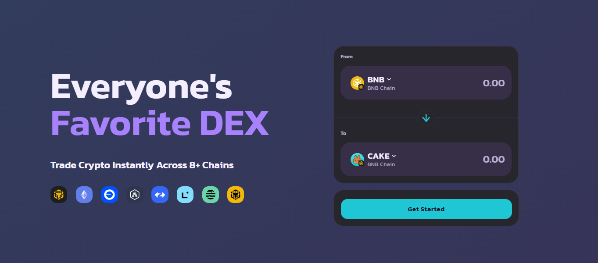<figcaption>
<a href="https://pancakeswap.finance/home">https://pancakeswap.finance/home</a>
</figcaption></figure>

2️⃣ Click the **`Connect Wallet`** button at the top-right of the screen.

<figure><figcaption></figcaption></figure>

3️⃣ Select the wallet you are using.

**🔐 Wallet Selection Guide**

* **MetaMask**\
  **-** If the browser extension is installed, selecting MetaMask will connect immediately.

<figure>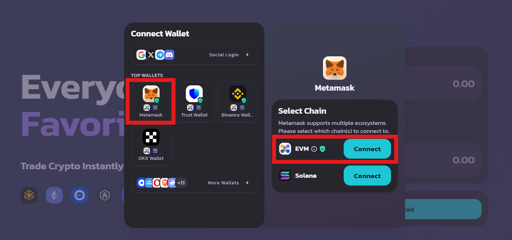<figcaption></figcaption></figure>

* **Trust Wallet**\
  **-** A QR code will be displayed.\
  \- Open the Trust Wallet app and connect by scanning the QR code.

<figure>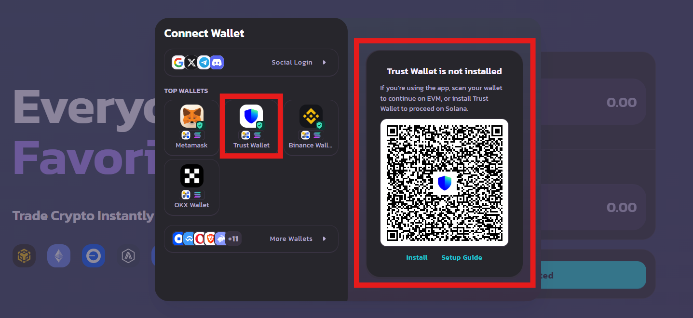<figcaption></figcaption></figure>

👉 When the connection confirmation popup appears, click **`Connect`** to complete the connection.

<figure>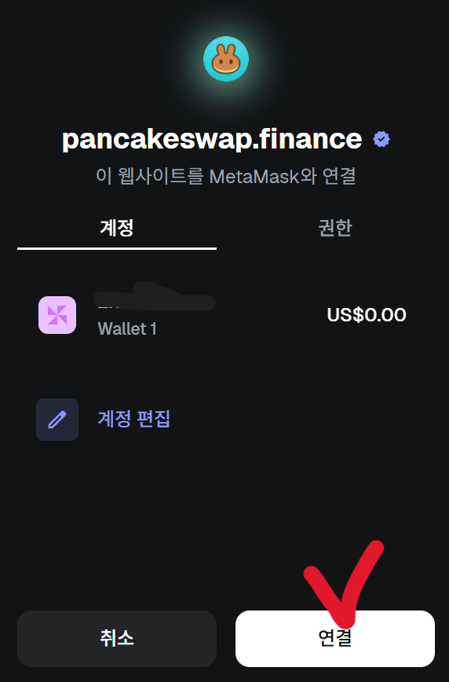<figcaption></figcaption></figure>

***

#### ✅ STEP 2. Check the Swap Screen

<figure><figcaption></figcaption></figure>

Once your wallet is connected,\
you will be automatically taken to the **Swap** screen.

* **From (Top)**\
  → Token you will send\
  → Select a **BNB Smart Chain–based token**\
  (e.g. BNB, FLOKI)
* **To (Bottom)**\
  → Token you will receive\
  → Default is set to **CAKE**

<figure>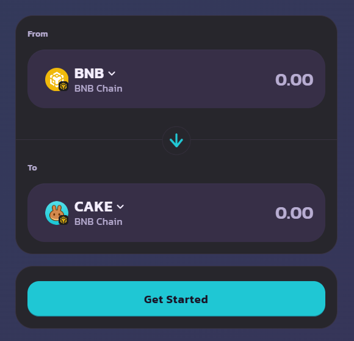<figcaption></figcaption></figure>

***

#### ✅ STEP 3. Select XTO

1️⃣ Tap **CAKE** in the To section.

<figure><figcaption></figcaption></figure>

2️⃣ Enter **XTO** in the search bar at the top of the token selection screen.

3️⃣ Select **XTO** from the search results.

<figure>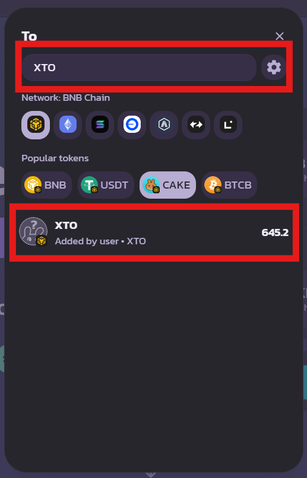<figcaption></figcaption></figure>

👉 The swap pair is now set to **From token → XTO**.

***

#### ✅ STEP 4. Review Swap Conditions & Proceed

1️⃣ Enter the amount to swap, then tap **`Swap`**.

<figure>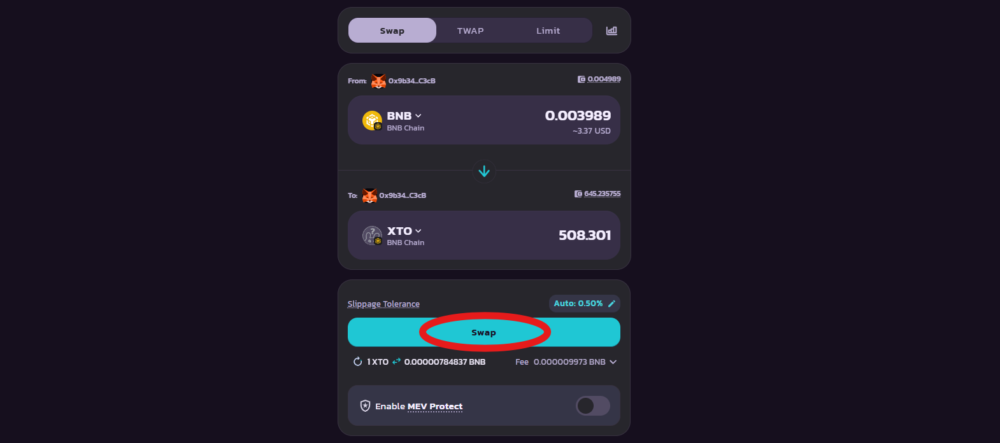<figcaption></figcaption></figure>

2️⃣ Review the following details:

* Price
* Price Impact
* Slippage Tolerance
* Minimum Received
* Trading Fee

3️⃣ If everything looks correct, tap **`Confirm Swap`** to proceed.

<figure>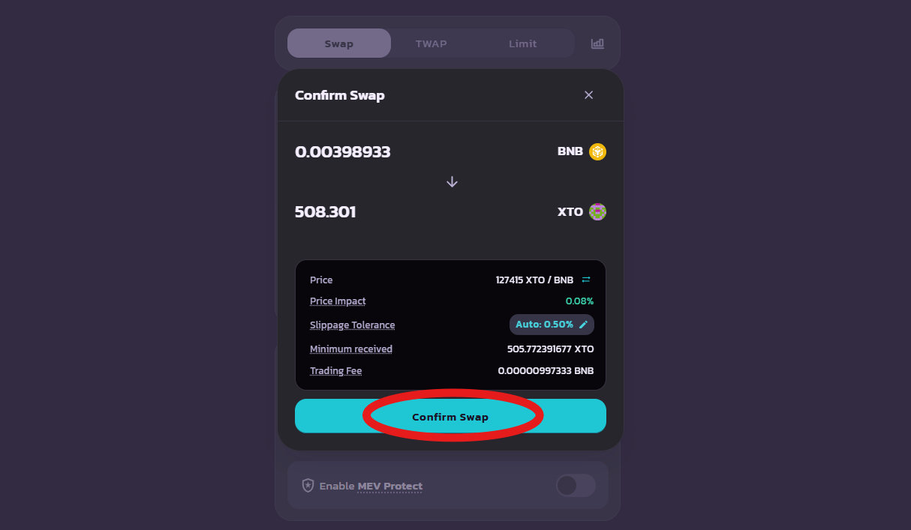<figcaption></figcaption></figure>

***

#### ✅ STEP 5. Wallet Approval & Transaction Completion

1️⃣ A transaction approval popup will appear.

<figure><figcaption></figcaption></figure>

\
2️⃣ Tap **`Confirm`** to execute the transaction.

Once completed:

* The **Transaction Receipt** screen will appear
* Tap **View on BscScan** to check detailed transaction information

<figure>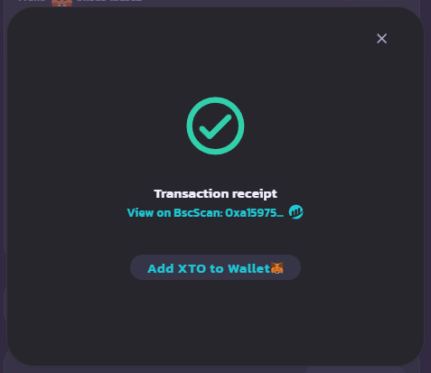<figcaption></figcaption></figure>

***

#### ✅ STEP 6. Check Swap Results

* On PancakeSwap, go to\
  **Wallet Address (top-right) → Transactions**\
  to view your recent swap history.

<figure>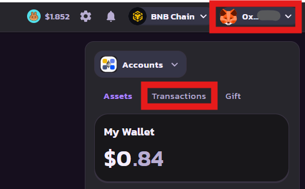<figcaption></figcaption></figure>

<figure>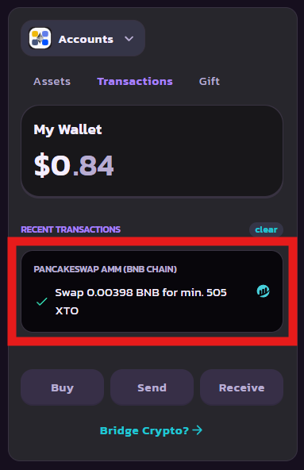<figcaption></figcaption></figure>

* Return to your wallet’s main screen to confirm that\
  the **XTO token has been added successfully**.



### 🥞 PancakeSwap에서 XTO 스왑하기

XTO는 **PancakeSwap**을 통해서도\
BNB Smart Chain 기반 자산과 자유롭게 스왑할 수 있습니다.

아래 순서를 차근차근 따라 하면\
처음이라도 안전하게 스왑을 완료할 수 있습니다.


#### ⚠️ 스왑 전 필수 확인 사항

* XTO 토큰이 지갑에 등록되어 있어야 합니다.\
  (등록되어 있지 않다면 👉 **\[**[**Import XTO Tokens**](import-xto-tokens.md#import-xto-token-1)**] 페이지를 먼저 확인해 주세요**)
* 스왑에 사용할 코인이 충분히 있어야 하며,\
  해당 코인은 **BNB Smart Chain 네트워크 기반**이어야 합니다.
* 거래 과정에서 **네트워크 수수료(가스비)** 가 사용되므로,\
  가스비까지 고려하여 잔액을 준비해 주시기 바랍니다.


***

#### ✅ STEP 1. PancakeSwap 접속 및 지갑 연결

1️⃣ **PancakeSwap 공식 홈페이지**에 접속합니다.&#x20;

<figure><figcaption>
<a href="https://pancakeswap.finance/home">https://pancakeswap.finance/home</a>
</figcaption></figure>

2️⃣ 화면 우측 상단의 **`Connect Wallet`** 버튼을 선택합니다.

<figure><figcaption></figcaption></figure>

3️⃣ 사용하는 지갑을 선택합니다.

**🔐 지갑 선택 안내**

* **MetaMask**\
  **-** 브라우저 확장 프로그램이 설치되어 있다면 MetaMask를 선택하면 바로 연결됩니다.

<figure><figcaption></figcaption></figure>

* **Trust Wallet**\
  **-** QR 코드가 표시됩니다.\
  \- Trust Wallet 앱을 실행한 후 QR 스캔으로 연결합니다.

<figure><figcaption></figcaption></figure>

👉 연결 확인 팝업이 나타나면 **`Connect`** 를 눌러 연결을 완료합니다.

<figure><figcaption></figcaption></figure>

***

#### ✅ STEP 2. Swap 화면 확인

<figure><figcaption></figcaption></figure>

지갑 연결이 완료되면 자동으로 **Swap 화면**으로 이동합니다.

* **From (상단)**\
  → 내가 보낼 토큰\
  → BNB Smart Chain 기반 토큰 선택\
  (예: BNB, FLOKI 등)
* **To (하단)**\
  → 내가 받을 토큰\
  → 기본값은 CAKE로 설정되어 있습니다.

<figure><figcaption></figcaption></figure>

***

#### ✅ STEP 3. XTO 선택하기

1️⃣ **To 영역의 CAKE** 를 터치합니다.

<figure><figcaption></figcaption></figure>

2️⃣ 토큰 선택 화면 상단의 검색창에 **XTO** 를 입력합니다.

3️⃣ 검색 결과에 표시되는 **XTO** 를 선택합니다.

<figure><figcaption></figcaption></figure>

👉 이제 스왑 대상이 **From 토큰 → XTO** 로 설정됩니다.

***

#### ✅ STEP 4. 스왑 조건 확인 및 진행

1️⃣ 스왑할 수량을 입력 후 `Swap` 을 클릭합니다.&#x20;

<figure><figcaption></figcaption></figure>

2️⃣ 아래 항목을 확인합니다.

* Price
* Price Impact
* Slippage Tolerance
* Minimum Received
* Trading Fee

3️⃣ 문제가 없다면 **`Confirm Swap`** 을 눌러 진행합니다.

<figure><figcaption></figcaption></figure>

***

#### ✅ STEP 5. 지갑 승인 및 트랜잭션 완료

1️⃣ 팝업창에서 **거래 승인(Confirm)** 창이 나타납니다.

<figure><figcaption></figcaption></figure>

\
2️⃣ `Confirm`를 누르면 트랜잭션이 즉시 진행됩니다.

트랜잭션 완료 후,

* **Transaction Receipt** 화면이 표시됩니다.
* **View on BscScan** 을 눌러 상세 거래 내역을 확인할 수 있습니다.

<figure><figcaption></figcaption></figure>

***

#### ✅ STEP 6. 스왑 결과 확인

* PancakeSwap 화면 우측 상단 **내 지갑 주소 → Transactions** 에서\
  최근 스왑 내역을 확인할 수 있습니다.

<figure><figcaption></figcaption></figure>

<figure><figcaption></figcaption></figure>

* 지갑 메인 화면으로 돌아가면\
  **XTO 토큰이 정상적으로 추가된 것**을 확인할 수 있습니다.



### 🥞 PancakeSwapでXTOをスワップする

XTOは **PancakeSwap** を通じて、\
**BNB Smart Chain対応の資産** と自由にスワップできます。

以下の手順を順番に進めれば、\
初めての方でも安全にスワップを完了できます。


#### ⚠️ スワップ前の必須確認事項

スワップを始める前に、以下をご確認ください。

* **XTOトークンがウォレットに登録されていること**\
  （未登録の場合は 👉 **\[**[**Import XTO Tokens**](import-xto-tokens.md#xtotkunwosuru)**]** を先にご確認ください）
* スワップに使用する **トークン残高が十分にあること**
* 対象トークンが **BNB Smart Chainネットワーク** 上であること
* 取引時に **ネットワーク手数料（ガス代）** が発生するため、\
  ガス代も含めた残高を準備してください


***

#### ✅ STEP 1. PancakeSwapに接続・ウォレット連携

1️⃣ **PancakeSwap公式サイト**にアクセスします。

<figure><figcaption>
<a href="https://pancakeswap.finance/home">https://pancakeswap.finance/home</a>
</figcaption></figure>

2️⃣ 画面右上の **Connect Wallet** を選択します。

<figure><figcaption></figcaption></figure>

3️⃣ 使用しているウォレットを選択します。

**🔐 ウォレット選択のご案内**

* **MetaMask**\
  **-** ブラウザ拡張機能がインストールされている場合、\
  MetaMaskを選択するとすぐに接続されます。

<figure><figcaption></figcaption></figure>

* **Trust Wallet**\
  **-** QRコードが表示されます。\
  \- Trust Walletアプリを起動し、QRコードをスキャンして接続します。

<figure><figcaption></figcaption></figure>

👉 接続確認ポップアップが表示されたら、\
&#xNAN;**`Connect`**&#x3092;タップして接続を完了してください。

<figure><figcaption></figcaption></figure>

***

#### ✅ STEP 2. Swap画面を確認する

<figure><figcaption></figcaption></figure>

ウォレットの接続が完了すると、自動的に **Swap画面** に移動します。

* **From（上段）**\
  → 送信するトークン\
  → **BNB Smart Chain対応トークン** を選択\
  （例：BNB、FLOKI など）
* **To（下段）**\
  → 受け取るトークン\
  → 初期設定は **CAKE** です。

<figure><figcaption></figcaption></figure>

***

#### ✅ STEP 3. XTOを選択する

1️⃣ To欄の **CAKE** をタップします。

<figure><figcaption></figcaption></figure>

2️⃣ トークン選択画面上部の検索欄に **XTO** を入力します。

3️⃣ 検索結果に表示される **XTO** を選択します。

<figure><figcaption></figcaption></figure>

👉 スワップ対象が **Fromトークン → XTO** に設定されます。

***

#### ✅ STEP 4. スワップ条件を確認して進む

1️⃣ スワップ数量を入力後、**Swap** をタップします。

<figure><figcaption></figcaption></figure>

2️⃣ 以下の項目を確認してください。

* Price
* Price Impact
* Slippage Tolerance
* Minimum Received
* Trading Fee

3️⃣ 問題がなければ **`Confirm Swap`** を選択します。

<figure><figcaption></figcaption></figure>

***

#### ✅ STEP 5. ウォレット承認・トランザクション完了

1️⃣ ポップアップで **取引承認（Confirm）** 画面が表示されます。

<figure><figcaption></figcaption></figure>

\
2️⃣ `Confirm`をタップすると、トランザクションが実行されます。

完了後：

* **Transaction Receipt** 画面が表示されます
* **View on BscScan** から詳細な取引情報を確認できます

<figure><figcaption></figcaption></figure>

***

#### ✅ STEP 6. スワップ結果を確認

* PancakeSwap右上の\
  **ウォレットアドレス → Transactions** から\
  最新のスワップ履歴を確認できます。

<figure><figcaption></figcaption></figure>

<figure><figcaption></figcaption></figure>

* ウォレットのメイン画面に戻り、\
  **XTOトークンが正常に追加されていること**をご確認ください。



<em>※ This guide was written based on the game status as of December 18, 2025,</em>  <em>and its contents may change with future updates.</em>

