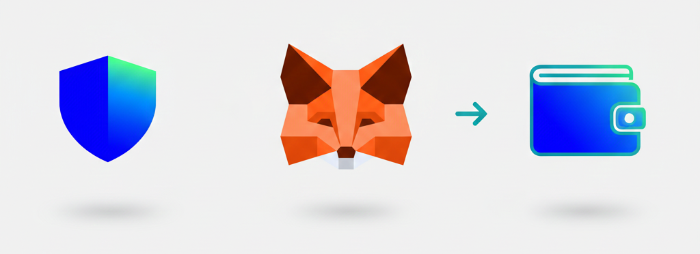

# 🔢 Wallet Setup

<figure><figcaption></figcaption></figure>



### 🧰 Wallet Setup Guide

To play **EXTOCIUM**,\
you must complete a wallet setup connected to the game.

This guide explains the wallet setup process\
in **three simple steps (1 → 2 → 3)**,\
so even first-time users can follow easily.

By completing each step in order,\
you can finish wallet creation and game connection at once.

***

#### 📌 What This Guide Covers

**① Understand what a wallet is.**

A wallet is a personal space where in-game assets and data are securely stored.\
In EXTOCIUM, your wallet is used to connect your account and character.


[what-is-a-wallet.md](what-is-a-wallet.md)


***

**② Add the BNB Smart Chain network to your wallet.**

EXTOCIUM operates on the **BNB Smart Chain network**.\
You must add the BNB Smart Chain network to your wallet in advance\
to play the game properly.


[add-bnb-smart-chain-to-your-wallet.md](add-bnb-smart-chain-to-your-wallet.md)


***

**③ Connect your wallet to EXTOCIUM**.

Once the wallet connection is complete, you are fully ready to play EXTOCIUM.\
You can then create a character and access the game.


[connect-your-wallet-to-extocium.md](connect-your-wallet-to-extocium.md)


***


#### 🔐 Important Notes

* You can choose **only one wallet**: MetaMask or Trust Wallet.
* The wallet you select **cannot be changed later**.
* Before connecting your wallet,\
  please make sure the **BNB Smart Chain network is properly set up**.




### 🧰 지갑 설정 가이드 (Wallet Setup)

EXTOCIUM을 플레이하기 위해서는\
게임과 연결되는 **지갑 설정이 반드시 필요합니다.**

본 가이드는\
지갑이 처음인 사용자도 이해할 수 있도록\
**1 → 2 → 3 단계**로 지갑 설정 과정을 안내합니다.

아래 단계를 순서대로 진행하면\
지갑 생성부터 게임 연결까지 한 번에 완료할 수 있습니다.

***

#### 📌 이 가이드에서 안내하는 내용

**① 지갑이 무엇인지 이해합니다.**

지갑은 게임 내 자산과 데이터를 보관하는 개인 공간입니다.\
EXTOCIUM에서는 지갑을 통해 계정 정보와 캐릭터가 연결됩니다.


[what-is-a-wallet.md](what-is-a-wallet.md)


***

**② BNB Smart Chain 네트워크를 지갑에 추가합니다.**

EXTOCIUM은 **BNB Smart Chain 네트워크**를 기반으로 운영됩니다.\
따라서 지갑에 BNB Smart Chain 네트워크를 **사전에 추가해야** 정상적인 게임 이용이 가능합니다.


[add-bnb-smart-chain-to-your-wallet.md](add-bnb-smart-chain-to-your-wallet.md)


***

**③ 지갑을 EXTOCIUM과 연결합니다.**

지갑 연결을 완료하면 EXTOCIUM 게임 플레이를 위한 준비가 완료됩니다.\
이후 캐릭터 생성 및 게임 접속이 가능합니다.


[connect-your-wallet-to-extocium.md](connect-your-wallet-to-extocium.md)


***


#### 🔐 안내 사항

* 지갑은 **MetaMask 또는 Trust Wallet 중 하나만** 선택할 수 있습니다.
* 최초로 선택한 지갑은 **변경할 수 없습니다.**
* 지갑 연결 전,\
  **BNB Smart Chain 네트워크가 설정되어 있는지 반드시 확인**하시기 바랍니다.




### 🧰 ウォレット設定ガイド（Wallet Setup）

EXTOCIUMをプレイするためには、\
ゲームと連携する**ウォレットの設定が必須**となります。

本ガイドでは、\
ウォレットを初めて利用する方でも理解できるよう、\
**1 → 2 → 3 の手順**で設定方法をご案内します。

手順通りに進めることで、\
ウォレット作成からゲーム連携までを一度に完了できます。

***

#### 📌 本ガイドの内容

**① ウォレットとは何かを理解します。**

ウォレットは、ゲーム内の資産やデータを保管する個人用スペースです。\
EXTOCIUMでは、ウォレットを通じてアカウント情報とキャラクターが連携されます。


[what-is-a-wallet.md](what-is-a-wallet.md)


***

**② BNB Smart Chainネットワークを追加します。**

EXTOCIUMは **BNB Smart Chainネットワーク**を基盤として運営されています。\
そのため、事前にウォレットへBNB Smart Chainネットワークを追加する必要があります。


[add-bnb-smart-chain-to-your-wallet.md](add-bnb-smart-chain-to-your-wallet.md)


***

**③ ウォレットをEXTOCIUMと接続します**。

ウォレットの接続が完了すると、EXTOCIUMをプレイする準備が完了します。\
その後、キャラクター作成およびゲームへの接続が可能になります。


[connect-your-wallet-to-extocium.md](connect-your-wallet-to-extocium.md)


***


#### 🔐 注意事項

* 使用できるウォレットは **MetaMaskまたはTrust Walletのいずれか一つのみ**です。
* 最初に選択したウォレットは**変更できません**。
* ウォレット接続前に、\
  **BNB Smart Chainネットワークが設定されているか必ず確認**してください。




<em>This page was last updated on December 17, 2025.</em>

