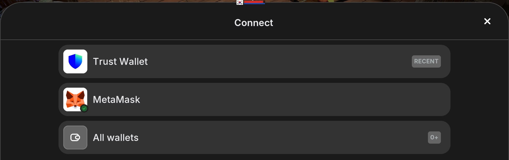
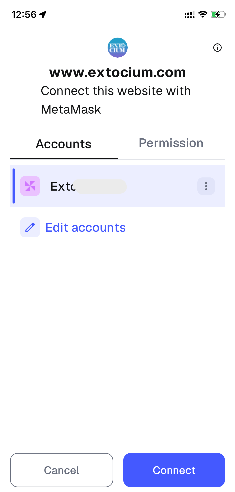
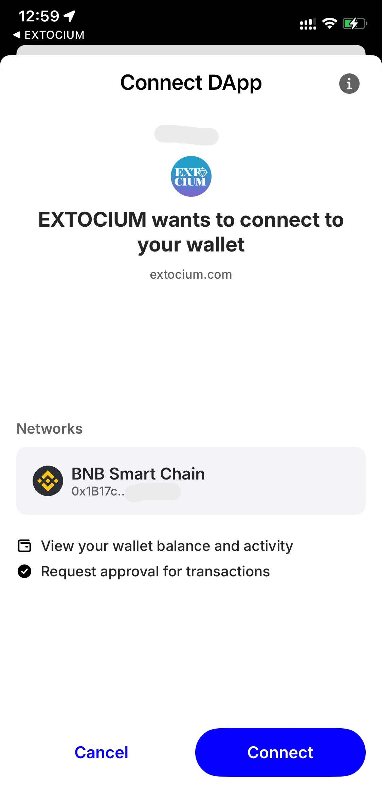
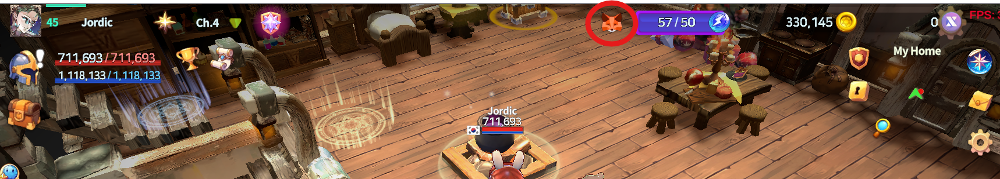

# 3️⃣ Connect Your Wallet to EXTOCIUM


**Watching the video will make it easier!**&#x20;




#### 🔗 Connect Your Wallet to EXTOCIUM

_(MetaMask / Trust Wallet)_

In EXTOCIUM,\
you can connect **one wallet** to the game.\
Choose either **MetaMask or Trust Wallet**.

Follow the steps below to safely connect your wallet to the game.

***


### ⚠️ Before You Choose a Wallet

Please read carefully before proceeding.

* The wallet you connect **for the first time cannot be changed later**.
* You can choose **only one wallet**: MetaMask _or_ Trust Wallet.

👉 Make sure you know which wallet you want to use before connecting.


***

#### ✅ Step 1. Start Connecting Your Wallet

1️⃣ Tap the **fox button (`🦊`)** at the top center of the main HUD.

<figure><figcaption></figcaption></figure>

2️⃣ When the popup appears, choose one of the following:

* **QR Login**
* **APP LOAD Login**

<figure><figcaption></figcaption></figure>

3️⃣ After selecting a login method,\
you’ll be asked to choose the wallet to connect.\
Select the wallet you are using (**MetaMask** or **Trust Wallet**).

<figure><figcaption></figcaption></figure>


1️⃣ [QR Login](connect-your-wallet-to-extocium.md#qr-login)

2️⃣ [APP LOAD Login](connect-your-wallet-to-extocium.md#app-load-login)


***

### 🔹 Login Method Explained&#x20;

#### 📱 QR Login

<figure><figcaption></figcaption></figure>

Use this method when your wallet is on a **different device**.

Example:

* Game: PC / Emulator
* Wallet: Smartphone


Make sure **BNB Smart Chain** is set in your wallet.


**◾How to Connect**

1️⃣ Select **QR Login** to display a QR code on the game screen.

<figure><figcaption></figcaption></figure>

2️⃣ Open your wallet app and scan the QR code to start the connection.

<figure><figcaption>
MetaMask QR
</figcaption></figure> <figure><figcaption>
TrustWallet QR
</figcaption></figure>

_👉 Works the same for both MetaMask and Trust Wallet._

3️⃣ When a **“Connection Request”** popup appears in your wallet,\
tap **`Connect`** to complete the process.

<figure><figcaption>
MetaMask pop-up
</figcaption></figure> <figure><figcaption>
TrustWallet pop-up
</figcaption></figure>

***

#### 📲 APP LOAD Login

<figure><figcaption></figcaption></figure>

**◾How to Connect**

1️⃣ Select **APP LOAD**, and the chosen wallet app will open automatically.

2️⃣ Review the connection request in the wallet and approve it.


👉 **The approval screen is the same as QR Login.**\
**(Only the connection method is different.)**


👉 Works the same for both MetaMask and Trust Wallet.

***

#### ✅ Step **2.** Confirm the Connection

🎉 Once the connection is complete,\
the **fox button (🦊)** at the top center of the main HUD will be activated.

<figure><figcaption></figcaption></figure>


### 🔐 Wallet Connection Notice

For security reasons, wallet connections may not always stay active.

If you plan to:

* Trade NFTs
* Approve transactions

we recommend reconnecting your wallet in advance.


<figure><figcaption></figcaption></figure>

📌 **Check Wallet Status & Transaction History**

Tap the activated **fox button (🦊)** to view:

* Your currently connected wallet
* Transaction history

***

🛑[Having trouble connecting your wallet? Please refer to this tab!](../common-wallet-issues.md)



#### 🔗 내 지갑과 EXTOCIUM 연결하기

_(MetaMask / Trust Wallet)_

EXTOCIUM에서는\
**MetaMask 또는 Trust Wallet 중 하나의 지갑을 선택하여 게임과 연결할 수 있습니다.**

아래 단계를 따라 진행하시면\
지갑을 게임에 안전하게 연결할 수 있습니다.

***


### ⚠️ 지갑 선택 전, 꼭 확인하세요

* 게임에 **처음 연결한 지갑은 임의로 변경할 수 없습니다.**
* MetaMask 또는 Trust Wallet 중 **하나만 선택**할 수 있습니다.

👉 사용하실 지갑을 **미리 확인한 후** 연결을 진행하시기 바랍니다.


***

#### ✅ Step 1. 지갑 연결을 시작합니다

1️⃣ **메인 HUD 중앙 상단**에 있는 **여우 버튼(`🦊`)** 을 터치하세요.

<figure><figcaption></figcaption></figure>

2️⃣ 팝업 창이 나타나면, **QR 로그인** 또는 **APP LOAD 로그인** 중 하나를 선택합니다.

<figure><figcaption></figcaption></figure>

3️⃣ 선택 후,\
**연결할 지갑을 선택하는 화면**이 나타납니다.\
이 화면에서 **사용 중인 지갑(MetaMask 또는 Trust Wallet)** 을 선택합니다.

<figure><figcaption></figcaption></figure>


1️⃣[QR 로그인 하기](connect-your-wallet-to-extocium.md#qr)

2️⃣[앱로드 로그인 하기](connect-your-wallet-to-extocium.md#app-load)


***

### 🔹 지갑 연결 방식 안내

#### 📱 QR 로그인

<figure><figcaption></figcaption></figure>

**지갑이 다른 디바이스에 있을 때 사용하는 방식입니다.**

* 예)
  * 게임: PC / 에뮬레이터
  * 지갑: 스마트폰


**BNB Smart Chain 네트워크가 설정되었는지 꼭 확인**하세요!&#x20;


◾**연결 방법**

1️⃣ QR 로그인을 선택하면 **게임 화면에 QR 코드가 표시됩니다.**

<figure><figcaption></figcaption></figure>

2️⃣ 선택한 지갑 앱을 실행하여 QR 코드를 스캔하면 연결이 진행됩니다.

<figure><figcaption>
MetaMask QR
</figcaption></figure> <figure><figcaption>
TrustWallet QR
</figcaption></figure>

_👉 MetaMask와 Trust Wallet 모두 동일하게 동작합니다._

3️⃣ 지갑 앱에 **"연결 승인 요청" 팝업**이 나타나면 **`연결` 버튼을 터치하여 연결을 완료하세요.**

<figure><figcaption>
MetaMask pop-up
</figcaption></figure> <figure><figcaption>
TrustWallet pop-up
</figcaption></figure>

***

#### 📲 APP LOAD 로그인

<figure><figcaption></figcaption></figure>

◾**연결 방법**

1️⃣ APP LOAD를 선택하면 **선택한 지갑 앱이 자동으로 실행됩니다.**

2️⃣ 지갑 앱에서 **연결 승인 요청을 확인하고 승인**하면 연결이 완료됩니다.


👉 **연결 승인 화면은 QR 로그인과 동일하게 표시됩니다.**\
(연결 방식만 다를 뿐, 승인 절차는 같습니다.)


👉 MetaMask와 Trust Wallet 모두 동일하게 동작합니다.

***

#### ✅ Step **2.** 연결 완료 확인하기

🎉 **연결이 완료되면, 메인 HUD 중앙 상단의 여우 버튼(🦊)이 활성화됩니다!**

<figure><figcaption></figcaption></figure>


### 🔐 지갑 연결 유지 관련 안내

보안상의 이유로 지갑 연결은 **항상 자동으로 유지되지 않을 수 있습니다.**

NFT 거래나 지갑 승인이 필요한 경우에는 **사전에 지갑을 다시 연결하는 것을 권장합니다.**


<figure><figcaption></figcaption></figure>

📌 **지갑 연결 상태 및 거래 내역 확인하기**

* 활성화된 **여우 버튼을 터치하면**, 현재 연결된 지갑 상태 및 거래 내역을 확인할 수 있습니다.

***

🛑[지갑 연결에 문제가 생겼나요? 이 탭을 참조해주세요!](../common-wallet-issues.md)



#### 🔗 ウォレットをEXTOCIUMに接続する

_(MetaMask / Trust Wallet)_

EXTOCIUMでは、\
**MetaMaskまたはTrust Walletのいずれか一つ**を選択して\
ゲームと接続できます。

以下の手順に沿って進めることで、\
ウォレットを安全に接続できます。

***


### ⚠️ ウォレット選択前の重要確認 接続前に、必ず以下をご確認ください。

* 初回に接続したウォレットは **後から変更できません**。
* 選択できるウォレットは **1つのみ** です\
  （MetaMask または Trust Wallet）。

👉 使用するウォレットを事前に確認したうえで、接続を行ってください。


***

#### ✅ Step 1. ウォレット接続を開始します

1️⃣ メインHUD中央上部にある **キツネボタン（`🦊`）** をタップしてください。

<figure><figcaption></figcaption></figure>

2️⃣ ポップアップが表示されたら、以下のいずれかを選択します。

* **QRログイン**
* **APP LOADログイン**

<figure><figcaption></figcaption></figure>

3️⃣ 選択後、\
接続するウォレットを選ぶ画面が表示されます。\
使用中のウォレット（**MetaMask** または **Trust Wallet**）を選択してください。

<figure><figcaption></figcaption></figure>


1️⃣[QRログイン](connect-your-wallet-to-extocium.md#qrroguin)

2️⃣[APP LOADログイン](connect-your-wallet-to-extocium.md#app-loadroguin)


***

### 🔹 ウォレット接続方法について

#### 📱 QRログイン

<figure><figcaption></figcaption></figure>

ウォレットが **別の端末** にある場合に使用します。

例：

* ゲーム：PC／エミュレーター
* ウォレット：スマートフォン


ウォレットで **BNB Smart Chain** が設定されているか必ず確認してください。


**◾接続手順**

1️⃣ QRログインを選択すると、ゲーム画面にQRコードが表示されます。

<figure><figcaption></figcaption></figure>

2️⃣ ウォレットアプリを起動し、QRコードをスキャンすると接続が進みます。

<figure><figcaption>
MetaMask QR
</figcaption></figure> <figure><figcaption>
TrustWallet QR
</figcaption></figure>

_👉 MetaMask・Trust Walletともに同じ動作です。_

3️⃣ ウォレットアプリに **「接続承認リクエスト」** が表示されたら、**「`接続`」** をタップして完了です。

<figure><figcaption>
MetaMask pop-up
</figcaption></figure> <figure><figcaption>
TrustWallet pop-up
</figcaption></figure>

***

#### 📲 APP LOADログイン

<figure><figcaption></figcaption></figure>

**◾接続手順**

1️⃣ APP LOADを選択すると、選択したウォレットアプリが自動で起動します。

2️⃣ ウォレット側で接続承認リクエストを確認し、承認してください。


👉 **承認画面はQRログインと同じです。**\
**（接続方法のみが異なります。）**


👉 MetaMask・Trust Walletともに同じ動作です。

***

#### ✅ Step **2.** 接続完了を確認します

🎉 接続が完了すると、メインHUD中央上部の **キツネボタン（🦊）** が有効化されます。

<figure><figcaption></figcaption></figure>


### 🔐 ウォレット接続維持について

セキュリティ上の理由により、ウォレット接続は常に自動で維持されるとは限りません。

NFT取引やウォレット承認が必要な場合は、事前に再接続することをおすすめします。


<figure><figcaption></figcaption></figure>

📌 ウォレット接続状態・取引履歴の確認

* 有効化された **キツネボタン（🦊）** をタップすると、\
  現在接続中のウォレット状態や取引履歴を確認できます。

***

🛑[ウォレットの接続に問題がありますか？このタブを参照してください！](../common-wallet-issues.md)



<em>※ This guide was written based on the game status as of December 17, 2025,</em>  <em>and its contents may change with future updates.</em>

