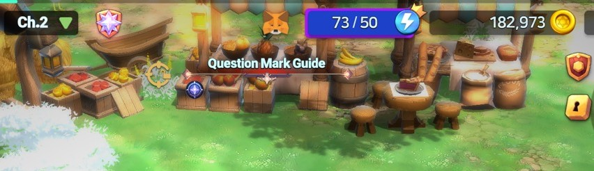

# 3️⃣ Connect Your Wallet to EXTOCIUM


**Watching the video will make it easier!**&#x20;




#### 🔗 **Connecting the Game with MetaMask**

Want to connect MetaMask to the game? No worries! \
Just follow the steps below to set it up easily. 🦊✨

***

#### ✅ **1. Start Connecting MetaMask**

1️⃣ Tap the **fox icon (🦊) at the top center of the main HUD**.

<figure><figcaption></figcaption></figure>

2️⃣ A pop-up will appear, giving you two connection options.

<figure><figcaption></figcaption></figure>


[1️⃣](connect-your-wallet-to-extocium.md#id-1-qr)[QR Login](connect-your-wallet-to-extocium.md#method-1-qr-login-using-metamask-on-mobile)

[2️⃣App Load Login](connect-your-wallet-to-extocium.md#method-2-app-load-login-using-metamask-on-the-same-device)


***

#### 🔹 **Method 1: QR Login (Using MetaMask on Mobile)**

💡 **If you're playing the game on a PC emulator, you can log in using the QR code with your MetaMask mobile app.**

> 
>
> 📌 **Already connected a wallet before?**
>
> * Simply check the **wallet address and network (Binance Smart Chain)** at the top and proceed.
>
> 
>
>
>
> 📌 **Connecting for the first time?**\
> 1️⃣ Make sure **Binance Smart Chain is set up** in MetaMask.\
> 2️⃣ Select the **wallet address** you want to connect and tap the **camera icon** in the top right of the MetaMask app.
>
> .png>)
>
>
>
> 3️⃣ When the camera opens, **scan the QR code displayed in the game**.
>
> 
>
>
>
> 4️⃣ Shortly after, a **connection approval request pop-up** will appear in MetaMask.\
> 5️⃣ Tap **"Connect"** to complete the connection.

***

#### 🔹 **Method 2: App Load Login (Using MetaMask on the Same Device)**

📌 **If you're playing the game on the same device where MetaMask is installed, use the "APP LOAD" button.**

If connecting within the device, you can load the wallet through the APP LOAD button.

> .png>)
>
> 1️⃣ Tap **"APP LOAD"**, and the MetaMask app will launch automatically.
>
> 2️⃣ **Important Notes:**
>
> * Make sure **MetaMask is already installed** on your device.
> * **If you have multiple accounts**, open MetaMask first and select the wallet you want to use.
>
> 
>
> &#x20;
>
> 3️⃣ A **connection approval request pop-up** will appear in MetaMask. \
> Tap **"Connect"** to complete the process.
>
> .jpg>)

***

#### ✅ **2. Confirm Connection Status**

🎉 **Once connected, the fox icon (🦊) at the top center of the main HUD will become active!**


📌 **Wallet Connection Maintenance**

* **For security reasons, MetaMask does not keep the connection active indefinitely.**
* **If you need to make a transaction, reconnect your wallet in advance.**


<figure><figcaption></figcaption></figure>

📌 **Check Wallet Status & Transaction History**

* Tap the **fox icon** to view your **current wallet connection status and transaction history**.

***

🛑[Having trouble connecting your wallet? Please refer to this tab!](../common-issues.md)



#### 🔗 내 지갑과 EXTOCIUM 연결하기

_(MetaMask & Trust Wallet)_

EXTOCIUM에서는\
**MetaMask 또는 Trust Wallet 중 하나의 지갑을 선택하여 게임과 연결할 수 있습니다.**

아래 단계를 따라 진행하시면\
지갑을 게임에 안전하게 연결할 수 있습니다.

***


### ⚠️ 지갑 선택 전, 꼭 확인하세요

* 게임에 **처음 연결한 지갑은 임의로 변경할 수 없습니다.**
* MetaMask 또는 Trust Wallet 중 **하나만 선택**할 수 있습니다.

👉 사용하실 지갑을 **미리 확인한 후** 연결을 진행하시기 바랍니다.


***

#### ✅ Step 1. 지갑 연결 시작하기

1️⃣ **메인 HUD 중앙 상단**에 있는 **여우 버튼(🦊)** 을 터치하세요.

<figure><figcaption></figcaption></figure>

2️⃣ 팝업 창이 나타나면, **QR 로그인** 또는 **APP LOAD 로그인** 중 하나를 선택합니다.

<figure><figcaption></figcaption></figure>

3️⃣ 선택 후,\
**연결할 지갑을 선택하는 화면**이 나타납니다.\
이 화면에서 **사용 중인 지갑(MetaMask 또는 Trust Wallet)** 을 선택합니다.

<figure><figcaption></figcaption></figure>


[1️⃣QR 로그인 하기](connect-your-wallet-to-extocium.md#id-1-qr)

[2️⃣앱로드 로그인 하기](connect-your-wallet-to-extocium.md#id-2)


***

### 🔹 연결 방식 설명&#x20;

#### 📱 QR 로그인

<figure><figcaption></figcaption></figure>

**지갑이 다른 디바이스에 있을 때 사용하는 방식입니다.**

* 예)
  * 게임: PC / 에뮬레이터
  * 지갑: 스마트폰


**BNB Smart Chain 네트워크가 설정되었는지 꼭 확인**하세요!&#x20;


1️⃣ QR 로그인을 선택하면 **게임 화면에 QR 코드가 표시됩니다.**

<figure><figcaption></figcaption></figure>

2️⃣ 선택한 지갑 앱을 실행하여 QR 코드를 스캔하면 연결이 진행됩니다.

<figure><figcaption>
MetaMask QR
</figcaption></figure> <figure><figcaption>
TrustWallet QR
</figcaption></figure>

_👉 MetaMask와 Trust Wallet 모두 동일하게 동작합니다._

3️⃣ 지갑 앱에 **"연결 승인 요청" 팝업**이 나타나면 **"연결" 버튼을 터치하여 연결을 완료하세요.**

<figure><figcaption>
MetaMask pop-up
</figcaption></figure> <figure><figcaption>
TrustWallet pop-up
</figcaption></figure>

***

#### 📲 APP LOAD 로그인

<figure><figcaption></figcaption></figure>

1️⃣ APP LOAD를 선택하면 **선택한 지갑 앱이 자동으로 실행됩니다.**

2️⃣ 지갑 앱에서 **연결 승인 요청을 확인하고 승인**하면 연결이 완료됩니다.


👉 **연결 승인 화면은 QR 로그인과 동일하게 표시됩니다.**\
(연결 방식만 다를 뿐, 승인 절차는 같습니다.)


👉 MetaMask와 Trust Wallet 모두 동일하게 동작합니다.

***

#### ✅ Step **2. 연결 완료 및 확인하기**

🎉 **연결이 완료되면, 메인 HUD 중앙 상단의 여우 버튼(🦊)이 활성화됩니다!**

<figure><figcaption></figcaption></figure>


### 🔐 지갑 연결 유지 관련 안내

보안상의 이유로 지갑 연결은 **항상 자동으로 유지되지 않을 수 있습니다.**

NFT 거래나 지갑 승인이 필요한 경우에는 **사전에 지갑을 다시 연결하는 것을 권장합니다.**


<figure><figcaption></figcaption></figure>

📌 **지갑 연결 상태 및 거래 내역 확인하기**

* 활성화된 **여우 버튼을 터치하면**, 현재 연결된 지갑 상태 및 거래 내역을 확인할 수 있습니다.

***

🛑[지갑 연결에 문제가 생겼나요? 이 탭을 참조해주세요!](../common-issues.md)



#### 🔗 **ゲームとMetaMaskを接続する方法**

ゲームでMetaMaskを接続したいですか？心配いりません！\
以下の手順に従えば、簡単にセットアップできます。 🦊✨

***

#### ✅ **1. MetaMaskの接続を開始する**

1️⃣ **メインHUDの中央上部にある🦊アイコン**をタップします。

<figure><figcaption></figcaption></figure>

2️⃣ ポップアップが表示され、2つの接続方法が選択できます。

<figure><figcaption></figcaption></figure>


[1️⃣QRログイン](connect-your-wallet-to-extocium.md#id-1-qrroguinmobairunometamaskwo)

[2️⃣アプリロードログイン](connect-your-wallet-to-extocium.md#id-2-appurdoroguinjidebaisudemetamaskwo)


***

#### 🔹 **方法1: QRログイン（モバイルのMetaMaskを使用）**

💡 **PCエミュレーターでゲームをプレイしている場合は、モバイル版MetaMaskを使用してQRコードでログインできます。**

> 
>
> 📌 **すでにウォレットを接続済みの場合?**
>
> * 上部に表示される **ウォレットアドレスとネットワーク（Binance Smart Chain）** を確認し、そのまま接続してください。
>
>
>
> 
>
> 📌 **初めてウォレットを接続する場合?**\
> 1️⃣ **MetaMaskでBinance Smart Chainが設定されていることを確認** します。\
> 2️⃣ **接続したいウォレットアドレスを選択** し、MetaMaskアプリの右上にある **カメラアイコン** をタップします。
>
>
>
> .png>)
>
> 3️⃣ カメラが起動したら、**ゲーム画面のQRコードをスキャン** します。
>
>
>
> 
>
> &#x20;
>
> 4️⃣ しばらくすると、MetaMaskに **「接続承認リクエスト」ポップアップ** が表示されます。\
> 5️⃣ **「接続」ボタンをタップして完了** します。

***

#### 🔹 **方法2: アップロードログイン（同じデバイスでMetaMaskを使用）**

📌 **ゲームをプレイしているデバイス内で直接接続する場合は、「APP LOAD」ボタンを使用します。**

> .png>)
>
>
>
> 1️⃣ **「APP LOAD」ボタンをタップ** すると、MetaMaskアプリが自動的に起動します。\
> 2️⃣ **注意事項:**
>
> * **MetaMaskアプリが事前にインストールされている必要があります。**
> * **複数のウォレットアカウントを使用している場合** は、事前にMetaMaskアプリを開き、使用するウォレットを選択してください。
>
> 
>
> &#x20;
>
> 3️⃣ **「接続承認リクエスト」ポップアップ** が表示されたら、**「接続」ボタンをタップして完了** します。
>
> 

***

#### ✅ **2. 接続完了 & 確認方法**

🎉 **接続が完了すると、メインHUD中央上部の🦊アイコンがアクティブになります！**


📌 **ウォレット接続の維持について**

* **セキュリティ上の理由により、MetaMaskの接続は長時間自動で維持されません。**
* **取引を行う前に、再接続することをおすすめします。**


<figure><figcaption></figcaption></figure>

📌 **ウォレットの状態 & 取引履歴の確認**

* **🦊アイコンをタップすると、現在のウォレット接続状況と取引履歴を確認** できます。

***

🛑[ウォレットの接続に問題がありますか？このタブを参照してください！](../common-issues.md)


