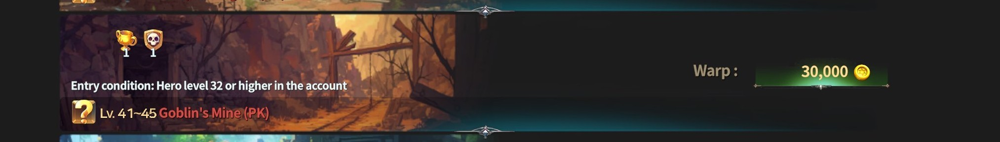
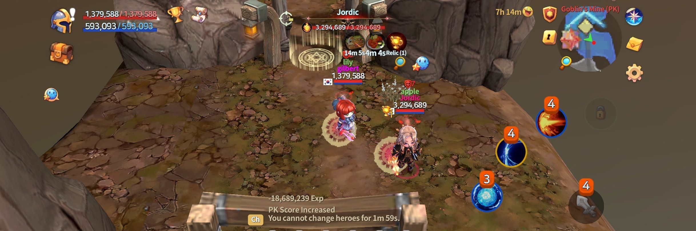

# 🏆 Seven Sacred Relics

<figure><figcaption></figcaption></figure>



### ⚔️ Seven Sacred Relics

Seven Sacred Relics are a core competitive system\
that can be obtained through **Club War**.

Only **seven relics exist per server**,\
and Club members who possess a Sacred Relic gain powerful individual benefits.\
In addition, the more Club members who hold Sacred Relics,\
the greater the bonus applied to the entire Club.

<figure><figcaption></figcaption></figure>

***

#### ◾ Seven Sacred Relic Bonuses

When a Club member possesses a Sacred Relic,\
the following effects are applied to the entire Club:

* **1 Sacred Relic held**\
  All Club members gain **+3% Drop Rate** (Items, Gold, and EXP)
* Additional Relics provide **stacking bonuses**
* A maximum of **+21%** is applied when **7 Relics** are held


**The more Sacred Relics a Club holds,** \
**the more likely it is to become a primary target for other Clubs.**


***

#### ◾ Conditions to Obtain Sacred Relics

Sacred Relics can only be obtained when **all of the following conditions are met**:

* The Club must be in a **War state**
* Sacred Relics are initially dropped by monsters in the **PK Leverage Zone**
* When a monster is defeated, **each player can obtain up to 1 Sacred Relic**

Sacred Relics **cannot be obtained** in the following situation:

* While a **PK Shield** is active

***

#### ◾ Sacred Relic Holding Restrictions

While holding a Sacred Relic, the following restrictions apply:

* **PK Shields cannot be used**
* The Relic holder is **constantly exposed to combat risk**

<figure><figcaption></figcaption></figure>

***

#### ◾ Sacred Relic Seizure (Club vs. Club PK)

Sacred Relics can be obtained not only from monsters\
but also by **seizing them through PK against other Clubs**.

* Club members holding a Sacred Relic\
  will have a **Relic icon displayed above their character**
* If such a player is defeated by an opposing Club member, the Sacred Relic can be seized
* A single player can hold **up to all 7 Sacred Relics**
* Defeating a player holding **7 Sacred Relics**\
  allows the opponent to obtain **all of them at once**

<figure><figcaption></figcaption></figure>

***

#### ◾Sacred Relic Maintenance & Disappearance

* A Sacred Relic holder’s **PK Level increases by 1 every 30 minutes**
* In the future, Sacred Relic effects will vary based on the **NFT’s base stats**
* If a Sacred Relic holder remains in a **Peace Zone**, or **10 minutes pass after logging out**,\
  the Sacred Relic will return to the monsters

***

✨

> **Seven Sacred Relics are a system that tests both the growth and honor of a Club.**\
> **Through strategy and combat, prove the true strength of your Club.**



### ⚔️ 일곱 성배 (Seven Sacred Relics)

일곱 성배는 **클럽 전쟁을 통해 획득할 수 있는 핵심 경쟁 콘텐츠**입니다.

서버 내에 단 **7개만 존재하는 특별한 유물**로,\
성배를 보유한 클럽원은 강력한 개인 혜택을 획득할 수 있습니다.

또한, 성배를 보유한 클럽원이 많을수록 **클럽 전체에 추가 보너스**가 적용됩니다.

<figure><figcaption></figcaption></figure>

***

#### ◾ 일곱 성배 보너스 효과

클럽원이 성배를 보유하면 클럽 전체에 다음 효과가 적용됩니다.

* 성배 **1개 보유 시** 모든 클럽원의 **드랍률(아이템·골드·EXP) +3%**
* 성배를 추가로 보유할수록 효과는 **누적 적용**됩니다.
* 최대 **7개 보유 시 +21%**&#xAE4C;지 증가합니다.


**성배를 많이 보유할수록 다른 클럽의 주요 공격 대상이 될 수 있습니다.**


***

#### ◾ 성배 획득 조건

성배는 아래 조건을 충족한 상태에서만 획득할 수 있습니다.

* 클럽이 **전쟁 상태**일 것
* **PK 레버리지 존**의 몬스터가 최초 드랍
* 몬스터 처치 시, **플레이어 1인당 성배 1개 드랍**

다음 상황에서는 성배를 획득할 수 없습니다.

* **PK 보호막 사용 중**일 경우
* 성배 보유 중에는 **PK 보호막 사용 불가**

***

#### ◾ 성배 쟁탈전 (클럽 간 PK)

성배는 몬스터 처치뿐만 아니라 **다른 클럽과의 PK를 통해서도 탈취**할 수 있습니다.

* 성배를 보유한 클럽원은 **머리 위에 성배 아이콘**이 표시됩니다.
* 해당 플레이어를 상대 클럽원이 PK할 경우 성배를 빼앗을 수 있습니다.
* 한 명의 플레이어가 **최대 7개의 성배를 모두 보유**할 수 있습니다.
* 성배 7개를 보유한 플레이어를 처치하면 **해당 성배 전부를 획득**합니다.

<figure><figcaption></figcaption></figure>

***

#### ◾ 성배 유지 및 소멸 조건

* 성배 보유자는 **30분마다 PK 레벨이 1씩 증가**합니다.
* 향후, **NFT 베이스 스탯에 따라 성배 효과가 다르게 적용**될 예정입니다.
* 성배 보유자가 **평화 지역에 머물거나**, **접속 종료 후 10분이 경과**하면  \
  성배는 다시 **몬스터에게 귀속**됩니다.

***

✨

> **일곱 성배는 클럽의 성장과 명예를 동시에 시험하는 콘텐츠입니다.**\
> **전략과 전투를 통해, 클럽의 힘을 증명해 보세요.**



### ⚔️ 七つの聖遺物（Seven Sacred Relics）

七つの聖遺物は、**クラブ戦争を通じて獲得できる中核的な競争コンテンツ**です。

サーバー内に**7つしか存在しない特別な遺物**であり、\
聖遺物を所持しているクラブメンバーは 強力な個人効果を獲得できます。\
また、聖遺物を所持しているクラブメンバーが多いほど、\
**クラブ全体に追加ボーナス**が適用されます。

<figure><figcaption></figcaption></figure>

***

#### ◾ 七つの聖遺物ボーナス効果

クラブメンバーが聖遺物を所持すると、クラブ全体に以下の効果が適用されます。

* **聖遺物1個所持時**\
  すべてのクラブメンバーの **ドロップ率（アイテム・ゴールド・EXP）+3%**
* 聖遺物を追加で所持するごとに 効果は**累積**されます
* 最大**7個所持時、+21%**&#x307E;で増加します


**聖遺物を多く所持するほど、他クラブから主要な攻撃対象となりやすくなります。**


***

#### ◾ 聖遺物の獲得条件

聖遺物は、以下の条件を**すべて満たしている場合のみ**獲得できます。

* クラブが**戦争状態**であること
* **PKレバレッジゾーン**のモンスターが最初にドロップすること
* モンスター撃破時、**プレイヤー1人につき聖遺物1個までドロップ**

以下の状況では、聖遺物を獲得することはできません。

* **PKシールド使用中**の場合

***

#### ◾ 聖遺物所持時の制限事項

聖遺物を所持している間は、以下の制限が適用されます。

* **PKシールドを使用できません**
* 聖遺物所持者は、常に**戦闘リスクにさらされます**

<figure><figcaption></figcaption></figure>

***

#### ◾ 聖遺物争奪戦（クラブ間PK）

聖遺物は、モンスターからのドロップだけでなく、\
**他クラブとのPKによって奪取することも可能**です。

* 聖遺物を所持しているクラブメンバーの頭上には **聖遺物アイコン**が表示されます
* 該当プレイヤーを 相手クラブメンバーがPKした場合、聖遺物を奪うことができます
* 1人のプレイヤーが **最大7個すべての聖遺物を所持**することも可能です
* **7個の聖遺物を所持しているプレイヤー**を撃破すると、その聖遺物を**すべて獲得**できます

<figure><figcaption></figcaption></figure>

***

#### ◾ 聖遺物の維持および消失条件

* 聖遺物所持者は、**30分ごとにPKレベルが1上昇**します
* 今後、**NFTのベースステータスに応じて 聖遺物効果が異なる形で適用**される予定です
* 聖遺物所持者が **平和地域に滞在した場合**、または **ログアウト後10分が経過した場合**、\
  聖遺物は再び**モンスターへ帰属**します

***

✨

> **七つの聖遺物は、クラブの成長と名誉の両方を試すコンテンツです。**\
> **戦略と戦闘を通じて、クラブの真の力を証明しましょう。**



<em>※ This guide was written based on the game status as of January 26, 2026,</em>  <em>and its contents may change with future updates.</em>

