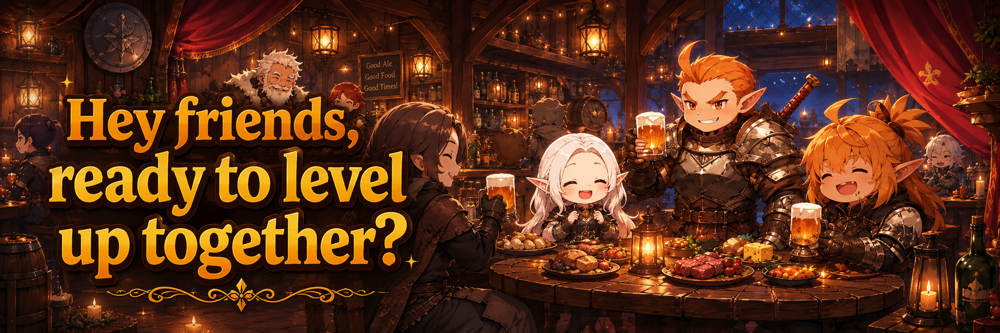

# 🍺 Club

<figure><figcaption></figcaption></figure>



### 🍻 Club Guide

Clubs are a community feature where Adventurers can gather,\
meet new allies, and grow together.

You can create a new Club or join an existing one to adventure alongside other players.

***

#### ◾ Club Requirements

**Club Creation Requirements**

* Hero Level 20 or higher on your account
* Total accumulated [TP](../../beginners-guide/gameplay-guide/training.md) of 5,000 or more

**Club Join Requirements**

* Hero Level 15 or higher on your account
* Total accumulated [TP](../../beginners-guide/gameplay-guide/training.md) of 1,000 or more

***

#### ◾ Club Access Location

All Club-related features are available in the **Clientelas Lobby**.

* Tap the **“Clientelas”** button at the top of the Main HUD\
  to move to the Clientelas Lobby.

<figure><figcaption></figcaption></figure>


#### ※ If you are in combat, a PK area, or a dungeon, movement to the Clientelas Lobby may be restricted.


***

#### ◾ Available Features in the Club Lobby

In the Club Lobby, you can access the following features:

* **Join a Club**\
  👇 Search for and join an existing Club.


[join-club.md](join-club.md)


* **Create a Club**\
  👇 Create a new Club.


[create-club.md](create-club.md)


* **Club Management**\
  👇 Manage Club operations and members.


[club-management.md](club-management.md)


* **Club Warehouse**\
  👇 Use the shared Club storage.


[club-warehouse.md](club-warehouse.md)


Detailed information for each feature can be found on the corresponding guide pages.

***

✨

> **Gather your allies and build a Club where you can grow together.**



### 🍻 클럽 가이드

클럽은 모험가들이 함께 모여 동료를 만들고 커뮤니티를 확장할 수 있는 콘텐츠입니다.\
새로운 클럽을 창설하거나, 기존 클럽에 가입하여 다른 모험가들과 함께할 수 있습니다.

***

#### ◾ 클럽 이용 조건

**클럽 창설 조건**

* 계정 내 영웅 레벨 20 이상
* 누적 [TP](../../beginners-guide/gameplay-guide/training.md) 5,000 이상

**클럽 가입 조건**

* 계정 내 영웅 레벨 15 이상
* 누적 [TP](../../beginners-guide/gameplay-guide/training.md) 1,000 이상

***

#### ◾ 클럽 이용 위치 안내

클럽과 관련된 모든 기능은 **클리엔텔라스 로비**에서 이용할 수 있습니다.

* 메인 HUD 상단의 **「Clientelas」 버튼**을 터치하여 클리엔텔라스 로비로 이동합니다.

<figure><figcaption></figcaption></figure>


#### ※ 전투 중이거나 PK 지역, 던전에 있는 경우 클리엔텔라스 로비로의 이동이 제한될 수 있습니다.


***

#### ◾ 클럽 로비에서 이용 가능한 기능

클럽 로비에서는 다음과 같은 기능을 이용할 수 있습니다.

* **클럽 가입하기 (Join)**\
  👇기존 클럽을 검색하고 가입할 수 있습니다.


[join-club.md](join-club.md)


* **클럽 창설하기 (Create Club)**\
  👇새로운 클럽을 생성할 수 있습니다.


[create-club.md](create-club.md)


* **클럽 관리 (Club Management)**\
  👇클럽 운영 및 멤버 관리를 할 수 있습니다.


[club-management.md](club-management.md)


* **클럽 창고 (Club Warehouse)**\
  👇클럽 공용 창고를 이용할 수 있습니다.


[club-warehouse.md](club-warehouse.md)


각 기능에 대한 자세한 내용은 해당 메뉴의 가이드 페이지에서 확인할 수 있습니다.

***

✨

> **동료를 모으고, 함께 성장할 수 있는 클럽을 만들어 보세요.**



### 🍻 クラブガイド

クラブは、冒険者たちが集まり、\
仲間を作り、コミュニティを広げることができるコンテンツです。

新しいクラブを設立したり、既存のクラブに参加して、他の冒険者と共に冒険できます。

***

#### ◾ クラブ利用条件

**クラブ設立条件**

* アカウント内ヒーローレベル20以上
* 累計[TP](../../beginners-guide/gameplay-guide/training.md) 5,000以上

**クラブ加入条件**

* アカウント内ヒーローレベル15以上
* 累計[TP](../../beginners-guide/gameplay-guide/training.md) 1,000以上

***

#### ◾ クラブ利用場所の案内

クラブに関するすべての機能は、**クリエンテラスロビー**で利用できます。

* メインHUD上部の「Clientelas」ボタンをタップして、クリエンテラスロビーへ移動します。

<figure><figcaption></figcaption></figure>


#### ※ 戦闘中、PKエリア、またはダンジョンにいる場合は、 クリエンテラスロビーへの移動が制限されることがあります。


***

#### ◾ クラブロビーで利用できる機能

クラブロビーでは、以下の機能を利用できます。

* **クラブに参加する（Join）**\
  👇 既存のクラブを検索して参加できます。


[join-club.md](join-club.md)


* **クラブを設立する（Create Club）**\
  👇 新しいクラブを作成できます。


[create-club.md](create-club.md)


* **クラブ管理（Club Management）**\
  👇 クラブの運営やメンバー管理を行えます。


[club-management.md](club-management.md)


* **クラブ倉庫（Club Warehouse）**\
  👇 クラブ共用の倉庫を利用できます。


[club-warehouse.md](club-warehouse.md)


各機能の詳細は、該当するメニューのガイドページをご確認ください。

***

✨

> **仲間を集め、共に成長できるクラブを作りましょう。**



<em>※ This guide was written based on the game status as of January 26, 2026,</em>  <em>and its contents may change with future updates.</em>

