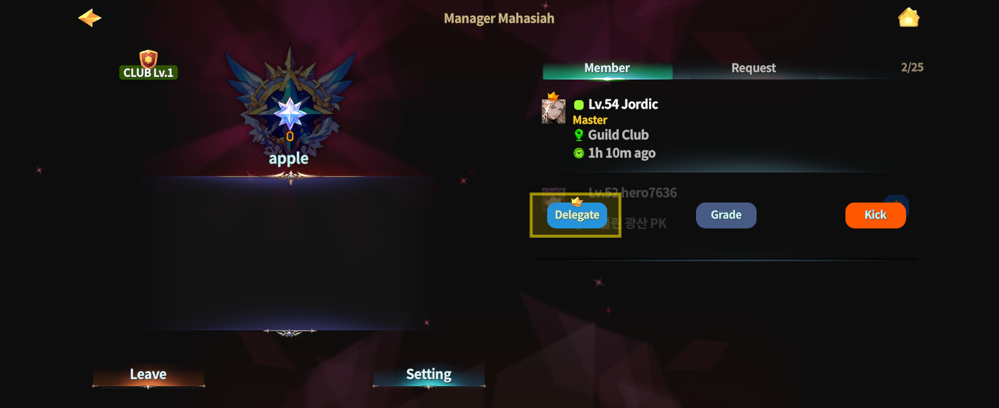
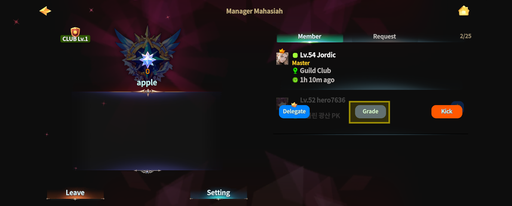
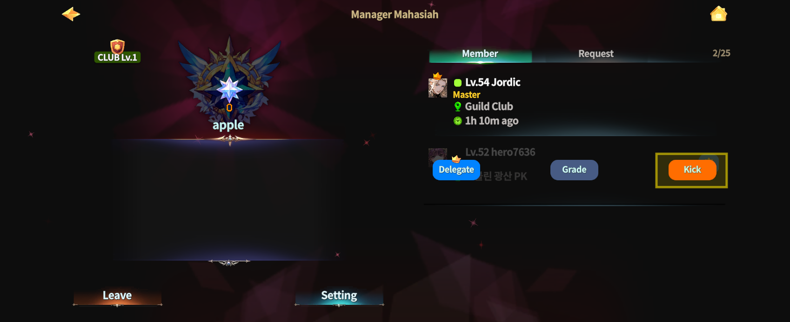

# ⚒️ Club Management



### 🍻 Club Management

Club Management allows you to operate your Club\
and manage its members from within the Club Room.

Through this menu, the Club Master can\
view member information and adjust settings required for Club operations.

***

#### ◾ Club Management Access Location

After joining a Club, \
you can move to your Club Room through the **Warp Gate in the Clientelas Lobby**.

* Once inside the Club Room, interact with **NPC “Mahasiah”**.

<figure><figcaption></figcaption></figure>

***

#### ◾ Basic Club Management Features

By talking to NPC Mahasiah, you can access the following information and settings:

* Club member list and basic member information
* View and edit Club announcements
* Club operation–related settings

<figure><figcaption></figcaption></figure>

***

#### ◾ Member Management

Member management is handled from the **Member List** on the right side\
after talking to NPC Mahasiah.

1️⃣ **Open the Member Management Menu**

* In the member list, select the **gear icon** located to the right of a member’s name.

<figure><figcaption></figcaption></figure>

2️⃣ **Select a Management Option**\
The following three options are available:

* **Delegate**\
  Transfer **Club Master authority** to the selected member.

<figure><figcaption></figcaption></figure>

* **Grade**\
  Opens the **Grade Change** pop-up. Select a color to change the member’s **grade**.

<figure><figcaption></figcaption></figure>

* **Kick**\
  Remove the selected member from the Club.

<figure><figcaption></figcaption></figure>

***

#### ◾ Club Member Limit

* A Club can have up to **25 members**, including the Club Master.
* If the Club is upgraded to a **Guild** in the future,\
  the maximum number of members will be increased.

***

✨

> **Manage your members efficiently**\
> **and keep your Club running smoothly as it grows.**



### 🍻 클럽 관리 (Club Management)

클럽 관리 기능은 클럽 룸에서 클럽 운영과 멤버 관리를 진행할 수 있는 메뉴입니다.\
클럽 마스터는 이 기능을 통해 클럽원 정보를 확인하고, 클럽 운영에 필요한 설정을 변경할 수 있습니다.

***

#### ◾ 클럽 관리 이용 위치 안내

클럽에 가입하면 **클리엔텔라스 로비의 워프게이트**를 통해 본인이 속한 **클럽 룸**으로 이동할 수 있습니다.

* 클럽 룸에 입장한 후 **NPC ‘마하시아’**&#xC5D0;게 말을 겁니다.

<figure><figcaption></figcaption></figure>

***

#### ◾ 클럽 관리 기본 기능

NPC 마하시아와 대화하면 다음과 같은 정보를 확인할 수 있습니다.

* 클럽원 목록 및 기본 정보
* 클럽 공지 확인 및 변경
* 클럽 운영 관련 설정

<figure><figcaption></figcaption></figure>

***

#### ◾ 멤버 관리 방법

클럽원 관리는 NPC 마하시아와 대화한 후 우측의 **멤버 목록**에서 진행할 수 있습니다.

1️⃣ **멤버 관리 메뉴 열기**

* 멤버 목록에서 클럽원 이름 오른쪽에 있는 **톱니바퀴 아이콘**을 선택합니다.

<figure><figcaption></figcaption></figure>

2️⃣ **관리 메뉴 선택**\
아래 3가지 메뉴를 사용할 수 있습니다.

* **마스터 위임**\
  선택한 멤버에게 **클럽 마스터 권한을 위임**합니다.

<figure><figcaption></figcaption></figure>

* **등급 변경**\
  **등급 변경** 팝업이 열리며, 색상을 선택하여 해당 멤버의 **등급을 변경**할 수 있습니다.

<figure><figcaption></figcaption></figure>

* **추방**\
  선택한 멤버를 **클럽에서 추방**합니다.

<figure><figcaption></figcaption></figure>

***

#### ◾ 클럽 인원 제한 안내

* 클럽에 가입할 수 있는 최대 인원은 **마스터 포함 25명**입니다.
* 추후 클럽이 **길드로 업그레이드**될 경우, 가입 가능 인원이 추가될 예정입니다.

***

✨

> **클럽을 효율적으로 관리하고, 원활한 운영을 통해 클럽을 성장시켜 보세요.**



### 🍻 クラブ管理（Club Management）

クラブ管理は、\
**クラブルーム内でクラブ運営やメンバー管理を行うための機能**です。

クラブマスターはこの機能を通じて、\
クラブメンバーの情報を確認し、クラブ運営に必要な設定を行うことができます。

***

#### ◾ クラブ管理の利用場所

クラブに加入すると、**クリエンテラスロビーのワープゲート**から\
所属している**クラブルーム**へ移動できます。

* クラブルームに入った後、**NPC「Mahasiah（マハシア）」**&#x306B;話しかけます。

<figure><figcaption></figcaption></figure>

***

#### ◾ クラブ管理の基本機能

NPCマハシアと会話すると、以下の情報や機能を利用できます。

* クラブメンバー一覧および基本情報の確認
* クラブ公告（お知らせ）の確認・変更
* クラブ運営に関する各種設定

<figure><figcaption></figcaption></figure>

***

#### ◾ メンバー管理方法

メンバー管理は、NPCマハシアと会話した後、右側に表示される**メンバー一覧**から行います。

1️⃣ **メンバー管理メニューを開く**

* メンバー一覧で、メンバー名の右側にある**歯車アイコン**を選択します。

<figure><figcaption></figcaption></figure>

2️⃣ **管理メニューを選択**\
以下の3つのメニューを利用できます。

* **マスター委譲**\
  選択したメンバーに **クラブマスター権限を委譲**します。

<figure><figcaption></figcaption></figure>

* **グレード変更**\
  グレード変更ポップアップが表示されます。\
  色を選択することで、メンバーの**グレードを変更**できます。

<figure><figcaption></figcaption></figure>

* **追放**\
  選択したメンバーを **クラブから追放**します。

<figure><figcaption></figcaption></figure>

***

#### ◾ クラブ人数制限

* クラブに加入できる最大人数は、**クラブマスターを含めて25人**です。
* 今後、クラブが**ギルドへアップグレード**された場合、加入可能人数は追加される予定です。

***

✨

> **メンバーを適切に管理し、円滑なクラブ運営を行いましょう。**



<em>※ This guide was written based on the game status as of January 26, 2026,</em>  <em>and its contents may change with future updates.</em>

