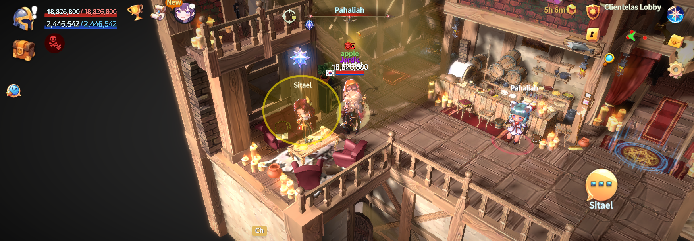

# 🗝️ Create Club



### 🍻 Create Club

This guide is for Adventurers who want to create their own Club.\
It walks you through the Club creation requirements,\
Club option settings, and the full creation process step by step.

***

#### ◾ Club Creation Requirements

* Hero Level **20 or higher** on your account
* Total accumulated [TP](../../beginners-guide/gameplay-guide/training.md) of **5,000 or more**

※ If these requirements are not met, Club creation will be restricted.

***

#### ◾ Club Creation Location

Club creation is available in the [**Clientelas Lobby**](../../field-info/rotten-hill/clientelas-lobby/).

* Tap the **“Clientelas”** button at the top of the Main HUD to move to the Clientelas Lobby.

<figure><figcaption></figcaption></figure>

***

#### ◾ How to Create a Club

1️⃣ **Talk to NPC “Sitael”**\
In the Clientelas Lobby, interact with [**NPC Sitael**](../../field-info/rotten-hill/clientelas-lobby/npc-clientelas.md#sitael-club-coordinator).

<figure><figcaption></figcaption></figure>

2️⃣ **Select Create a Club**\
From Sitael’s menu, select the **“Create a Club”** option.

<figure><figcaption></figcaption></figure>

3️⃣ **Set Club Options**\
Configure the following options:

* **Club Name**\
  Enter the name of your Club.
* **Level Requirement**\
  Set the minimum Hero Level required to join the Club.\
  This value is based on the **highest-level Hero NFT** on your account.
* **Visibility**\
  Set how players can join your Club.
  * **Public Club**: Players can join immediately if requirements are met
  * **Private Club**: Approval from the Club Master is required
* **Mode**\
  Define the purpose of the Club.
  * **War**: A combat-focused Club that can participate in the Holy Grail War\
    (Required for future Club-exclusive content such as Siege Battles)
  * **Social**: A Club focused on interaction and community
  * **Farming**: A Club focused on growth and farming

<figure><figcaption></figcaption></figure>

4️⃣ **Complete Club Creation**\
After configuring all options, tap the **“Apply”** button to create the Club.

***

#### ◾ Club Creation Completion

* Once the Club is created,\
  the Club name will appear above your character in **green text**.
* Move to the warp on the right side of the Clientelas Lobby to enter the **Club Room**.

<figure><figcaption></figcaption></figure>

***

#### ◾ Club Room Information

The Club Room is a private space available only to Club members.\
Inside the Club Room, you will find **NPC “Mahasiah”**,\
who provides access to [**Club Management**](club-management.md) **features**.

<figure><figcaption></figcaption></figure>

***

✨

> **Create your Club,**\
> **and begin a new journey together with your fellow Adventurers.**



### 🍻 클럽 창설하기 (Create Club)

이 가이드는 **클럽을 직접 창설하고 싶은 모험가를 위한 안내 페이지**입니다.\
클럽 창설 조건부터, 클럽 옵션 설정과 창설 완료까지의 과정을 순서대로 확인할 수 있습니다.

***

#### ◾ 클럽 창설 조건

* 계정 내 영웅 레벨 **20 이상**
* 누적 [TP](../../beginners-guide/gameplay-guide/training.md) **5,000 이상**

※ 조건을 충족하지 못할 경우 클럽 창설이 제한됩니다.

***

#### ◾ 클럽 창설 위치 안내

클럽 창설은 [**클리엔텔라스 로비**](../../field-info/rotten-hill/clientelas-lobby/)에서 진행할 수 있습니다.

* 메인 HUD 상단의 **「Clientelas」 버튼**을 터치하여 클리엔텔라스 로비로 이동합니다.

<figure><figcaption></figcaption></figure>

***

#### ◾ 클럽 창설 방법

1️⃣ **NPC ‘시타엘’과 대화**\
클리엔텔라스 로비에서 [**NPC ‘시타엘’**](../../field-info/rotten-hill/clientelas-lobby/npc-clientelas.md#sitael-club-coordinator)에게 말을 겁니다.

<figure><figcaption></figcaption></figure>

2️⃣ **클럽 창설 선택**\
시타엘의 메뉴에서 **‘클럽 창설’** 버튼을 선택합니다.

<figure><figcaption></figcaption></figure>

3️⃣ **클럽 창설 옵션 설정**\
아래 항목을 설정할 수 있습니다.

* **클럽명**\
  생성할 클럽의 이름을 입력합니다.
* **레벨 제한**\
  클럽에 가입할 수 있는 최소 영웅 레벨을 설정합니다.\
  해당 수치는 **계정 내 영웅 NFT 중 최대 레벨**을 기준으로 적용됩니다.
* **공개 여부**\
  클럽의 가입 방식을 설정합니다.
  * 공개 클럽: 조건 충족 시 즉시 가입 가능
  * 비공개 클럽: 클럽 마스터의 승인 필요
* **모드**\
  클럽의 운영 목적을 설정합니다.
  * **전쟁**: 성배 전쟁에 참여 가능한 전투 중심 클럽 (추후 공성전 등 클럽 전용 콘텐츠 이용 가능)
  * **친목**: 교류를 중심으로 한 클럽
  * **파밍**: 성장과 파밍을 중심으로 한 클럽

<figure><figcaption></figcaption></figure>

4️⃣ **클럽 창설 완료**\
모든 설정을 마친 후 **‘승인’** 버튼을 터치하면 클럽 창설이 완료됩니다.

***

#### ◾ 클럽 창설 완료 안내

* 클럽 창설이 완료되면 캐릭터 머리 위에 **녹색 글자로 클럽명**이 표시됩니다.
* 클리엔텔라스 로비 우측의 워프로 이동하면 **클럽 룸**에 입장할 수 있습니다.

<figure><figcaption></figcaption></figure>

***

#### ◾ 클럽 룸 안내

클럽 룸은 클럽원만 이용할 수 있는 전용 공간입니다.\
클럽 룸에는 **NPC ‘마하시아’**&#xAC00; 있으며, 해당 NPC를 통해 [**클럽 관리 기능**](club-management.md)을 이용할 수 있습니다.

<figure><figcaption></figcaption></figure>

***

✨

> **클럽을 창설하고,**\
> **함께할 모험가들과 새로운 여정을 시작해 보세요.**



### 🍻 クラブ創設（Create Club）

このガイドは、**クラブを自ら創設したい冒険者向けの案内ページ**です。\
クラブ創設条件から、クラブオプションの設定、創設完了までの流れを 順を追って確認できます。

***

#### ◾ クラブ創設条件

* アカウント内ヒーローレベル **20以上**
* 累計[TP](../../beginners-guide/gameplay-guide/training.md) **5,000以上**

※ 条件を満たしていない場合、クラブの創設は制限されます。

***

#### ◾ クラブ創設場所の案内

クラブの創設は [**クリエンテラスロビー**](../../field-info/rotten-hill/clientelas-lobby/)で行います。

* メインHUD上部の「Clientelas」ボタンをタップして クリエンテラスロビーへ移動します。

<figure><figcaption></figcaption></figure>

***

#### ◾ クラブ創設方法

1️⃣ **NPC「Sitael（シタエル）」と会話**\
クリエンテラスロビーで [NPC「シタエル」](../../field-info/rotten-hill/clientelas-lobby/npc-clientelas.md#sitael-club-coordinator)に話しかけます。

<figure><figcaption></figcaption></figure>

2️⃣ **クラブ創設を選択**\
シタエルのメニューから「クラブ創設」ボタンを選択します。

<figure><figcaption></figcaption></figure>

3️⃣ **クラブ創設オプション設定**\
以下の項目を設定できます。

* **クラブ名**\
  作成するクラブの名前を入力します。
* **レベル制限**\
  クラブに加入できる最低ヒーローレベルを設定します。\
  この数値は、**アカウント内ヒーローNFTの最大レベル**を基準に適用されます。
* **公開設定**\
  クラブの加入方式を設定します。
  * **公開クラブ**：条件を満たせば即時加入可能
  * **非公開クラブ**：クラブマスターの承認が必要
* **モード**\
  クラブの運営目的を設定します。
  * **戦争**：聖杯戦争に参加可能な戦闘重視クラブ\
    （今後追加予定の攻城戦など、クラブ専用コンテンツに必要）
  * **親睦**：交流を目的としたクラブ
  * **ファーミング**：成長や素材集めを目的としたクラブ

<figure><figcaption></figcaption></figure>

4️⃣ **クラブ創設完了**\
すべての設定を終えた後、「承認」ボタンをタップすると クラブの創設が完了します。

***

#### ◾ クラブ創設完了の案内

* クラブ創設が完了すると、キャラクターの頭上に **緑色の文字でクラブ名**が表示されます。
* クリエンテラスロビー右側のワープから **クラブルーム**へ入場できます。

<figure><figcaption></figcaption></figure>

***

#### ◾ クラブルーム案内

クラブルームは、クラブメンバーのみが利用できる専用空間です。\
クラブルームには **NPC「Mahasiah（マハシア）」**&#x304C;おり、\
このNPCを通じて [**クラブ管理機能**](club-management.md)を利用できます。

<figure><figcaption></figcaption></figure>

***

✨

> **クラブを創設し、**\
> **共に活動する冒険者たちと新たな旅を始めましょう。**



<em>※ This guide was written based on the game status as of January 26, 2026,</em>  <em>and its contents may change with future updates.</em>

