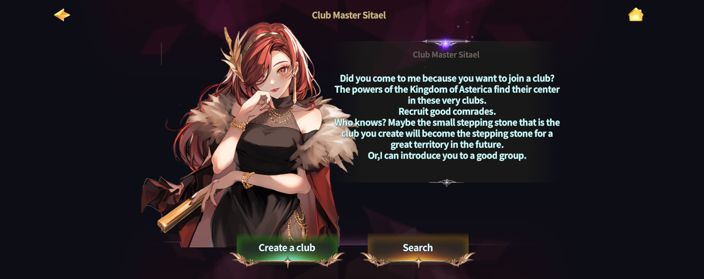
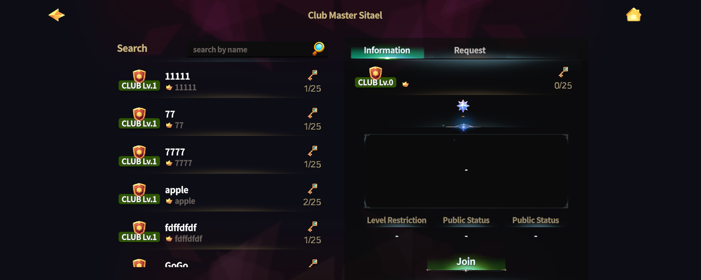
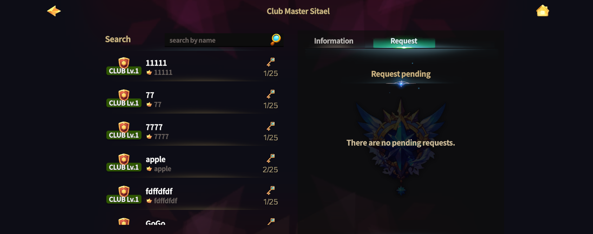

# 🚪 Join Club



### 🍻 Join Club

This guide is for Adventurers who want to join an existing Club.\
It walks you through the Club requirements, how to search for a Club,\
and the full joining process step by step.

***

#### ◾ Club Join Requirements

* Hero Level **15 or higher** on your account
* Total accumulated [TP](../../beginners-guide/gameplay-guide/training.md) of **1,000 or more**

※ If these requirements are not met, joining a Club will be restricted.

***

#### ◾ Club Access Location

Joining a Club is done in the **Clientelas Lobby**.

* Tap the **“Clientelas”** button at the top of the Main HUD to move to the Clientelas Lobby.

<figure><figcaption></figcaption></figure>

***

#### ◾ How to Join a Club

1️⃣ **Talk to** [**NPC “Sitael”**](../../field-info/rotten-hill/clientelas-lobby/npc-clientelas.md#sitael-club-coordinator)\
In the Clientelas Lobby, interact with **NPC Sitael**.

<figure><figcaption></figcaption></figure>

2️⃣ **Select Club Search**\
From Sitael’s menu, select the **“Search”** option.

<figure><figcaption></figcaption></figure>

3️⃣ **Check the Club List**

* Select a Club from the list on the left.
* Review the Club information and join requirements in the right panel.

<figure><figcaption></figcaption></figure>

4️⃣ **Apply to Join a Club**

* **Public Clubs**:\
  If you meet the requirements, you will join immediately.
* **Private Clubs**:\
  Select **“Join”** to send a join request. Approval from the Club Master is required.

For Private Clubs, you can check the status of your request in the **“Requests”** panel.

<figure><figcaption></figcaption></figure>

***

#### ◾ Club Join Completion

* Once you have joined a Club,\
  the Club name will appear above your character in **green text**.
* Move to the warp on the right side of the Clientelas Lobby\
  to enter the **Club Room**.

<figure><figcaption></figcaption></figure>

***

#### ◾ Club Room Information

The Club Room is a private space available only to Club members.\
Here, you can interact with other members and take part in community activities.

<figure><figcaption></figcaption></figure>

***

✨

> **Find a Club that fits you,**\
> **and begin a broader adventure together with your allies.**



### 🍻 Join Club&#x20;

이 가이드는 **기존 클럽에 가입하고 싶은 모험가를 위한 안내 페이지**입니다.\
클럽 가입 조건부터, 클럽 검색 방법과 가입 절차까지 순서대로 확인할 수 있습니다.

***

#### ◾ 클럽 가입 조건

* 계정 내 영웅 레벨 **15 이상**
* 누적 [TP](../../beginners-guide/gameplay-guide/training.md) **1,000 이상**

※ 조건을 충족하지 못할 경우 클럽 가입이 제한됩니다.

***

#### ◾ 클럽 가입 위치 안내

클럽 가입은 **클리엔텔라스 로비**에서 진행할 수 있습니다.

* 메인 HUD 상단의 **「Clientelas」 버튼**을 터치하여 클리엔텔라스 로비로 이동합니다.

<figure><figcaption></figcaption></figure>

***

#### ◾ 클럽 가입 방법

1️⃣ [**NPC ‘시타엘’**](../../field-info/rotten-hill/clientelas-lobby/npc-clientelas.md#sitael-club-coordinator)**과 대화**\
클리엔텔라스 로비에서 **NPC ‘시타엘’**&#xC5D0;게 말을 겁니다.

<figure><figcaption></figcaption></figure>

2️⃣ **클럽 검색 선택**\
시타엘의 메뉴에서 **‘검색하기’** 버튼을 선택합니다.

<figure><figcaption></figcaption></figure>

3️⃣ **클럽 목록 확인**

* 좌측 리스트에서 클럽을 선택합니다.
* 우측 패널에서 클럽 정보와 가입 조건을 확인합니다.

<figure><figcaption></figcaption></figure>

4️⃣ **클럽 가입 신청**

* **공개 클럽**: 가입 조건을 만족하면 즉시 가입됩니다.
* **비공개 클럽**: ‘가입하기’를 선택하면 가입 요청이 전송되며, 클럽 마스터의 승인이 필요합니다.

비공개 클럽의 경우, ‘요청’ 패널에서 가입 요청 상태를 확인할 수 있습니다.

<figure><figcaption></figcaption></figure>

***

#### ◾ 클럽 가입 완료 안내

* 가입이 완료되면 캐릭터 머리 위에 **녹색 글자로 클럽명**이 표시됩니다.
* 클리엔텔라스 로비 우측의 워프로 이동하면 **클럽 룸**에 입장할 수 있습니다.

<figure><figcaption></figcaption></figure>

***

#### ◾ 클럽 룸 안내

클럽 룸은 클럽원만 이용할 수 있는 전용 공간입니다.\
이곳에서 클럽원들과 교류하고 커뮤니티 활동을 진행할 수 있습니다.

<figure><figcaption></figcaption></figure>

***

✨

> **자신에게 맞는 클럽을 찾아 가입하고, 동료들과 함께 더 넓은 모험을 시작해 보세요.**



### 🍻 Join Club

このガイドは、**既存のクラブに加入したい冒険者向けの案内ページ**です。\
クラブ加入条件から、クラブの検索方法、加入手順までを 順を追って確認できます。

***

#### ◾ クラブ加入条件

* アカウント内ヒーローレベル **15以上**
* 累計[TP](../../beginners-guide/gameplay-guide/training.md) **1,000以上**

※ 条件を満たしていない場合、クラブへの加入は制限されます。

***

#### ◾ クラブ加入場所の案内

クラブへの加入は **クリエンテラスロビー**で行います。

* メインHUD上部の「Clientelas」ボタンをタップして クリエンテラスロビーへ移動します。

<figure><figcaption></figcaption></figure>

***

#### ◾ クラブ加入方法

1️⃣ [**NPC「シタエル」**](../../field-info/rotten-hill/clientelas-lobby/npc-clientelas.md#sitael-club-coordinator)**と会話**\
クリエンテラスロビーで NPC「シタエル」に話しかけます。

<figure><figcaption></figcaption></figure>

2️⃣ **クラブ検索を選択**\
シタエルのメニューか&#x3089;**「検索」**&#x30DC;タンを選択します。

<figure><figcaption></figcaption></figure>

3️⃣ **クラブ一覧を確認**

* 左側のリストからクラブを選択します。
* 右側のパネルでクラブ情報と加入条件を確認します。

<figure><figcaption></figcaption></figure>

4️⃣ **クラブ加入申請**

* **公開クラブ**：\
  加入条件を満たしていれば、すぐに加入できます。
* **非公開クラブ**：\
  「加入する」を選択すると加入申請が送信され、クラブマスターの承認が必要です。

非公開クラブの場合、「リクエスト」パネルで申請状況を確認できます。

<figure><figcaption></figcaption></figure>

***

#### ◾ クラブ加入完了の案内

* 加入が完了すると、キャラクターの頭上に **緑色の文字でクラブ名**が表示されます。
* クリエンテラスロビー右側のワープから **クラブルーム**へ入場できます。

<figure><figcaption></figcaption></figure>

***

#### ◾ クラブルーム案内

クラブルームは、クラブメンバーのみが利用できる専用空間です。\
ここでクラブメンバーと交流し、コミュニティ活動を行うことができます。

<figure><figcaption></figcaption></figure>

***

✨

> **自分に合ったクラブに加入し、仲間とともに、より広い冒険を始めましょう。**



<em>※ This guide was written based on the game status as of January 26, 2026,</em>  <em>and its contents may change with future updates.</em>

