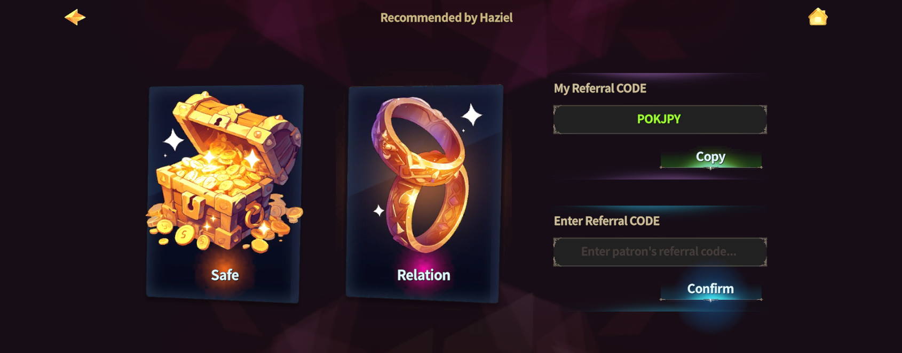

# 🤝 Patron & Client



### 🤝 Patron & Client Guide

The Patron system allows Adventurers to form support relationships with each other\
and earn additional Gold through hunting.

By using a referral code, you can establish a sponsorship relationship\
with other Adventurers.

***

#### ◾ Patron System Overview

* **Patron**: The supporting Adventurer
* **Client**: The supported Adventurer

Once a support relationship is established,\
both parties can earn bonus Gold through hunting.

Patron and Client roles can be set or changed at any time,\
and it is also possible to take on both roles simultaneously.

***

#### ◾ Patron & Client Rewards


**Patron**

* Automatically receives **0.05%** of the Gold earned by supported Clients through hunting.

**Client**

* While a Patron is set, gains an additional **0.5% bonus Gold** when hunting.



#### ◾ System Limitations

Each Patron can support up to **20 Clients**.


***

#### ◾ How to Use the Patron System

1️⃣ **Move to the Clientelas Lobby**

* Tap the **“Clientelas”** button at the top of the Main HUD.

<figure><figcaption></figcaption></figure>

2️⃣ **Find NPC “Haziel”**

* In the Clientelas Lobby, interact with **NPC Haziel**.

<figure><figcaption></figcaption></figure>

3️⃣ **Referral Code & Support Management**

* **Enter Code**: Enter a referral code to establish a support relationship
* **Copy Code**: Copy and share your own referral code
* **Vault**: Collect Gold accumulated through support relationships
* **Relations**: Check your current Patron and Client relationships

<figure><figcaption></figcaption></figure>

***

✨

> **Share referral codes through the community and chat**\
> **to efficiently increase your Gold earnings.**



### 🤝 Patron & Client 가이드

페이트론 시스템은 모험가 간 지지 및 후원 관계를 설정하고,\
사냥을 통해 추가 골드를 획득할 수 있는 시스템입니다.

레퍼럴 코드를 사용해 다른 모험가와 후원 관계를 맺을 수 있습니다.

***

#### ◾ 페이트론 시스템 개요

* **페이트론(Patron)** : 후원자 역할
* **클라이언트(Client)** : 지지자 역할

후원 관계가 설정되면 사냥을 통해 추가 골드 보너스를 획득할 수 있습니다.

페이트론과 클라이언트는 언제든 설정 및 변경이 가능하며,\
두 역할을 동시에 수행할 수도 있습니다.

***

#### ◾ 페이트론 & 클라이언트 보상


**페이트론(Patron)**

* 후원 중인 클라이언트가 사냥으로 획득한 골드의 **0.05%가 자동으로 적립**됩니다.

**클라이언트(Client)**

* 페이트론을 설정한 상태에서 사냥 시 **획득 골드의 0.5%를 추가로 획득**합니다.



#### ◾ 시스템 이용 제한

페이트론 1명당 최대 **20명의 클라이언트**를 설정할 수 있습니다.


***

#### ◾ 페이트론 시스템 이용 방법

1️⃣ **클리엔텔라스 로비 이동**

* 메인 HUD 상단의 **「Clientelas」 버튼**을 터치합니다.

<figure><figcaption></figcaption></figure>

2️⃣ **NPC ‘하지엘’ 찾기**

* 클리엔텔라스 로비에서 NPC ‘하지엘’에게 말을 겁니다.

<figure><figcaption></figcaption></figure>

3️⃣ **레퍼럴 코드 및 후원 관리**

* **코드 입력** : 레퍼럴 코드를 입력하여 후원 관계 설정
* **코드 복사** : 자신의 레퍼럴 코드 복사 및 공유
* **금고** : 후원 관계로 적립된 골드 수령
* **관계** : 현재 설정된 후원 관계 확인

<figure><figcaption></figcaption></figure>

***

✨

> **커뮤니티 및 채팅을 통해 레퍼럴 코드를 공유하여 효율적인 골드 획득이 가능합니다.**



### 🤝 パトロン＆クライアントガイド

パトロンシステムは、冒険者同士が支援・後援関係を結び、\
狩りを通じて追加ゴールドを獲得できるシステムです。

紹介コード（リファラルコード）を使用することで、\
他の冒険者と後援関係を結ぶことができます。

***

#### ◾ パトロンシステム概要

* **パトロン（Patron）**：支援する側の冒険者
* **クライアント（Client）**：支援を受ける側の冒険者

後援関係が設定されると、狩りによって追加のゴールドボーナスを獲得できます。

パトロンとクライアントは、いつでも設定・変更が可能で、\
両方の役割を同時に担うこともできます。

***

#### ◾ パトロン＆クライアント報酬



**パトロン（Patron）**

* 支援しているクライアントが狩りで獲得したゴールドの**0.05％**&#x304C;自動的に蓄積されます。

**クライアント（Client）**

* パトロンを設定した状態で狩りを行うと、獲得ゴールドの**0.5％**&#x3092;追加で獲得できます。



#### ◾ システム利用制限

パトロン1人につき、最大**20人のクライアント**を設定できます。


***

#### ◾ パトロンシステムの利用方法

1️⃣ **クリエンテラスロビーへ移動**

* メインHUD上部&#x306E;**「Clientelas」ボタン**をタップします。

<figure><figcaption></figcaption></figure>

2️⃣ **NPC「Haziel」を探す**

* クリエンテラスロビーで、NPC「Haziel」に話しかけます。

<figure><figcaption></figcaption></figure>

3️⃣ **紹介コード・後援管理**

* **コード入力**：紹介コードを入力して後援関係を設定
* **コードコピー**：自分の紹介コードをコピーして共有
* **金庫**：後援関係で蓄積されたゴールドを受け取る
* **関係**：現在設定されている後援関係を確認

<figure><figcaption></figcaption></figure>

***

✨

> **コミュニティやチャットで紹介コードを共有し、効率よくゴールドを獲得しましょう。**



<em>※ This guide was written based on the game status as of January 26, 2026,</em>  <em>and its contents may change with future updates.</em>

