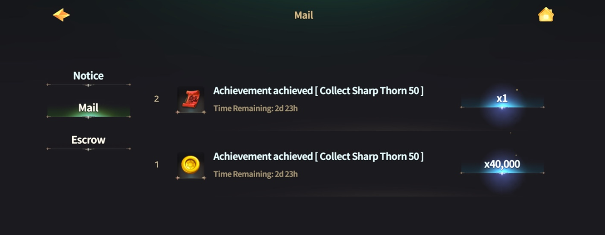

# 🥇 Achievement

<figure><figcaption></figcaption></figure>



💡 **Complete achievements and claim valuable rewards!**

As you **hunt and engage in PvP battles** in EXTOCIUM, you will naturally progress through various achievements.\
By steadily completing achievements from the beginning of your journey, you can **earn a variety of useful items** to aid your gameplay!

### 🎯 Accessing the Achievements Menu

👉 Tap the **Guide button at the top of the main HUD** to access the achievements menu.

<figure><figcaption></figcaption></figure>

👉 Select the **'Achievements' tab** to view the list of available achievements.

<figure><figcaption></figcaption></figure>

### 🎁 Claiming Achievement Rewards

👉 Once you meet the achievement requirements, the **'Receive' button** will become available.

<figure><figcaption></figcaption></figure>

👉 Tap the **'Receive' button** to receive your rewards.

<figure><figcaption></figcaption></figure>

👉 **Rewards can be collected from the 'Mailbox'.**

<figure><figcaption></figcaption></figure>

🏆 **Complete achievements and enjoy a variety of rewards!**



💡 **업적을 달성하고 푸짐한 보상을 받아가세요!**

EXTOCIUM에서 **사냥과 PvP를 즐기는 것만으로도** 다양한 업적을 달성할 수 있습니다.\
게임을 시작하면서 차근차근 업적을 해결해 나가면, **게임 플레이에 도움이 되는 다양한 아이템**을 보상으로 획득할 수 있습니다!

### 🎯 **업적 메뉴 접근 방법**

👉 **메인 HUD 상단의 가이드 버튼**을 터치하면 업적 메뉴에 접근할 수 있습니다.

<figure><figcaption></figcaption></figure>

👉 **'업적' 탭을 터치**하면 업적 목록이 표시됩니다.

<figure><figcaption></figcaption></figure>

### 🎁 **업적 보상 받기**

👉 업적 조건을 충족하면 **'받기' 버튼**이 활성화됩니다.

<figure><figcaption></figcaption></figure>

👉 **'받기' 버튼을 터치하여 보상을 수령**하세요.

<figure><figcaption></figcaption></figure>

👉 **획득한 보상은 '우편함'에서 확인**할 수 있습니다.

<figure><figcaption></figcaption></figure>

🏆 **업적을 달성하고 다양한 보상을 받아보세요!**



💡 **業績を達成し、貴重な報酬を獲得しましょう！**

EXTOCIUMで**狩猟やPvPを楽しむだけで**、さまざまな業績を達成できます。\
ゲームを始めたばかりの頃から業績を達成していくことで、**プレイに役立つさまざまなアイテム**を報酬として獲得できます！

### 🎯 業績メニューのアクセス方法

👉 **メインHUD上部のガイドボタン** をタップすると、業績メニューにアクセスできます。

<figure><figcaption></figcaption></figure>

👉 **「業績」タブ** をタップすると、業績一覧が表示されます。

<figure><figcaption></figcaption></figure>

### 🎁 業績報酬の受け取り

👉 業績条件を達成すると、**「受け取る」ボタン** が有効になります。

<figure><figcaption></figcaption></figure>

👉 **「受け取る」ボタンをタップして報酬を獲得** してください。

<figure><figcaption></figcaption></figure>

👉 **獲得した報酬は「郵便箱」で確認できます。**

<figure><figcaption></figcaption></figure>

🏆 **業績を達成して、さまざまな報酬を手に入れましょう！**


