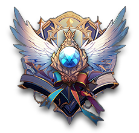
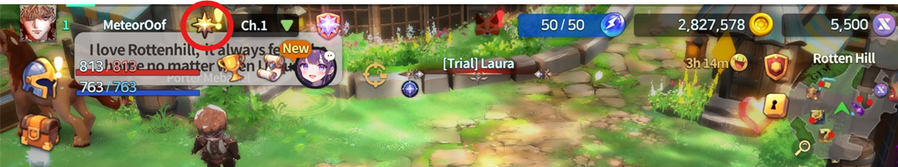
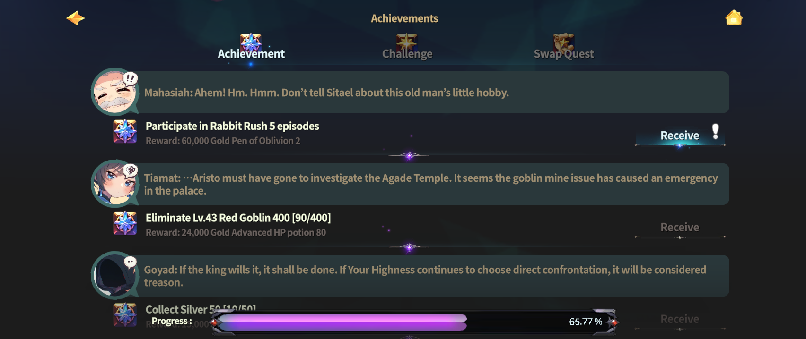
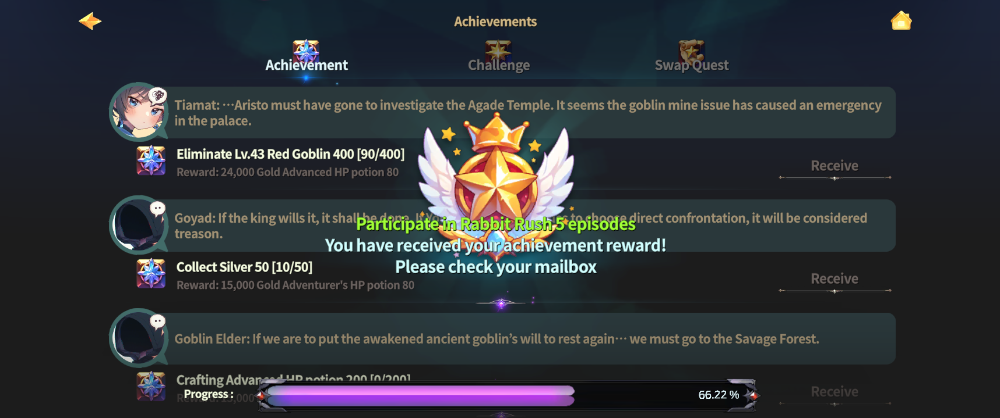
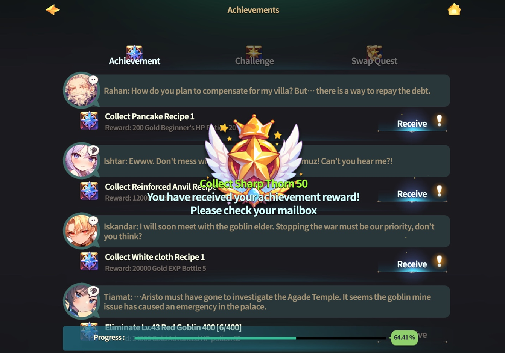

# 🥇 Achievement

<figure><figcaption></figcaption></figure>



### 🏆 Achievements Guide

Achievements are goal-based content that can be **naturally completed** as you play through hunting, combat, and various activities in EXTOCIUM.\
By completing achievements, \
you can earn **valuable rewards** that support your overall progression.

***

### ◾ How to Access the Achievements Menu

You can check your achievements by following the steps below.

1️⃣ Tap the **scroll-shaped icon** at the top of the main screen.

<figure><figcaption></figcaption></figure>

2️⃣ When the menu opens, select the **\[Achievements] tab**.

<figure><figcaption></figcaption></figure>

***

### ◾ How to Claim Achievement Rewards

Once an achievement’s requirements are met, you can claim its reward.

1️⃣ Tap the **\[Receive]** button to receive the achievement reward.

<figure><figcaption></figcaption></figure>

2️⃣ Claimed rewards are delivered to your **Mailbox**.

<figure><figcaption></figcaption></figure>

***

✨

> **Achievements are completed naturally as part of your journey through the game.**\
> **Each achievement you earn becomes a resource that supports your growth**\
> **and leads you toward your next adventure.**



### 🏆 업적 가이드

업적은 사냥, 전투, 다양한 콘텐츠를 플레이하며 자연스럽게 달성할 수 있는 목표 콘텐츠입니다.\
업적을 달성하면 게임 플레이에 도움이 되는 다양한 보상을 획득할 수 있습니다.

***

### ◾ 업적 메뉴 접근 방법

업적은 아래 순서로 확인할 수 있습니다.

1️⃣ **메인 화면 상단의 두루마리 모양 아이콘**을 터치합니다.

<figure><figcaption></figcaption></figure>

2️⃣ 메뉴가 열리면 **\[업적] 탭**을 선택합니다.

<figure><figcaption></figcaption></figure>

***

### ◾ 업적 보상 받는 방법

업적 조건을 충족하면 보상을 받을 수 있습니다.

1️⃣ **\[받기] 버튼**을 터치하면 업적 보상을 획득할 수 있습니다.

<figure><figcaption></figcaption></figure>

2️⃣ 획득한 보상은 **우편함**으로 지급됩니다.

<figure><figcaption></figcaption></figure>

***

✨

> **업적은 게임을 플레이하는 과정 속에서 자연스럽게 완성됩니다.**\
> **차근차근 쌓아 올린 업적 하나하나가, 모험에 필요한 자원이 되어 다음 여정을 이끌어 줍니다.**



### 🏆 実績ガイド

実績は、狩りや戦闘、さまざまなコンテンツをプレイする中で\
**自然に達成できる目標型コンテンツ**です。

実績を達成すると、ゲームプレイに役立つ **さまざまな報酬** を獲得できます。

***

### ◾ 実績メニューへのアクセス方法

実績は、以下の手順で確認できます。

1️⃣ メイン画面上部の **巻物型アイコン** をタップします。

<figure><figcaption></figcaption></figure>

2️⃣ メニューが開いたら、**［実績］タブ** を選択します。

<figure><figcaption></figcaption></figure>

***

### ◾ 実績報酬の受け取り方

実績条件を満たすと、報酬を受け取ることができます。

1️⃣ **［受け取る］ボタン** をタップすると、実績報酬を獲得できます。

<figure><figcaption></figcaption></figure>

2️⃣ 獲得した報酬は、**メールボックス** に送られます。

<figure><figcaption></figcaption></figure>

***

✨

> **実績は、ゲームを進める中で 自然と積み重なっていきます。**\
> **一つひとつ達成した実績が、次の冒険へ進むための力となります。**



<em>※ This guide was written based on the game status as of January 20, 2026,</em>  <em>and its contents may change with future updates.</em>

