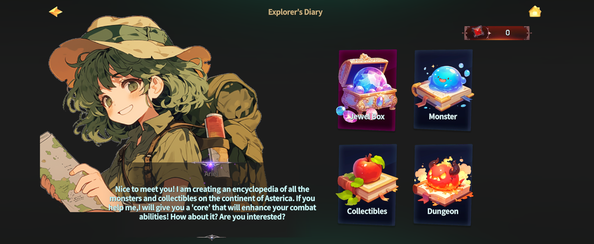
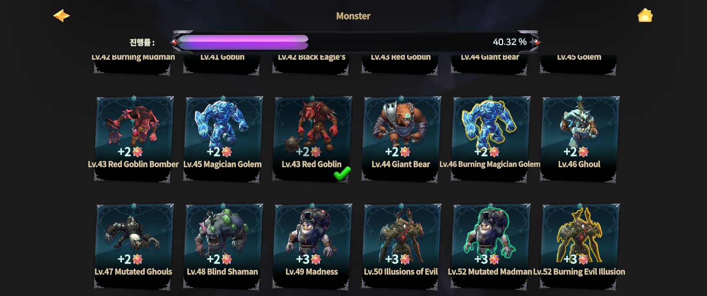
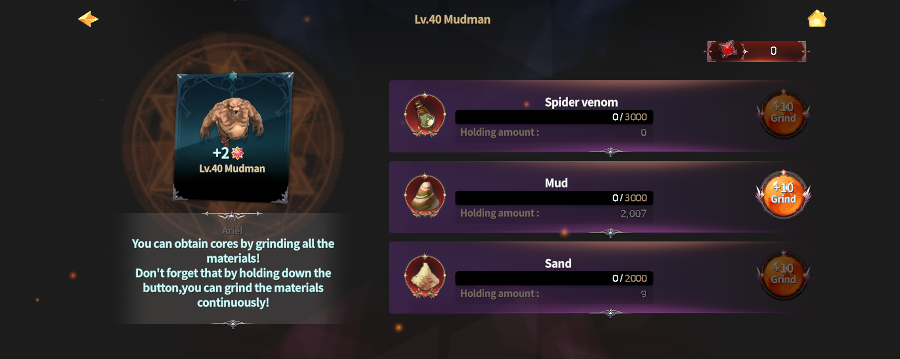
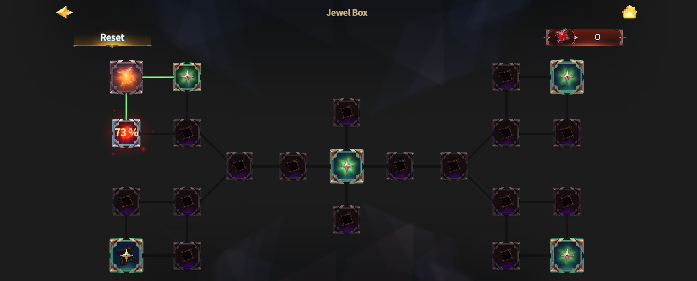
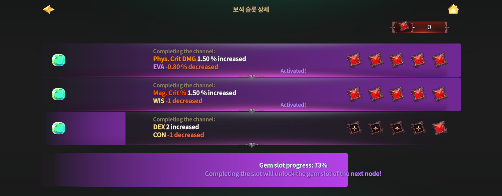

# 📓 Explorer's Diary

<figure><figcaption></figcaption></figure>



### 📔 Explorer’s Diary Guide

The Explorer’s Diary is a **progression content** where you record\
monsters and gatherables encountered across the continent of **Asterica**,\
build completion, and gain **bonus stats**.

You can start the Explorer’s Diary by talking to the NPC **Arial**, who appears in the field.

<figure><figcaption></figcaption></figure>

***

### ◾ How the Explorer’s Diary Works

The Explorer’s Diary progresses in the following steps.

#### 1️⃣ Select a Target

In the Explorer’s Diary, select one of the categories: **Monsters / Gathering / Dungeons**.

You can view a list of recordable targets,\
and tap each entry to check information about the selected monster or gatherable.

<figure><figcaption></figcaption></figure>

***

#### 2️⃣ Check Required Items

After selecting a target, a list of **items required to complete that entry** will be displayed.\
These items can be obtained naturally through hunting monsters or gathering resources.

<figure><figcaption></figcaption></figure>

***

#### 3️⃣ Register Items in the Diary

Once you have collected all required items, \
register (grind) them in the Explorer’s Diary to complete the entry.

When an entry is completed, you receive **Core** as a reward.

<figure><figcaption></figcaption></figure>

***

### ◾ What Is a Core?

Cores are a **key progression resource** used in the **Jewel Box** system.

<figure><figcaption></figcaption></figure>

***

### ◾ Jewel Box System Overview

The Jewel Box contains multiple **stat node slots**.

Each slot may include the following effects:

* Stat bonuses that enhance attributes such as **Phys. DMG** or **HP**
* Some slots may include **penalty effects**

<figure><figcaption></figcaption></figure>

***

### ◾ Jewel Slot Rules

* You must **fully fill a stat node** to unlock the slots connected to the next node.
* Progression efficiency can vary greatly depending on how nodes are configured.
* Using Cores **strategically** is important.

***

### ◾ Tips for Using the Explorer’s Diary

* In the early stages, it is recommended to **collect items in advance**.\
  This allows you to complete the Diary more quickly later.
* Instead of spending Cores immediately,\
  invest them carefully according to your character’s **build and progression direction**.

***

✨

> **The Explorer’s Diary is a long-term progression content**\
> **that gradually strengthens your character through exploration and record-keeping.**
>
> **Each record you complete in the Diary** \
> **directly contributes to your growth as an adventurer.**



### 📔 탐험가 다이어리 가이드

탐험가 다이어리는 아스테리카 대륙에서 만나는 **몬스터와 채집물**을 기록하고,\
완성도를 쌓아 **추가 능력치(보너스 스탯)**&#xB97C; 획득할 수 있는 성장형 콘텐츠입니다.

필드에 먼저 나와 있는 NPC **에리얼**과 대화하면, 탐험가 다이어리를 시작할 수 있습니다.

<figure><figcaption></figcaption></figure>

***

### ◾ 탐험가 다이어리 진행 방법

탐험가 다이어리는 아래 순서로 진행됩니다.

#### 1️⃣ 대상 발견하기

탐험가 다이어리에서 **몬스터 / 채집 / 던전** 항목을 선택하면, 기록할 수 있는 대상 목록을 확인할 수 있습니다.\
각 항목을 터치하면 해당 몬스터나 채집물의 정보를 확인할 수 있습니다.

<figure><figcaption></figcaption></figure>

***

#### 2️⃣ 필요한 아이템 확인하기

대상을 선택하면, 해당 항목을 완성하기 위해 **등록해야 할 아이템 목록**이 표시됩니다.\
이 아이템들은 사냥이나 채집을 진행하며 자연스럽게 획득할 수 있습니다.

<figure><figcaption></figcaption></figure>

***

#### 3️⃣ 다이어리에 등록하기

필요한 아이템을 모두 모았다면, 탐험가 다이어리에 **등록(갈아넣기)**&#xD558;여 해당 항목을 완성할 수 있습니다.\
항목이 완성되면, 보상으로 **코어(Core)**&#xB97C; 획득할 수 있습니다.

<figure><figcaption></figcaption></figure>

***

### ◾ 코어(Core)란?

코어는 **보석함(Jewel Box)** 시스템에서 사용하는 주요 성장 재화입니다.

<figure><figcaption></figcaption></figure>

***

### ◾ 보석함 시스템 안내

보석함에는 여러 개의 **스탯 노드 슬롯**이 존재합니다.

각 슬롯에는 다음과 같은 효과가 포함되어 있습니다.

* 물리 데미지, 체력 등 **능력치를 강화하는 스탯 효과**
* 일부 슬롯에는 **패널티 효과**가 포함될 수 있습니다.

<figure><figcaption></figcaption></figure>

***

### ◾ 보석 슬롯 이용 규칙

* 하나의 스탯 노드를 **모두 채워야**, 다음 노드와 연결된 슬롯이 개방됩니다.
* 노드 구성에 따라 성장 효율이 크게 달라질 수 있습니다.
* 코어는 **전략적으로 사용**하는 것이 중요합니다.

***

### ◾ 탐험가 다이어리 활용 팁

* 콘텐츠 초반에는 드롭 아이템을 **미리 모아두는 것을 추천**합니다.\
  이후 다이어리를 빠르게 완성할 수 있습니다.
* 코어는 무작정 사용하기보다, **캐릭터의 성장 방향과 빌드**에 맞춰 신중하게 투자해 주세요.

***

✨

> **탐험가 다이어리는 탐험과 기록을 통해 모험가의 능력을 차근차근 강화해 나가는** \
> **장기 성장 콘텐츠입니다.**\
> **다이어리에 남긴 기록 하나하나가 모험가의 성장으로 이어집니다.**



### 📔 探検家ダイアリー ガイド

探検家ダイアリーは、アステリカ大陸で出会う **モンスターや採集物** を記録し、\
完成度を高めることで **追加能力値（ボーナスステータス）** を獲得できる 成長型コンテンツです。

フィールドに登場しているNPC **エアリエル** と会話すると、探検家ダイアリーを開始できます。

<figure><figcaption></figcaption></figure>

***

### ◾ 探検家ダイアリーの進め方

探検家ダイアリーは、以下の手順で進行します。

#### 1️⃣ 対象を確認する

探検家ダイアリーで **モンスター / 採集 / ダンジョン** の項目を選択すると、\
記録可能な対象一覧を確認できます。\
各項目をタップすると、対象となるモンスターや採集物の情報を確認できます。

<figure><figcaption></figcaption></figure>

***

#### 2️⃣ 必要なアイテムを確認する

対象を選択すると、その項目を完成させるために **登録が必要なアイテム一覧** が表示されます。\
これらのアイテムは、狩りや採集を行う中で 自然に入手することができます。

<figure><figcaption></figcaption></figure>

***

#### 3️⃣ ダイアリーに登録する

必要なアイテムをすべて揃えたら、探検家ダイアリーに **登録（消費）** して\
対象項目を完成させることができます。\
項目を完成させると、報酬として **コア（Core）** を獲得できます。

<figure><figcaption></figcaption></figure>

***

### ◾ コア（Core）とは？

コアは、**宝石箱（Jewel Box）** システムで使用される 主要な成長用リソースです。

<figure><figcaption></figcaption></figure>

***

### ◾ 宝石箱システムについて

宝石箱には、複数の **ステータスノードスロット** が存在します。

各スロットには、以下のような効果が含まれています。

* **物理DMG** **や HP** **など**、能力値を強化するステータス効果
* 一部のスロットには **ペナルティ効果** が含まれる場合があります

<figure><figcaption></figcaption></figure>

***

### ◾ 宝石スロットの利用ルール

* 1つのステータスノードを **すべて埋めることで**、\
  次のノードと接続されたスロットが解放されます。
* ノードの構成によって、成長効率は大きく変わります。
* コアは **戦略的に使用することが重要** です。

***

### ◾ 探検家ダイアリー活用のヒント

* コンテンツ序盤では、アイテムを **あらかじめ集めておくこと** をおすすめします。\
  その後、ダイアリーをより早く完成させることができます。
* コアは無計画に使用せず、\
  キャラクターの **成長方針やビルド** に合わせて 慎重に投資してください。

***

✨

> **探検家ダイアリーは、**\
> **探索と記録を通じて 冒険者の能力を少しずつ強化していく 長期成長コンテンツ です。**
>
> **ダイアリーに残した一つひとつの記録が、冒険者自身の成長へとつながっていきます。**



<em>※ This guide was written based on the game status as of January 19, 2026,</em>  <em>and its contents may change with future updates.</em>

