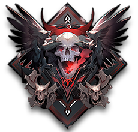

# 😈 Field Raid

<figure><figcaption></figcaption></figure>



💡**In each field, there is a field boss that appears at specific times.**&#x20;

We call this the Field Raid system. The boss is very powerful, so you need to work together with others to defeat it.

Each field boss has unique materials that only it drops.

When you defeat the boss, the reward is determined by calculating the percentage of total damage dealt to the boss.

<table><thead><tr><th width="122" align="center">Item Pool</th><th align="center">Achievement conditions - 달성 조건 - 達成条件</th></tr></thead><tbody><tr><td align="center">1</td><td align="center">Damage over 35% - 데미지 35% 이상 - ダメージ 35% 以上</td></tr><tr><td align="center">2</td><td align="center">Damage less than 35% - 데미지 35% 미만 - ダメージ 35% 未満</td></tr><tr><td align="center">3</td><td align="center">Damage less than 30% -  데미지 30% 미만 - ダメージ 30% 未満</td></tr><tr><td align="center">4</td><td align="center">Damage less than 15% - 데미지 15% 미만 - ダメージ 15% 未満</td></tr><tr><td align="center">5</td><td align="center">Damage less than 10% - 데미지 10% 미만 - ダメージ 10% 未満</td></tr><tr><td align="center">6</td><td align="center">Damage less than 5% - 데미지 5% 미만 - ダメージ 5% 未満</td></tr><tr><td align="center">7</td><td align="center">Damage less than 3% - 데미지 3% 미만 - ダメージ 3% 未満</td></tr><tr><td align="center">8</td><td align="center">Damage less than 2% - 데미지 2% 미만 - ダメージ 2% 未満</td></tr></tbody></table>

<figure><figcaption></figcaption></figure>

<figure><figcaption></figcaption></figure>

When a boss appears in the field you're hunting in, an alert will appear on the screen, as shown in the image above.

<figure><figcaption></figcaption></figure>

Alternatively, you can check the remaining time until the boss appears at the top-left corner of each field slot on the world map.



💡**각 필드에는 특정 시간에 나타나는 필드 보스가 있습니다.**&#x20;

우리는 이것을 필드 레이드 시스템이라고 부릅니다. 보스가 워낙 강해서 사람들과 함께 죽여야 합니다.

각 필드 보스는 자신만이 드롭할 수 있는 고유한 재료를 가지고 있습니다.

보스를 처치하면 보스에게 입힌 총 데미지의 백분율을 계산하여 보상이 결정됩니다.

<table><thead><tr><th width="122" align="center">Item Pool</th><th align="center">Achievement conditions - 달성 조건 - 達成条件</th></tr></thead><tbody><tr><td align="center">1</td><td align="center">Damage over 35% - 데미지 35% 이상 - ダメージ 35% 以上</td></tr><tr><td align="center">2</td><td align="center">Damage less than 35% - 데미지 35% 미만 - ダメージ 35% 未満</td></tr><tr><td align="center">3</td><td align="center">Damage less than 30% -  데미지 30% 미만 - ダメージ 30% 未満</td></tr><tr><td align="center">4</td><td align="center">Damage less than 15% - 데미지 15% 미만 - ダメージ 15% 未満</td></tr><tr><td align="center">5</td><td align="center">Damage less than 10% - 데미지 10% 미만 - ダメージ 10% 未満</td></tr><tr><td align="center">6</td><td align="center">Damage less than 5% - 데미지 5% 미만 - ダメージ 5% 未満</td></tr><tr><td align="center">7</td><td align="center">Damage less than 3% - 데미지 3% 미만 - ダメージ 3% 未満</td></tr><tr><td align="center">8</td><td align="center">Damage less than 2% - 데미지 2% 미만 - ダメージ 2% 未満</td></tr></tbody></table>

<figure><figcaption></figcaption></figure>

<figure><figcaption></figcaption></figure>

사냥 중인 필드에 보스가 나타나면 위 이미지와 같이 화면에 알림이 뜹니다.

<figure><figcaption></figcaption></figure>

또는 월드맵의 각 필드 슬롯 좌측 상단에서 보스가 등장하기까지 남은 시간을 확인할 수 있습니다.



💡**各フィールドには、特定の時間に表示されるフィールド ボスがいます。**&#x20;

私たちはこれをフィールドレイドシステムと呼びます。 ボスがあまりにも強くて人々と一緒に殺さなければなりません。

各フィールドボスは、自分だけがドロップできる固有の材料を持っています。

ボスを処置すると、ボスに着せた総ダメージのパーセンテージを計算して報酬が決まります。

<table><thead><tr><th width="122" align="center">Item Pool</th><th align="center">Achievement conditions - 달성 조건 - 達成条件</th></tr></thead><tbody><tr><td align="center">1</td><td align="center">Damage over 35% - 데미지 35% 이상 - ダメージ 35% 以上</td></tr><tr><td align="center">2</td><td align="center">Damage less than 35% - 데미지 35% 미만 - ダメージ 35% 未満</td></tr><tr><td align="center">3</td><td align="center">Damage less than 30% -  데미지 30% 미만 - ダメージ 30% 未満</td></tr><tr><td align="center">4</td><td align="center">Damage less than 15% - 데미지 15% 미만 - ダメージ 15% 未満</td></tr><tr><td align="center">5</td><td align="center">Damage less than 10% - 데미지 10% 미만 - ダメージ 10% 未満</td></tr><tr><td align="center">6</td><td align="center">Damage less than 5% - 데미지 5% 미만 - ダメージ 5% 未満</td></tr><tr><td align="center">7</td><td align="center">Damage less than 3% - 데미지 3% 미만 - ダメージ 3% 未満</td></tr><tr><td align="center">8</td><td align="center">Damage less than 2% - 데미지 2% 미만 - ダメージ 2% 未満</td></tr></tbody></table>

<figure><figcaption></figcaption></figure>

<figure><figcaption></figcaption></figure>

狩り中のフィールドにボスが現れましたら 上記の画像のように画面に通知が表示されます。

<figure><figcaption></figcaption></figure>

または、ワールドマップの各フィールドスロット左上からボスが登場するまでの残り時間を確認できます。



\-
