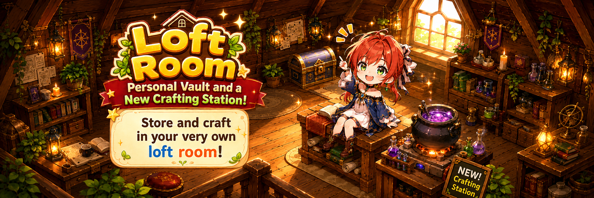

# 🏠 Loft Room

<figure><figcaption></figcaption></figure>



### 🏠 Loft Room Guide

Loft Room is a **personal space** available to adventurers.\
By unlocking the **attic located in Rotten hill**, you can access all My Home features.

***

### ◾ Loft Room Unlock Requirements

You can unlock the attic by meeting the following condition:

* Reach **Level 21** with at least one Hero in your account

***

### ◾ How to Unlock Loft Room

1️⃣ Move to the attic location in **Rotten hill** and tap the **\[Loft Room]** button.

<figure><figcaption></figcaption></figure>

2️⃣ Use the items below to unlock the attic.

<figure><figcaption></figcaption></figure>


#### 🔑 Required Items

* Gold × 1,000
* Apple × 40
* Strawberry × 40
* Wood × 30


***

### ◾ Inside the Loft Room

When you enter the attic for the first time,\
you can check the various facilities available in Loft Room.\
The following features are available in Loft Room:

👇 A **training space** you can access through a portal in Loft Room.\
You can freely switch between different Heroes and weapons\
to test combat performance.


[the-rooftop-hollow.md](the-rooftop-hollow.md)


👇 A **furnace facility** where you can process materials obtained during your adventures.


[furnace.md](furnace.md)


👇 A **worktable** used to unlock **\[Locked] NFT weapons**.


[runebreakers-worktable.md](runebreakers-worktable.md)


👇 A **personal safe** where you can securely store your items.


[personal-safe.md](personal-safe.md)


Each facility is a core feature of Loft Room,\
and you can check detailed usage instructions through each menu.

***

✨

> **Loft Room is more than just a place to rest.**\
> **It is a central hub designed to make your adventures more efficient—**\
> **from combat preparation and item management**\
> **to unlocking special equipment.**
>
> **Make the most of Loft Room and get ready for your next adventure.**



### 🏠 Loft Room 가이드

로프트룸은 모험가가 사용할 수 있는 **개인 전용 공간**입니다.\
로튼힐에 위치한 **로프트룸을 개방**하면 마이홈 기능을 이용할 수 있습니다.

***

### ◾ 로프트룸 잠금 해제 조건

아래 조건을 만족하면 로프트룸을 잠금 해제할 수 있습니다.

* 계정 내 영웅 중 **최대 레벨 21 달성**

***

### ◾ 로프트룸 잠금 해제 방법

1️⃣ 로튼힐에서 로프트룸이 있는 위치로 이동한 후 **\[마이홈] 버튼**을 터치합니다.

<figure><figcaption></figcaption></figure>

2️⃣ 아래 아이템을 사용하면 로프트룸을 잠금 해제할 수 있습니다.

<figure><figcaption></figcaption></figure>


#### 🔑 잠금 해제에 필요한 아이템

* 골드 × 1,000
* 사과 × 40
* 딸기 × 40
* 목재 × 30


***

### ◾ 로프트룸 내부 안내

로프트룸에 처음 입장하면, 로프트룸에서 이용할 수 있는 **다양한 시설**을 확인할 수 있습니다.\
로프트룸에는 다음과 같은 기능이 준비되어 있습니다.

👇 로프트룸에서 포털을 통해 이동할 수 있는 **연습 공간**입니다.\
여러 영웅과 무기를 자유롭게 변경하며 전투 성능을 시험할 수 있습니다.


[the-rooftop-hollow.md](the-rooftop-hollow.md)


👇 모험 중 획득한 재료를 가공할 수 있는 **화로 시설**입니다.


[furnace.md](furnace.md)


👇 **\[잠금] 상태의 NFT 무기**를 해금할 수 있는 작업대입니다.


[runebreakers-worktable.md](runebreakers-worktable.md)


👇 아이템을 안전하게 보관할 수 있는 **개인 전용 금고**입니다.


[personal-safe.md](personal-safe.md)


각 시설은 로프트룸의 핵심 기능으로, 해당 메뉴를 통해 **자세한 이용 방법을 확인**할 수 있습니다.

***

✨

> **로프트룸은 단순한 휴식 공간이 아닙니다.**\
> **전투 준비, 아이템 관리, 특수 장비 해금 등 모험을 더욱 효율적으로 만들기 위한 중심 공간입니다.**
>
> **로프트룸을 잘 활용해 다음 모험을 준비해 보세요.**



### 🏠 マイホーム ガイド

マイホームは、冒険者が利用できる **個人専用の空間**です。\
ロッテンヒルにある **屋根裏部屋** を解放すると、マイホーム機能を利用できるようになります。

***

### ◾ マイホーム 解放条件

以下の条件を満たすと、屋根裏部屋を解放できます。

* アカウント内の英雄のうち、**いずれか1体がレベル21に到達**

***

### ◾ マイホーム 解放方法

1️⃣ ロッテンヒルで屋根裏部屋のある場所へ移動し、**［マイホーム］ボタン**をタップします。

<figure><figcaption></figcaption></figure>

2️⃣ 以下のアイテムを使用すると、屋根裏部屋を解放できます。

<figure><figcaption></figcaption></figure>


#### 🔑 解放に必要なアイテム

* ゴールド × 1,000
* りんご × 40
* いちご × 40
* 木材 × 30


***

### ◾ 屋根裏部屋 内部案内

屋根裏部屋に初めて入ると、マイホームで利用できる **さまざまな施設** を確認できます。\
マイホームには、以下の機能が用意されています。

👇 マイホーム内のポータルから移動できる **訓練スペース** です。\
複数の英雄や武器を自由に切り替えて、戦闘性能を試すことができます。


[the-rooftop-hollow.md](the-rooftop-hollow.md)


👇 冒険中に獲得した素材を加工できる **炉（ファーネス）施設**です。


[furnace.md](furnace.md)


👇 **［ロック］状態のNFT武器**を解放できる **作業台**です。


[runebreakers-worktable.md](runebreakers-worktable.md)


👇 アイテムを安全に保管できる **個人専用の金庫**です。


[personal-safe.md](personal-safe.md)


各施設はマイホームの主要な機能であり、\
それぞれのメニューから **詳しい利用方法を確認**できます。

***

✨

> **マイホームは、ただ休むだけの場所ではありません。**\
> **戦闘準備、アイテム管理、特別な装備の解放など、**\
> **冒険をより効率的に進めるための 中心となる空間 です。**
>
> **マイホームを活用して、次の冒険に備えましょう。**



<em>※ This guide was written based on the game status as of January 19, 2026,</em>  <em>and its contents may change with future updates.</em>

