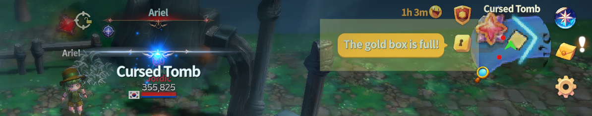
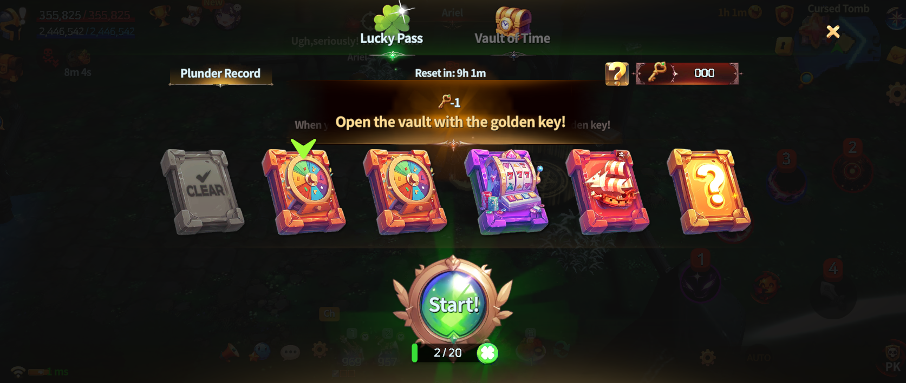

# 🪙 Gold Box

<figure><figcaption></figcaption></figure>



### 💰 Gold Box Guide

The Gold Box is a **bonus reward system** where a portion of the Gold you earn from hunting monsters is **automatically accumulated**.

When you obtain Gold through hunting,\
bonus Gold will be added to the Gold Box **once certain conditions are met**, instead of being given immediately.

***

### ◾ How Gold Box Accumulates

* When you defeat a monster and obtain **5 Gold or more in a single drop**,\
  bonus Gold is added to the Gold Box.
* Accumulated Gold is **not granted immediately** and is stored inside the Gold Box.

***

### ◾ Opening the Gold Box

Once the Gold Box becomes full,\
you can open it using a **Golden Key** obtained through Lucky Pass.

* When the Gold Box is full,\
  a notification will appear on the **top-right of the Main HUD**.

<figure><figcaption></figcaption></figure>

* Enter the **Lucky Pass menu** to activate the **Open Gold Box** button.
* If you have a Golden Key, tap the button to **claim the stored Gold**.

<figure><figcaption></figcaption></figure>

👉 Golden Keys can be obtained through Lucky Pass.\
👉 For more details, please refer to the [**Lucky Pass Guide**](./).

***

### ◾ Gold Box Accumulation Rules

The following rules apply to the Gold Box system:

* The Gold Box can accumulate up to **2% of the daily Gold mining amount** set in your account’s [**Mining Setup**](../../growth/mining-settings/).
* When the Gold Box is full,\
  **no additional bonus Gold will be accumulated**.
* After opening the Gold Box with a Golden Key,\
  Gold accumulation will resume.
* Gold obtained from **Raid rewards** does **not** contribute to Gold Box accumulation.



### 💰 Gold Box 가이드

골드 박스는 몬스터를 사냥하며 획득한 골드 중 일부가 **자동으로 적립되는 보너스 보상 시스템**입니다.\
사냥을 통해 골드를 획득하면, 일정 조건을 만족할 경우 **골드 박스에 보너스 골드가 쌓이게 됩니다.**

***

### ◾ 골드 박스 적립 방법

* 몬스터를 처치하여 **1회에 5골드 이상**을 획득하면 골드 박스에 **보너스 골드가 적립**됩니다.
* 적립된 골드는 즉시 지급되지 않고, **골드 박스에 저장**됩니다.

***

### ◾ 골드 박스 열기

골드 박스가 가득 차면, 럭키 패스를 통해 획득한 **황금 열쇠**를 사용하여 골드 박스를 열 수 있습니다.

* 골드 박스가 가득 차면 **메인 HUD 우측 상단에 알림**이 표시됩니다.

<figure><figcaption></figcaption></figure>

* 럭키 패스 메뉴에 진입하면 **골드 박스 오픈 버튼**이 활성화됩니다.
* 황금 열쇠를 보유한 상태에서 버튼을 터치하면 **골드를 획득**할 수 있습니다.

<figure><figcaption></figcaption></figure>

👉 황금 열쇠는 럭키 패스를 통해 획득할 수 있습니다.\
👉 자세한 내용은 [**럭키 패스 가이드**](./)를 참고해 주세요.

***

### ◾ 골드 박스 적립 규칙

골드 박스에는 다음과 같은 규칙이 적용됩니다.

* 골드 박스는 계정 내 [**채굴 세팅**](../../growth/mining-settings/)**에서 설정한 일일 골드 채굴량의 최대 2%까지** 적립됩니다.
* 골드 박스가 가득 찬 상태에서는 **보너스 골드가 더 이상 적립되지 않습니다.**
* 황금 열쇠로 골드 박스를 열면, 다시 골드 박스를 적립할 수 있습니다.
* **레이드 보상으로 획득한 골드**에는 골드 박스 보너스가 적용되지 않습니다.



### 💰 ゴールドボックス ガイド

ゴールドボックスは、モンスターを討伐して獲得したゴールドの一部が\
**自動的に蓄積されるボーナス報酬システム**です。

狩りを通じてゴールドを獲得すると、\
一定の条件を満たした場合、ゴールドボックスに **ボーナスゴールドが蓄積**されます。

***

### ◾ ゴールドボックスの蓄積方法

* モンスターを討伐し、**1回の獲得で5ゴールド以上**を入手すると、\
  ゴールドボックスにボーナスゴールドが蓄積されます。
* 蓄積されたゴールドはすぐに獲得されず、**ゴールドボックス内に保存**されます。

***

### ◾ ゴールドボックスを開く

ゴールドボックスが満タンになると、\
ラッキーパスで獲得した **ゴールデンキー**を使用して ゴールドボックスを開くことができます。

* ゴールドボックスが満タンになると、**メインHUD右上に通知**が表示されます。

<figure><figcaption></figcaption></figure>

* ラッキーパスメニューに進入すると、**ゴールドボックスオープンボタン**が有効になります。
* ゴールデンキーを所持した状態で ボタンをタップすると、**ゴールドを獲得**できます。

<figure><figcaption></figcaption></figure>

👉 ゴールデンキーはラッキーパスを通じて獲得できます。\
👉 詳しくは [**ラッキーパス ガイド** ](./)をご確認ください。

***

### ◾ ゴールドボックス 蓄積ルール

ゴールドボックスには、以下のルールが適用されます。

* ゴールドボックスには、\
  アカウント内の [**採掘セッティング**](../../growth/mining-settings/)**で設定された1日のゴールド採掘量の最大2％まで**\
  蓄積されます。
* ゴールドボックスが満タンの状態では、**それ以上ボーナスゴールドは蓄積されません。**
* ゴールデンキーでゴールドボックスを開くと、再びゴールドの蓄積が可能になります。
* **レイド報酬として獲得したゴールド**には、ゴールドボックスのボーナスは適用されません。



<em>※ This guide was written based on the game status as of January 16, 2026,</em>  <em>and its contents may change with future updates.</em>

