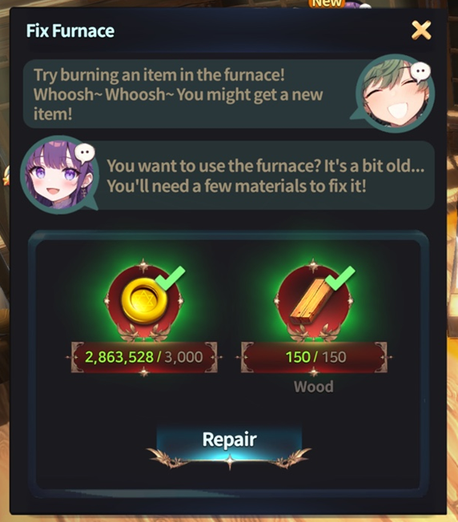

# Furnace



💡 **Create new materials using the furnace!**\
Do you have unused or unwanted items?\
Then why not utilise the **furnace**? You can find it in **'**[**My Home**](./#eng)**'**.

### 🛠 **Repairing the Furnace**

👉 If you are using the furnace for the first time, you must **repair it**.\
👉 **Use gold and woods to restore the furnace.**


❓ _Materials required for repair:_

* **3,000 Gold**
* **Wood** × 150


<figure><figcaption></figcaption></figure>

### 🔥 Furnace Functions

The furnace allows you to **burn items to obtain 'embers'**, which can then be used to **summon new items**.

* The amount of **embers gained varies depending on the item** burned.
* ❓ _Untradeable items can also be burned, so be cautious not to incinerate valuable possessions!_

<figure><figcaption></figcaption></figure>

### 🎮 How to Use

1️⃣ **Burning Items**

* Drag & drop items from your **inventory to the furnace slot**.
* The **estimated ember yield** will be displayed below the slot.
* Click **\[Burn]** to generate embers.

<figure><figcaption></figcaption></figure>

2️⃣ **Claiming Embers**

* The embers you obtain can be **claimed from the 'Mailbox'**.

<figure><figcaption></figcaption></figure>

3️⃣ **Summoning Items**

* Once you have received the embers, return to the **furnace** and use them, along with gold, to summon new items.
* Click **\[Summon]** to proceed!
* ❓ _Each summon requires 30 embers._

<figure><figcaption></figcaption></figure>

4️⃣ **Checking Summoned Items**

* The result of the summon will be displayed immediately.

<figure><figcaption></figcaption></figure>

* Summoned items can also be found in the '**Mailbox**'.

<figure><figcaption></figcaption></figure>

🔥 **Make good use of the embers and transform unwanted items into valuable resources!**

### ✅ **Table of Items Summonable with Embers**

| Item Name          | Summon Probability (%) | Amount |
| ------------------ | ---------------------- | ------ |
| Orb of Spirit      | 10                     | 1      |
| Molten Core        | 10                     | 1      |
| Pearl              | 10                     | 1      |
| Song of Spirit     | 10                     | 1      |
| Carving Knife      | 10                     | 1      |
| Empty Container    | 10                     | 1      |
| Magic Mold         | 10                     | 1      |
| Polishing Agent    | 10                     | 1      |
| Essence of Healing | 3                      | 2      |
| Essence of Magic   | 4                      | 2      |
| Neutralizer        | 10                     | 2      |



💡 **화로를 이용해 새로운 재료를 만들어 봅시다!**

사용하지 않는 아이템이나 버려야 할 아이템이 있나요?\
그렇다면 **화로**를 활용해 보세요! 화로는 **'**[**마이홈**](./#undefined-1)**'**&#xC5D0;서 찾을 수 있습니다.

### 🛠 **화로 수리하기**

👉 화로를 처음 사용한다면 **우선 수리가 필요합니다.**\
👉 **골드와 목재를 사용해 화로를 수리**해 주세요.


❓ _화로 수리에 필요한 재료:_

* **3,000 골드**
* **목재** × 150


<figure><figcaption></figcaption></figure>

### 🔥 **화로의 기능**

화로는 **아이템을 태워 '불씨'를 얻고**, 그 불씨를 사용해 **새로운 아이템을 소환하는 시스템**입니다.

* 아이템마다 태울 때 획득할 수 있는 **불씨의 양이 다릅니다.**
* ❓ _거래 불가 아이템도 태울 수 있으니, 중요한 아이템이 소각되지 않도록 주의하세요!_

<figure><figcaption></figcaption></figure>

### 🎮 **사용 방법**

1️⃣ **아이템 태우기**

* 우측 인벤토리에서 **화로 칸으로 아이템을 드래그&드롭**하세요.
* **불씨 예상 획득량이 슬롯 하단에 표시**되니 참고하세요.
* **\[태우기] 버튼을 누르면 불씨가 소환**됩니다.

<figure><figcaption></figcaption></figure>

2️⃣ **불씨 수령하기**

* 생성된 **불씨는 '우편함'에서 수령**할 수 있습니다.

<figure><figcaption></figcaption></figure>

3️⃣ **아이템 소환하기**

* 우편함에서 불씨를 받았다면, 다시 화로로 돌아와 **불씨와 골드를 사용해 아이템을 소환**할 수 있습니다.
* **\[소환] 버튼을 눌러보세요!**
* ❓ _소환 1회당 불씨 30개가 필요합니다._

<figure><figcaption></figcaption></figure>

4️⃣ **소환된 아이템 확인**

* 소환된 아이템의 결과가 즉시 표시됩니다.

<figure><figcaption></figcaption></figure>

* **소환된 아이템 역시 '우편함'에서 확인할 수 있습니다.**

<figure><figcaption></figcaption></figure>

🔥 불씨를 잘 활용해 불필요한 아이템을 가치 있게 바꿔 보세요!

### ✅불씨로 소환 가능한 아이템 도표

| 아이템 이름 | 소환 확률 (%) | 양 (Amount) |
| ------ | --------- | ---------- |
| 정령의 구슬 | 10        | 1          |
| 용암 결정  | 10        | 1          |
| 진주     | 10        | 1          |
| 정령의 노래 | 10        | 1          |
| 조각용 칼  | 10        | 1          |
| 빈 용기   | 10        | 1          |
| 마법 몰드  | 10        | 1          |
| 연마제    | 10        | 1          |
| 치유의 정수 | 3         | 2          |
| 마력의 정수 | 4         | 2          |
| 중화제    | 10        | 2          |



💡 **炉を活用して新しい素材を作りましょう！**\
使わないアイテムや不要なアイテムはありませんか？\
それなら、ぜひ **炉を活用** してみてください！炉は **「**[**マイホーム**](./#ri-ben-yu)**」** で見つけることができます。

### 🛠 炉の修理

👉 初めて炉を使用する場合は、**まず修理が必要** です。\
👉 **ゴールドと木材を使用して炉を修理してください。**


❓ _修理に必要な素材:_

* **3,000 ゴールド**
* **木材** × 150


<figure><figcaption></figcaption></figure>

### 🔥 **炉の機能**

炉では **アイテムを燃やして「火種」(embers) を獲得** し、その火種を使用して **新たなアイテムを召喚** できます。

* **獲得できる火種の量はアイテムごとに異なります。**
* ❓ _取引不可のアイテムも燃やせるため、大切なアイテムを誤って燃やさないようご注意ください！_

<figure><figcaption></figcaption></figure>

### 🎮 使用方法

1️⃣ **アイテムを燃やす**

* **インベントリから炉のスロットにアイテムをドラッグ＆ドロップ** してください。
* **獲得可能な火種の予測量** がスロットの下に表示されます。
* **\[燃やす] ボタンを押すと、火種が生成** されます。

<figure><figcaption></figcaption></figure>

2️⃣ **火種の受け取り**

* 獲得した火種は **「郵便箱」から受け取る** ことができます。

<figure><figcaption></figcaption></figure>

3️⃣ **アイテムの召喚**

* 郵便箱で火種を受け取ったら、**炉に戻り、火種とゴールドを使用してアイテムを召喚** できます。
* **\[召喚] ボタンを押してください！**
* ❓ _1回の召喚には火種30個が必要です。_

<figure><figcaption></figcaption></figure>

4️⃣ **召喚されたアイテムの確認**

* 召喚結果が即座に表示されます。

<figure><figcaption></figcaption></figure>

* 召喚されたアイテムは「**郵便箱**」から確認できます。

<figure><figcaption></figcaption></figure>

🔥 **火種を活用して、不用品を貴重なアイテムに変えましょう！**

### ✅ **火種で召喚可能なアイテム表**

| アイテム名    | 召喚確率 (%) | 数量 (Amount) |
| -------- | -------- | ----------- |
| 精霊の珠     | 10       | 1           |
| 溶岩結晶     | 10       | 1           |
| 真珠       | 10       | 1           |
| 精霊の歌     | 10       | 1           |
| 彫刻用ナイフ   | 10       | 1           |
| 空の容器     | 10       | 1           |
| 魔法モールド   | 10       | 1           |
| 研磨剤      | 10       | 1           |
| 治癒のエッセンス | 3        | 2           |
| 魔力のエッセンス | 4        | 2           |
| 中和剤      | 10       | 2           |



