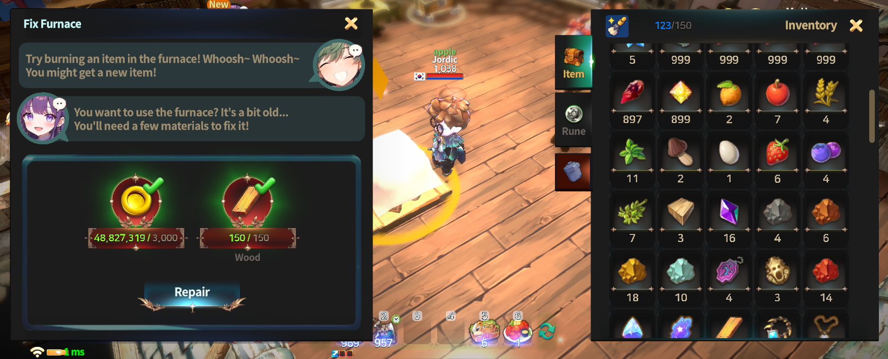
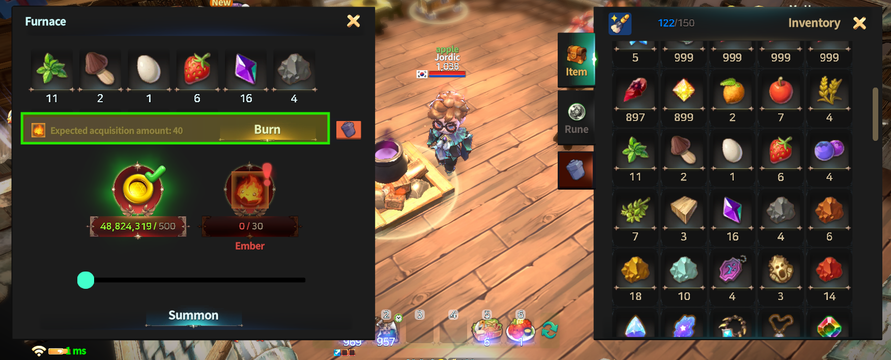
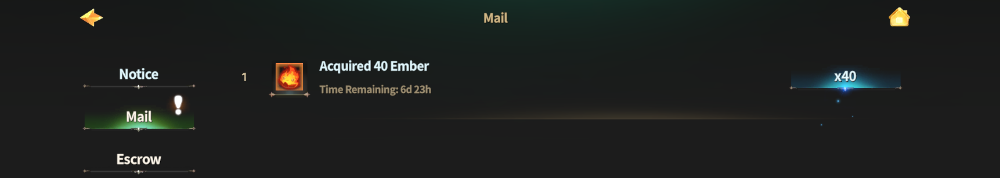
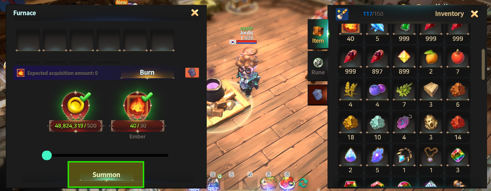
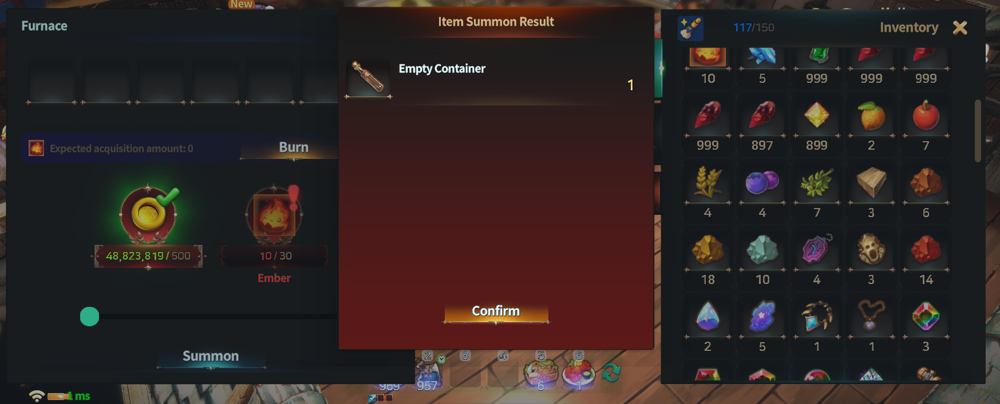
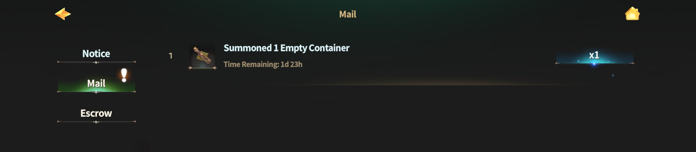

# 🔥 Furnace



### 🔥 Furnace Guide

The Furnace is a **crafting system** that allows you to burn unused items to obtain **Embers**,\
which can then be used to **summon new items**.

The Furnace can be accessed **inside** [**My Home**](./).

***

### ◾ Repairing the Furnace

Before using the Furnace for the first time, it must be **repaired**.\
You can repair the Furnace using the items below.

<figure><figcaption></figcaption></figure>


#### 🛠️ Required Items for Repair

* Gold × 3,000
* Wood × 150


Once the repair is complete, the Furnace functions will be fully available.

***

### ◾ Basic Furnace Functions

The Furnace operates in the following way:

* Burning items grants **Embers**.
* The amount of Embers obtained **varies by item**.
* **Untradeable items can also be burned**, \
  so be careful not to accidentally destroy important items.

***

### ◾ How to Use the Furnace

#### 1️⃣ Burning Items

<figure><figcaption></figcaption></figure>

* From the inventory on the right side,\
  **drag and drop** the item you want to burn into the Furnace slot.
* The **expected Ember amount** will be displayed at the bottom of the slot.
* Tap the **\[Burn]** button to generate Embers.

***

#### 2️⃣ Receiving Embers

<figure><figcaption></figcaption></figure>

* Generated Embers are delivered to your **Mailbox**.
* Make sure to collect them from the Mailbox.

***

#### 3️⃣ Summoning Items

<figure><figcaption></figcaption></figure>

* After collecting Embers, return to the Furnace.
* Use **Embers and Gold** to summon items.
* Tap the **\[Summon]** button.

💡 Each summon requires **30 Embers**.

***

#### 4️⃣ Checking Summoned Items

<figure><figcaption></figcaption></figure>

* The summon result is displayed immediately.
* Summoned items can also be checked in your **Mailbox**.

<figure><figcaption></figcaption></figure>

***

### ◾ Using Embers

By using Embers wisely, you can turn unwanted items into **new items with greater value**.

🔻 Please refer to the table below for items that can be summoned using Embers.

| Item Name          | Summon Probability (%) | Amount |
| ------------------ | ---------------------- | ------ |
| Orb of Spirit      | 10                     | 1      |
| Molten Core        | 10                     | 1      |
| Pearl              | 10                     | 1      |
| Song of Spirit     | 10                     | 1      |
| Carving Knife      | 10                     | 1      |
| Empty Container    | 10                     | 1      |
| Magic Mold         | 10                     | 1      |
| Polishing Agent    | 10                     | 1      |
| Essence of Healing | 3                      | 2      |
| Essence of Magic   | 4                      | 2      |
| Neutralizer        | 10                     | 2      |



### 🔥 화로 가이드

화로는 사용하지 않는 아이템을 태워 **불씨**를 획득하고,\
그 불씨를 사용해 **새로운 아이템을 소환**할 수 있는 제작 시스템입니다.

화로는 [**마이홈**](./) **내부**에서 이용할 수 있습니다.

***

### ◾ 화로 수리하기

화로를 처음 이용하려면 먼저 **수리**가 필요합니다.\
아래 아이템을 사용해 화로를 수리할 수 있습니다.

<figure><figcaption></figcaption></figure>


#### 🛠️ 화로 수리에 필요한 아이템

* 골드 × 3,000
* 목재 × 150


수리가 완료되면 화로 기능을 정상적으로 이용할 수 있습니다.

***

### ◾ 화로의 기본 기능

화로는 다음과 같은 방식으로 작동합니다.

* 아이템을 태우면 **불씨**를 획득할 수 있습니다.
* 아이템마다 태울 때 획득할 수 있는 **불씨의 양은 서로 다릅니다**.
* **거래 불가 아이템도 태울 수 있으므로**, 중요한 아이템이 소각되지 않도록 주의해 주세요.

***

### ◾ 화로 사용 방법

#### 1️⃣ 아이템 태우기

<figure><figcaption></figcaption></figure>

* 우측 인벤토리에서 태우고 싶은 아이템을 **화로 슬롯으로 드래그 & 드롭**합니다.
* 슬롯 하단에서 **예상 불씨 획득량**을 확인할 수 있습니다.
* **\[태우기] 버튼**을 누르면 불씨가 생성됩니다.

***

#### 2️⃣ 불씨 수령하기

<figure><figcaption></figcaption></figure>

* 생성된 불씨는 **우편함**으로 지급됩니다.
* 우편함에서 불씨를 수령해 주세요.

***

#### 3️⃣ 아이템 소환하기

<figure><figcaption></figcaption></figure>

* 불씨를 수령한 후, 다시 화로로 이동합니다.
* **불씨와 골드**를 사용해 아이템을 소환할 수 있습니다.
* **\[소환] 버튼**을 터치해 주세요.

💡 아이템 소환 1회당 **불씨 30개**가 필요합니다.

***

#### 4️⃣ 소환된 아이템 확인

<figure><figcaption></figcaption></figure>

* 소환 결과는 즉시 화면에 표시됩니다.
* 소환된 아이템은 **우편함**에서 확인할 수 있습니다.

<figure><figcaption></figcaption></figure>

***

### ◾ 불씨 활용 안내

불씨를 잘 활용하면, 쓸모없던 아이템을 **새로운 가치 있는 아이템으로 바꿀 수 있습니다**.

🔻 불씨로 소환 가능한 아이템은 아래 도표를 참고해 주세요.

| 아이템 이름 | 소환 확률 (%) | 양 (Amount) |
| ------ | --------- | ---------- |
| 정령의 구슬 | 10        | 1          |
| 용암 결정  | 10        | 1          |
| 진주     | 10        | 1          |
| 정령의 노래 | 10        | 1          |
| 조각용 칼  | 10        | 1          |
| 빈 용기   | 10        | 1          |
| 마법 몰드  | 10        | 1          |
| 연마제    | 10        | 1          |
| 치유의 정수 | 3         | 2          |
| 마력의 정수 | 4         | 2          |
| 중화제    | 10        | 2          |



### 🔥 炉（ファーネス）ガイド

炉は、使用しないアイテムを燃やして **火種** を獲得し、\
その火種を使用して **新しいアイテムを召喚**できる制作システムです。\
炉は [**マイホーム**](./)**の内部** で利用できます。

***

### ◾ 炉の修理

炉を初めて利用する場合、まず **修理** を行う必要があります。\
以下のアイテムを使用すると、炉を修理できます。

<figure><figcaption></figcaption></figure>


#### 🛠️ 修理に必要なアイテム

* ゴールド × 3,000
* 木材 × 150


修理が完了すると、炉の機能を正常に利用できるようになります。

***

### ◾ 炉の基本機能

炉は、以下の仕組みで動作します。

* アイテムを燃やすと **火種** を獲得できます。
* 獲得できる火種の量は、\
  **アイテムごとに異なります**。
* **取引不可アイテムも燃やすことができる**ため、\
  大切なアイテムを誤って消失しないよう注意してください。

***

### ◾ 炉の使い方

#### 1️⃣ アイテムを燃やす

<figure><figcaption></figcaption></figure>

* 右側のインベントリから、燃やしたいアイテムを **炉スロットへドラッグ＆ドロップ**します。
* スロット下部で **獲得予定の火種数** を確認できます。
* **［燃やす］ボタン**をタップすると、火種が生成されます。

***

#### 2️⃣ 火種を受け取る

<figure><figcaption></figcaption></figure>

* 生成された火種は **メールボックス** に送られます。
* メールボックスから火種を受け取ってください。

***

#### 3️⃣ アイテムを召喚する

<figure><figcaption></figcaption></figure>

* 火種を受け取った後、再び炉に戻ります。
* **火種とゴールド**を使用して アイテムを召喚できます。
* **［召喚］ボタン**をタップしてください。

💡 アイテム召喚は **1回につき火種30個** が必要です。

***

#### 4️⃣ 召喚されたアイテムを確認する

<figure><figcaption></figcaption></figure>

* 召喚結果はすぐに画面に表示されます。
* 召喚されたアイテムは **メールボックス** でも確認できます。

<figure><figcaption></figcaption></figure>

***

### ◾ 火種の活用について

火種をうまく活用することで、\
不要なアイテムを **新たな価値のあるアイテムへ変える**ことができます。

🔻 火種で召喚できるアイテムについては、下記の表をご確認ください。

| アイテム名    | 召喚確率 (%) | 数量 (Amount) |
| -------- | -------- | ----------- |
| 精霊の珠     | 10       | 1           |
| 溶岩結晶     | 10       | 1           |
| 真珠       | 10       | 1           |
| 精霊の歌     | 10       | 1           |
| 彫刻用ナイフ   | 10       | 1           |
| 空の容器     | 10       | 1           |
| 魔法モールド   | 10       | 1           |
| 研磨剤      | 10       | 1           |
| 治癒のエッセンス | 3        | 2           |
| 魔力のエッセンス | 4        | 2           |
| 中和剤      | 10       | 2           |



<em>※ This guide was written based on the game status as of January 19, 2026,</em>  <em>and its contents may change with future updates.</em>

