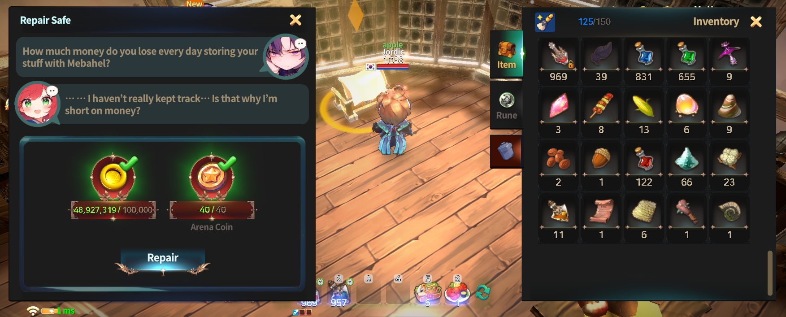
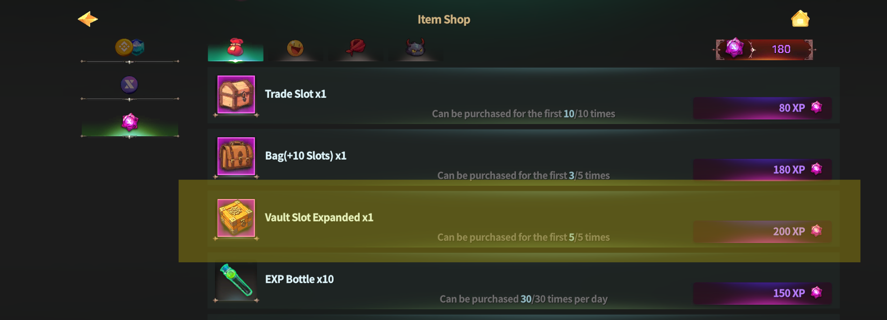

# 🔐 Personal Safe



### 🔐 Personal Safe Guide

The Personal Safe is a **private storage space** where you can safely store items obtained during your adventures **without any storage fees**.\
The Personal Safe can be accessed **inside** [**My Home**](./).

***

### ◾ Repairing the Personal Safe

Before using the Personal Safe for the first time, it must be **repaired**.\
You can restore the Personal Safe using the items below.

<figure><figcaption></figcaption></figure>


#### 🛠️ Required Items for Repair

* Gold × 100,000
* Arena Coin × 40


Once the repair is complete, the Personal Safe will be fully available for use.

***

### ◾ Basic Functions of the Personal Safe

<figure><figcaption></figcaption></figure>

After repairing the Personal Safe, **three storage slots** are activated immediately.

* Identical items can be stored **up to 999 per slot**.
* Items stored in the Personal Safe **do not incur any fees**.
* You can safely manage important items and valuable materials.

***

### ◾ Expanding Storage Slots

The storage slots of the Personal Safe can be expanded.

* You can purchase additional storage slots\
  using [**X Points**](../../xto-token/xto-holding-service/x-points-earning-rate.md) **obtained through** [**XTO Holding**](../../xto-token/xto-holding-service/).
* Expanding slots allows you to manage a larger number of items more efficiently.

<figure><figcaption></figcaption></figure>

***

✨

> **The Personal Safe provides a reliable way** \
> **to store your items without the risk of losing them.**
>
> **Store frequently used items or valuable materials**\
> **in your Personal Safe to keep them secure and organized.**



### 🔐 개인금고 가이드

개인금고는 모험 중 획득한 아이템을 **수수료 없이 안전하게 보관**할 수 있는 개인 전용 보관 공간입니다.\
개인금고는 [**마이홈**](./) **내부**에서 이용할 수 있습니다.

***

### ◾ 개인금고 수리하기

개인금고를 처음 이용하려면 먼저 **수리**가 필요합니다.\
아래 아이템을 사용해 개인금고를 복구할 수 있습니다.

<figure><figcaption></figcaption></figure>


#### 🛠️ 개인금고 수리에 필요한 아이템

* 골드 × 100,000
* 아레나 코인 × 40


수리가 완료되면 개인금고를 정상적으로 이용할 수 있습니다.

***

### ◾ 개인금고 기본 기능

<figure><figcaption></figcaption></figure>

개인금고를 수리하면, **기본 보관 슬롯 3개**가 즉시 활성화됩니다.

* 같은 아이템은 **한 슬롯에 최대 999개까지** 보관할 수 있습니다.
* 보관한 아이템에는 **어떠한 수수료도 발생하지 않습니다.**
* 중요한 아이템을 안전하게 관리할 수 있습니다.

***

### ◾ 보관 슬롯 확장하기

개인금고의 보관 슬롯은 추가로 확장할 수 있습니다.

* [**XTO 홀딩**](../../xto-token/xto-holding-service/)**을 통해 획득한** [**X 포인트**](../../xto-token/xto-holding-service/x-points-earning-rate.md)를 사용하면 보관 슬롯을 추가로 구매할 수 있습니다.
* 슬롯을 확장하면 더 많은 아이템을 효율적으로 관리할 수 있습니다.

<figure><figcaption></figcaption></figure>

***

✨

> **개인금고는 아이템을 잃어버릴 걱정 없이 안정적으로 보관할 수 있는 공간입니다.**\
> **자주 사용하는 아이템이나 소중한 재료는 개인금고를 활용해 안전하게 관리해 보세요.**



### 🔐 個人金庫 ガイド

個人金庫は、冒険中に獲得したアイテムを\
**手数料なしで安全に保管できる、個人専用の保管スペース**です。\
個人金庫は [**マイホーム**](./)**の内部** で利用できます。

***

### ◾ 個人金庫の修理

個人金庫を初めて利用する場合、まず **修理** を行う必要があります。\
以下のアイテムを使用すると、個人金庫を復旧できます。

<figure><figcaption></figcaption></figure>


#### 🛠️ 修理に必要なアイテム

* ゴールド × 100,000
* アリーナコイン × 40


修理が完了すると、個人金庫を正常に利用できるようになります。

***

### ◾ 個人金庫の基本機能

<figure><figcaption></figcaption></figure>

個人金庫を修理すると、**基本保管スロット3枠** がすぐに有効化されます。

* 同じアイテムは **1枠につき最大999個まで** 保管できます。
* 保管したアイテムには **一切の手数料はかかりません。**
* 大切なアイテムや貴重な素材を 安全に管理できます。

***

### ◾ 保管スロットの拡張

個人金庫の保管スロットは、追加で拡張することができます。

* [**XTOホールディング**](../../xto-token/xto-holding-service/)**を通じて獲得した**[**Xポイント**](../../xto-token/xto-holding-service/x-points-earning-rate.md)を使用すると、\
  保管スロットを追加購入できます。
* スロットを拡張することで、より多くのアイテムを効率よく管理できます。

<figure><figcaption></figcaption></figure>

***

✨

> **개인금고는 아이템을 잃어버릴 걱정 없이 안정적으로 보관할 수 있는 공간입니다.**\
> **자주 사용하는 아이템이나 소중한 재료는 개인금고를 활용해 안전하게 관리해 보세요.**



<em>※ This guide was written based on the game status as of January 19, 2026,</em>  <em>and its contents may change with future updates.</em>

