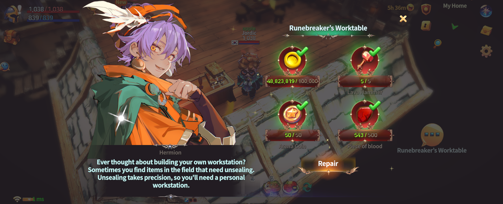
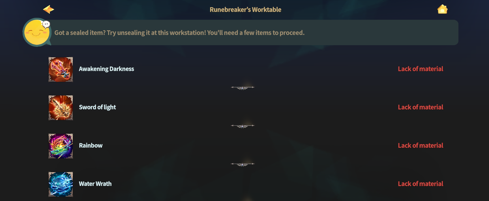
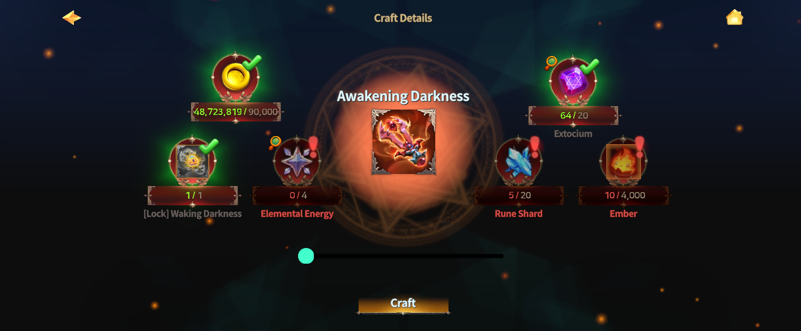

# 🛠️ Runebreaker's Worktable



### 🛠️ Runebreaker’s Worktable Guide

Runebreaker’s Worktable is a **special worktable** that allows you to unlock\
&#xNAN;**\[Locked] NFT weapons and orbs** obtained through field hunting,\
making them fully usable equipment.

The Worktable is located **inside My Home**, and\
**wallet connection is required** to unlock NFT equipment.

***

### ◾ What Are \[Locked] NFT Equipment?

When hunting using **paid Energy**,\
there is a very small chance to obtain **\[Locked] NFT weapons**.

* \[Locked] NFT equipment **cannot be used immediately**.
* You must complete the **unlock process** at the Runebreaker’s Worktable\
  before the equipment becomes usable.

***

### ◾ How to Unlock the Worktable

To use the Runebreaker’s Worktable for the first time,\
you must unlock the Worktable using the items below.

<figure><figcaption></figcaption></figure>


#### 🔓 Required Items to Unlock the Worktable

* Lava Hammer × 5
* Arena Coin × 50
* Piece of Blood × 500


***

### ◾ Unlockable NFT Equipment List

When you tap the Worktable,\
a list of **\[Locked] weapons and orbs** that can be unlocked will be displayed.\
The following equipment can currently drop in a **\[Locked] state**.

|       Weapon       |     Orb     |
| :----------------: | :---------: |
| Awakening Darkness |   Rainbow   |
|   Sword of light   | Water Wrath |

<figure><figcaption></figcaption></figure>

***

### ◾ How to Unlock NFT Equipment

When you select a **\[Locked] NFT equipment**,\
a **Crafting tab** will appear, showing the materials required for unlocking.

* Once all required materials are prepared,\
  proceed with crafting to unlock the NFT equipment.
* After unlocking, the equipment is obtained as a **fully usable NFT item**.

<figure><figcaption></figcaption></figure>

***

### ◾ Important Notes

* Unlocking **\[Locked] NFT equipment** can only be performed\
  while your **wallet is connected**.
* Materials used for unlocking **cannot be refunded**, so please proceed carefully.

***

✨

> **Runebreaker’s Worktable is a high-tier progression content**\
> **where you can obtain rare NFT equipment.**
>
> **By hunting with paid Energy to acquire \[Locked] NFT equipment,**\
> **and completing the unlock process at the Worktable,**\
> **you can forge powerful equipment for your journey.**



### 🛠️ 룬 파괴자의 작업대 가이드

룬 파괴자의 작업대는 필드 사냥 중 획득한 **\[잠금] 상태의 NFT 무기 및 오브**를\
해금하여 실제로 사용할 수 있게 만드는 **특수 작업대**입니다.

작업대는 **마이홈 내부**에 위치해 있으며, NFT 장비를 해금하려면 **지갑 연결이 필수**입니다.

***

### ◾ \[잠금] NFT 장비란?

유료 에너지를 사용해 사냥을 진행하면, 아주 낮은 확률로 **\[잠금] 상태의 NFT 무기**가 드랍될 수 있습니다.

* \[잠금] 상태의 NFT 장비는 **바로 사용할 수 없습니다.**
* 룬 파괴자의 작업대에서 **해금 작업**을 완료해야 정상적으로 사용할 수 있습니다.

***

### ◾ 작업대 잠금 해제 방법

룬 파괴자의 작업대를 처음 이용하려면 아래 아이템을 사용해 **작업대를 해금**해야 합니다.

<figure><figcaption></figcaption></figure>


#### 🔓 작업대 해금에 필요한 아이템

* 용암 망치 × 5
* 아레나 코인 × 50
* 피의 조각 × 500


***

### ◾ 해금 가능한 NFT 장비 목록

작업대를 클릭하면, 해금할 수 있는 **\[잠금] 상태의 무기 및 오브 목록**이 표시됩니다.\
현재 \[잠금] 상태로 드랍될 수 있는 장비는 다음과 같습니다.

|    무기   |   오브  |
| :-----: | :---: |
| 깨어나는 어둠 |  레인보우 |
|   빛의 검  | 물의 분노 |

<figure><figcaption></figcaption></figure>

***

### ◾ NFT 장비 해금 방법

해금하고 싶은 **\[잠금] NFT 장비**를 선택하면,\
해금에 필요한 재료를 확인하고 제작할 수 있는 **제작 탭**이 표시됩니다.

* 필요한 재료를 모두 준비한 뒤 제작을 진행하면 NFT 장비가 해금됩니다.
* 해금이 완료된 장비는 **정상적으로 사용 가능한 NFT 장비**로 획득됩니다.

<figure><figcaption></figcaption></figure>

***

### ◾ 작업대 이용 시 유의사항

* \[잠금] NFT 장비 해금은 **지갑이 연결된 상태에서 진행**할 수 있습니다.
* 해금에 사용된 재료는 반환되지 않으니 신중하게 진행해 주세요.

***

✨

> **룬 파괴자의 작업대는 희귀한 NFT 장비를 획득할 수 있는 고급 성장 콘텐츠입니다.**\
> **유료 에너지를 사용한 사냥을 통해 \[잠금] 상태의 NFT 장비를 획득하고,**\
> **작업대에서 해금 과정을 거쳐 강력한 장비를 완성할 수 있습니다.**



### 🛠️ ルーンブレイカーの作業台 ガイド

ルーンブレイカーの作業台は、\
フィールド狩りで入手した **［ロック］状態のNFT武器やオーブ** を解放し、\
実際に使用できるようにするための **特殊な作業台** です。

作業台は **マイホームの内部** に設置されており、\
NFT装備を解放するには **ウォレットの接続が必須** となります。

***

### ◾［ロック］NFT装備とは？

**有料エネルギー**を使用して狩りを行うと、\
非常に低い確率で **［ロック］状態のNFT武器** がドロップすることがあります。

* ［ロック］状態のNFT装備は、**そのままでは使用できません。**
* ルーンブレイカーの作業台で **解放作業を完了**することで、正常に使用できるようになります。

***

### ◾ 作業台の解放方法

ルーンブレイカーの作業台を初めて利用するには、\
以下のアイテムを使用して **作業台を解放**する必要があります。

<figure><figcaption></figcaption></figure>


#### 🔓 作業台解放に必要なアイテム

* 溶岩ハンマー × 5
* アリーナコイン × 50
* 血の欠片 × 500


***

### ◾ 解放可能なNFT装備一覧

作業台をタップすると、\
解放可能な **［ロック］状態の武器およびオーブの一覧** が表示されます。\
現在、以下の装備&#x304C;**［ロック］状態でドロップする可能性**があります。

|   武器  |  オーブ  |
| :---: | :---: |
| 目覚める闇 | レインボー |
|  光の剣  |  水の怒り |

<figure><figcaption></figcaption></figure>

***

### ◾ NFT装備の解放方法

解放したい **［ロック］NFT装備** を選択すると、\
解放に必要な素材を確認できる **制作タブ** が表示されます。

* 必要な素材をすべて揃えた後、制作を進行するとNFT装備が解放されます。
* 解放が完了した装備は、**通常通り使用可能なNFT装備**として獲得できます。

<figure><figcaption></figcaption></figure>

***

### ◾ 作業台利用時の注意事項

* **［ロック］NFT装備の解放**は、**ウォレット接続中のみ**行うことができます。
* 解放に使用した素材は **返却されません**ので、内容をよく確認したうえで進行してください。

***

✨

> **ルーンブレイカーの作業台は、**\
> **希少なNFT装備を獲得できる 高難度の成長コンテンツ です。**
>
> **有料エネルギーを使用した狩りで［ロック］状態のNFT装備を入手し、**\
> **作業台で解放工程を経ることで、強力な装備を完成させることができます。**



<em>※ This guide was written based on the game status as of January 19, 2026,</em>  <em>and its contents may change with future updates.</em>

