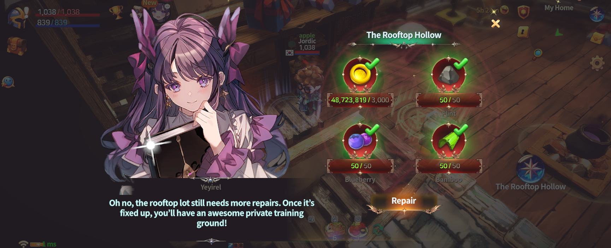
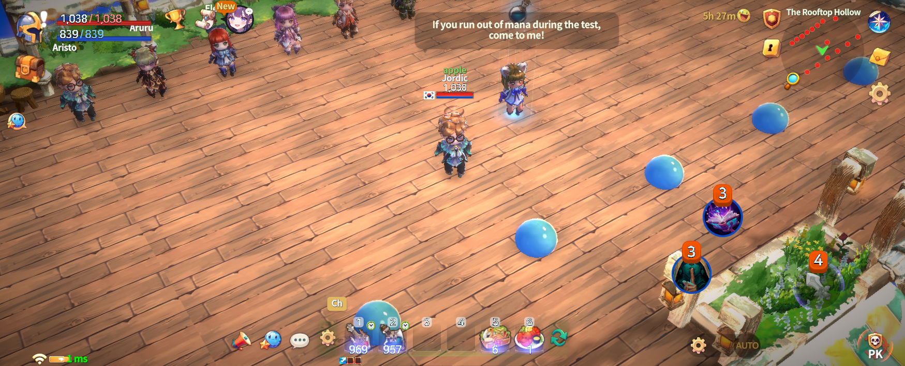
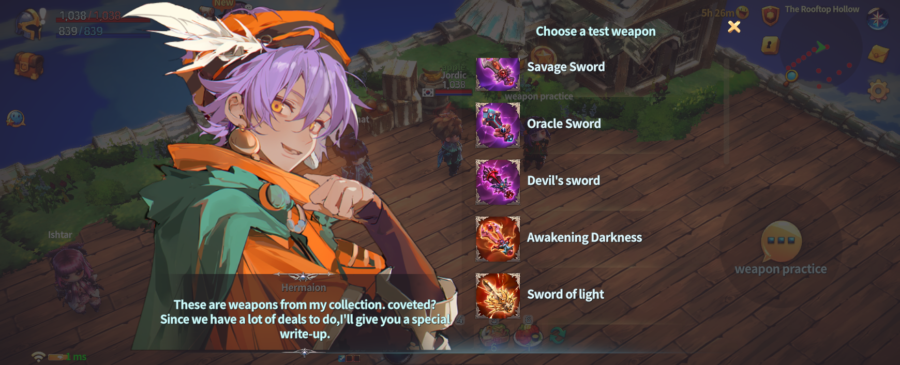

# 🎯 The Rooftop Hollow



### 🎯 The Rooftop Hollow Guide

The Rooftop Hollow is a **practice-focused content** where you can freely test the performance of Heroes and weapons before heading into battle.\
It is a dedicated training space where you can **directly experience different skills and weapons** to find the setup that suits you best.

***

### ◾ How to Access the Rooftop Hollow

The Rooftop Hollow is located **inside My Home**.

1️⃣ Move to **My Home**.

<figure><figcaption></figcaption></figure>

2️⃣ Inside My Home, tap the **Rooftop Hollow icon**.

<figure><figcaption></figcaption></figure>

3️⃣ On your first visit, the Rooftop Hollow will be locked. \
Use the required materials to **unlock** it.

<figure><figcaption></figcaption></figure>

4️⃣ Once unlocked, you can freely enter the Rooftop Hollow.

<figure><figcaption></figcaption></figure>

***

### ◾ What You Can Do in the Rooftop Hollow

The following tests are available in the Rooftop Hollow.

#### 🔹 Hero Testing

<figure><figcaption></figcaption></figure>

* You can try out the skills of **various Heroes**, regardless of ownership.
* Before deploying a Hero in real combat, \
  you can check skill setups and get a feel for their gameplay.

#### 🔹 Weapon Testing

<figure><figcaption></figcaption></figure>

* You can freely use **various types of weapons**.
* Weapon skills are applied with **randomized settings**.
* Test different weapon skills to evaluate which combat style fits you best.

#### 🔹 Practice Slime

<figure><figcaption></figcaption></figure>

* Your test target is the **Practice Slime**.
* Experiment freely and improve your combat sense without any pressure.

***

✨

> **The Rooftop Hollow is a space** \
> **where you can experiment freely without worrying about failure.**\
> **Before using a new Hero or weapon in real combat,**\
> **make sure to practice here and prepare with confidence.**



### 🎯 옥상공터 가이드

옥상공터는 전투에 앞서 **영웅과 무기의 성능을 자유롭게 시험**할 수 있는 연습 전용 콘텐츠입니다.\
자신에게 맞는 **스킬과 무기를 직접 체험**할 수 있는 완벽한 연습 공간입니다.

***

### ◾ 옥상공터 입장 방법

옥상공터는 **마이홈 내부**에 위치해 있습니다.

1️⃣ **마이홈**으로 이동합니다.

<figure><figcaption></figcaption></figure>

2️⃣ 마이홈 내부에서 **옥상공터 아이콘**을 터치합니다.

<figure><figcaption></figcaption></figure>

3️⃣ 최초 이용 시에는 잠겨 있으며, 필요한 재료를 사용해 **잠금 해제**할 수 있습니다.

<figure><figcaption></figcaption></figure>

4️⃣ 잠금 해제가 완료되면, 옥상공터에 자유롭게 입장할 수 있습니다.

<figure><figcaption></figcaption></figure>

***

### ◾ 옥상공터에서 할 수 있는 것

옥상공터에서는 다음과 같은 테스트가 가능합니다.

#### 🔹 영웅 테스트

<figure><figcaption></figcaption></figure>

* 보유 여부와 관계없이 **다양한 영웅의 스킬을 체험**할 수 있습니다.
* 실전에 투입하기 전, 스킬 구성과 사용감을 미리 확인할 수 있습니다.

#### 🔹 무기 테스트

<figure><figcaption></figcaption></figure>

* 여러 종류의 무기를 자유롭게 사용해 볼 수 있습니다.
* 무기 스킬은 **무작위로 설정**되어 적용됩니다.
* 다양한 무기 스킬을 체험하며 자신에게 맞는 전투 스타일을 점검할 수 있습니다.

#### 🔹 연습용 슬라임

<figure><figcaption></figcaption></figure>

* 테스트 대상은 **연습용 슬라임**입니다.
* 부담 없이 실험하며 전투 감각을 익힐 수 있습니다.

***

✨

> **옥상공터는 실패에 대한 부담 없이 자유롭게 실험할 수 있는 공간입니다.**\
> **새로운 영웅이나 무기를 사용하기 전, 이곳에서 충분히 연습한 뒤 실전에 도전해 보세요.**



### 🎯 屋上の空地 ガイド

屋上の空地は、戦闘に挑む前に\
**英雄や武器の性能を自由に試すことができる、練習専用コンテンツ**です。\
自分に合った **スキルや武器を直接体験**できる、最適なトレーニングスペースです。

***

### ◾ 屋上の空地 進入方法

屋上の空地は、**マイホームの内部**にあります。

1️⃣ **マイホーム**へ移動します。

<figure><figcaption></figcaption></figure>

2️⃣ マイホーム内で **屋上の空地アイコン**をタップします。

<figure><figcaption></figcaption></figure>

3️⃣ 初回利用時はロックされており、必要な素材を使用して **解放**することができます。

<figure><figcaption></figcaption></figure>

4️⃣ 解放が完了すると、屋上の空地に自由に進入できます。

<figure><figcaption></figcaption></figure>

***

### ◾ 屋上の空地でできること

屋上の空地では、以下のテストを行うことができます。

#### 🔹 英雄テスト

<figure><figcaption></figcaption></figure>

* 所持しているかどうかに関わらず、**さまざまな英雄のスキルを体験**できます。
* 実戦に投入する前に、スキル構成や使用感を事前に確認できます。

#### 🔹 武器テスト

<figure><figcaption></figcaption></figure>

* 複数の種類の武器を自由に使用できます。
* 武器スキルは **ランダムに設定**されて適用されます。
* さまざまな武器スキルを体験しながら、自分に合った戦闘スタイルを確認できます。

#### 🔹 練習用スライム

<figure><figcaption></figcaption></figure>

* テスト対象は **練習用スライム**です。
* 失敗を気にせず、自由に実験しながら戦闘感覚を身につけることができます。

***

✨

> **屋上の空地は、失敗を気にせず自由に試せる空間です。**\
> **新しい英雄や武器を使用する前に、ここで十分に練習してから実戦に挑戦しましょう。**



<em>※ This guide was written based on the game status as of January 19, 2026,</em>  <em>and its contents may change with future updates.</em>

