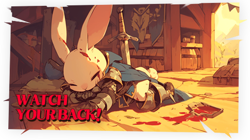

# ⚠️ PK

<figure><figcaption></figcaption></figure>



💡 **All fields where hunting is possible in EXTOCIUM are defined as 'Combat Zones'.**&#x20;

In combat zones, you can kill monsters for farming or kill other players to monopolize resources. Killing another player may probabilistically allow you to obtain their gold and items.&#x20;

💡 **The higher-tier fields in EXTOCIUM are set as 'PK Zones'.**&#x20;

This is an inevitable [mission](../../xto-token/xto-summary/our-mission.md) to drive the EXTOCIUM economy. PK allows factions to check each other and controls inflation that could arise from indiscriminate farming. It also provides motivation to invest gold and XTO in equipment for victory in user competition.&#x20;

💡 **Since PK inherently involves risk, a** [**PK Leverage Bonus** ](pk-leverage-bonus/)**is applied in PK fields.**

#### 1️⃣PK on/off Button

You can prevent yourself from PK-ing others in Auto mode using the PK on/off button at the bottom right of the HUD.&#x20;

<figure><figcaption></figcaption></figure>

❗ <mark style="color:orange;">**However, you cannot prevent others from PK-ing you.**</mark>


[👉 **Check out more detailed target features here!**](target-control.md)

[**👉**Do you want to check your PK record?](pk-record.md#eng)


#### 2️⃣Basic PK Rules

* PK levels exist from 1 to 10.&#x20;
* Each time you kill one PC, your PK level increases by 1.
* &#x20;If you are killed by a monster or a user while at a high PK level, items and gold may drop from your inventory.
  * 3️⃣[Item/Gold Drop Chart upon Death due to PK](./#id-3-item-gold-drop-chart-upon-death-due-to-pk)
* Heroes below level 25 are not affected by PK. Damage cannot be dealt during PK, and heroes below level 25 are unable to inflict damage.&#x20;
* When non-PK individuals inflict damage on each other, a purple skull appears above their heads. If you PK someone with a purple skull, no PK points are accumulated. The purple skull disappears if you wait in place for 30 seconds.&#x20;
* To remove PK levels, you must stay still. Every 30 minutes, the PK Level decreases by 1. Alternatively, you can decrease your PK Level by giving gold and items to the [NPC 'Niberius'](../../field-info/rotten-hill/npc-rotten-hill.md#niberius-niberiusu) in town.&#x20;
* In [PK Leverage Zones](pk-leverage-bonus/), you can accumulate PK levels to obtain more items and gold. In Non-PK Zones, a [PK penalty](pk-penalty.md) applies when PK-ing.
* Starting from PK level 6, your location will be revealed on the map.

#### 3️⃣Item/Gold Drop Chart upon Death due to PK <mark style="color:purple;">(Based on non-PK zone standards)</mark>

<table data-header-hidden><thead><tr><th width="76"></th><th></th><th></th><th></th><th></th><th></th></tr></thead><tbody><tr><td>
PK

Lv.
</td><td>EXP reduction ratio</td><td>Chance to drop ‘my’ items upon death</td><td>Amount to drop ‘my’ item upon death</td><td>Chance to drop ‘my’ gold on death</td><td>Amount to drop 'my' gold on death</td></tr><tr><td>0</td><td>0.1%</td><td>10%</td><td>5%</td><td>10%</td><td>5%</td></tr><tr><td>1</td><td>0.2%</td><td>11%</td><td>6%</td><td>11%</td><td>6%</td></tr><tr><td>2</td><td>0.3%</td><td>12%</td><td>8%</td><td>12%</td><td>8%</td></tr><tr><td>3</td><td>0.4%</td><td>14%</td><td>10%</td><td>14%</td><td>10%</td></tr><tr><td>4</td><td>0.5%</td><td>18%</td><td>12%</td><td>18%</td><td>12%</td></tr><tr><td>5</td><td>0.6%</td><td>20%</td><td>16%</td><td>20%</td><td>16%</td></tr><tr><td>6</td><td>0.7%</td><td>22%</td><td>20%</td><td>22%</td><td>20%</td></tr><tr><td>7</td><td>1%</td><td>24%</td><td>24%</td><td>24%</td><td>24%</td></tr><tr><td>8</td><td>1.5%</td><td>26%</td><td>28%</td><td>26%</td><td>28%</td></tr><tr><td>9</td><td>2%</td><td>30%</td><td>32%</td><td>30%</td><td>32%</td></tr><tr><td>10</td><td>2.5%</td><td>35%</td><td>40%</td><td>35%</td><td>40%</td></tr></tbody></table>

❗ <mark style="color:orange;">**In the event a judgment to drop gold is made, a portion of the dropped gold is permanently lost.**</mark> \
Please refer to the chart below for the ratio.

| PK Lv. | Permanent loss rate of dropped gold |
| ------ | ----------------------------------- |
| 0      | 10%                                 |
| 1      | 10%                                 |
| 2      | 10%                                 |
| 3      | 10%                                 |
| 4      | 15%                                 |
| 5      | 15%                                 |
| 6      | 15%                                 |
| 7      | 20%                                 |
| 8      | 20%                                 |
| 9      | 20%                                 |
| 10     | 20%                                 |



💡**EXTOCIUM에서 사냥할 수 있는 모든 필드는 '전투 지역'으로 정의됩니다.**&#x20;

전투 지역에서는 파밍을 위해 몬스터를 죽일 수도 있고, 리소스 독점을 위해 다른 사용자를 죽일 수도 있습니다. 다른 사람을 죽일 경우, 확률적으로 그가 가진 골드와 아이템을 획득할 수 있게 됩니다.

💡**EXTOCIUM의 상위 필드들은 'PK지역'으로 설정되어 있습니다.**

이는 EXTOCIUM 경제를 구동하기 위한 필연적 [미션](../../xto-token/xto-summary/our-mission.md)입니다. PK를 통해 세력이 서로를 견제하고, 무분별한 파밍으로 발생될 인플레이션을 제어합니다. 또한 유저 간 경쟁구도에서의 승리를 위해 장비에 골드 및  XTO를  투자하는 원동력을 제공합니다.

💡**PK는 기본적으로 위험을 동반하기 때문에, PK 필드에는** [**PK 레버리지 보너스**](pk-leverage-bonus/)**가 적용됩니다.**

#### 1️⃣PK on/off 버튼

<figure><figcaption></figcaption></figure>

HUD 우측 하단의 PK on/off 버튼을 이용해 Auto상태에서 내가 타인을 PK하는 것을 막을 수 있습니다.&#x20;

**❗**<mark style="color:orange;">**단, 타인이 나를 PK하는 것을 막을 수는 없습니다.**</mark>


[👉더 자세한 타겟 기능을 이곳에서 확인하세요!](target-control.md)

[👉PK 기록을 확인하고 싶으신가요?](pk-record.md)


#### 2️⃣PK 기본 룰

* PK레벨은 1부터 10까지 존재합니다.&#x20;
* PC 1명을 죽일 때 마다 PK레벨이 1씩 높아집니다.
* **PK 레벨이 높은 상태에서 몬스터나 유저에게 죽임을 당하면, 인벤토리에서 아이템과 골드가 드랍 될 수 있습니다.**&#x20;
  * [3️⃣PK로 인한 사망 시, PK 레벨에 따른 아이템/골드 드랍 도표](./#id-3-pk-pk)
* 레벨 25 이하 영웅은 PK에 영향을 받지 않습니다. PK시 데미지 또한 들어가지 않으며 레벨 25 이하 영웅으로는 데미지를 줄 수도 없습니다.&#x20;
* PK 0인 상태인 사람끼리 데미지를 주고받으면 보라색 해골이 머리 위에 나타납니다. 보라색 해골 상태인 사람을 PK하면, PK 점수가 쌓이지 않습니다. 보라색 해골은 제자리에서 30초를 기다리면 삭제됩니다.
* PK 레벨을 없애려면, 제자리에 멈춰 서 있어야 합니다. 30분마다 PK Level이 1씩 감소합니다. 혹은, 마을의 NPC ‘[니베리우스](../../field-info/rotten-hill/npc-rotten-hill.md#niberius-niberiusu)’ 에게서 골드와 아이템을 주고 PK Level을 감소 시킬 수 있습니다.
* [PK레버리지 존](pk-leverage-bonus/)에서는 PK레벨을 쌓아 더 많은 아이템과 골드를 획득할 수 있습니다.
* Non-PK존에서 PK시, [PK 패널티](pk-penalty.md)가 적용됩니다.
* PK레벨 6부터는 지도에 위치가 노출됩니다.

#### 3️⃣PK로 인한 사망 시, PK 레벨에 따른 아이템/골드 드랍 도표 <mark style="color:purple;">(non-PK존 기준)</mark>

<table data-header-hidden><thead><tr><th width="76"></th><th></th><th></th><th></th><th></th><th></th></tr></thead><tbody><tr><td>
PK

Lv.
</td><td>EXP 감소 비율 (사망 시)</td><td>나의 아이템을 떨어트릴 확률</td><td>나의 아이템을 떨어트리는 비율</td><td>나의 골드를 떨어트릴 확률</td><td>나의 골드를 떨어트리는 비율</td></tr><tr><td>0</td><td>0.1%</td><td>10%</td><td>5%</td><td>10%</td><td>5%</td></tr><tr><td>1</td><td>0.2%</td><td>11%</td><td>6%</td><td>11%</td><td>6%</td></tr><tr><td>2</td><td>0.3%</td><td>12%</td><td>8%</td><td>12%</td><td>8%</td></tr><tr><td>3</td><td>0.4%</td><td>14%</td><td>10%</td><td>14%</td><td>10%</td></tr><tr><td>4</td><td>0.5%</td><td>18%</td><td>12%</td><td>18%</td><td>12%</td></tr><tr><td>5</td><td>0.6%</td><td>20%</td><td>16%</td><td>20%</td><td>16%</td></tr><tr><td>6</td><td>0.7%</td><td>22%</td><td>20%</td><td>22%</td><td>20%</td></tr><tr><td>7</td><td>1%</td><td>24%</td><td>24%</td><td>24%</td><td>24%</td></tr><tr><td>8</td><td>1.5%</td><td>26%</td><td>28%</td><td>26%</td><td>28%</td></tr><tr><td>9</td><td>2%</td><td>30%</td><td>32%</td><td>30%</td><td>32%</td></tr><tr><td>10</td><td>2.5%</td><td>35%</td><td>40%</td><td>35%</td><td>40%</td></tr></tbody></table>

❗<mark style="color:orange;">**이 때, 골드를 떨어트리는 판정이 났을 경우 떨어트린 골드의 일부는 영구 소실됩니다.**</mark> \
해당 비율은 아래 도표를 참조해주세요.

| PK Lv. | 골드 소실 비율 |
| ------ | -------- |
| 0      | 10%      |
| 1      | 10%      |
| 2      | 10%      |
| 3      | 10%      |
| 4      | 15%      |
| 5      | 15%      |
| 6      | 15%      |
| 7      | 20%      |
| 8      | 20%      |
| 9      | 20%      |
| 10     | 20%      |



💡**EXTOCIUMで狩りが可能なすべてのフィールドは「戦闘エリア」として定義されています。**&#x20;

戦闘エリアでは、モンスターを倒してファーミングを行うことも、他のユーザーを倒してリソースを独占することもできます。他のプレイヤーを倒すと、確率的にそのプレイヤーが持っていたゴールドとアイテムを獲得できる場合があります。&#x20;

💡**EXTOCIUMの上位フィールドは「PKゾーン」として設定されています。**&#x20;

これはEXTOCIUM経済を動か[すための必然的なミッションです](../../xto-token/xto-summary/our-mission.md)。PKを通じて勢力が互いを牽制し、無差別なファーミングによって発生するインフレーションを制御します。また、ユーザー間の競争での勝利のために装備にゴールドやXTOを投資する動機付けとなります。&#x20;

💡**PKは基本的にリスクを伴うため、PKフィールドでは**[**PKレバレッジボーナス**](pk-leverage-bonus/)**が適用されます。**

#### 1️⃣PK on/offボタン

<figure><figcaption></figcaption></figure>

HUDの右下にあるPK on/offボタンを使用して、Auto状態で他人をPKするのを防ぐことができます。&#x20;

<mark style="color:orange;">**❗ ただし、他人があなたをPKするのを防ぐことはできません。**</mark>


[👉 **詳細なターゲット機能はこちらで確認してください！**](./#ri-ben-yu)

**👉**[PK記録を確認したいですか？](pk-record.md#ri-ben-yu)


#### 2️⃣PK基本ルール

* PKレベルは1から10まで存在します。&#x20;
* PC1名を殺すたびにPKレベルが1上がります。&#x20;
* PKレベルが高い状態でモンスターやユーザーに殺されると、インベントリからアイテムやゴールドがドロップすることがあります。
  * #### 3️⃣[PKによる死亡時のアイテム/ゴールドドロップ表](./#id-3pkniyorunoaitemugrudodoroppu-1)
* レベル25以下のヒーローはPKの影響を受けません。PK時にダメージは与えられず、レベル25以下の英雄ではダメージを与えることができません。
* PK 0の状態の人同士がダメージを与え合うと、頭上に紫の頭蓋骨が表示されます。紫の頭蓋骨状態の人をPKしても、PKポイントは蓄積されません。紫の頭蓋骨はその場で30秒待つと消えます。
* &#x20;PKレベルをなくすには、その場に止まっていなければなりません。30分ごとにPKレベルが1減少します。または、町の[NPC「ニベリウス」](../../field-info/rotten-hill/npc-rotten-hill.md#niberius-niberiusu)にゴールドとアイテムを渡してPKレベルを減少させることができます。&#x20;
* [PKレバレッジゾーンで](pk-leverage-bonus/)は、PKレベルを積み重ねることでより多くのアイテムとゴールドを獲得できます。&#x20;
* Non-PKゾーンではPKを行うと、[PKペナルティが適用されます](pk-penalty.md)。
* PKレベル6からは地図に位置が露出されます。

#### 3️⃣PKによる死亡時のアイテム/ゴールドドロップ表 <mark style="color:purple;">(非PKゾーン基準)</mark>

<table data-header-hidden><thead><tr><th width="76"></th><th></th><th></th><th></th><th></th><th></th></tr></thead><tbody><tr><td>
PK

Lv.
</td><td>経験値減少率（死亡時）</td><td>私のアイテムを落とす確率</td><td>私のアイテムを落とす割合</td><td>私のゴールドを落とす確率</td><td>私のゴールドを落とす割合</td></tr><tr><td>0</td><td>0.1%</td><td>10%</td><td>5%</td><td>10%</td><td>5%</td></tr><tr><td>1</td><td>0.2%</td><td>11%</td><td>6%</td><td>11%</td><td>6%</td></tr><tr><td>2</td><td>0.3%</td><td>12%</td><td>8%</td><td>12%</td><td>8%</td></tr><tr><td>3</td><td>0.4%</td><td>14%</td><td>10%</td><td>14%</td><td>10%</td></tr><tr><td>4</td><td>0.5%</td><td>18%</td><td>12%</td><td>18%</td><td>12%</td></tr><tr><td>5</td><td>0.6%</td><td>20%</td><td>16%</td><td>20%</td><td>16%</td></tr><tr><td>6</td><td>0.7%</td><td>22%</td><td>20%</td><td>22%</td><td>20%</td></tr><tr><td>7</td><td>1%</td><td>24%</td><td>24%</td><td>24%</td><td>24%</td></tr><tr><td>8</td><td>1.5%</td><td>26%</td><td>28%</td><td>26%</td><td>28%</td></tr><tr><td>9</td><td>2%</td><td>30%</td><td>32%</td><td>30%</td><td>32%</td></tr><tr><td>10</td><td>2.5%</td><td>35%</td><td>40%</td><td>35%</td><td>40%</td></tr></tbody></table>

❗<mark style="color:orange;">**ゴールドを落とす判定が出た場合、落としたゴールドの一部は永久に失われます。**</mark>\
その比率は以下の表を参照してください。

| PK Lv. | ゴールド損失率 |
| ------ | ------- |
| 0      | 10%     |
| 1      | 10%     |
| 2      | 10%     |
| 3      | 10%     |
| 4      | 15%     |
| 5      | 15%     |
| 6      | 15%     |
| 7      | 20%     |
| 8      | 20%     |
| 9      | 20%     |
| 10     | 20%     |


