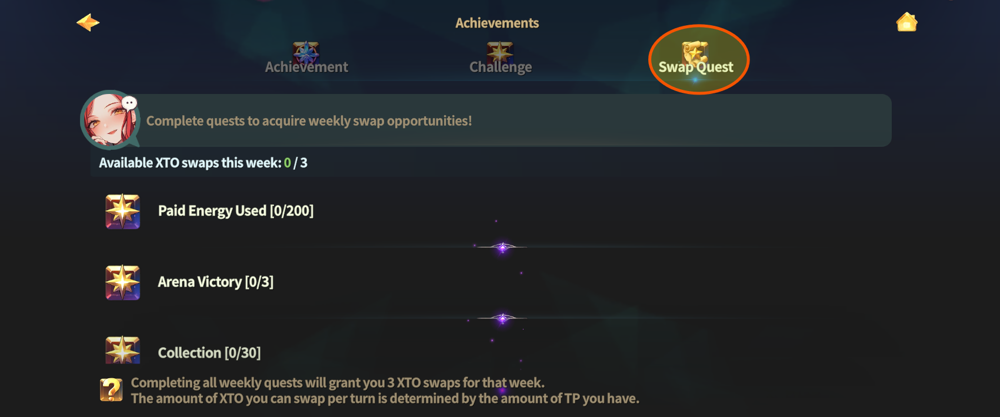
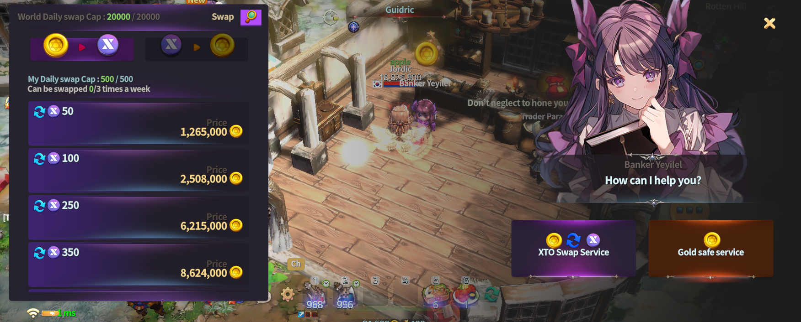

# 📚 Weekly swap Quests

<figure><figcaption></figcaption></figure>



### 🔄 Weekly Swap Quest Guide

Weekly Swap Quests are **weekly content** that grant you the permission\
to swap Gold into **XTO** through normal gameplay.

You must **complete the Weekly Swap Quests** in order to swap Gold for XTO\
during that specific week.

***

### ◾ What Are Weekly Swap Quests?

Weekly Swap Quests are a **weekly objective system** designed to encourage\
balanced participation across EXTOCIUM’s various contents.

By engaging in activities such as\
using Energy, winning Arena battles, and participating in Raids,\
you can naturally complete Weekly Quests through regular play.

***

### ◾ How to Access Weekly Swap Quests

You can check Weekly Swap Quests by following the steps below.

1️⃣ Tap the **scroll-shaped icon** at the top of the main screen.

<figure><figcaption></figcaption></figure>

2️⃣ When the menu opens, select **\[Swap Quest]** to view the list of Weekly Swap Quests.

<figure><figcaption></figcaption></figure>

***

### ◾ How to Complete Weekly Swap Quests

* Each Weekly Quest has specific conditions.\
  Progress is filled as you complete them one by one.
* Once **all Weekly Quest conditions** are completed,\
  you gain the **swap permission for that week**.

***

### ◾ XTO Swap Availability

After completing all Weekly Swap Quests,\
you can swap [Gold for **XTO**](../xto-token/xto-swap-service/gold-greater-than-xto.md) through [**NPC YEYILEL**](../field-info/rotten-hill/npc-rotten-hill.md#yeyilel-yeireru) during that week.

<figure><figcaption></figcaption></figure>

***

✨

> **Weekly Swap Quests are not designed to restrict your gameplay.**\
> **They exist to support consistent and healthy gameplay over time.**
>
> **Complete the quests each week and don’t miss your opportunity to swap for XTO.**



### 🔄 주간 스왑 퀘스트 가이드

주간 스왑 퀘스트는\
게임 플레이를 통해 **골드를 XTO로 스왑할 수 있는 권한**을 얻는 주간 단위 콘텐츠입니다.

주간 스왑 퀘스트를 **완료해야만**, 해당 주간 동안 골드를 XTO로 스왑할 수 있습니다.

***

### ◾ 주간 스왑 퀘스트란?

주간 스왑 퀘스트는 \
EXTOCIUM의 다양한 콘텐츠를 골고루 플레이하도록 돕는 주간 목표 시스템입니다.\
에너지 사용, 아레나 승리, 레이드 참여 등 게임 내 여러 활동을 진행하면 \
주간 퀘스트가 자연스럽게 완료됩니다.

***

### ◾ 주간 스왑 퀘스트 메뉴 접근 방법

주간 스왑 퀘스트는 아래 순서로 확인할 수 있습니다.

1️⃣ **메인 화면 상단의 두루마리 모양 아이콘**을 터치합니다.

<figure><figcaption></figcaption></figure>

2️⃣ 메뉴가 열리면 **\[주간 퀘스트]** 항목을 선택하면 주간 퀘스트 목록이 표시됩니다.

<figure><figcaption></figcaption></figure>

***

### ◾ 주간 스왑 퀘스트 완료 방법

* 주간 퀘스트에 표시된 조건을 하나씩 달성하면 진행도가 채워집니다.
* 모든 주간 퀘스트 조건을 달성하면 해당 주간의 스왑 권한을 획득할 수 있습니다.

***

### ◾ XTO 스왑 가능 안내

주간 스왑 퀘스트를 모두 완료하면, 해당 주간 동안 [**NPC 예이렐**](../field-info/rotten-hill/npc-rotten-hill.md#yeyilel-yeireru)을 통해 [골드를 **XTO로 스왑**](../xto-token/xto-swap-service/gold-greater-than-xto.md)할 수 있습니다.

<figure><figcaption></figcaption></figure>

***

✨

> **주간 스왑 퀘스트는**\
> **플레이를 제한하기 위한 장치가 아니라, 지속적이고 건강한 게임 플레이를 돕기 위한 시스템입니다.**\
> **매주 퀘스트를 완료하고, XTO 스왑 기회를 놓치지 마세요.**



### 🔄 週間スワップクエスト ガイド

週間スワップクエストは、\
ゲームプレイを通じて **ゴールドをXTOにスワップする権限** を獲得できる\
**週単位のコンテンツ**です。

週間スワップクエストを **すべて完了してはじめて**、\
その週の間、ゴールドをXTOにスワップできるようになります。

***

### ◾ 週間スワップクエストとは？

週間スワップクエストは、EXTOCIUMのさまざまなコンテンツを\
バランスよくプレイすることを目的とした **週間目標システム**です。

エネルギーの使用、アリーナでの勝利、レイドへの参加など、\
ゲーム内の活動を進めることで 週間クエストは自然に達成されていきます。

***

### ◾ 週間スワップクエスト メニューへのアクセス方法

週間スワップクエストは、以下の手順で確認できます。

1️⃣ メイン画面上部の **巻物型アイコン** をタップします。

<figure><figcaption></figcaption></figure>

2️⃣ メニューが開いたら、\
&#xNAN;**［週間クエスト］** を選択すると 週間スワップクエストの一覧が表示されます。

<figure><figcaption></figcaption></figure>

***

### ◾ 週間スワップクエストの完了方法

* 表示されている週間クエストの条件を 1つずつ達成すると進行度が上がります。
* **すべての週間クエスト条件を達成**すると、その週の **スワップ権限** を獲得できます。

***

### ◾ XTOスワップについて

週間スワップクエストをすべて完了すると、その週の間、[NPC **イェイレル** ](../field-info/rotten-hill/npc-rotten-hill.md#yeyilel-yeireru)を通じて\
[ゴールドを **XTOにスワップ**](../xto-token/xto-swap-service/gold-greater-than-xto.md) することができます。

<figure><figcaption></figcaption></figure>

***

✨

> **週間スワップクエストは、プレイを制限するための仕組みではありません。**\
> **継続的で健全なゲームプレイを サポートするためのシステムです。**\
> **毎週クエストを完了して、XTOスワップのチャンスを逃さないようにしましょう。**



<em>※ This guide was written based on the game status as of January 20, 2026,</em>  <em>and its contents may change with future updates.</em>

