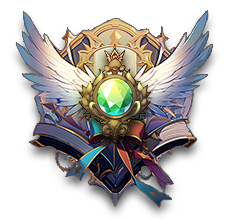
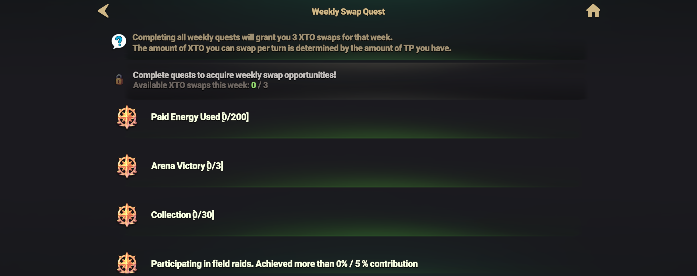

# 📚 Weekly swap Quests

<figure><figcaption></figcaption></figure>

<figure><figcaption></figcaption></figure>



💡 **Want to swap your gold for XTO? Complete the Weekly Quest!**

To **swap your hard-earned gold for XTO**, you must first complete the **Weekly Quest**.\
This system is designed to **maintain the stability of the XTO ecosystem** by encouraging participation in EXTOCIUM activities such as **energy consumption, arena victories, and raid participation**.

### 🎯 **Accessing the Weekly Quest Menu**

👉 Tap the **Guide button at the top of the main HUD** to access the Weekly Quest menu.

<figure><figcaption></figcaption></figure>

👉 Select the **'Weekly Quest' tab** to open the quest menu.

<figure><figcaption></figcaption></figure>

👉 Once the quest menu is open, the list of Weekly Quests will be displayed.

<figure><figcaption></figcaption></figure>

### 🔓 Completing the Weekly Quest & Swapping XTO

* If you successfully **complete all Weekly Quest requirements**, you will be able to[ **swap gold for XTO**](../xto-token/xto-swap-service/gold-greater-than-xto.md#eng) **through**[ **NPC Yeyilel**](../field-info/rotten-hill/npc-rotten-hill.md#yeyilel-yeireru) for that week.
* (❗ For details on the XTO swap limit, please refer to the [link](../xto-token/xto-swap-service/gold-greater-than-xto.md#conditions-for-swapping) provided.)

🔄 **Complete Weekly Quests and Earn a Chance to Swap XTO!**



💡 **XTO로 스왑하고 싶다면, 주간 퀘스트를 완료하세요!**

열심히 채굴한 골드를 **XTO로 스왑**하려면, **주간 퀘스트를 해결해야 합니다.**\
주간 퀘스트는 XTO의 **건강한 생태계를 유지하기 위해 도입된 시스템**으로,\
**에너지 사용, 아레나 승리, 레이드 참여** 등 **EXTOCIUM 생태계 내 다양한 활동을 유도**합니다!

### 🎯 **주간 퀘스트 메뉴 접근 방법**

👉 **메인 HUD 상단의 가이드 버튼을 터치**하여 주간 퀘스트 메뉴에 접근하세요.

<figure><figcaption></figcaption></figure>

👉 **'주간 퀘스트' 탭을 터치**하면 퀘스트 메뉴가 열립니다.

<figure><figcaption></figcaption></figure>

👉 퀘스트 메뉴가 열리면 **주간 퀘스트 목록이 표시됩니다.**

<figure><figcaption></figcaption></figure>

### 🔓 **주간 퀘스트 완료 & XTO 스왑**

* 주간 퀘스트 조건을 **모두 달성하면**, 해당 주간 동안 **'**[**NPC 예이렐**](../field-info/rotten-hill/npc-rotten-hill.md#yeyilel-yeireru)**'을 통해** [**골드를 XTO로 스왑**](../xto-token/xto-swap-service/gold-greater-than-xto.md#undefined-1)할 수 있습니다.
* (❗ XTO 스왑 가능량에 대한 자세한 내용은[ 링크](../xto-token/xto-swap-service/gold-greater-than-xto.md#undefined-2)를 참고하세요.)

🔄 **주간 퀘스트를 완료하고 XTO 스왑 기회를 얻으세요!**



💡 **XTOへスワップしたいですか？ それなら週間クエストをクリアしましょう！**

**貴重なゴールドをXTOへスワップするためには**、まず **週間クエストを完了** する必要があります。\
このシステムは、**XTOの安定したエコシステムを維持するために導入** されており、\
**エネルギーの消費、アリーナでの勝利、レイドへの参加** など、EXTOCIUM内での活動を促進します。

### 🎯 週間クエストメニューのアクセス方法

👉 **メインHUD上部のガイドボタン** をタップして、週間クエストメニューにアクセスしてください。

<figure><figcaption></figcaption></figure>

👉 **「週間クエスト」タブ** をタップすると、クエストメニューが開きます。

<figure><figcaption></figcaption></figure>

👉 クエストメニューを開くと、**週間クエストの一覧が表示** されます。

<figure><figcaption></figcaption></figure>

### 🔓 **週間クエストの完了 & XTOスワップ**

週間クエストの条件を**すべて達成すると**、その週の間 [**NPCイェイレル**](../field-info/rotten-hill/npc-rotten-hill.md#yeyilel-yeireru)**を通じて**[**ゴールドをXTO**](../xto-token/xto-swap-service/gold-greater-than-xto.md#ri-ben-yu)**へスワップ** できるようになります。\
(❗ XTOスワップ可能量の詳細については、[**リンク**](../xto-token/xto-swap-service/gold-greater-than-xto.md#jiao-huan-ke-neng-tiao-jian)をご参照ください。)

🔄 **週間クエストをクリアして、XTOスワップのチャンスを獲得しよう！**


