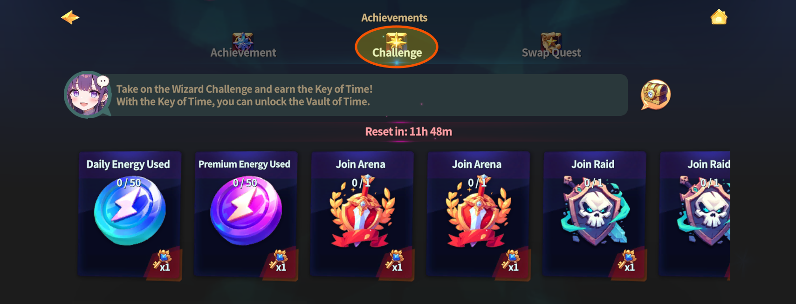

# 🪩 Wizard Challenge

<figure><figcaption></figcaption></figure>



### 🧙‍♂️ Wizard Challenge Guide

The Wizard Challenge is a **daily challenge content** that runs for **24 hours each day**.

Every day, multiple **Challenge Cards** are generated based on normal gameplay.\
By completing these challenges, you can earn **Keys**.

The Keys you earn are used to open the **Vault of Time**,\
allowing you to claim resources that have been stored inside the vault.

***

### ◾ What Is the Wizard Challenge?

The Wizard Challenge is a system designed to let players\
naturally take on challenges while enjoying EXTOCIUM’s various contents.

Challenge Cards may include activities such as:

* Performing PK or being defeated through PK
* Participating in Raids
* Playing different game modes
* Consuming Energy

Most challenges can be completed naturally through regular gameplay.

***

### ◾ Challenge Cards & Earning Keys

Multiple **Challenge Cards** are displayed in the Wizard Challenge.

Each card shows its completion condition and reward.\
Once the condition is met, tap the Challenge Card to obtain a **Key**.

***

### ◾ Opening the Vault of Time

When you collect a certain number of Keys, you can open the **Vault of Time**.\
Opening the vault allows you to claim resources that were automatically stored\
through field activities.

***

### ◾ How to Access the Wizard Challenge

You can access the Wizard Challenge by following the steps below.

1️⃣ Tap the **scroll-shaped icon** at the top of the main screen.

<figure><figcaption></figcaption></figure>

2️⃣ Tap **\[Challenge]** at the top to view the list of Challenge Cards and your current progress.

<figure><figcaption></figcaption></figure>

Once a challenge is completed, 👉 tap the Challenge Card to claim your Key immediately.

***

✨

> **Once a day, check your Challenge Cards and open the Vault of Time.**



### 🧙‍♂️ 위자드 챌린지 가이드

위자드 챌린지는 매일 **24시간 동안 진행할 수 있는 일일 도전 콘텐츠**입니다.

게임을 플레이하며 달성할 수 있는 여러 가지 **도전 카드**가 매일 새롭게 생성되며,\
도전을 완료하면 **열쇠(Key)**&#xB97C; 획득할 수 있습니다.

획득한 열쇠는 **시간의 금고(Vault of Time)**&#xB97C; 열어, 금고에 보관된 재화를 수령하는 데 사용됩니다.

***

### ◾ 위자드 챌린지란?

위자드 챌린지는 \
EXTOCIUM의 다양한 콘텐츠를 즐기며 자연스럽게 도전할 수 있도록 구성된 시스템입니다.

도전 카드에는 다음과 같은 활동이 포함됩니다.

* PK 진행 또는 PK로 사망하기
* 레이드 참여하기
* 다양한 게임 모드 플레이
* 에너지 소비하기

대부분의 도전은 일반적인 플레이 과정에서 자연스럽게 달성할 수 있습니다.

***

### ◾ 도전 카드와 열쇠 획득

위자드 챌린지에는 여러 장의 **도전 카드**가 표시됩니다.

각 도전 카드에는 달성 조건과 보상이 함께 표시되며, \
도전 조건을 만족하면 해당 도전 카드를 터치해 **열쇠(Key)**&#xB97C; 획득할 수 있습니다.

***

### ◾ 시간의 금고(Time Vault) 열기

일정 개수의 열쇠를 모으면 **시간의 금고를 개방**할 수 있습니다.\
금고를 열면, 필드 활동을 통해 자동으로 보관되어 있던 재화를 수령할 수 있습니다.

***

### ◾ 위자드 챌린지 메뉴 접근 방법

위자드 챌린지는 아래 순서로 확인할 수 있습니다.

1️⃣ **메인 화면 상단의 두루마리 모양 아이콘**을 터치합니다.

<figure><figcaption></figcaption></figure>

2️⃣ 상단에서 **\[챌린지]**&#xB97C; 터치하면 도전 카드 목록과 현재 진행 상황을 확인할 수 있습니다.

<figure><figcaption></figcaption></figure>

도전을 완료했다면, 👉 해당 도전 카드를 터치해 열쇠를 바로 획득하세요.

***

✨

> **하루 한 번,도전 카드를 확인하고 시간의 금고를 열어 보세요.**



### 🧙‍♂️ ウィザードチャレンジ ガイド

ウィザードチャレンジは、**毎日24時間プレイできる日替わりチャレンジコンテンツ**です。

ゲームをプレイすることで達成できる 複数の**チャレンジカード**が毎日生成され、\
チャレンジを達成すると **鍵（Key）** を獲得できます。

獲得した鍵は、**時間の金庫（Vault of Time）**&#x3092;開き、\
金庫に保管されている資源を受け取るために使用されます。

***

### ◾ ウィザードチャレンジとは？

ウィザードチャレンジは、EXTOCIUMのさまざまなコンテンツを楽しみながら、\
自然に挑戦できるよう構成されたシステムです。

チャレンジカードには、次のような内容が含まれます。

* PKを行う、またはPKによって倒される
* レイドに参加する
* さまざまなゲームモードをプレイする
* エネルギーを消費する

多くのチャレンジは、通常のプレイを行う中で 自然に達成できます。

***

### ◾ チャレンジカードと鍵の獲得

ウィザードチャレンジでは、複数の**チャレンジカード**が表示されます。

各カードには、達成条件と報酬が表示されており、条件を満たすと\
カードをタップして **鍵（Key）** を獲得できます。

***

### ◾ 時間の金庫（Vault of Time）を開く

一定数の鍵を集めると、**時間の金庫**を開くことができます。\
金庫を開くと、フィールド活動を通じて 自動的に保管されていた資源を受け取れます。

***

### ◾ ウィザードチャレンジ メニューへのアクセス方法

ウィザードチャレンジは、以下の手順で確認できます。

1️⃣ メイン画面上部の **巻物型アイコン**をタップします。

<figure><figcaption></figcaption></figure>

2️⃣ 上部の **［チャレンジ］** をタップすると、チャレンジカード一覧と\
現在の進行状況を確認できます。

<figure><figcaption></figcaption></figure>

チャレンジを達成したら、👉 該当するカードをタップして すぐに鍵を受け取りましょう。

***

✨

> **1日1回、チャレンジカードを確認して 時間の金庫を開いてみましょう。**



<em>※ This guide was written based on the game status as of January 20, 2026,</em>  <em>and its contents may change with future updates.</em>

