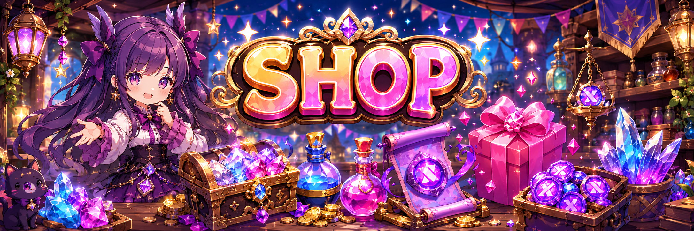

# 🎁 Shop

<figure><figcaption></figcaption></figure>



### 🛒 Shop

In the Shop, \
you can use **Gems, BNB, and XTO tokens**  to access a variety of items and content.

You can access the Shop by opening the Dashboard\
from the left-side menu on the main screen.

<figure><figcaption></figcaption></figure>

***

#### ◾ Shop Overview

The Shop is organized into multiple menus\
based on different purposes such as currency usage, information viewing, and rentals.

You can also **top up Gems through the Gem Store**.

Use the menus below to navigate to each Shop and related content.

***

#### ◾ Shop Menu Shortcuts

* **Gem Store**\
  👇 A store where you can top up Gems


[gem-store.md](gem-store.md)


* **BNB / Gem Shop**\
  👇 View items available for purchase using BNB or Gems


[bnb-gem-shop.md](bnb-gem-shop.md)


* **XTO Shop**\
  👇 View items available for purchase using XTO tokens


[xto-shop.md](xto-shop.md)


* **X-Point Shop**\
  👇 A dedicated shop where items can be purchased using **X Points** obtained through [XTO holding](../../xto-token/xto-holding-service/) or Shop purchases


[x-point-shop.md](x-point-shop.md)


* **Skin Info**\
  👇 View detailed information on currently available skins


[skin-info.md](skin-info.md)


* **Asset Rental**\
  👇 Rent Heroes and Weapons for a limited period of time


[asset-rental](asset-rental/)


Detailed information for each menu can be found on its respective guide page.

***

✨

> **Choose the right currency and content, and make the most of the Shop efficiently.**



### 🛒 상점 (Shop)

상점에서는 **Gem, BNB, XTO 토큰**을 사용해 다양한 아이템과 콘텐츠를 이용할 수 있습니다.\
메인 화면 좌측 메뉴에서 대시보드에 접속하면 상점을 이용할 수 있습니다.

<figure><figcaption></figcaption></figure>

***

#### ◾ 상점 이용 안내

상점은 재화 사용, 정보 확인, 렌탈 등 용도에 따라 여러 메뉴로 구성되어 있습니다.\
또한, **Gem Store를 통해 Gem을 충전**할 수 있습니다.

아래 메뉴를 통해 각 상점 및 관련 콘텐츠로 이동할 수 있습니다.

***

#### ◾ 상점 메뉴 바로가기

* **Gem Store**\
  👇 Gem을 충전할 수 있는 상점


[gem-store.md](gem-store.md)


* **BNB / Gem Shop**\
  👇 BNB 또는 Gem으로 구매 가능한 아이템 확인


[bnb-gem-shop.md](bnb-gem-shop.md)


* **XTO Shop**\
  👇 XTO 토큰으로 구매 가능한 아이템 확인


[xto-shop.md](xto-shop.md)


* **X-Point Shop**\
  👇 [XTO 홀딩](../../xto-token/xto-holding-service/) 또는 상점 구매를 통해 획득한 X Point로 이용 가능한 전용 상점


[x-point-shop.md](x-point-shop.md)


* **Skin Info**\
  👇 현재 판매 중인 스킨의 상세 정보 확인


[skin-info.md](skin-info.md)


* **Asset Rental**\
  👇 영웅 및 무기를 일정 기간 동안 렌탈 가능


[asset-rental](asset-rental/)


각 메뉴의 자세한 내용은 해당 가이드 페이지에서 확인할 수 있습니다.

***

✨

> **필요한 재화와 콘텐츠를 선택해, 상점을 더욱 효율적으로 활용해 보세요.**



### 🛒 ショップ（Shop）

ショップでは、**ジェム、BNB、XTOトークン**を使用して\
さまざまなアイテムやコンテンツを利用できます。

メイン画面左側のメニューから ダッシュボードにアクセスすると、ショップを利用できます。

<figure><figcaption></figcaption></figure>

***

#### ◾ショップ利用案内

ショップは、\
通貨の使用、情報の確認、レンタルなど、用途に応じて複数のメニューで構成されています。

また、**ジェムストアを通じてジェムをチャージ**できます。

以下のメニューから、各ショップおよび関連コンテンツへ移動できます。

***

#### ◾ ショップメニュー一覧

* **ジェムストア（Gem Store）**\
  👇 ジェムをチャージできるショップ


[gem-store.md](gem-store.md)


* **BNB / ジェムショップ**\
  👇 BNBまたはジェムで購入可能なアイテムを確認


[bnb-gem-shop.md](bnb-gem-shop.md)


* **XTOショップ**\
  👇 XTOトークンで購入可能なアイテムを確認


[xto-shop.md](xto-shop.md)


* **Xポイントショップ（X-Point Shop）**\
  👇 [XTOの保有](../../xto-token/xto-holding-service/)やショップ購入で獲得した Xポイント専用のショップ


[x-point-shop.md](x-point-shop.md)


* **スキン情報（Skin Info）**\
  👇 現在販売中のスキンの詳細情報を確認


[skin-info.md](skin-info.md)


* **アセットレンタル（Asset Rental）**\
  👇 ヒーローや武器を一定期間レンタル可能


[asset-rental](asset-rental/)


各メニューの詳細は、それぞれのガイドページをご確認ください。

***

✨

> **目的に合った通貨やコンテンツを選び、ショップを効率的に活用しましょう。**



<em>※ This guide was written based on the game status as of January 27, 2026,</em>  <em>and its contents may change with future updates.</em>

