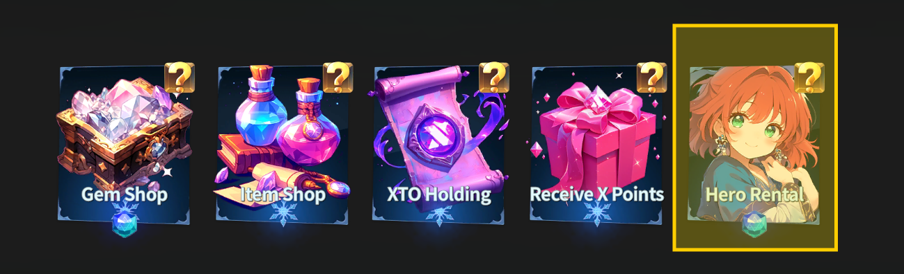
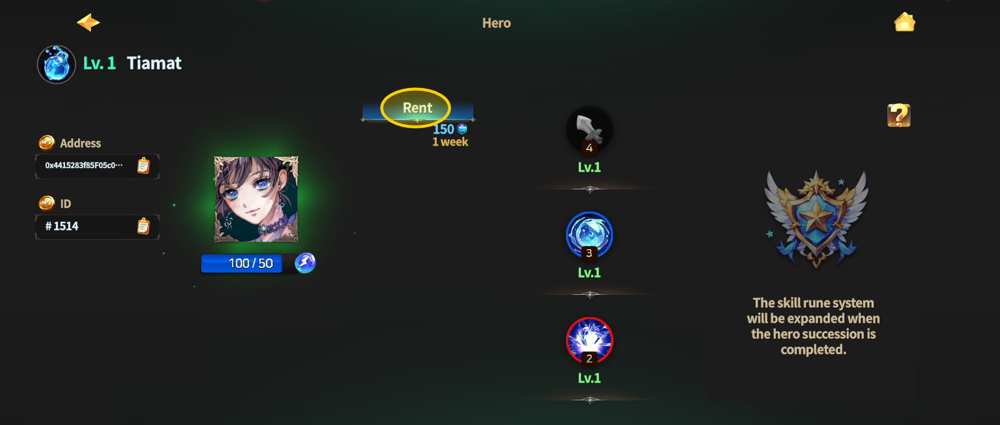
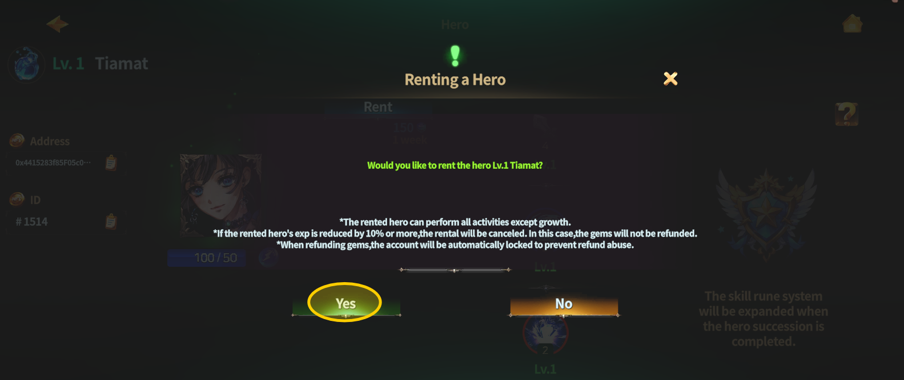
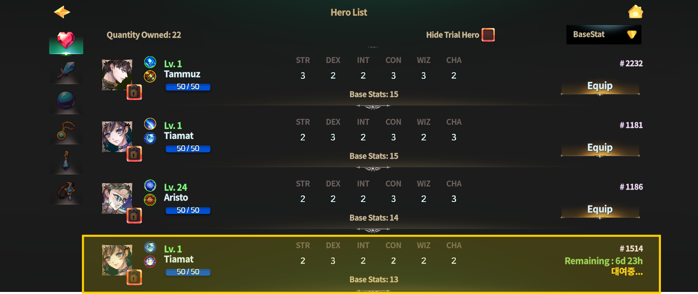
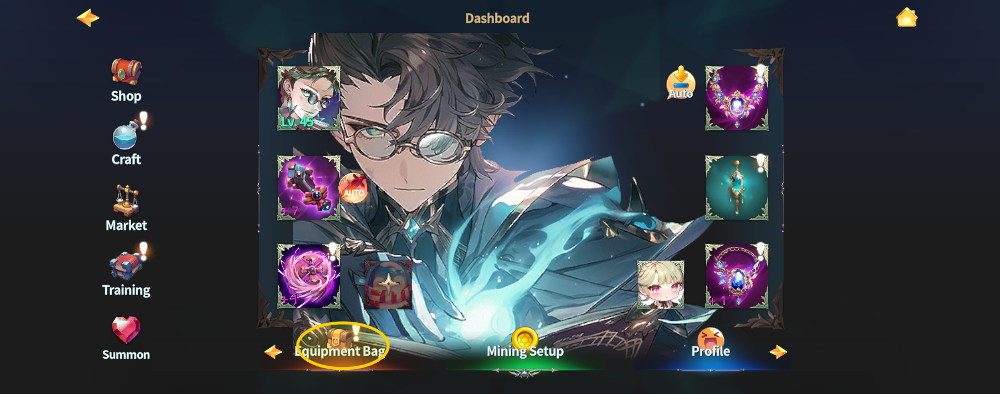
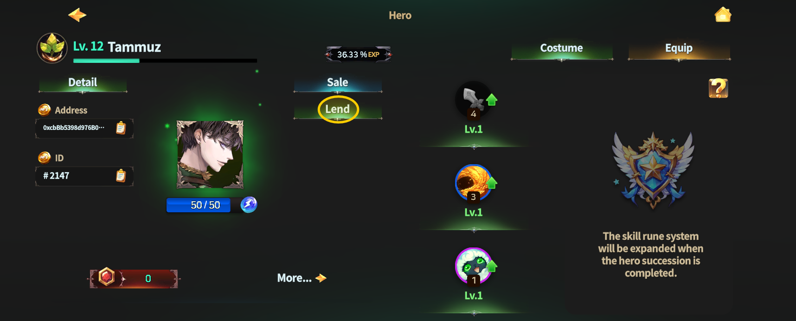
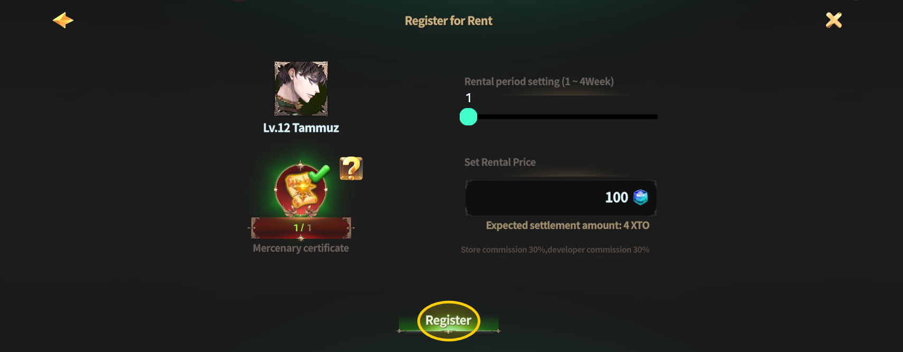
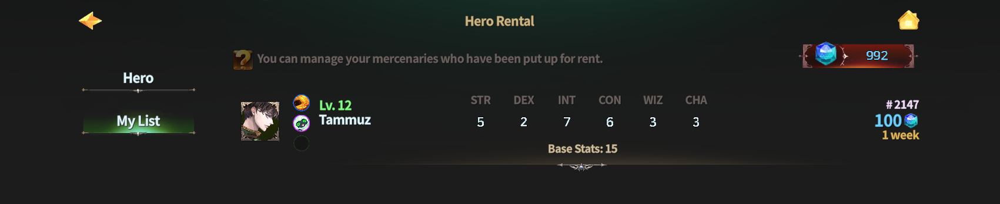
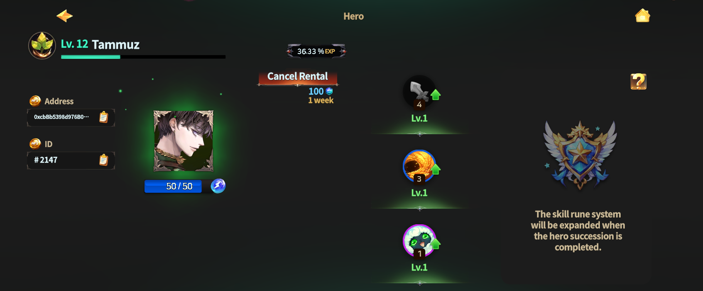

# 🧝 Hero Rental

<figure><figcaption></figcaption></figure>



### ⚔️ Hero Rental System Guide

The Hero Rental System allows Adventurers\
to participate in combat by **renting Heroes**, even without owning an NFT Hero.

In addition,\
you can **list your own NFT Heroes for rental**,\
allowing other players to rent them and earn **XTO rewards**.

Through this system,\
you can try Heroes firsthand or generate additional income using your owned assets.

***

#### ◾ What is the Hero Rental System?

The Hero Rental System offers two ways to use the service:

* **Rent a Hero**\
  👉 Rent a Hero owned by another player for a limited period
* **List Hero for Rental**\
  👉 List your own Hero for rental and earn XTO rewards

***

#### ◾ Rent a Hero

By renting a Hero, you can use **Gems** to play with the Hero for a limited time.

**◾ Rental Basics**

* Payment Method: Gems
* Rental Period: 1 to 4 weeks
* Rental duration and price are set by the Hero owner

**◾ Rental Hero Restrictions**

* EXP can be earned
* SP distribution and skill upgrades are not available
* Gold and item drops are available
* All combat content is accessible, including PK and Arena
* Gold ↔ XTO swaps require owning an NFT on the account


#### **◾** Important Notes

* To prevent EXP abuse,\
  the rental will be **automatically canceled if the Hero’s EXP decreases by 10% or more**.
* If the rental is canceled, **Gems used for the rental will not be refunded**.
* Please manage EXP carefully while using a rented Hero.


***

#### ◾ How to Rent a Hero

1️⃣ From the main HUD, go to the **Dashboard**.

<figure><figcaption></figcaption></figure>

2️⃣ Select **Shop > Hero Rental** from the Dashboard.

<figure><figcaption></figcaption></figure>

3️⃣ Choose the Hero you wish to rent.

<figure><figcaption></figcaption></figure>

4️⃣ Select the **Rent** button on the Hero’s detail screen.

<figure><figcaption></figcaption></figure>

5️⃣ Confirm the details and proceed with the rental.

<figure><figcaption></figcaption></figure>

6️⃣ The rented Hero can be found in your **Equipment Bag**.

<figure><figcaption></figcaption></figure>

***

#### ◾List Hero for Rental

You can list your owned NFT Hero for rental, allowing other players to rent it.\
Once the rental period ends, you will receive **XTO rewards** based on your set conditions.


#### **◾** Before Listing a Hero

* A connected wallet is required to list an NFT Hero for rental.
* Listing a Hero for rental will **reset Arena trophies**.


**◾ How to List a Hero for Rental**

1️⃣ From the Dashboard, go to the **Equipment Bag**.

<figure><figcaption></figcaption></figure>

2️⃣ Select the Hero you want to list for rental.

3️⃣ On the Hero detail screen, select **List for Rental**.

<figure><figcaption></figcaption></figure>

4️⃣ Set the rental period between **1 and 4 weeks**.

5️⃣ Set your desired rental price.

* Based on the price you set,\
  the **total XTO amount** you will receive after the rental ends will be displayed.

<figure><figcaption></figcaption></figure>

6️⃣ Complete the listing, then approve it in MetaMask by selecting **Confirm**.

<figure><figcaption></figcaption></figure>

7️⃣ You can check your listed Hero under **Shop > Hero Rental > My List**.

<figure><figcaption></figcaption></figure>

8️⃣ You can cancel a listed Hero’s rental at any time from the **Equipment Bag**.

<figure><figcaption></figcaption></figure>

***

✨

> **Rent Heroes to experience combat firsthand,**\
> **or list your own Heroes for rental to earn XTO rewards.**\
> **Use the Hero Rental System to enjoy strategic gameplay**\
> **and unlock new earning opportunities.**



### ⚔️ 영웅 렌탈 시스템 가이드 (Hero Rental System)

영웅 렌탈 시스템은\
**NFT 영웅을 보유하지 않은 모험가도 영웅을 빌려 전투에 참여할 수 있는 시스템**입니다.

또한, **내가 보유한 NFT 영웅을 렌탈로 등록하여 다른 유저에게 대여하고 XTO 보상을 획득할 수도 있습니다.**\
이 시스템을 통해 영웅을 직접 사용해 보거나, 보유 자산을 활용해 추가 수익을 얻을 수 있습니다.

***

#### ◾ 영웅 렌탈 시스템이란?

영웅 렌탈 시스템에서는 아래 두 가지 방식의 이용이 가능합니다.

* [**영웅 대여하기**](hero-rental.md#rent-a-hero)\
  👉 다른 유저의 영웅을 일정 기간 빌려 사용
* [**영웅 대여 등록하기**](hero-rental.md#list-hero-for-rental)\
  👉 내가 보유한 영웅을 렌탈로 등록하여 XTO 보상 획득

***

#### ◾ 영웅 대여하기 (Rent a Hero)

영웅을 대여하면 Gem을 사용해 **일정 기간 동안 영웅을 빌려 플레이**할 수 있습니다.

**◾ 대여 기본 정보**

* 결제 방식: Gem 사용
* 대여 기간: 1주 \~ 4주
* 대여 기간 및 가격은 영웅 등록자가 설정합니다.

**◾ 대여 영웅 이용 제한**

* EXP 획득 가능
* SP 분배 및 스킬 업그레이드 불가
* 골드 및 아이템 획득 가능
* PK, 아레나 등 모든 전투 콘텐츠 이용 가능
* 골드 ↔ XTO 스왑은 계정 내 NFT 보유 시에만 가능


#### **◾ 주의 사항**

* EXP 어뷰징 방지를 위해 대여 영웅의 EXP가 **10% 이상 감소할 경우 대여가 자동 취소**됩니다.
* 대여가 취소될 경우 **지불한 Gem은 반환되지 않습니다.**
* 대여 중 EXP 감소에 유의해 주세요.


***

#### ◾ 영웅 대여 방법

1️⃣ 메인 HUD에서 **대시보드**로 이동합니다.

<figure><figcaption></figcaption></figure>

2️⃣ 대시보드에서 **Shop > Hero Rental** 메뉴를 선택합니다.

<figure><figcaption></figcaption></figure>

3️⃣ 대여할 영웅을 선택합니다.

<figure><figcaption></figcaption></figure>

4️⃣ 상세 정보 화면에서 **Rent** 버튼을 선택합니다.

<figure><figcaption></figcaption></figure>

5️⃣ 확인 창에서 다시 한 번 확인 후 대여를 진행합니다.

<figure><figcaption></figcaption></figure>

6️⃣ 대여한 영웅은 **장비 가방**에서 확인할 수 있습니다.

<figure><figcaption></figcaption></figure>

***

#### ◾ 영웅 대여 등록하기 (List Hero for Rental)

보유 중인 NFT 영웅을 렌탈로 등록하여 다른 유저에게 대여할 수 있습니다.\
대여 기간이 종료되면 **설정한 조건에 따라 XTO 보상을 획득**합니다.


#### **◾ 대여 등록 전 확인 사항**

* NFT 영웅 대여 등록을 위해 **지갑 연결이 필수**입니다.
* 영웅을 대여 등록할 경우 **아레나 트로피가 초기화**됩니다.


**◾ 영웅 대여 등록 방법**

1️⃣ 대시보드에서 **장비 가방**으로 이동합니다.

<figure><figcaption></figcaption></figure>

2️⃣ 대여 등록할 영웅을 선택합니다.

3️⃣ 상세 정보 화면에서 **대여 등록** 버튼을 선택합니다.

<figure><figcaption></figcaption></figure>

4️⃣ 대여 기간을 **1주 \~ 4주** 사이로 설정합니다.

5️⃣ 원하는 대여 가격을 설정합니다.

* 설정된 가격에 따라 대여 종료 후 획득할 **총 XTO 수량**이 표시됩니다.

<figure><figcaption></figcaption></figure>

6️⃣ 대여 등록을 완료한 후, MetaMask에서 **Confirm** 버튼을 눌러 승인합니다.

<figure><figcaption></figcaption></figure>

7️⃣ 등록된 영웅은 **Shop > Hero Rental > 내 목록**에서 확인할 수 있습니다.

<figure><figcaption></figcaption></figure>

8️⃣ 대여 등록한 영웅은 **장비 가방에서 언제든지 대여 등록을 취소할 수 있습니다.**

<figure><figcaption></figcaption></figure>

***

✨

> **영웅을 빌려 전투를 경험하거나,**\
> **내 영웅을 렌탈로 등록해 XTO 보상을 획득해 보세요.**\
> **영웅 렌탈 시스템을 통해 전략적인 플레이와 새로운 수익 기회를 함께 즐길 수 있습니다.**



### ⚔️ ヒーローレンタルシステムガイド（Hero Rental System）

ヒーローレンタルシステムは、**NFTヒーローを所持していない冒険者でも、**\
**ヒーローをレンタルして戦闘に参加できるシステム**です。

また、**自分が所持しているNFTヒーローをレンタル登録し、**\
**他のプレイヤーに貸し出してXTO報酬を獲得することも可能**です。

このシステムを通じて、\
ヒーローを実際に使用して体験したり、保有資産を活用して追加収益を得ることができます。

***

#### ◾ ヒーローレンタルシステムとは？

ヒーローレンタルシステムでは、以下の2つの利用方法があります。

* **ヒーローをレンタルする**\
  👉 他のプレイヤーのヒーローを一定期間借りて使用
* **ヒーローをレンタル登録する**\
  👉 所持しているヒーローをレンタル登録し、XTO報酬を獲得

***

#### ◾ ヒーローをレンタルする（Rent a Hero）

ヒーローをレンタルすると、**ジェムを使用して一定期間ヒーローを借りてプレイ**できます。

**◾ レンタル基本情報**

* 支払い方法：ジェム
* レンタル期間：1週間～4週間
* レンタル期間および価格は、ヒーロー登録者が設定します。

**◾ レンタルヒーローの制限**

* EXPの獲得：可能
* SPの振り分けおよびスキル強化：不可
* ゴールドおよびアイテム獲得：可能
* PK、アリーナなどすべての戦闘コンテンツに参加可能
* ゴールド ↔ XTOのスワップは、アカウント内にNFTを所持している場合のみ可能


#### **◾** 注意事項

* EXPの不正利用防止のため、レンタルヒーローのEXPが**10％以上減少した場合、**\
  **レンタルは自動的にキャンセル**されます。
* レンタルがキャンセルされた場合、**支払ったジェムは返還されません。**
* レンタル中はEXPの減少にご注意ください。


***

#### ◾ ヒーローのレンタル方法

1️⃣ メインHUDから**ダッシュボード**へ移動します。

<figure><figcaption></figcaption></figure>

2️⃣ ダッシュボードで **Shop > Hero Rental** を選択します。

<figure><figcaption></figcaption></figure>

3️⃣ レンタルしたいヒーローを選択します。

<figure><figcaption></figcaption></figure>

4️⃣ 詳細情報画面で **Rent** ボタンを選択します。

<figure><figcaption></figcaption></figure>

5️⃣ 確認画面でもう一度確認し、レンタルを進めます。

<figure><figcaption></figcaption></figure>

6️⃣ レンタルしたヒーローは **装備バッグ**で確認できます。

<figure><figcaption></figcaption></figure>

***

#### ◾ ヒーローをレンタル登録する（List Hero for Rental）

所持しているNFTヒーローをレンタル登録し、他のプレイヤーに貸し出すことができます。\
レンタル期間終了後、設定した条件に応じて **XTO報酬**を獲得します。


#### **◾** レンタル登録前の確認事項

* NFTヒーローをレンタル登録するには、**ウォレット接続が必須**です。
* ヒーローをレンタル登録すると、**アリーナトロフィーがリセット**されます。


**◾ ヒーローのレンタル登録方法**

1️⃣ ダッシュボードから **装備バッグ**へ移動します。

<figure><figcaption></figcaption></figure>

2️⃣ レンタル登録するヒーローを選択します。

3️⃣ 詳細情報画面で **レンタル登録** ボタンを選択します。

<figure><figcaption></figcaption></figure>

4️⃣ レンタル期間を **1週間～4週間** の間で設定します。

5️⃣ 希望するレンタル価格を設定します。

* 設定した価格に応じて、レンタル終了後に獲得できる **合計XTO数量**が表示されます。

<figure><figcaption></figcaption></figure>

6️⃣ レンタル登録を完了した後、MetaMaskで **Confirm** ボタンを押して承認します。

<figure><figcaption></figcaption></figure>

7️⃣ 登録したヒーローは **Shop > Hero Rental > マイリスト** で確認できます。

<figure><figcaption></figcaption></figure>

8️⃣ レンタル登録したヒーローは、**装備バッグからいつでもレンタル登録をキャンセル可能**です。

<figure><figcaption></figcaption></figure>

***

✨

> **ヒーローをレンタルして戦闘を体験したり、**\
> **自分のヒーローをレンタル登録してXTO報酬を獲得しましょう。**\
> **ヒーローレンタルシステムを通じて、**\
> **戦略的なプレイと新たな収益機会を同時にお楽しみください。**



<em>※ This guide was written based on the game status as of January 29, 2026,</em>  <em>and its contents may change with future updates.</em>

