# 😎 Skin info

| 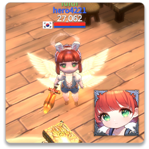 | 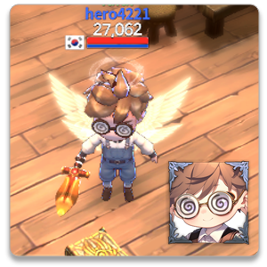  |
| -------------------------------------------------------------------------------------- | ----------------------------------------------------- |
| 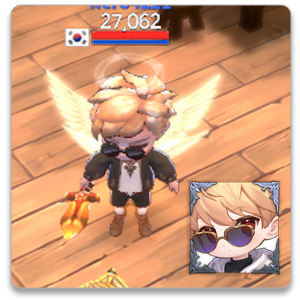                               | 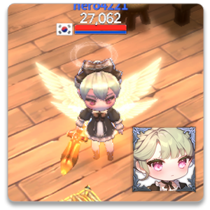 |
| 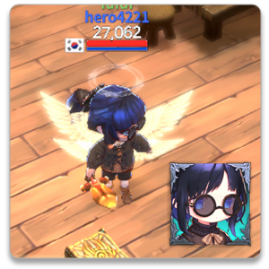                                 | 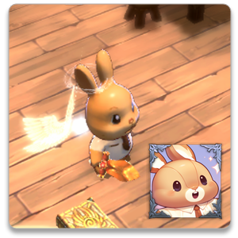           |
| 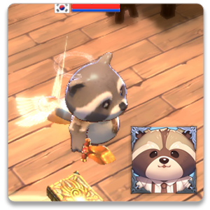                                            | 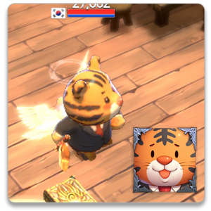            |
| 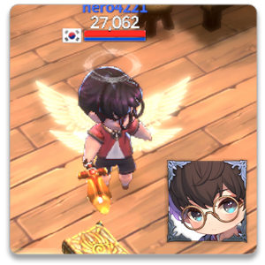                                  | 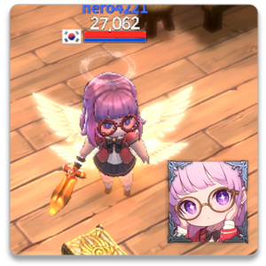 |
|                                   | 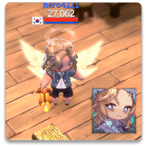 |
| 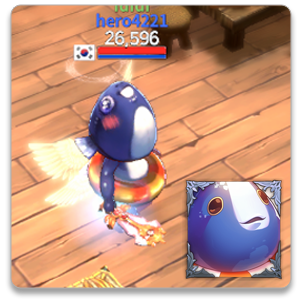                                            | 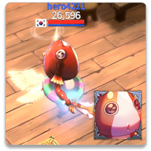            |

<em>※ This guide was written based on the game status as of January 27, 2026,</em>  <em>and its contents may change with future updates.</em>

