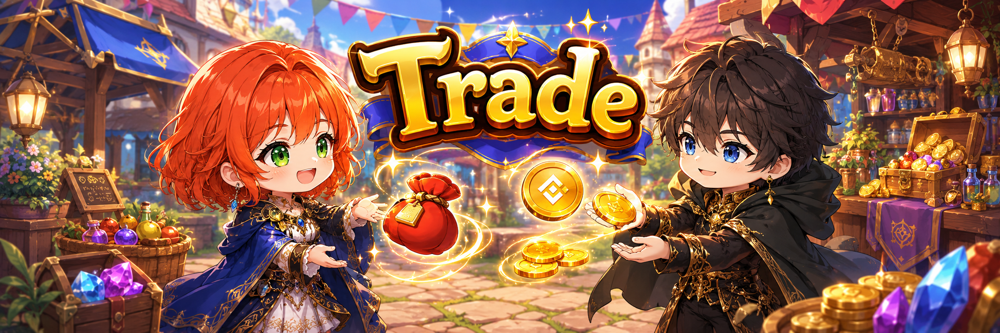

# 📈 Trade

<figure><figcaption></figcaption></figure>



### 🔁 Trade

Trade is a space where you can **exchange items and NFTs with other Wizards**.

You can choose your preferred trading method,\
either through the Marketplace or by trading directly with other Wizards.

In addition, an **Escrow system** is provided\
to safely conduct **player-to-player equipment trades within the game**.

***

#### ◾ Trade Content Overview

Within the Trade menu, you can use the following trading methods:

* **Market**\
  👇 List and trade items and NFTs through the marketplace


[market](market/)


* **Personal Trade**\
  👇 Trade directly with a specific Wizard


[personal-trade.md](personal-trade.md)


* **Escrow**\
  👇 A secure system designed for player-to-player equipment trading within the game


[escrow.md](escrow.md)


Detailed instructions for each trading method can be found on their respective guide pages.

***

✨

> **Choose the trading method that fits your needs and enjoy safe and efficient trades.**



### 🔁 트레이드 (Trade)

트레이드는 **아이템과 NFT를 다른 위자드들과 거래할 수 있는 공간**입니다.\
거래 방식을 선택하여 거래소를 통한 거래 또는 위자드 간 직접 거래를 진행할 수 있습니다.\
또한, 게임 내 개인 간 장비 거래를 안전하게 진행할 수 있는 에스크로 시스템이 제공됩니다.

***

#### ◾ 트레이드 콘텐츠 구성

트레이드 메뉴에서는 아래의 거래 방식을 이용할 수 있습니다.

* **마켓 (Market)**\
  👇 아이템 및 NFT를 등록하고 거래소에서 거래


[market](market/)


* **개인 거래 (Personal Trade)**\
  👇 특정 위자드와 직접 거래 진행


[personal-trade.md](personal-trade.md)


* **에스크로 (Escrow)**\
  👇 게임 내 개인 간 장비 거래를 위한 안전 거래 시스템


[escrow.md](escrow.md)


각 거래 방식의 자세한 이용 방법은 해당 가이드 페이지에서 확인할 수 있습니다.

***

✨

> **거래 방식을 선택하고, 안전하고 효율적인 거래를 진행해 보세요.**



### 🔁 トレード（Trade）

トレードは、**他のウィザードとアイテムやNFTを取引できる空間**です。

取引方法を選択することで、\
マーケットを通じた取引、またはウィザード同士の直接取引を行うことができます。

また、**ゲーム内での個人間装備取引を安全に行うための エスクローシステム**が提供されています。

***

#### ◾ トレードコンテンツ構成

トレードメニューでは、以下の取引方法を利用できます。

* **マーケット（Market）**\
  👇 アイテムやNFTを登録し、マーケットで取引


[market](market/)


* **個人取引（Personal Trade）**\
  👇 特定のウィザードと直接取引


[personal-trade.md](personal-trade.md)


* **エスクロー（Escrow）**\
  👇 ゲーム内の個人間装備取引のための安全な取引システム


[escrow.md](escrow.md)


各取引方法の詳しい利用方法は、それぞれのガイドページをご確認ください。

***

✨

> **目的に合った取引方法を選び、安全かつ効率的な取引を行いましょう。**



<em>※ This guide was written based on the game status as of January 28, 2026,</em>  <em>and its contents may change with future updates.</em>

