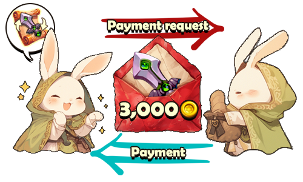

# 📩 Escrow

<figure><figcaption></figcaption></figure>



### 🛡️ Escrow System Guide

The Escrow System allows you to safely trade equipment with a specific adventurer in-game.

Instead of using an open space like the Market, \
you can conduct a **1:1 equipment trade** with a chosen player.\
Until the trade is completed, a **third party (the system)** securely holds the equipment.

***

### ◾ Escrow Trade Roles

There are two roles in an Escrow trade.

😊 **A: Payment Requester**\
The adventurer who sends the equipment and requests payment.

😎 **B: Payment Sender**\
The adventurer who reviews the request and pays the requested amount.

***

### ◾ Escrow Trade Process

Escrow trades proceed in the following order:

1️⃣ [Send a payment request](escrow.md#send-a-payment-request-a)\
2️⃣ [Respond to the payment request](escrow.md#respond-to-a-payment-request-b)\
3️⃣ [How to obtain an Equipment Trade Ticket](escrow.md#how-to-obtain-an-equipment-trade-ticket)

***

### ◾ **Send a Payment Request (A)**

1️⃣ While holding an **Equipment Trade Ticket**, go to **Mailbox > Escrow**.\
2️⃣ Select the **Send** button at the bottom right.

<figure><figcaption></figcaption></figure>

3️⃣ Select the equipment to send. <mark style="color:$danger;">**※ NFT equipment trading is not supported at this time.**<mark style="color:$danger;">\
4️⃣ Enter the trading partner’s **in-game nickname** accurately.\
5️⃣ Enter the requested **payment amount (Gold)**. \
<mark style="color:$danger;">※ Currently, only Gold is supported. Payment requests using XTO and BNB will be added in future updates.<mark style="color:$danger;">

<figure><figcaption></figcaption></figure>

6️⃣ Select **Send** to complete the payment request.\
At this point, **1 Equipment Trade Ticket** is consumed.

<figure><figcaption></figcaption></figure>

***


#### ◾ Payment Request Mail Validity

Escrow payment request mail is valid for **24 hours**.\
After 24 hours, the mail is automatically deleted.

※ We recommend discussing the trade with the other party in advance.


***

### ◾ Respond to a Payment Request (B)

1️⃣ When A sends an Escrow request, the mail arrives in **Mailbox > Escrow** for B.

<figure><figcaption></figcaption></figure>

2️⃣ Review the payment request details.

<figure><figcaption></figcaption></figure>

3️⃣ When you respond to the request, the trade is completed,\
and the item can be checked in the **in-game mailbox**.

<figure><figcaption></figcaption></figure>

If you do not respond to the request, the mail will be automatically deleted after 24 hours.

***

### ◾ How to Obtain an Equipment Trade Ticket

You can obtain an Equipment Trade Ticket using the methods below.

1️⃣ Purchase from **Shop > Item Shop > XTO** category.

<figure><figcaption></figcaption></figure>

2️⃣ Use **X Points** obtained from holding XTO to purchase a\
[**Special Material Random Box**](../loot-box-info/random-box.md#special-material-random-box), which can drop **Equipment Trade Ticket Fragments** at a certain probability.

<figure><figcaption></figcaption></figure>

3️⃣ Collect **Equipment Trade Ticket Fragments** and craft them to create an **Equipment Trade Ticket**.

<figure><figcaption></figcaption></figure>

***

✨

> **With equipment safely held by the system and payments confirmed before completion,**\
> **use the Escrow System to trade equipment with confidence and peace of mind.**



### 🛡️ 에스크로 시스템 안내

에스크로 시스템은 게임 내에서 **특정 모험가와 장비를 안전하게 거래**할 수 있는 기능입니다.

마켓처럼 공개된 공간이 아닌, 지정한 상대와 **1:1로 장비 거래**를 진행할 수 있으며,\
거래가 완료될 때까지 **제3자(시스템)**&#xAC00; 장비를 안전하게 보관합니다.

***

### ◾ 에스크로 거래 역할 안내

에스크로 거래에는 두 명의 역할이 있습니다.

😊 **A: 대금 요청자**\
장비를 보내고, 대금을 요청하는 모험가

😎 **B: 대금 지불자**\
요청을 확인하고, 대금을 지불하는 모험가

***

### ◾ 에스크로 거래 진행 순서

에스크로 거래는 아래 순서로 진행됩니다.

1️⃣ [대금 요청 보내기](escrow.md#a)\
2️⃣ [대금 요청에 응답하기](escrow.md#b)\
3️⃣ [장비 거래권 획득 방법](escrow.md#undefined-5)

***

### ◾ 대금 요청 보내기 (A)

1️⃣ **장비 거래권**을 보유한 상태에서 **우편함 > 에스크로** 탭으로 이동합니다.\
2️⃣ 우측 하단의 **보내기** 버튼을 선택합니다.

<figure><figcaption></figcaption></figure>

3️⃣ 보낼 **장비**를 선택합니다. <mark style="color:$danger;">※ 현재는<mark style="color:$danger;"> <mark style="color:$danger;"> <mark style="color:$danger;">**NFT 장비 거래는 지원하지 않습니다.**<mark style="color:$danger;">\
4️⃣ 거래할 상대의 **게임 닉네임을 정확히 입력**합니다.\
5️⃣ 요청할 **대금(골드)**&#xC744; 입력합니다. <mark style="color:$danger;">※ 현재는 골드만 지원되며, 추후 XTO 및 BNB 대금 요청 기능이 추가될 예정입니다.<mark style="color:$danger;">

<figure><figcaption></figcaption></figure>

6️⃣ **보내기** 버튼을 선택하면, 대금 요청이 완료되고 **장비 거래권 1장**이 소모됩니다.

<figure><figcaption></figcaption></figure>

***


#### ◾ **대금 요청 우편 유효 기간 안내**

에스크로 대금 요청 우편은 **24시간 동안 유효**합니다.\
24시간이 지나면 우편은 자동으로 삭제됩니다.\
&#xNAN;**※ 거래 전, 상대방과 미리 협의하는 것을 권장합니다.**


***

### ◾ 대금 요청에 응답하기 (B)

1️⃣ A가 에스크로를 보내면, B의 **우편함 > 에스크로** 탭으로 우편이 도착합니다.

<figure><figcaption></figcaption></figure>

2️⃣ 도착한 대금 요청 내용을 확인합니다.

<figure><figcaption></figcaption></figure>

3️⃣ 요청에 응답하면 거래가 완료되며, 아이템은 인게임 우편함에서 확인할 수 있습니다.

<figure><figcaption></figcaption></figure>

요청에 응답하지 않을 경우, 우편을 그대로 두면 24시간 후 자동으로 삭제됩니다.

***

### ◾ 장비 거래권 획득 방법

장비 거래권은 아래 방법으로 획득할 수 있습니다.

1️⃣ **상점 > 아이템 상점 > XTO** 카테고리에서 구매

<figure><figcaption></figcaption></figure>

2️⃣ XTO 홀딩으로 획득한 **X 포인트**를 사용해 [**Special Material Random Box**](../loot-box-info/random-box.md#special-material-random-box)를 구매하면,\
확률적으로 **장비 거래권 조각**을 획득할 수 있습니다.

<figure><figcaption></figcaption></figure>

3️⃣ 획득한 **장비 거래권 조각**을 모아 제작을 통해 **장비 거래권**으로 만들 수 있습니다.

<figure><figcaption></figcaption></figure>

***

✨

> **장비는 시스템이 안전하게 보관하고, 대금은 확인 후 거래되는 에스크로 시스템으로**\
> **안심하고 장비 거래를 진행해 보세요.**



### 🛡️ エスクローシステム案内

エスクローシステムは、ゲーム内で特定の冒険者と**装備を安全に取引できる機能**です。\
マーケットのような公開された場所ではなく、\
指定した相手と**1:1で装備取引**を行うことができます。\
取引が完了するまで、**第三者（システム）**&#x304C;装備を安全に保管します。

***

### ◾ エスクロー取引の役割

エスクロー取引には、以下の2つの役割があります。

😊 **A：代金リクエスト側**\
装備を送付し、代金を請求する冒険者

😎 **B：代金支払側**\
リクエスト内容を確認し、代金を支払う冒険者

***

### ◾ エスクロー取引の進行手順

エスクロー取引は、以下の順序で進行します。

1️⃣ [代金リクエストを送る](escrow.md#rikuesutoworua)\
2️⃣ [代金リクエストに応答する](escrow.md#rikuesutonisurub)\
3️⃣ [装備取引券の入手方法](escrow.md#no)

***

### ◾ 代金リクエストを送る（A）

1️⃣ **装備取引券**を所持した状態で、**メールボックス ＞ エスクロー** タブへ移動します。\
2️⃣ 右下の **送信** ボタンを選択します。

<figure><figcaption></figcaption></figure>

3️⃣ 送信する**装備**を選択します。<mark style="color:$danger;">※ 現在、<mark style="color:$danger;"><mark style="color:$danger;">**NFT装備の取引は対応していません。**<mark style="color:$danger;">\
4️⃣ 取引相手の**ゲーム内ニックネーム**を正確に入力します。\
5️⃣ 請求する**代金（ゴールド）**&#x3092;入力します。\
<mark style="color:$danger;">※ 現在はゴールドのみ対応しており、今後、XTOおよびBNBでの代金請求機能が追加される予定です。<mark style="color:$danger;">

<figure><figcaption></figcaption></figure>

6️⃣ **送信**ボタンを選択すると、代金リクエストが完了し、**装備取引券が1枚消費**されます。

<figure><figcaption></figcaption></figure>

***


#### ◾ 代金リクエストメールの有効期間

エスクローの代金リクエストメールは、**24時間有効**です。\
24時間が経過すると、メールは自動的に削除されます。

※ 取引前に、相手と事前に相談することをおすすめします。


***

### ◾ 代金リクエストに応答する（B）

1️⃣ Aがエスクローを送信すると、Bの **メールボックス ＞ エスクロー** タブにメールが届きます。

<figure><figcaption></figcaption></figure>

2️⃣ 届いた代金リクエストの内容を確認します。

<figure><figcaption></figcaption></figure>

3️⃣ リクエストに応答すると取引が完了し、**アイテムはゲーム内メールボックスで確認できます。**

<figure><figcaption></figcaption></figure>

リクエストに応答しない場合、メールは24時間後に自動的に削除されます。

***

### ◾ 装備取引券の入手方法

装備取引券は、以下の方法で入手できます。

1️⃣ **ショップ ＞ アイテムショップ ＞ XTO** カテゴリで購入

<figure><figcaption></figcaption></figure>

2️⃣ XTOのホールディングで獲得した**Xポイント**を使用して\
[**Special Material Random Box**](../loot-box-info/random-box.md#special-material-random-box)を購入すると、確率で**装備取引券の欠片**を獲得できます。

<figure><figcaption></figcaption></figure>

3️⃣ 獲得した**装備取引券の欠片**を集め、制作によって**装備取引券**を作成できます。

<figure><figcaption></figcaption></figure>

***

✨

> **装備はシステムが安全に保管し、**\
> **代金を確認した後に取引が完了するエスクローシステムで、**\
> **安心して装備取引を行ってみましょう。**



<em>※ This guide was written based on the game status as of February 10, 2026,</em>  <em>and its contents may change with future updates.</em>

