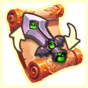

# 📩 Escrow

<figure><figcaption></figcaption></figure>



💡**The 'Escrow System' is a system for trading equipment between individuals within the game.**&#x20;

If you want to trade your equipment secretly with a specific person, rather than in an open space like the market, try using this system. Until the trade is successful, the attached items will be safely held by the 'company (third party)'.

**😊**<mark style="color:blue;">**A: Payment Requester**</mark>**&#x20;      😎**<mark style="color:orange;">**B: Payment Payer**</mark>

😊[Send request](escrow.md#send-request)\
😎[Respond to requests](escrow.md#respond-to-requests)\
✅[How to get ‘Equipment Trading Pass’](escrow.md#how-to-get-equipment-trading-pass)

### 😊Send request

<figure><figcaption></figcaption></figure>

1. A holds an 'Equipment Trade Pass' and goes to 'Mailbox' > 'Escrow' tab, then touches the 'Send' button at the bottom right.&#x20;
2. Select the equipment to send and accurately enter the game nickname of the recipient. (Currently, NFT equipment trading is not supported.)&#x20;
3. Enter the requested payment amount. (Currently, only gold payment is supported, but XTO and BNB payment requests will be implemented in the future.)&#x20;
4. Pressing the send button completes the payment request and consumes 1 'Equipment Trade Permit'.&#x20;
5. 🛑The payment request mail is valid for 1 day. After 1 day (24 hours), the mail will be automatically deleted. It is recommended to consult with the trading party in advance.\
   💠

### 😎Respond to requests

* If A sends an escrow, an escrow mail will arrive for B. Check the payment request sent to you in the 'Mailbox' > 'Escrow' category.&#x20;
* If you respond to the payment request, the trade will be successful!&#x20;
* If you do not want to respond to this request, leave the mail as it is. The mail will be automatically deleted after 24 hours.

### ✅How to get ‘Equipment Trading Pass’

<figure><figcaption></figcaption></figure>

Equipment trading pass can be purchased in the 'Shop > Item Shop > XTO' category. Additionally, from the items obtained through XTO holder drops, you can collect 'Equipment Trade Shard' from the [🌷Special Material Random Box](../loot-box-info/random-box.md#special-material-random-box) to craft an equipment trading pass.



�&#xDCA1;**'에스크로 시스템'은 게임 안에서 개인 간에 장비를 거래하기 위한 시스템입니다.**&#x20;

당신의 장비를 마켓과 같은 열린 공간이 아닌, 특정 개인과 비밀스럽게 거래하고 싶다면 이 시스템을 이용해 보세요. 거래가 성사될 때 까지 첨부된 아이템은 '회사(제 3자)'가 안전하게 보유하고 있게 됩니다.

**😊**<mark style="color:blue;">**A: 대금 요청자**</mark>**&#x20;      😎**<mark style="color:orange;">**B: 대금 지불자**</mark>

😊[요청 보내기](escrow.md#undefined-2)\
😎[요청에 응답하기](escrow.md#undefined-3)\
✅['장비 거래권' 획득 방법](escrow.md#undefined-4)

### 😊요청 보내기

<figure><figcaption></figcaption></figure>

1. A는 '장비 거래권'을 소지하고 '우편함' > '에스크로' 탭으로 이동하여 우측 하단의 '보내기' 버튼을 터치합니다.&#x20;
2. 보낼 장비를 선택하고, 보낼 사람의 게임 닉네임을 정확히 입력해주세요. ( 현재는 NFT 장비 거래는 지원하지 않습니다. )
3. 요청할 대금을 입력합니다. (현재는 골드 대금만 지원되며, 추후 XTO 및  BNB 대금 요청도 구현 예정입니다. )
4. 보내기 버튼을 누르면, 대금 요청이 완료되고, '장비 거래권'이 1장 소모됩니다.
5. 🛑대금 요청 우편은 1일간 유효합니다. 1일(24시간)이 지나면 우편이 자동 소멸됩니다. 사전에 거래 당사자와 협의 하는 것을 추천합니다.

### 😎요청에 응답하기

* A가 에스크로를 보내면 B에게 에스크로 우편이 도착합니다. '우편함' > '에스크로' 카테고리에서 나에게 도착한 대금 요청을 확인하세요.
* 대금 요청에 응하면 거래가 성사됩니다!
* 이 요청에 응하고 싶지 않다면 우편을 그대로 두세요. 24시간이 지나면 우편이 자동 소거 됩니다.

### ✅'장비 거래권' 획득 방법

<figure><figcaption></figcaption></figure>

장비 거래권은 '상점 > 아이템 상점 > XTO' 카테고리에서 구입할 수 있습니다. \
또한XTO 홀더 드랍을 통해 얻은 아이템 중, [🌷Special Material Random Box](../loot-box-info/random-box.md#special-material-random-box) 에서 나온 '장비 거래권 조각'을 모아 장비 거래권을 제작할 수도 있습니다.&#x20;



�&#xDCA1;**「エスクロー・システム」はゲーム内で個人間で装備を取引するためのシステムです。**

あなたの装備をマーケットのような公開された場所ではなく、特定の個人と秘密裏に取引したい場合は、このシステムを利用してみてください。取引が成立するまで、添付された装備は「会社(第三者)」が安全に保持しています。

**😊**<mark style="color:blue;">**A: 請求者**</mark>**&#x20;      😎**<mark style="color:orange;">**B: 支払者**</mark>

😊[リクエストを送る](escrow.md#rikuesutoworu)\
😎[リクエストに応答する](escrow.md#rikuesutonisuru)\
✅[「装備取引許可」の入手方法](escrow.md#no)

### 😊リクエストを送る

<figure><figcaption></figcaption></figure>

1. Aは「装備取引権」を所持し、「メールボックス」>「エスクロー」タブに移動して、右下の「送信」ボタンをタッチします。&#x20;
2. 送信する装備を選択し、受信者のゲームのニックネームを正確に入力してください。(現在、NFT装備の取引はサポートされていません)&#x20;
3. 要求する代金額を入力します。(現在はゴールド代金のみサポートされており、今後XTOおよびBNBでの代金要求も実装予定です)&#x20;
4. 送信ボタンを押すと代金要求が完了し、「装備取引権」が1枚消費されます。&#x20;
5. 🛑代金要求の郵便は1日間有効です。1日(24時間)経過すると郵便は自動的に消滅します。事前に取引当事者と協議することをおすすめします。

### 😎リクエストに応答する

* Aがエスクローを送ると、Bにエスクローメールが届きます。「メールボックス」>「エスクロー」カテゴリーで受け取った支払いリクエストを確認してください。&#x20;
* 支払いリクエストに応じると、取引が成立します！&#x20;
* このリクエストに応じたくない場合は、メールをそのままにしておいてください。24時間後にメールは自動的に削除されます。

### ✅「装備取引許可」の入手方法

<figure><figcaption></figcaption></figure>

装備取引券は、「ショップ > アイテムショップ > XTO」カテゴリで購入できます。\
さらに、XTOホルダードロップを通じて得られたアイテムの中で、[🌷Special Material Random Box](../loot-box-info/random-box.md#special-material-random-box)から出た「装備取引券の欠片」を集めて、装備取引券を作成することもできます。


