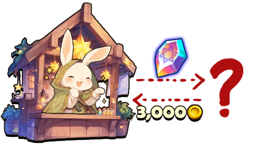

# ⚖️ Market

<figure><figcaption></figcaption></figure>



### ⚖️ Market

The Market is the official trading space where you can **buy and sell Items and NFTs**.

Within the Market, trading is divided by asset type,\
allowing you to access separate menus for **Item trading** and **NFT trading**,\
with dedicated options for buying and selling.

***

#### ◾ Market Content Overview

The Market provides the following trading categories:

* **Trading NFTs**\
  👇 Access features for NFT buying and selling, verification, and wallet registration


[trading-nfts](trading-nfts/)


* **Trading Items**\
  👇 Buy and sell in-game items


[trading-items](trading-items/)


Detailed instructions for each trading category can be found on their respective guide pages.

***

✨

> **Choose the appropriate category for your needs**\
> **and trade Items and NFTs efficiently through the Market.**



### ⚖️ 마켓 (Market)

마켓은 **아이템과 NFT를 거래할 수 있는 공식 거래 공간**입니다.

마켓에서는 거래 대상에 따라 **아이템 거래**와 **NFT 거래**로 구분된 메뉴를 이용할 수 있으며,\
구매와 판매를 각각 진행할 수 있습니다.

***

#### ◾ 마켓 콘텐츠 구성

마켓 메뉴에서는 아래 두 가지 거래 유형을 이용할 수 있습니다.

* **Trading NFTs**\
  👇 NFT의 구매 및 판매, 검증, 지갑 등록 관련 기능 제공


[trading-nfts](trading-nfts/)


* **Trading Items**\
  👇 게임 내 아이템의 구매 및 판매 기능 제공


[trading-items](trading-items/)


각 거래 유형의 자세한 이용 방법은 해당 가이드 페이지에서 확인할 수 있습니다.

***

✨

> **거래 목적에 맞는 메뉴를 선택하고, 마켓을 통해 아이템과 NFT를 효율적으로 거래해 보세요.**



### ⚖️ マーケット（Market）

マーケットは、**アイテムおよびNFTを売買できる公式取引スペース**です。

マーケット内では、取引対象ごとにメニューが分かれており、\
**アイテム取引**と**NFT取引**を選択して、それぞれ購入・販売を行うことができます。

***

#### ◾ マーケットコンテンツ構成

マーケットでは、以下の取引カテゴリを利用できます。

* **NFT取引（Trading NFTs）**\
  👇 NFTの購入・販売、検証およびウォレット登録機能を利用可能


[trading-nfts](trading-nfts/)


* **アイテム取引（Trading Items）**\
  👇 ゲーム内アイテムの購入・販売が可能


[trading-items](trading-items/)


各取引カテゴリの詳しい利用方法は、それぞれのガイドページをご確認ください。

***

✨

> **目的に合ったカテゴリを選び、マーケットで効率的に取引を行いましょう。**



<em>※ This guide was written based on the game status as of January 28, 2026,</em>  <em>and its contents may change with future updates.</em>

