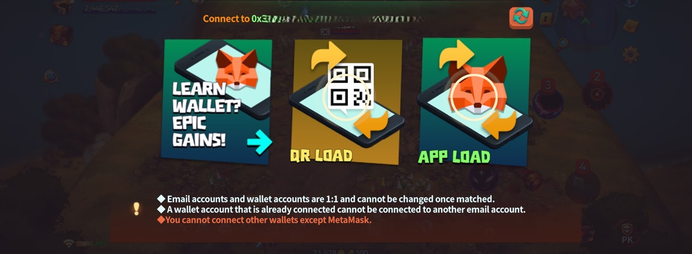

# 📥 Buy



### 🛒 Buy NFTs

This guide explains how to purchase NFTs through the **in-game Market**.\
NFT trading is **recommended through the in-game Market**.\
To purchase NFTs, your **MetaMask wallet must be connected**.

***


#### ◾ Before You Begin

* Make sure your wallet is properly connected.
* NFT purchases are not available if your wallet is not connected.


***

#### ◾ How to Buy NFTs

**1️⃣ Go to the Market**

* Tap the menu on the left side of the Main HUD to move to the **Dashboard**.

<figure><figcaption></figcaption></figure>

* From the Dashboard, select the **Market** menu.

<figure><figcaption></figcaption></figure>

***

**2️⃣ Select an NFT**

* Once you enter the Market, the NFT trading menu will be displayed.
* You can browse **Hero, Weapon, Orb, and Accessory NFTs**.
* Select the NFT you want to purchase.

<figure><figcaption></figcaption></figure>

***

**3️⃣ Check NFT Details**

* Select an NFT to open the **detail information panel**.

<figure><figcaption></figcaption></figure>

* Review the NFT’s stats, attributes, and transaction history.

<figure><figcaption></figcaption></figure>

***

**4️⃣ Proceed with Purchase**

* On the detail screen, select the **Purchase** button.

<figure><figcaption></figcaption></figure>

* If your wallet is not connected, a wallet connection prompt will appear.
* Connect your wallet, then proceed with the purchase.

<figure><figcaption></figcaption></figure>

* Select **Confirm** in your wallet to continue.

<figure><figcaption>
This is an example shown using test coins.
</figcaption></figure>

***

**5️⃣ Complete Purchase and Receive NFT**

* After selecting **Confirm** in MetaMask, the game screen will automatically appear.
* A **PROGRESS…** message will be shown at the top of the screen while the purchase is processed.

<figure><figcaption></figcaption></figure>

* Once processing is complete, a **purchase confirmation window** will appear.

<figure><figcaption></figcaption></figure>

* The purchased NFT can then be found in your **in-game Mailbox**.

<figure><figcaption></figcaption></figure>

* Receive the NFT from the Mailbox to add it to your inventory.

<figure><figcaption></figcaption></figure>

***


#### ◾ Important Notes

* Due to the nature of blockchain transactions,\
  processing may take a short amount of time.
* If the transaction result is not reflected immediately, please wait a moment.
* Wallet confirmation screens shown in this guide are **examples using test coins**.
* **Actual NFT purchases must be completed using BNB.**


***

✨

> If you encounter any issues during NFT purchase,\
> please check the [**Common Issues**](common-issues.md) tab for assistance.



### 🛒 NFT 구매하기&#x20;

이 가이드는 **인게임 마켓에서 NFT를 구매하는 방법**을 안내합니다.\
NFT 거래는 **인게임 마켓 이용을 권장**합니다.

NFT를 구매하려면 **MetaMask 지갑이 연결되어 있어야 합니다.**

***


#### ◾ 구매 전 확인 사항

* 지갑이 정상적으로 연결되어 있는지 확인하세요.
* 지갑이 연결되지 않은 상태에서는 NFT 구매가 불가능합니다.


***

#### ◾ NFT 구매 방법

**1️⃣ 마켓 이동**

* 메인 HUD 좌측 메뉴를 터치하여 **대시보드**로 이동합니다.

<figure><figcaption></figcaption></figure>

* 대시보드에서 **Market** 메뉴를 선택합니다.

<figure><figcaption></figcaption></figure>

***

**2️⃣ NFT 선택**

* 마켓에 접속하면 **NFT 거래 메뉴**가 표시됩니다.
* 영웅, 무기, 오브, 악세서리 NFT를 확인할 수 있습니다.
* 구매할 NFT를 선택합니다.

<figure><figcaption></figcaption></figure>

***

**3️⃣ NFT 정보 확인**

* NFT를 선택하면 **상세 정보 패널**이 표시됩니다.

<figure><figcaption></figcaption></figure>

* NFT의 능력, 속성, 거래 내역을 확인합니다.

<figure><figcaption></figcaption></figure>

***

**4️⃣ NFT 구매 진행**

* 상세 정보 화면에서 **Purchase버튼**을 선택합니다.

<figure><figcaption></figcaption></figure>

* 지갑이 연결되지 않은 경우, 지갑 연결 안내가 표시됩니다.
* 지갑을 연결한 후 구매를 진행합니다.

<figure><figcaption></figcaption></figure>

* 지갑에서 **Confirm** 버튼을 선택하면 구매가 진행됩니다.

<figure><figcaption>
테스트용 코인으로 진행된 예시입니다.
</figcaption></figure>

***

**5️⃣ 구매 완료 및 수령**

* MetaMask에서 **Confirm** 버튼을 선택하면 게임 화면으로 자동 전환됩니다.
* 게임 화면 상단에 **PROGRESS…** 메시지가 표시되며, 구매 처리가 진행됩니다.

<figure><figcaption></figcaption></figure>

* 처리가 완료되면 **구매 완료 안내 창**이 표시됩니다.

<figure><figcaption></figcaption></figure>

* 이후, 구매한 NFT는 인게임 **메일함**에서 확인할 수 있습니다.

<figure><figcaption></figcaption></figure>

* 메일함에서 NFT를 수령하면 인벤토리에 정상 반영됩니다.

<figure><figcaption></figcaption></figure>

***


#### ◾ 안내 사항

* 블록체인 거래 특성상, 거래 완료까지 약간의 시간이 소요될 수 있습니다.
* 거래 내역이 즉시 반영되지 않더라도 잠시 기다려 주세요.
* 가이드에 포함된 지갑 확인(Confirm) 화면은 테스트용 코인으로 진행된 예시입니다.
* 실제 NFT 구매 시에는 반드시 BNB로 결제를 진행해야 합니다.


***

✨

> NFT 구매 중 문제가 발생했다면, [**Common Issues**](common-issues.md) 탭에서 해결 방법을 확인할 수 있습니다.



### 🛒 NFTを購入する

このガイドでは、**インゲームマーケットでNFTを購入する方法**を説明します。\
NFTの取引は、**インゲームマーケットの利用を推奨**しています。\
NFTを購入するには、**MetaMaskウォレットの接続が必要**です。

***


#### ◾ 購入前の確認事項

* ウォレットが正常に接続されていることを確認してください。
* ウォレットが接続されていない場合、NFTを購入することはできません。


***

#### ◾ NFTの購入方法

**1️⃣ マーケットへ移動**

* メインHUD左側のメニューをタップして、**ダッシュボード**へ移動します。

<figure><figcaption></figcaption></figure>

* ダッシュボードから **Market** メニューを選択します。

<figure><figcaption></figcaption></figure>

***

**2️⃣ NFTを選択**

* マーケットに入ると、NFT取引メニューが表示されます。
* **ヒーロー / 武器 / オーブ / アクセサリーNFT**を確認できます。
* 購入したいNFTを選択します。

<figure><figcaption></figcaption></figure>

***

**3️⃣ NFTの情報を確認**

* NFTを選択すると、**詳細情報パネル**が表示されます。

<figure><figcaption></figcaption></figure>

* NFTの能力、属性、取引履歴を確認します。

<figure><figcaption></figcaption></figure>

***

**4️⃣ NFTを購入**

* 詳細画面で **Purchase** ボタンを選択します。

<figure><figcaption></figcaption></figure>

* ウォレットが接続されていない場合、接続案内が表示されます。
* ウォレットを接続後、購入を進めます。

<figure><figcaption></figcaption></figure>

* ウォレットで **Confirm** を選択すると、購入処理が開始されます。

<figure><figcaption>
テスト用コインで進行した例です。
</figcaption></figure>

***

**5️⃣ 購入完了・受け取り**

* MetaMaskで **Confirm** を選択すると、ゲーム画面へ自動的に戻ります。
* 画面上部に **PROGRESS…** と表示され、購入処理が進行します。

<figure><figcaption></figcaption></figure>

* 処理が完了すると、**購入完了の案内ウィンドウ**が表示されます。

<figure><figcaption></figcaption></figure>

* 購入したNFTは、インゲームの**メールボックス**で確認できます。

<figure><figcaption></figcaption></figure>

* メールボックスからNFTを受け取ると、インベントリに反映されます。

<figure><figcaption></figcaption></figure>

***


#### ◾ 注意事項

* ブロックチェーン取引の特性上、処理完了までに少し時間がかかる場合があります。
* 取引結果がすぐに反映されない場合は、しばらくお待ちください。
* 本ガイドに含まれるウォレット確認（Confirm）画面は、**テスト用コインでの例**です。
* **実際のNFT購入は、必ずBNBで行う必要があります。**


***

✨

> NFT購入中に問題が発生した場合は、\
> [**Common Issues**](common-issues.md) タブで解決方法を確認してください。



<em>※ This guide was written based on the game status as of January 30, 2026,</em>  <em>and its contents may change with future updates.</em>

