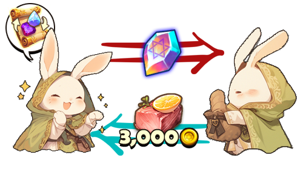

# 💰 Personal Trade

<figure><figcaption></figcaption></figure>



### 🔐 Personal Trade System Guide

The Personal Trade System lets you trade items and Gold 1:1 with a specific adventurer in-game.\
It’s for direct trading with a chosen player, instead of using an open space like the Market.


※ Personal Trades can only be used in Safe Zones.


***

### ◾ Send a Trade Request

1️⃣ Move close to the player you want to trade with while you have an **Item Trade Ticket** in your inventory.

<figure><figcaption></figcaption></figure>

2️⃣ Tap the **trade icon** above the other player’s character to send a trade request.

<figure><figcaption></figcaption></figure>

***

### ◾ Respond to a Trade Request

A trade request popup will appear on the other player’s screen.\
Select **Accept** to start the trade.

<figure><figcaption></figcaption></figure>

***

### ◾ Proceed with the Trade

When the trade window opens, you can register items and Gold.

<figure><figcaption></figcaption></figure>

◾ **Screen Layout**\
Top section: Items and Gold registered by the other player\
Bottom section: Items and Gold registered by you

◾ **How to Register Items**\
Drag the item you want to trade from the inventory on the left into the trade slot at the bottom-right.

◾ **How to Register Gold**\
Tap the Gold input field to enter the amount of Gold to send/receive.

***

### ◾ Lock and Confirm the Trade

<figure><figcaption></figcaption></figure>

* After registering all items and Gold, select the **Lock** button to send your registered details to the other player.\
  At this time, the amount the other player will actually receive after the trade fee is applied will be displayed.

> Example)\
> If you register **1,500,000 Gold**\
> → the other player will see **1,350,000 Gold** after the fee is applied.

* If the other player also selects **Lock**, the **Confirm** button becomes available.
* When both players select **Confirm**, the trade is completed.


Once the trade is completed,\
**1 Item Trade Ticket** is consumed from the player who sent the trade request.\
If either player cancels or the connection is interrupted during the trade, \
the trade is automatically canceled.


***

### ◾ Trade Complete & Item Collection

<figure><figcaption></figcaption></figure>

Completed trade items and Gold are delivered to the **in-game mailbox**.\
When you claim the items from the mailbox, they are automatically saved to your inventory.

***

### ◾ How to Obtain an Item Trade Ticket

You can obtain an Item Trade Ticket using the methods below.

1️⃣ Purchase from **Shop > Item Shop > XTO** category

<figure><figcaption></figcaption></figure>

2️⃣ You can use **X Points** obtained from holding XTO to purchase \
a [**Special Material Random Box**](../loot-box-info/random-box.md#special-material-random-box), and you can obtain **Item Trading Shard** \
from the box at a certain probability.

<figure><figcaption></figcaption></figure>

3️⃣ Collect the **Item Trade Ticket Fragments** you obtained and craft them to create an **Item Trade Ticket**.

<figure><figcaption></figcaption></figure>

***

✨

> **Double-check everything, trade safely,** \
> **and use the Personal Trade System with confidence.**



### 🔐 개인 거래 시스템 안내

개인 거래 시스템은 게임 내에서 특정 모험가와 **1:1로 아이템과 골드를 거래**할 수 있는 기능입니다.\
마켓처럼 공개된 공간이 아닌, 지정한 상대와 직접 거래하고 싶을 때 이용할 수 있습니다.


※ 개인 거래는 **안전 지역에서만** 이용할 수 있습니다.


***

### ◾ 거래 요청 보내기

1️⃣ 인벤토리에 **아이템 거래권**을 보유한 상태로 거래할 상대에게 가까이 이동합니다.

<figure><figcaption></figcaption></figure>

2️⃣ 상대 캐릭터 머리 위에 **거래 아이콘**을 터치하여 상대에게 거래 요청을 보냅니다.

<figure><figcaption></figcaption></figure>

***

### ◾ 거래 요청에 응답하기

상대방의 화면에 거래 요청 팝업이 표시됩니다.\
**수락** 버튼을 선택하면 거래가 시작됩니다.

<figure><figcaption></figcaption></figure>

***

### ◾ 거래 진행하기

거래 창이 열리면, 아이템과 골드를 등록할 수 있습니다.

<figure><figcaption></figcaption></figure>

◾ 화면 구성 안내\
상단 영역: 상대방이 등록한 아이템과 골드\
하단 영역: 내가 등록한 아이템과 골드

◾ 아이템 등록 방법\
좌측 인벤토리에서 거래할 아이템을 우측 하단의 거래 슬롯으로 드래그하여 등록합니다.

◾ 골드 등록 방법\
골드 입력 창을 터치하여 주고받을 골드를 입력합니다.

***

### ◾ 잠금 및 거래 확정

<figure><figcaption></figcaption></figure>

* 아이템과 골드를 모두 등록한 후 **잠금** 버튼을 선택하면, 상대방에게 나의 등록 정보가 전달됩니다.\
  이때, 거래 수수료가 적용된 **상대방이 실제로 받는 금액**이 표시됩니다.

> **예시)**\
> 150만 골드를 등록한 경우\
> → 상대방에게는 수수료를 제외한 **135만 골드**가 표시됩니다.

* 상대방도 **잠금** 버튼을 선택하면 **확인** 버튼이 활성화됩니다.
* 양측 모두 **확인** 버튼을 선택하면 거래가 완료됩니다.


거래가 완료되면, 거래 요청자의 **아이템 거래권 1장이 소모**됩니다.\
거래 중 한쪽이 취소하거나 연결이 끊어질 경우, 거래는 자동으로 취소됩니다.


***

### ◾ 거래 완료 및 아이템 수령

<figure><figcaption></figcaption></figure>

거래가 완료된 아이템과 골드는 **인게임 우편함**으로 지급됩니다.\
우편함에서 아이템을 수령하면 자동으로 인벤토리에 저장됩니다.

***

### ◾ 아이템 거래권 획득 방법

아이템 거래권은 아래 방법으로 획득할 수 있습니다.

1️⃣ **상점 > 아이템 상점 > XTO** 카테고리에서 구매

<figure><figcaption></figcaption></figure>

2️⃣ XTO 홀딩으로 획득한 X 포인트를 사용해 [**Special Material Random Box**](../loot-box-info/random-box.md#special-material-random-box)**를 구매**할 수 있으며,\
해당 박스에서 **확률적으로 아이템 거래권 조각을 획득**할 수 있습니다.

<figure><figcaption></figcaption></figure>

3️⃣ 획득한 **아이템 거래권 조각**을 모아 제작을 통해 **아이템 거래권**으로 만들 수 있습니다.

<figure><figcaption></figcaption></figure>

***

✨

> **신중하게 확인하고, 안전하게 거래하며 믿을 수 있는 개인 거래를 이용해 보세요.**



### 🔐 パーソナル取引システム案内

パーソナル取引システムは、\
ゲーム内で特定の冒険者と1:1でアイテムとゴールドを取引できる機能です。\
マーケットのような公開された場所ではなく、\
指定した相手と直接取引したいときに利用できます。


※ パーソナル取引は安全エリアでのみ利用できます。


***

### ◾ 取引リクエストを送る

1️⃣ インベントリに**アイテム取引券**を所持した状態で、取引したい相手に近づきます。

<figure><figcaption></figcaption></figure>

2️⃣ 相手キャラクターの頭上に表示される**取引アイコン**をタップして、\
取引リクエストを送ります。

<figure><figcaption></figcaption></figure>

***

### ◾ 取引リクエストに応答する

相手の画面に取引リクエストのポップアップが表示されます。\
**承諾**ボタンを選択すると取引が開始されます。

<figure><figcaption></figcaption></figure>

***

### ◾ 取引を進める

取引ウィンドウが開くと、アイテムとゴールドを登録できます。

<figure><figcaption></figcaption></figure>

◾ **画面構成案内**\
上段：相手が登録したアイテムとゴールド\
下段：自分が登録したアイテムとゴールド

◾ **アイテム登録方法**\
左側のインベントリから取引するアイテムを、右下の取引スロットへドラッグして登録します。

◾ **ゴールド登録方法**\
ゴールド入力欄をタップして、やり取りするゴールドを入力します。

***

### ◾ ロック・取引確定

<figure><figcaption></figcaption></figure>

* アイテムとゴールドをすべて登録した後、**ロック**ボタンを選択すると、\
  相手に自分の登録情報が送信されます。\
  このとき、取引手数料が適用された**相手が実際に受け取る金額**が表示されます。

> 例）\
> 150万ゴールドを登録した場合\
> → 相手には手数料を除いた**135万ゴールド**が表示されます。

* 相手も**ロック**ボタンを選択すると、**確認**ボタンが有効になります。
* 両者が**確認**ボタンを選択すると、取引が完了します。


取引が完了すると、取引リクエストを送った側の**アイテム取引券が1枚消費**されます。\
取引中にどちらかがキャンセルする、または接続が切れた場合、取引は自動的にキャンセルされます。


***

### ◾ 取引完了・アイテム受け取り

<figure><figcaption></figcaption></figure>

取引が完了したアイテムとゴールドは、ゲーム内の**メールボックス**に支給されます。\
メールボックスでアイテムを受け取ると、自動的にインベントリに保存されます。

***

### ◾ アイテム取引券の入手方法

アイテム取引券は、以下の方法で入手できます。

1️⃣ **ショップ ＞ アイテムショップ ＞ XTO** カテゴリで購入

<figure><figcaption></figcaption></figure>

2️⃣ XTOホールディングで獲得した**Xポイント**を使用して [**Special Material Random Box**](../loot-box-info/random-box.md#special-material-random-box) を購入でき、そのボックスから確率で**アイテム取引券の欠片**を獲得できます。

<figure><figcaption></figcaption></figure>

3️⃣ 獲得した**アイテム取引券の欠片**を集め、制作によって**アイテム取引券**を作成できます。

<figure><figcaption></figcaption></figure>

***

✨

> **内容を慎重に確認し、安全に取引しながら、**\
> **信頼できるパーソナル取引を利用してみましょう。**



<em>※ This guide was written based on the game status as of February 10, 2026,</em>  <em>and its contents may change with future updates.</em>

