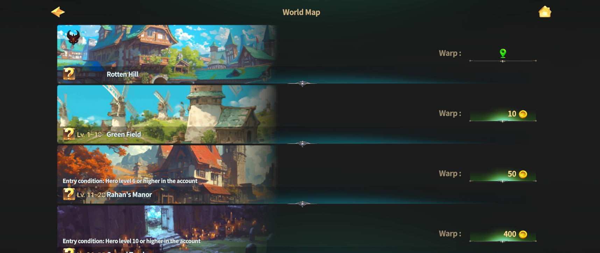

# ⛰️ Fields by level



### 🌍 Fields by Level

This page explains how to move between fields in EXTOCIUM.\
Each field listed below is organized by level,\
and selecting a field will show detailed information about that area.

***

### ◾ How to Move Between Fields

Follow the steps below to travel to different fields.

#### 1️⃣ Open the Navigation Menu

Touch the **Navigation button** at the top right of the Main HUD.

<figure><figcaption></figcaption></figure>

***

#### 2️⃣ Use the World Map

Once the World Map widget opens, you can view the list of available fields.

<figure><figcaption></figcaption></figure>


Each field must be unlocked **once by**\
**manually moving** your character and passing through a portal.\
After a field is unlocked, you can **warp to it anytime by paying Gold**.


***

#### ◾ PK Field Information

Some fields are designated as **PK areas**.\
For more details about PK fields, please refer to the [**PK page**](../../system/pk/).



### 🌍 레벨별 필드 안내

이 페이지에서는 엑스토시움에서 **필드 간 이동하는 방법**을 안내합니다.

아래에 표시된 각 필드는 레벨에 따라 구분되어 있으며,\
필드를 선택하면 해당 지역의 상세 정보를 확인할 수 있습니다.

***

### ◾ 필드 이동 방법

필드로 이동하는 방법은 다음과 같습니다.

#### 1️⃣ 네비게이션 메뉴 열기

메인 HUD 우측 상단에 있는 **네비게이션 버튼**을 터치하세요.

<figure><figcaption></figcaption></figure>

***

#### 2️⃣ 월드맵 이용하기

월드맵 위젯이 열리면, 이동 가능한 필드 목록을 확인할 수 있습니다.

<figure><figcaption></figcaption></figure>


각 필드는 **최초 1회**, 캐릭터를 직접 이동하여 포탈을 통과해야 잠금이 해제됩니다.\
필드가 한 번 잠금 해제되면, 이후에는 **골드를 지불하여 언제든지 워프 이동**이 가능합니다.


***

#### ◾ PK 필드 안내

일부 필드는 **PK 지역**으로 설정되어 있습니다.\
PK 필드에 대한 자세한 내용은 [**PK 페이지**](../../system/pk/)를 참고해 주세요.



### 🌍 レベル別フィールド案内

このページでは、EXTOCIUMにおける**フィールド間の移動方法**を案内します。

下に表示されている各フィールドは\
レベル別に分類されており、フィールドを選択すると、そのエリアの詳細情報を確認できます。

***

### ◾ フィールド移動方法

フィールドへの移動方法は以下の通りです。

#### 1️⃣ ナビゲーションメニューを開く

メインHUD右上にある **ナビゲーションボタン**をタッチしてください。

<figure><figcaption></figcaption></figure>

***

#### 2️⃣ ワールドマップを利用する

ワールドマップウィジェットが開くと、移動可能なフィールド一覧を確認できます。

<figure><figcaption></figcaption></figure>


各フィールドは**最初の1回のみ**、キャラクターを直接操作して\
ポータルを通過することでロックが解除されます。\
一度ロックを解除すると、その後は**ゴールドを支払っていつでもワープ移動**が可能になります。


***

#### ◾ PKフィールド案内

一部のフィールドは **PKエリア**として設定されています。\
PKフィールドに関する詳しい内容は、[**PKページ**](../../system/pk/)をご確認ください。




[lv.10-green-field.md](lv.10-green-field.md)



[lv.20-rahans-manor](lv.20-rahans-manor/)



[lv.30-cursed-tomb.md](lv.30-cursed-tomb.md)



[lv.40-temple-of-agade.md](lv.40-temple-of-agade.md)



[lv.45-goblins-mine-pk.md](lv.45-goblins-mine-pk.md)



[lv.50-savage-forest-pk.md](lv.50-savage-forest-pk.md)



[lv.55-ancient-tears-pk.md](lv.55-ancient-tears-pk.md)


<em>※ This guide was written based on the game status as of January 23, 2026,</em>  <em>and its contents may change with future updates.</em>

