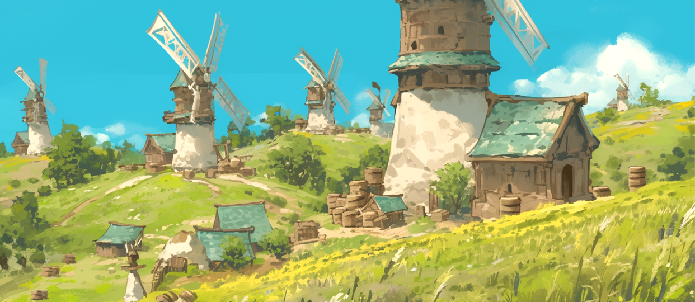
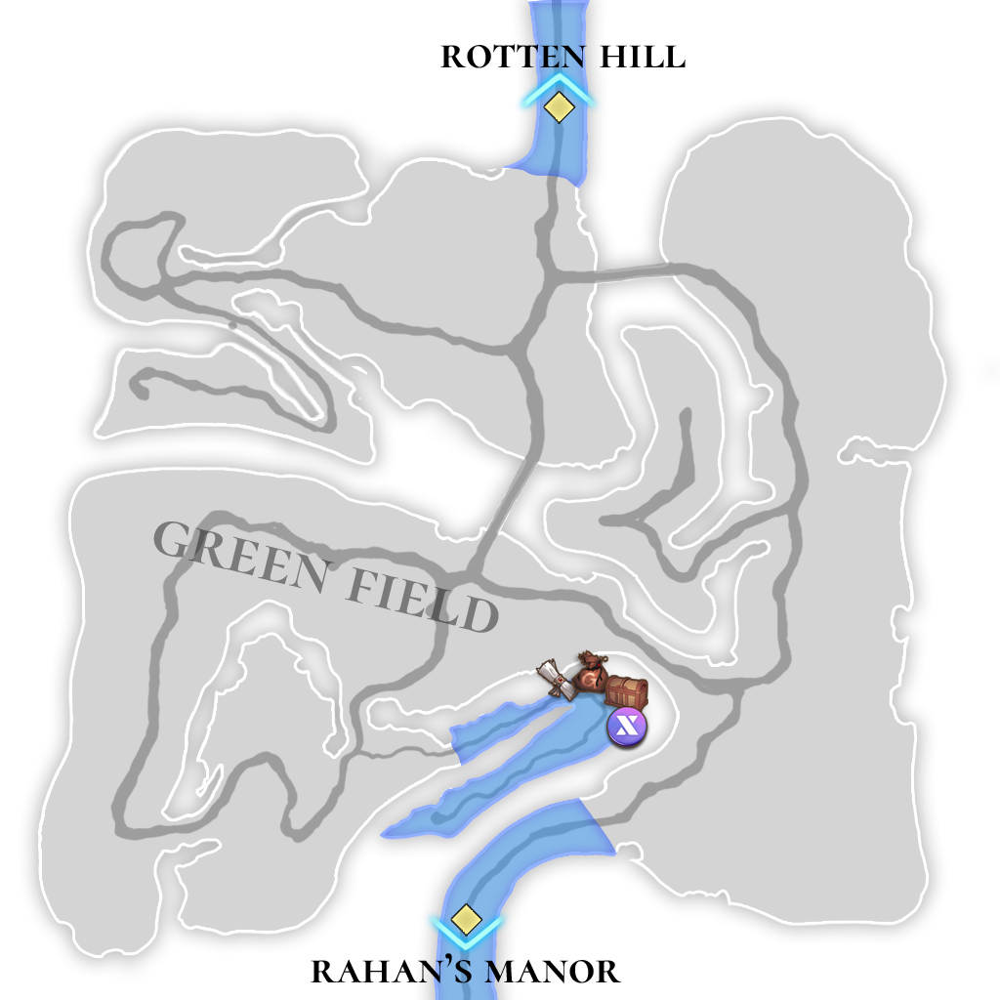

# 🏔️ \~Lv.10 Green field

<figure><figcaption></figcaption></figure>

<figure><figcaption></figcaption></figure>



📒A vast plain lies in front of Rotten Hill. It is an untouched field covered in lush, blue vegetation. With many low-powered wild creatures roaming about, novice warriors frequently visit to gain their first combat experience.

<table><thead><tr><th width="71">Lv.</th><th width="139">Monster</th><th width="95">Drop1</th><th width="93">Drop2</th><th width="116">Drop3</th><th width="96">Drop4</th></tr></thead><tbody><tr><td>2</td><td>Squirrel</td><td>Acorn</td><td>Walnut</td><td>Nuts</td><td>–</td></tr><tr><td>4</td><td>Chipmunk (FORCE)</td><td>Acorn</td><td>Walnut</td><td>Nuts</td><td>–</td></tr><tr><td>6</td><td>Lesser Panda (FIRE)</td><td>Bamboo</td><td>Fur ball</td><td>Piece of copper</td><td>–</td></tr><tr><td>8</td><td>Racoon (LEAF)</td><td>Flint</td><td>Fur ball</td><td>Nuts</td><td>Piece of copper</td></tr><tr><td>10</td><td>Elk (STONE)</td><td>Leather</td><td>Milk</td><td>Flint</td><td>-</td></tr></tbody></table>

🍀**Gathered items :** apples, blueberries, strawberries, vegetables

> 😈**Field Raid :** Lv.13 Mushroom Monster
>
> 🕓**Spawn Time (UTC)** : 16:00 / 21:20 / 02:40 / 08:00 / 13:30
>
> 📦**Drop Item :** Core of protection, Lucky Core, Evil crystal, Poison crystal, Monster mushroom, Extocium Fragment etc…

🍀**Recipe  Drop Information:**

<table><thead><tr><th width="153">Monster</th><th width="172">Drop1</th><th width="141">Drop2</th><th>Drop3</th></tr></thead><tbody><tr><td>Squirrel</td><td>Assorted skewers recipe</td><td>-</td><td>Hammer Recipe</td></tr><tr><td>Chipmunk</td><td>Assorted skewers recipe</td><td>-</td><td>Hammer Recipe</td></tr><tr><td>Lesser Panda</td><td>Salad Recipe</td><td>Nut Yogurt Recipe</td><td>Hammer Recipe</td></tr><tr><td>Racoon</td><td>Salad Recipe</td><td>Butter Recipe</td><td>Hammer Recipe</td></tr><tr><td>Elk</td><td>Cheese Recipe</td><td>Orange juice Recipe</td><td>Glue Recipe</td></tr><tr><td>Giant Squirrel</td><td>Assorted skewers recipe</td><td>-</td><td></td></tr><tr><td>Giant Elk</td><td>Cheese Recipe</td><td>Orange juice Recipe</td><td></td></tr></tbody></table>

\




📒로튼힐 앞에 있는 거대한 평원이다. 푸른 잡초가 무성한, 자연 그대로의 들판이다. 마력이 약한 산짐승들이 많아, 초보 전사들이 첫 전투 경험을 배우기 위해 많이 찾는다.

<table data-full-width="true"><thead><tr><th width="83">레벨</th><th width="119">몬스터</th><th width="89">드랍1</th><th width="92">드랍2</th><th width="100">드랍3</th><th>드랍4</th></tr></thead><tbody><tr><td>2</td><td>다람쥐 (FORCE)</td><td>도토리</td><td>호두</td><td>견과류</td><td>–</td></tr><tr><td>4</td><td>얼룩 다람쥐 (FORCE)</td><td>도토리</td><td>호두</td><td>견과류</td><td>–</td></tr><tr><td>6</td><td>레서판다 (FIRE)</td><td>대나무</td><td>털뭉치</td><td>구리조각</td><td>–</td></tr><tr><td>8</td><td>라쿤 (LEAF)</td><td>부싯돌</td><td>털뭉치</td><td>견과류</td><td>구리조각</td></tr><tr><td>10</td><td>엘크 (STONE)</td><td>가죽</td><td>우유</td><td>부싯돌</td><td>-</td></tr></tbody></table>

🍀**채집 품목** : 사과, 블루베리, 딸기, 야채

> 😈**필드 레이드 :** Lv.13 버섯 괴물
>
> 🕓**출현시간 (KST)** : 01:00 / 06:20 / 11:40 / 17:00 / 22:30&#x20;
>
> 📦**드랍 아이템 :** 보호의 핵, 행운의 핵, 악의 결정, 독의 결정, 괴물 버섯, 엑스토시움 조각 etc…

**🍀레시피 드랍 정보 :**

<table data-full-width="true"><thead><tr><th width="133">Monster</th><th width="141">Drop1</th><th width="137">Drop2</th><th width="146">Drop3</th></tr></thead><tbody><tr><td>다람쥐</td><td>모듬꼬치  레시피</td><td>-</td><td>망치 레시피</td></tr><tr><td>얼룩 다람쥐</td><td>모듬꼬치  레시피</td><td>-</td><td>망치 레시피</td></tr><tr><td>레서판다</td><td>샐러드 레시피</td><td>견과류 요거트 레시피</td><td>망치 레시피</td></tr><tr><td>라쿤</td><td>샐러드 레시피</td><td>버터 레시피</td><td>망치 레시피</td></tr><tr><td>엘크</td><td>치즈 레시피</td><td>오렌지 주스  레시피</td><td>접착제 레시피</td></tr><tr><td>거대 다람쥐</td><td>모듬꼬치  레시피</td><td>-</td><td></td></tr><tr><td>거대 엘크</td><td>치즈 레시피</td><td>오렌지 주스  레시피</td><td></td></tr></tbody></table>



📒ロットンヒルの前には広大な平原がある。青々とした雑草が生い茂る、手つかずの大地だ。魔力の弱い野生の動物が多く生息しているため、初心者の戦士たちが最初の戦闘経験を得るために良く訪れる。

<table><thead><tr><th width="81">Lv.</th><th width="114">モンスター</th><th width="106">ドロップ1</th><th width="105">ドロップ2</th><th width="104">ドロップ3</th><th>ドロップ4</th></tr></thead><tbody><tr><td>2</td><td>クリネズミ</td><td>どんぐり</td><td>クルミ</td><td>けんか</td><td>–</td></tr><tr><td>4</td><td>シマリス (FORCE)</td><td>どんぐり</td><td>クルミ</td><td>けんか</td><td>–</td></tr><tr><td>6</td><td>レッサーパンダ (FIRE)</td><td>竹</td><td>毛玉</td><td>銅片</td><td>–</td></tr><tr><td>8</td><td>ラクーン (LEAF)</td><td>火打ち石</td><td>毛玉</td><td>けんか</td><td>銅片</td></tr><tr><td>10</td><td>エルク (STONE)</td><td>がわ</td><td>ミルク</td><td>フリント</td><td>-</td></tr></tbody></table>

🍀**採集品目 :** リンゴ、ブルーベリー、イチゴ、野菜

> 😈**フィールドレイド :** Lv.13 キノコ怪物
>
> 🕓**出現時間 (KST)** : 01:00 / 06:20 / 11:40 / 17:00 / 22:30
>
> 📦**ドロップアイテム:** 保護の核、幸運の核、悪の結晶、毒の結晶、怪物キノコ、エクストシウム彫刻 ect···

🍀**レシピドロップ情報:**

<table><thead><tr><th width="143">Monster</th><th width="157">Drop1</th><th width="153">Drop2</th><th>Drop3</th></tr></thead><tbody><tr><td>リス</td><td>串盛り合わせレシピ</td><td>-</td><td>ハンマーレシピ</td></tr><tr><td>シマリス</td><td>串盛り合わせレシピ</td><td>-</td><td>ハンマーレシピ</td></tr><tr><td>レッサーパンダ</td><td>サラダレシピ</td><td>ナッツヨーグルトレシピ</td><td>ハンマーレシピ</td></tr><tr><td>ラクーン</td><td>サラダレシピ</td><td>バターレシピ</td><td>ハンマーレシピ</td></tr><tr><td>エルク</td><td>チーズレシピ</td><td>オレンジジュースレシピ</td><td>接着剤レシピ</td></tr><tr><td>巨大リス</td><td>串盛り合わせレシピ</td><td>-</td><td>-</td></tr><tr><td>巨大エルク</td><td>チーズレシピ</td><td>オレンジジュースレシピ</td><td>-</td></tr></tbody></table>



