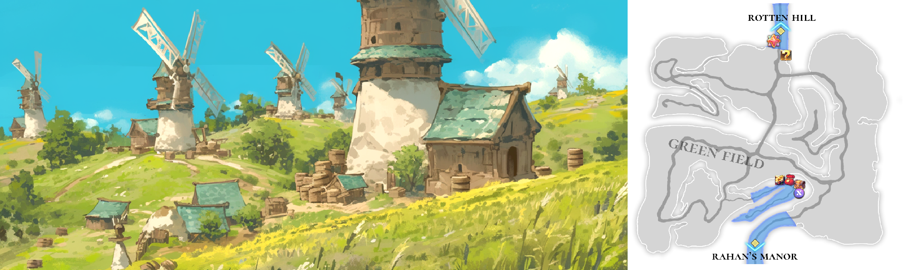

# 🏔️ \~Lv.10 Green field

<figure><figcaption></figcaption></figure>



📒The Green Field unfurls as a vast plain before Rotten Hill, a boundless expanse where the horizon stretches endlessly and vibrant green weeds thrive with the pulse of nature. When the breeze sweeps through, it sets off waves of green that ripple across the field, the blades of grass catching the sunlight and sparkling like the breath of a living earth. The air, laced with the subtle scent of soil and the crisp freshness of greenery, greets first-time adventurers with a peaceful, almost nostalgic welcome.&#x20;

This land is home to creatures faintly touched by magic, making it the perfect proving ground for novice warriors eager to taste their first battle. Squirrels, small but swift, dart around with surprising agility, flashing sharp teeth in a quick counterattack. Chipmunks, a bit larger and marked by their mottled fur, often cross paths with adventurers while pilfering tree fruits. Lesser pandas lounge lazily in the grass, their drowsy expressions belying an unexpected burst of speed when riled. Raccoons, with their inquisitive eyes, roam the field’s edges, sometimes playfully trying to snag a trinket from an unsuspecting traveler. And then there’s the elk—proudly bearing its massive antlers—wandering the plains with a calm stride, though it stamps the ground with mighty hooves when its territory is challenged.&#x20;

These creatures aren’t fearsome monsters by any means; they’re just right for beginners learning the weight of a sword or the balance of a shield. That’s why the Green Field shines as the first stop for those setting out to find Extocium. With Rotten Hill’s faint outline hovering in the distance, this isn’t just any plain—it’s whispered to be one of the lands where the fabled Extocium lies scattered. Adventurers flock here, chasing squirrels or facing off with elk, all while scouring the weeds for a glimpse of that legendary purple stone. The hope of stumbling upon Extocium by chance keeps the field buzzing with life. For those starting out, the Green Field is both a humble beginning and the opening chapter of a grand adventure.

<table><thead><tr><th width="71">Lv.</th><th width="139">Monster</th><th width="95">Drop1</th><th width="93">Drop2</th><th width="116">Drop3</th><th width="96">Drop4</th></tr></thead><tbody><tr><td>2</td><td>Squirrel</td><td>Acorn</td><td>Walnut</td><td>Nuts</td><td>–</td></tr><tr><td>4</td><td>Chipmunk (FORCE)</td><td>Acorn</td><td>Walnut</td><td>Nuts</td><td>–</td></tr><tr><td>6</td><td>Lesser Panda (FIRE)</td><td>Bamboo</td><td>Fur ball</td><td>Piece of copper</td><td>–</td></tr><tr><td>8</td><td>Racoon (LEAF)</td><td>Flint</td><td>Fur ball</td><td>Nuts</td><td>Piece of copper</td></tr><tr><td>10</td><td>Elk (STONE)</td><td>Leather</td><td>Milk</td><td>Flint</td><td>-</td></tr></tbody></table>

🍀**Gathered items :** apples, blueberries, strawberries, vegetables

> 😈**Field Raid :** Lv.13 Mushroom Monster (Leaf)
>
> 🕓**Spawn Time (UTC)** : 16:00 / 18:10 / 21:20 / 02:40 / 08:00 / 09:50 / 10:50
>
> **🕓Spawn Time (PHT)** : 00:00 / 02:10 / 05:20 / 10:40 / 16:00 / 17:50 / 18:50
>
> 📦**Drop Item :** Core of protection, Lucky Core, Evil crystal, Poison crystal, Monster mushroom, Extocium Fragment etc…
>
> <a href="https://extocium.com/mushroommonster/" class="button primary" data-icon="pen-circle">Drop Table Detail...</a>

🍀**Recipe  Drop Information:**

<table><thead><tr><th width="153">Monster</th><th width="172">Drop1</th><th width="141">Drop2</th><th width="200.734375">Drop3</th></tr></thead><tbody><tr><td>Squirrel</td><td>Assorted skewers recipe</td><td>-</td><td>Hammer Recipe</td></tr><tr><td>Chipmunk</td><td>Assorted skewers recipe</td><td>-</td><td>Hammer Recipe</td></tr><tr><td>Lesser Panda</td><td>Salad Recipe</td><td>Nut Yogurt Recipe</td><td>Hammer Recipe</td></tr><tr><td>Racoon</td><td>Salad Recipe</td><td>Butter Recipe</td><td>Hammer Recipe</td></tr><tr><td>Elk</td><td>Cheese Recipe</td><td>Orange juice Recipe</td><td>Glue Recipe</td></tr><tr><td>Giant Squirrel</td><td>Assorted skewers recipe</td><td>-</td><td></td></tr><tr><td>Giant Elk</td><td>Cheese Recipe</td><td>Orange juice Recipe</td><td></td></tr></tbody></table>

\
🍀 **Weapon Drop Notice (Paid Energy)**

When using **Paid Energy**, rewards are drawn from the **Paid Energy–exclusive reward pool**.\
At an **extremely low probability**, the following weapon items may be dropped.

> **Wooden Sword, Steel Sword**



📒푸른 들판은 로튼힐 앞에 드넓게 펼쳐진 평원으로, 끝없이 이어지는 지평선과 무성한 푸른 잡초가 자연의 생기를 가득 품은 들판이다. 바람이 초원을 스치며 초록빛 물결을 만들어낼 때면, 햇살에 반사된 풀잎들이 반짝이며 살아 있는 대지의 숨결을 보여준다. 흙내음과 풀잎의 싱그러움이 어우러진 공기는 이곳을 처음 찾는 모험가들에게 평화로운 첫인상을 안겨준다.&#x20;

이곳에는 마력이 약하게 깃든 산짐승들이 서식하며, 초보 전사들에게 첫 전투의 맛을 보여주는 무대로 제격이다. 다람쥐는 작은 몸집에 비해 날쌔게 움직이며, 날카로운 앞니로 반격을 시도한다. 얼룩다람쥐는 다람쥐보다 몸집이 조금 더 크고 얼룩무늬 털을 자랑하며, 나무 열매를 훔치려다 모험가와 마주치곤 한다. 레서판다는 나른한 표정으로 풀숲에 누워 있다가도, 위협을 느끼면 예기치 않게 민첩하게 달려든다. 라쿤은 호기심 많은 눈빛으로 주변을 탐색하며, 가끔 모험가의 소지품을 슬쩍 훔치려는 장난기 어린 행동을 보인다. 그리고 엘크는 거대한 뿔을 자랑하며 초원을 느긋이 거닐지만, 영역을 침범당하면 강력한 발굽으로 땅을 울린다.&#x20;

이 산짐승들은 강력한 마물이라기보다는 초보 모험가들이 검을 휘두르고 방패를 드는 법을 익히기에 알맞은 상대들이다. 푸른 들판은 그래서 ‘엑스토시움’을 찾아 떠나는 이들의 여정에서 첫걸음을 내딛는 장소로 각광받는다. 멀리 로튼힐의 윤곽이 아스라이 보이는 이곳은 단순한 평원을 넘어, 전설 속 엑스토시움이 흩어진 땅으로 여겨진다. 잡초 사이에 숨겨진 보라빛 돌멩이를 찾아 헤매는 모험가들의 발길은 끊이지 않고, 다람쥐를 쫓다가 우연히 엑스토시움과 마주칠지도 모른다는 희망이 이곳을 더욱 생동감 있게 만든다. 푸른 들판은 그렇게 초보자들의 겸허한 시작점이자, 위대한 모험의 서막을 여는 땅으로 자리 잡고 있다.

<table data-full-width="true"><thead><tr><th width="83">레벨</th><th width="119">몬스터</th><th width="89">드랍1</th><th width="92">드랍2</th><th width="100">드랍3</th><th width="111.234375">드랍4</th></tr></thead><tbody><tr><td>2</td><td>다람쥐 (FORCE)</td><td>도토리</td><td>호두</td><td>견과류</td><td>–</td></tr><tr><td>4</td><td>얼룩 다람쥐 (FORCE)</td><td>도토리</td><td>호두</td><td>견과류</td><td>–</td></tr><tr><td>6</td><td>레서판다 (FIRE)</td><td>대나무</td><td>털뭉치</td><td>구리조각</td><td>–</td></tr><tr><td>8</td><td>라쿤 (LEAF)</td><td>부싯돌</td><td>털뭉치</td><td>견과류</td><td>구리조각</td></tr><tr><td>10</td><td>엘크 (STONE)</td><td>가죽</td><td>우유</td><td>부싯돌</td><td>-</td></tr></tbody></table>

🍀**채집 품목** : 사과, 블루베리, 딸기, 야채

> 😈**필드 레이드 :** Lv.13 버섯 괴물
>
> 🕓**출현시간 (KST)** : 01:00 / 03:10 / 06:20 / 11:40 / 17:00 / 18:50 / 19:50
>
> 📦**드랍 아이템 :** 보호의 핵, 행운의 핵, 악의 결정, 독의 결정, 괴물 버섯, 엑스토시움 조각 etc…
>
> <a href="https://extocium.com/mushroommonster/" class="button primary" data-icon="pen-circle">Drop Table Detail...</a>

**🍀레시피 드랍 정보 :**

<table data-full-width="true"><thead><tr><th width="133">Monster</th><th width="141">Drop1</th><th width="137">Drop2</th><th width="146">Drop3</th></tr></thead><tbody><tr><td>다람쥐</td><td>모듬꼬치  레시피</td><td>-</td><td>망치 레시피</td></tr><tr><td>얼룩 다람쥐</td><td>모듬꼬치  레시피</td><td>-</td><td>망치 레시피</td></tr><tr><td>레서판다</td><td>샐러드 레시피</td><td>견과류 요거트 레시피</td><td>망치 레시피</td></tr><tr><td>라쿤</td><td>샐러드 레시피</td><td>버터 레시피</td><td>망치 레시피</td></tr><tr><td>엘크</td><td>치즈 레시피</td><td>오렌지 주스  레시피</td><td>접착제 레시피</td></tr><tr><td>거대 다람쥐</td><td>모듬꼬치  레시피</td><td>-</td><td></td></tr><tr><td>거대 엘크</td><td>치즈 레시피</td><td>오렌지 주스  레시피</td><td></td></tr></tbody></table>

🍀 **유료 에너지 사용 시 무기 드랍 안내**

유료 에너지를 사용하면 **유료 에너지 풀 전용 보상**이 적용됩니다.\
이때, **매우 희박한 확률로 아래의** **무기 아이템이 드랍될 수 있습니다.**

> **목검, 강철검**



📒グリーンフィールドは、ロッテンヒルの前にどこまでも広がる平原で、地平線が果てしなく続き、生き生きとした青い雑草が自然の息吹をたっぷり湛えています。風がそっと吹き抜けると、緑の波がゆらりと揺れて、陽の光に照らされた草たちがキラキラ輝き、大地が生きているような気配を感じさせるんです。土のほのかな香りと草の清々しさが混ざった空気は、初めて訪れる冒険者に穏やかな第一印象を与えてくれます。

ここには、ほんの少しだけ魔力を宿した山の生き物たちが暮らしていて、初心者の戦士が初めての戦いを経験するのにうってつけの場所。ダラミ（リス）は小さくても動きが素早く、鋭い前歯でちょっとした反撃をしてくるんです。シマダラミ（斑リス）はダラミより少し大きくて、斑模様の毛が自慢で、木の実を盗もうとして冒険者と鉢合わせすることも。レッサーパンダはのんびりした顔で草むらに寝転がっていますが、危険を感じるとびっくりするほど素早く飛びかかってきます。ラクーンは好奇心いっぱいの目で辺りをうろつき、たまに冒険者の持ち物をこっそり盗もうとするお茶目な一面も。そしてエルクは大きな角を堂々と掲げて、ゆったりと歩き回っていますが、縄張りを侵されると力強い蹄で地面を響かせるんです。

これらの生き物たちは強力な魔物じゃない。でも、剣を振り回す感覚や盾を構えるコツを掴むにはちょうどいい相手。だから、グリーンフィールドは「エクストシウム」を追い求める旅の第一歩を踏み出す場所として注目されてるんです。遠くにロッテンヒルの輪郭がぼんやり見えるこの場所は、ただの平原じゃない。伝説では、エクストシウムが散らばった土地の一つとされているんだとか。雑草の間に隠れた紫色の石を探して、ダラミを追いかけたりエルクに挑んだりする冒険者の足跡が絶えません。偶然エクストシウムに出会えるかもしれないという期待が、この場所を生き生きとさせています。グリーンフィールドは、初心者にとって素朴なスタート地点であり、大きな冒険の幕開けとなる特別な土地なんです。

<table><thead><tr><th width="81">Lv.</th><th width="114">モンスター</th><th width="117.25">ドロップ1</th><th width="113.7498779296875">ドロップ2</th><th width="112.75">ドロップ3</th><th width="122.984375">ドロップ4</th></tr></thead><tbody><tr><td>2</td><td>クリネズミ</td><td>どんぐり</td><td>クルミ</td><td>けんか</td><td>–</td></tr><tr><td>4</td><td>シマリス (FORCE)</td><td>どんぐり</td><td>クルミ</td><td>けんか</td><td>–</td></tr><tr><td>6</td><td>レッサーパンダ (FIRE)</td><td>竹</td><td>毛玉</td><td>銅片</td><td>–</td></tr><tr><td>8</td><td>ラクーン (LEAF)</td><td>火打ち石</td><td>毛玉</td><td>けんか</td><td>銅片</td></tr><tr><td>10</td><td>エルク (STONE)</td><td>がわ</td><td>ミルク</td><td>フリント</td><td>-</td></tr></tbody></table>

🍀**採集品目 :** リンゴ、ブルーベリー、イチゴ、野菜

> 😈**フィールドレイド :** Lv.13 キノコ怪物
>
> 🕓**出現時間 (KST)** : 01:00 / 03:10 / 06:20 / 11:40 / 17:00 / 18:50 / 19:50
>
> 📦**ドロップアイテム:** 保護の核、幸運の核、悪の結晶、毒の結晶、怪物キノコ、エクストシウム彫刻 ect···
>
> <a href="https://extocium.com/mushroommonster/" class="button primary" data-icon="pen-circle">Drop Table Detail...</a>

🍀**レシピドロップ情報:**

<table><thead><tr><th width="143">Monster</th><th width="174.4998779296875">Drop1</th><th width="153">Drop2</th><th width="169.984375">Drop3</th></tr></thead><tbody><tr><td>リス</td><td>串盛り合わせレシピ</td><td>-</td><td>ハンマーレシピ</td></tr><tr><td>シマリス</td><td>串盛り合わせレシピ</td><td>-</td><td>ハンマーレシピ</td></tr><tr><td>レッサーパンダ</td><td>サラダレシピ</td><td>ナッツヨーグルトレシピ</td><td>ハンマーレシピ</td></tr><tr><td>ラクーン</td><td>サラダレシピ</td><td>バターレシピ</td><td>ハンマーレシピ</td></tr><tr><td>エルク</td><td>チーズレシピ</td><td>オレンジジュースレシピ</td><td>接着剤レシピ</td></tr><tr><td>巨大リス</td><td>串盛り合わせレシピ</td><td>-</td><td>-</td></tr><tr><td>巨大エルク</td><td>チーズレシピ</td><td>オレンジジュースレシピ</td><td>-</td></tr></tbody></table>

🍀 **有料エナジー使用時の武器ドロップ案内**

有料エナジーを使用すると、**有料エナジー専用報酬プール**が適用されます。\
この際、**非常に低い確率**で、以下の武器アイテムがドロップする場合があります。

> **木剣, 鋼鉄の剣**



<em>※ This guide was written based on the game status as of January 23, 2026,</em>  <em>and its contents may change with future updates.</em>

