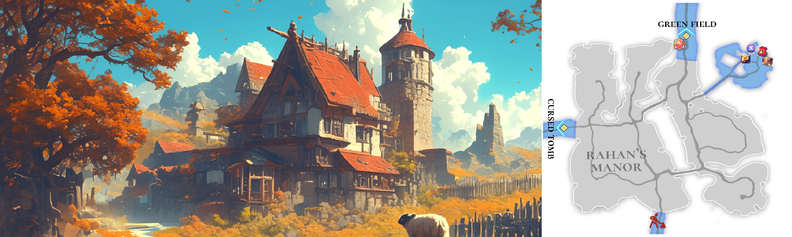

# 🏔️ \~Lv.20 Rahan's Manor

<figure><figcaption></figcaption></figure>



📒Rahan's Manor lies at the heart of the Asterica continent, a fertile breadbasket where endless fields of golden wheat sway in the breeze, singing the song of the land’s bounty. Renowned as the source of the finest wheat supplied across the entire continent, its quality is unmatched, a treasure of the soil. Blessed with a rare climate that yields two harvests a year—once in spring and again in fall—this vast estate serves as Asterica’s granary, a steadfast pillar feeding the continent’s hungry mouths. It’s no wonder the lord of Rahan is quietly hailed among the locals as the “Emperor of Autumn,” a title so revered that even the royal families of Asterica are said to bow their heads when they step onto this land.

The manor teems with life, each creature adding its own flavor to the landscape. Shy pigs scurry into the grass at the sight of strangers, their timid nature almost endearing. Runaway pigs, on the other hand, charge with wild grunts, exuding a fierce energy that demands respect. Bisons lumber across the fields, their massive frames a testament to the quiet strength of the plains. Iguanas bask lazily in the sun, only to lash out with sharp tails when disturbed. Shy boars lurk along the forest edges, skittish yet capable of surprising power when cornered. And then there are the slimes—gooey, slippery blobs that slide across the fields, offering playful challenges to novice adventurers.

Long ago, the Rahan tribe settled this desolate expanse, once buried under volcanic ash and deemed a barren wasteland. Through generations of toil, they tamed the wild earth, cultivating it into the thriving farmland it is today. The secret to their success—a special fertilizer that enriches the soil—remains a closely guarded heirloom, passed down solely within the Rahan bloodline. This sacred knowledge sets their land apart, a feat no outsider can replicate, keeping even the greediest hands at bay. Rahan's Manor isn’t just a stretch of farmland; it’s a living legacy forged from resilience and tradition.

<table><thead><tr><th width="77">Lv.</th><th>Monster</th><th width="125.2501220703125">Drop1</th><th width="119.75">Drop2</th><th>Drop3</th><th width="135.2342529296875">Drop4</th></tr></thead><tbody><tr><td>11</td><td>Shy pig (LEAF)</td><td>Pork belly</td><td>Bark</td><td>Scrap metal</td><td>-</td></tr><tr><td>13</td><td>Runaway pig (FIRE)</td><td>Bark</td><td>Flint</td><td>Fur ball</td><td>-</td></tr><tr><td>15</td><td>Bison (FORCE)</td><td>Milk</td><td>Leather</td><td>Hard bone</td><td>-</td></tr><tr><td>16</td><td>Iguana (WATER)</td><td>Lizard’s tail</td><td>-</td><td>Piece of copper</td><td>-</td></tr><tr><td>18</td><td>Shy boar (LEAF)</td><td>Pork belly</td><td>Bark</td><td>Scrap metal</td><td>Piece of copper</td></tr><tr><td>20</td><td>Slime (WATER)</td><td>-</td><td>Jelly</td><td>Powder of blessing</td><td>Piece of jewelry</td></tr></tbody></table>

🍀**Gathered items :** Oranges, Wheat, Eggs, Herbs, Vegetables

> 😈**Field Raid :** Lv.23 Lizard Man (Dark)
>
> 🕓**Spawn Time (UTC)** : 16:10 / 18:20 / 21:30 / 02:50 / 08:10 / 10:00 / 11:00
>
> **🕓Spawn Time (PHT) :** 00:10 / 02:20 / 05:30 / 10:50 / 16:10 / 18:00 / 19:00
>
> 📦**Drop Item :** Core of protection, Lucky Core, Evil crystal, Crystal of wrath, Freshly caught octopus, Extocium Fragment etc…
>
> <a href="https://extocium.com/lizardman/" class="button primary" data-icon="pen-circle">Drop Table Detail...</a>

🍀**Recipe  Drop Information:**

<table><thead><tr><th width="141">Monster</th><th width="143">Drop1</th><th width="162">Drop2</th><th width="210.734375">Drop3</th></tr></thead><tbody><tr><td>Shy pig</td><td>Cheese Recipe</td><td>Salad Recipe</td><td>Glue Recipe</td></tr><tr><td>Runaway pig</td><td>Cheese Recipe</td><td>Orange juice Recipe</td><td>Glue Recipe</td></tr><tr><td>Bison</td><td>Butter Recipe</td><td>Nut Yogurt Recipe</td><td>Glue Recipe</td></tr><tr><td>Iguana</td><td>Butter Recipe</td><td>Pancake Recipe</td><td>-</td></tr><tr><td>Shy boar</td><td>Pancake Recipe</td><td>Apple steak Recipe</td><td>Iron Ring Recipe</td></tr><tr><td>Slime</td><td>Assorted skewers recipe</td><td>Magic jelly Recipe</td><td>Spirit's Necklace Recipe</td></tr><tr><td>Rampaging Giant Pig</td><td>Cheese Recipe</td><td>Orange juice Recipe</td><td>-</td></tr><tr><td>Giant Slime</td><td>Assorted skewers recipe</td><td>Magic jelly Recipe</td><td>-</td></tr><tr><td>Golden Slime</td><td>-</td><td>Salad Recipe</td><td>Glue Recipe</td></tr><tr><td>Golden Giant Slime</td><td>-</td><td>Magic jelly Recipe</td><td>-</td></tr></tbody></table>

🍀 **Weapon Drop Notice (Paid Energy)**

When using Paid Energy, rewards are drawn from the Paid Energy–exclusive reward pool.\
At an extremely low probability, the following weapon items may be dropped.

> **Wooden Sword, Bronze Sword, Steel Sword, Flamberg, Paladin's Sword**



📒라한영지는 아스테리카 대륙의 심장부에 자리 잡은 비옥한 곡창 지대로, 끝없이 펼쳐진 황금빛 밀밭이 바람에 일렁이며 대지의 풍요를 노래한다. 이곳은 대륙 전역에 납품되는 최상급 밀의 산지로, 그 품질은 어느 곳에서도 따라올 수 없을 만큼 뛰어나다. 일 년에 두 번, 봄과 가을에 걸쳐 풍성한 수확을 자랑하는 이 땅은 아스테리카의 식량 창고라 불리며, 대륙의 허기를 책임지는 든든한 버팀목이다. 그 덕에 라한 영주는 주민들 사이에서 은밀히 ‘가을의 황제’라는 별칭으로 불리며, 심지어 아스테리카의 왕족조차 이곳에 오면 고개를 숙인다는 이야기가 전해질 정도다.

이곳에는 다양한 생명체들이 터를 잡고 있다. 수줍은 돼지는 낯선 이를 보면 풀로 숨어버리는 귀여운 성격을 지녔고, 반대로 폭주 돼지는 거친 울음소리와 함께 돌진하며 위협적인 기세를 뽐낸다. 바이슨은 우람한 몸집으로 들판을 느릿느릿 거닐며 평화로운 풍경을 더하고, 이구아나는 햇볕 아래 느긋하게 몸을 녹이다가도 날카로운 꼬리로 반격을 가한다. 수줍은 멧돼지는 겁이 많아 숲 가장자리에 숨어 지내지만, 자극받으면 뜻밖의 힘을 내보인다. 그리고 슬라임은 끈적한 몸으로 들판을 미끄러지며, 초보 모험가들에게 장난스러운 도전을 제안한다.

라한 부족은 먼 옛날, 화산재로 뒤덮여 생명이라곤 찾아볼 수 없던 불모의 땅에 정착했다. 그들은 피땀 흘려 황무지를 일구고, 세대를 거쳐 토질을 비옥하게 만드는 비료의 비법을 완성해냈다. 이 비밀은 오직 라한 가문의 혈통 안에서만 전승되며, 그 누구도 흉내 낼 수 없는 독보적인 힘이다. 그래서인지 대륙의 탐욕스러운 세력조차 이 땅을 함부로 넘보지 못한다. 라한영지는 단순한 농지가 아니라, 끈질긴 노력과 전통이 빚어낸 살아 있는 유산이다.

<table><thead><tr><th width="77">레벨</th><th>몬스터</th><th>드랍1</th><th>드랍2</th><th>드랍3</th><th width="117.484375">드랍4</th></tr></thead><tbody><tr><td>11</td><td>수줍은 돼지 (LEAF)</td><td>삼겹살</td><td>나무껍질</td><td>고철조각</td><td>-</td></tr><tr><td>13</td><td>폭주 돼지 (FIRE)</td><td>나무껍질</td><td>부싯돌</td><td>털뭉치</td><td>-</td></tr><tr><td>15</td><td>바이슨 (FORCE)</td><td>우유</td><td>가죽</td><td>단단한 뼈</td><td>-</td></tr><tr><td>16</td><td>이구아나 (WATER)</td><td>도마뱀 꼬리</td><td>-</td><td>구리조각</td><td>-</td></tr><tr><td>18</td><td>수줍은 멧돼지 (LEAF)</td><td>삼겹살</td><td>나무껍질</td><td>고철조각</td><td>구리조각</td></tr><tr><td>20</td><td>슬라임 (WATER)</td><td>-</td><td>젤리</td><td>축복의 가루</td><td>보석조각</td></tr></tbody></table>

🍀**채집 품목 :** 오렌지, 밀, 달걀, 허브, 야채

> 😈**필드 레이드 :** Lv.23 리자드맨
>
> 🕓**출현시간 (KST)** : 01:10 / 03:20 / 06:30 / 11:50 / 17:10 / 19:00 / 20:00
>
> 📦**드랍 아이템 :** 보호의 핵, 행운의 핵, 악의 결정, 분노의 결정, 갓 잡은 문어, 엑스토시움 조각 etc…
>
> <a href="https://extocium.com/lizardman/" class="button primary" data-icon="pen-circle">Drop Table Detail...</a>

**🍀레시피 드랍 정보 :**

<table><thead><tr><th width="153">Monster</th><th width="136">Drop1</th><th width="170">Drop2</th><th width="181.484375">Drop3</th></tr></thead><tbody><tr><td>수줍은 돼지</td><td>치즈 레시피</td><td>샐러드 레시피</td><td>접착제 레시피</td></tr><tr><td>폭주 돼지</td><td>치즈 레시피</td><td>오렌지 주스 레시피</td><td>접착제 레시피</td></tr><tr><td>바이슨</td><td>버터 레시피</td><td>견과류 요거트 레시피</td><td>접착제 레시피</td></tr><tr><td>이구아나</td><td>버터 레시피</td><td>팬케이크 레시피</td><td>-</td></tr><tr><td>수줍은 멧돼지</td><td>팬케이크 레시피</td><td>사과 스테이크 레시피</td><td>철 고리 레시피</td></tr><tr><td>슬라임</td><td>모듬꼬치 레시피</td><td>매직 젤리 레시피</td><td>정령의 목걸이 제작서</td></tr><tr><td>거대 폭주 돼지</td><td>치즈 레시피</td><td>오렌지 주스 레시피</td><td>-</td></tr><tr><td>거대 슬라임</td><td>모듬꼬치 레시피</td><td>매직 젤리 레시피</td><td>-</td></tr><tr><td>황금 슬라임</td><td>-</td><td>샐러드 레시피</td><td>접착제 레시피</td></tr><tr><td>황금 거대 슬라임</td><td>-</td><td>매직 젤리 레시피</td><td>-</td></tr></tbody></table>

🍀 **유료 에너지 사용 시 무기 드랍 안내**

유료 에너지를 사용하면 유료 에너지 풀 전용 보상이 적용됩니다.
\
이때, 매우 희박한 확률로 아래의 무기 아이템이 드랍될 수 있습니다.

> **목검, 청동검, 강철검, 플람베르그, 팔라딘의 검**



📒ラハン領は、アステリカ大陸の中心に広がる豊かな穀倉地帯で、風に揺れる黄金色の小麦畑がどこまでも続き、大地の恵みを讃える歌を奏でています。ここは大陸全土に届けられる最高級の小麦の産地として名高く、その品質は他に類を見ません。年に二度、春と秋に豊かな収穫をもたらす珍しい気候に恵まれたこの土地は、アステリカの食糧庫と呼ばれ、大陸の人々の腹を満たす頼もしい支えとなっています。そのため、ラハン領主は住民たちの間でひそかに「秋の皇帝」と称され、アステリカの王族でさえこの地を訪れると頭を下げるという言い伝えがあるほどです。

この領地には、個性豊かな生き物たちが暮らしています。恥ずかしがり屋のブタは見知らぬ人を見ると草むらに隠れてしまう可愛らしい性格で、一方の暴走ブタは荒々しい鳴き声とともに突進し、迫力ある姿を見せつけます。バイソンは大きな体で平原をのんびり歩き、穏やかな風景に彩りを添えます。イグアナは陽光の下で体を温めつつ、邪魔されると鋭い尾で反撃してくることも。恥ずかしがり屋のイノシシは森の端に隠れていますが、追い詰められると意外な力を発揮します。そしてスライムはヌルヌルした体で畑を滑り回り、初心者の冒険者にちょっとした試練を仕掛けてくるんです。

遠い昔、ラハン部族は火山灰に覆われ、命の気配すらない不毛の地に根を下ろしました。彼らは汗と涙を流して荒れ地を開墾し、何世代にもわたって土壌を豊かにする肥料の秘法を編み出しました。この秘密はラハン家の中だけで受け継がれ、誰にも真似できない特別な力となっています。だから、大陸の貪欲な者たちでさえ、この土地に手を出すことはできません。ラハン領はただの農地じゃない。粘り強い努力と伝統が織りなした、生きた遺産なんです。

<table><thead><tr><th width="91">レベル</th><th>モンスター</th><th width="144.75">ドロップ1</th><th>ドロップ2</th><th>ドロップ3</th><th>ドロップ4</th></tr></thead><tbody><tr><td>11</td><td>はにかむ豚 (LEAF)</td><td>サムギョプサル</td><td>樹皮</td><td>古鉄のかけら</td><td>-</td></tr><tr><td>13</td><td>暴走豚 (FIRE)</td><td>樹皮</td><td>フリント</td><td>毛玉</td><td>-</td></tr><tr><td>15</td><td>バイソン (FORCE)</td><td>ミルク</td><td>かわ</td><td>固い骨</td><td>-</td></tr><tr><td>16</td><td>イグアナ (WATER)</td><td>トカゲのしっぽ</td><td>-</td><td>銅片</td><td>-</td></tr><tr><td>18</td><td>はにかむイノシシ (LEAF)</td><td>サムギョプサル</td><td>樹皮</td><td>古鉄のかけら</td><td>銅片</td></tr><tr><td>20</td><td>スライム (WATER)</td><td>-</td><td>ゼリー</td><td>祝福の粉</td><td>宝石のかけら</td></tr></tbody></table>

🍀**採集品目 :** オレンジ、小麦、卵、ハーブ、野菜

> 😈**フィールドレイド :** Lv.23 リザードマン
>
> 🕓**出現時間 (KST)** : 01:10 / 03:20 / 06:30 / 11:50 / 17:10 / 19:00 / 20:00
>
> 📦**ドロップアイテム:** 保護の核、幸運の核、悪の結晶、怒りの結晶、獲れたてのタコ、エクストシウム彫刻 ect···
>
> <a href="https://extocium.com/lizardman/" class="button primary" data-icon="pen-circle">Drop Table Detail...</a>

🍀**レシピドロップ情報:**

<table><thead><tr><th width="150">Monster</th><th width="154">Drop1</th><th width="145">Drop2</th><th width="215.234375">Drop3</th></tr></thead><tbody><tr><td>はにかむ豚</td><td>チーズレシピ</td><td>サラダレシピ</td><td>接着剤レシピ</td></tr><tr><td>暴走豚</td><td>チーズレシピ</td><td>オレンジジュースレシピ</td><td>接着剤レシピ</td></tr><tr><td>バイソン</td><td>バターレシピ</td><td>ナッツヨーグルトレシピ</td><td>接着剤レシピ</td></tr><tr><td>イグアナ</td><td>バターレシピ</td><td>パンケーキレシピ</td><td>-</td></tr><tr><td>はにかむイノシシ</td><td>パンケーキレシピ</td><td>リンゴステーキレシピ</td><td>鉄のリングレシピ</td></tr><tr><td>スライム</td><td>串盛り合わせレシピ</td><td>マジックゼリーレシピ</td><td>精霊のネックレスレシピ</td></tr><tr><td>暴走巨大豚</td><td>チーズレシピ</td><td>オレンジジュースレシピ</td><td>-</td></tr><tr><td>巨大スライム</td><td>串盛り合わせレシピ</td><td>マジックゼリーレシピ</td><td>-</td></tr><tr><td>ゴールデンスライム</td><td></td><td>サラダレシピ</td><td>接着剤レシピ</td></tr><tr><td>ゴールデン巨大スライム</td><td></td><td>マジックゼリーレシピ</td><td></td></tr></tbody></table>

🍀 **有料エナジー使用時の武器ドロップ案内**

有料エナジーを使用すると、有料エナジー専用報酬プールが適用されます。
\
この際、非常に低い確率で、以下の武器アイテムがドロップする場合があります。

> **木剣, 青銅の剣, 鋼鉄の剣, フランベルグ, パラディンの剣**



<em>※ This guide was written based on the game status as of January 23, 2026,</em>  <em>and its contents may change with future updates.</em>

